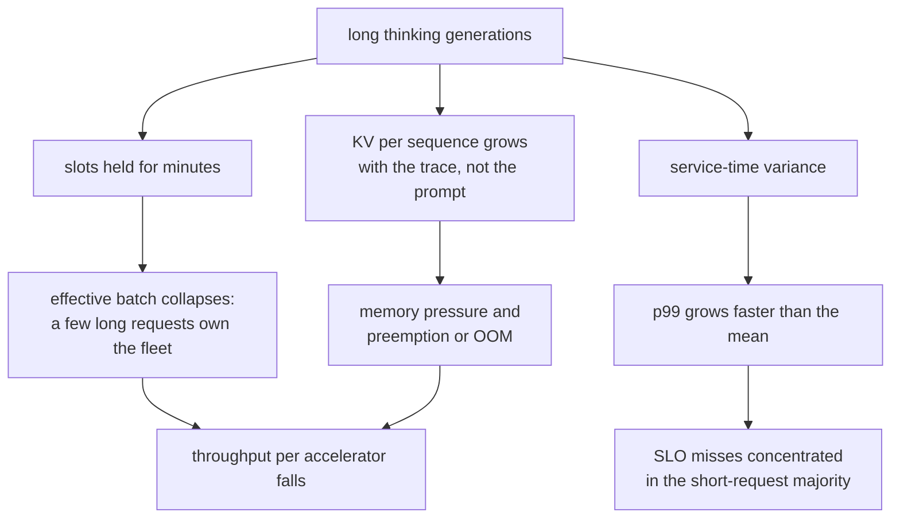

# 6. Serving and scaling

## What a thinking workload does to the serving stack

Every arrow here is a consequence of the same fact: the unit of work got longer and
more variable. The serving techniques from [inference
serving](../inference-serving/) all still apply; what changes is which of them
matter most.

**Continuous batching matters more, and delivers less.** More, because slot
turnover is now the scarce resource; less, because long generations reduce the rate
at which slots free up. Watch the distribution of slot residency, not just
utilization.

**Prefix caching helps the prompt, not the thinking.** The reasoning trace is
unique per request, so the share of tokens that can be served from a shared prefix
falls. Systems with a large shared system prompt see the benefit shrink as thinking
grows.

**Speculative decoding attacks exactly the right phase.** Thinking is pure
bandwidth-bound decode, which is where speculation pays. It is also a good fit
because reasoning traces contain long stretches of predictable, formulaic text that
a draft model gets right.

**Disaggregating prefill and decode gets more attractive.** The decode phase is now
much longer relative to prefill, so separating the two lets you scale the decode
fleet independently of prompt-processing capacity.

## Capacity planning with a heavy tail

Sizing from the mean is what causes the 3 a.m. page. The three numbers to carry:

1. $E[S]$, mean service time, which sets raw capacity: throughput $\approx C/E[S]$
   for $C$ slots.
2. $C^2$, the squared coefficient of variation of service time, which sets how far
   below saturation you have to run.
3. The **budget cap hit rate**, which tells you whether the tail you measured is the
   model's or your cap's.

Because queueing delay carries the $\rho/(1-\rho)$ factor, a thinking workload
typically has to run at a noticeably lower target utilization than a chat workload
to hold the same p99. That is a real cost, and it belongs in the capacity plan
rather than being discovered under load. The capstone in
[section 10](10-putting-it-together.md) simulates exactly this.

## The metric that ranks policies correctly

| Metric | What it hides |
|---|---|
| Cost per request | A policy that got cheap by failing more |
| Accuracy | A policy that got accurate by spending ten times more |
| Tokens per request | Verification cost, retries, and cancellations |
| p50 latency | The entire problem |
| **Cost per solved task** | Nothing much, which is why it is the headline |
| **p95 or p99 latency** | Nothing much, which is why it is the co-headline |

Report the pair. A policy is better when it moves one without moving the other in
the wrong direction, and the pair is what makes the three policies in the capstone
comparable at all.

## Bottlenecks table

| Bottleneck | First sign | Fix | Tradeoff |
|---|---|---|---|
| Slots held by long generations | Effective batch size far below configured | Budget caps, budget-class queues, preemption | Lower utilization or serving-layer complexity |
| p99 blowup at moderate load | Mean latency fine, tail terrible | Run at lower utilization; separate queues; predict length | Fleet costs more per request |
| KV memory pressure from traces | Preemption or OOM under load | Paged KV, quantized KV, shorter budgets | Quality if budgets get too tight ([compression](../model-compression/)) |
| Verification cost exceeds generation | Cost per solved task rises even as quality does | Cheaper verifier, verify only escalations, sample-then-verify | Weaker accept test |
| Cascade escalation storm | A traffic shift makes the cheap path fail more; the long path saturates | Cap escalation rate; shed or downgrade under load | Some requests get the cheap answer |
| Budget cap hit rate rising | Truncations climbing silently | Alert on cap-hit rate; re-measure the accuracy-versus-budget knee | Higher cost if you raise the cap |
| No outcome logging | Cannot compare policies at all | Log solved or not per request before optimizing anything | Instrumentation work first |

**Tools.** Serving runtimes with continuous batching, paged KV, and priority or
preemption support (vLLM, SGLang, TensorRT-LLM) are what make the mitigations above
implementable; provider APIs expose the budget as an effort or thinking-token
parameter instead. Length prediction and effort classification are ordinary small
models trained on your own logs. Sandboxed execution for verifiers reuses the
harness from [benchmarking, section 3](../benchmark-eval/03-the-harness.md).
