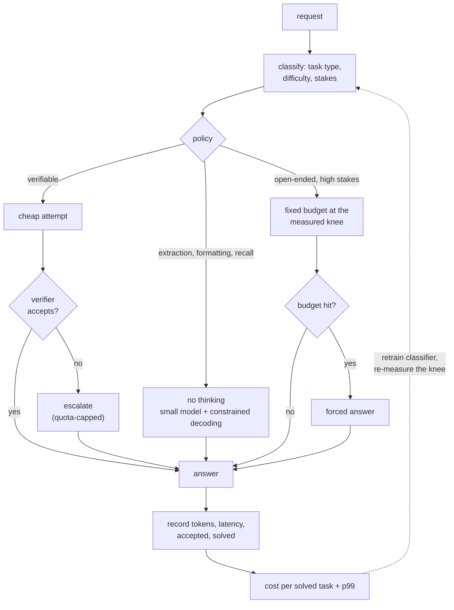

# 9. Summary

## One-page recap

- **Thinking turns output length into a random variable.** Capacity planning moves
  from means to tails, because queueing delay scales with the second moment of
  service time. Two workloads with the same mean and different tails have very
  different p99s, and the thinking one always has the fatter tail.

- **Long generations cause head-of-line blocking.** They hold KV slots, collapse
  the effective batch, and make short requests wait. Budget-class queues, length
  prediction, and preemption are the structural fixes; adding capacity is the
  expensive one.

- **Cap every budget, and design the boundary.** A cap is a latency guarantee. What
  happens at the cap must be a forced answer or an explicit decline, never a silent
  truncation, which returns malformed output and evaluates as a wrong answer.

- **Parallel sampling is a multiplier on a verifier, not a technique.** Repeated
  sampling raises coverage sharply; delivered quality is coverage times how often
  your selector picks a correct sample. Invest in the verifier before buying more
  samples, and prefer an executor over a model-based judge wherever the output runs.

- **The allocation question beats the on-off question.** Effort routing by
  classifier, and better, a cascade (cheap attempt, check, escalate) which measures
  difficulty instead of predicting it and can beat always-thinking on solve rate
  because escalated requests get two attempts.

- **Cascades win when** $a \gt (c_{\text{short}} + c_{\text{verify}})/c_{\text{long}}$,
  which at typical cost ratios means the cheap path only has to handle about one
  request in five.

- **Thinking does not always help.** Recall, extraction, formatting, and
  latency-bound surfaces are all worse with it. Compare cost-matched before
  designing around a benchmark win.

- **Report cost per solved task and p99 as a pair.** Cost per request is minimized
  by failing faster; accuracy is maximized by spending without limit. Neither alone
  ranks a policy, and both require per-request outcome logging you have to build
  first.

## The system on one page

## Test yourself

1. Your mean latency is unchanged after enabling thinking on 20 percent of traffic,
   but p99 tripled. Explain, and give two fixes that do not involve buying hardware.

   

Answer

   The mean is a weighted average and 20 percent of a longer service time moves it
   modestly; the tail is driven by service-time *variance*, and the thinking path is
   long-tailed, so $C^2$ rose sharply ([3](03-budgets-and-latency.md)). On top of the
   queueing effect there is a structural one: long generations hold KV slots, so the
   effective batch shrinks and the 80 percent of short requests now queue behind
   them, which is head-of-line blocking. Two non-hardware fixes: **partition the
   queues by budget class** so short requests never wait behind long ones, and **cap
   the thinking budget** with a forced-answer step at the boundary, which truncates
   the tail of the distribution directly. A third, if you have traffic to train on,
   is a length-class predictor that restores approximate shortest-job-first
   scheduling, since FIFO is optimal for nothing here.

   

2. Cheap path costs 1 unit, verification 0.2, the thinking path 10. What fraction of
   requests must the cheap path handle for a cascade to be worth it, and what else
   would you check before shipping it?

   

Answer

   The cascade costs $1 + 0.2 + (1-a)\cdot 10$ against 10 for always-thinking, so it
   wins when $a \gt 1.2/10 = 12$ percent ([4](04-allocation-and-routing.md)). That
   threshold is low, which is why cascades dominate whenever a verifier exists. Three
   checks before shipping: **the accept test's false-accept rate**, since a verifier
   that passes wrong answers converts a cost win into a silent quality loss and is
   the expensive direction of error; **the latency profile**, because a cascade is
   bimodal and the escalated requests now pay cheap-path latency plus thinking
   latency, so p99 can worsen even as the mean improves; and **the escalation
   quota**, because a traffic shift that pushes escalation from 20 to 60 percent
   turns a quality signal into a capacity incident ([8](08-interview-qa.md)).

   

3. You sample 8 candidates, coverage (pass@8) measured at 0.95, delivered accuracy
   is 0.62. What is wrong and what do you do?

   

Answer

   Nothing is wrong with the generator; the **selector** is the bottleneck
   ([5](05-verification.md)). Coverage says a correct answer is present in 95 percent
   of the sample sets, and delivered accuracy says your verifier finds it about two
   thirds of the time, so most of what you paid for is evaporating at the selection
   step. Buying more samples pushes coverage along an already-flat curve and changes
   delivered quality almost not at all. The fixes, in order: **replace the judge with
   an executor** wherever the output is runnable (tests, a compiler, a query against
   a fixture database), which is a near-perfect selector; **use step-level rather
   than outcome-only supervision** if the verifier must be learned and the failures
   are localizable; **ensemble or certify** the judge otherwise. Also check for the
   opposite failure while you are there: if delivered accuracy *falls* as k grows,
   you are optimizing against verifier artifacts and should cap k where delivered
   quality peaks.

   

4. Product asks for a p95 under 30 seconds on a thinking path whose mean generation
   is 40 seconds. What do you say?

   

Answer

   That the request as posed is infeasible and here are the three ways to make it
   feasible. **Change the distribution**: cap the budget so the mean generation fits
   inside the promise, accepting the quality cost, and measure it on the
   accuracy-versus-budget curve rather than guessing ([3](03-budgets-and-latency.md)).
   **Change the population**: route so most requests never take the thinking path,
   since a p95 is a statement about the whole traffic mix, and a cascade where 80
   percent of requests are answered by the cheap path can meet a p95 the thinking
   path alone cannot ([4](04-allocation-and-routing.md)). **Change the promise**:
   split the SLO by surface, so the interactive path has a tight one and the
   deliberate path is asynchronous with a progress signal and a notification. What
   you should not do is size the fleet for it: at high service-time variance the
   $\rho/(1-\rho)$ factor makes capacity the most expensive lever available.

   

5. Two policies: A costs \$26 per thousand requests and solves 79 percent; B costs
   \$7 and solves 59 percent. Which ships?

   

Answer

   Compute the governing metric before choosing: A is \$33 per thousand solved, B is
   \$12 ([6](06-serving-and-scaling.md), [10](10-putting-it-together.md)). On cost
   per solved task B is far better, but the decision is not automatic, because the 20
   points of solve rate have a product value that the cost metric does not price: if
   an unsolved request means a retry, a support ticket, or a lost user, that value
   can exceed the \$19 saved. The right move is to compute the third option rather
   than choose between these two: a cascade that runs the cheap path first and
   escalates on a verifier failure typically beats **both**, because escalated
   requests get two attempts, and in the capstone it solves 85 percent (above A) at
   \$15 per thousand solved (near B). The general lesson is that A-versus-B framings
   in this chapter are usually missing the cascade.

   

## Further reading

- The capstone: [the complete build](10-putting-it-together.md), with the three
  policies simulated on one queue and a runnable model.
- Test-time scaling: [Scaling LLM Test-Time Compute Optimally](https://arxiv.org/abs/2408.03314), [Large Language Monkeys](https://arxiv.org/abs/2407.21787), [s1: Simple test-time scaling](https://arxiv.org/abs/2501.19393).
- Verification: [Let's Verify Step by Step](https://arxiv.org/abs/2305.20050).
- Training side: [DeepSeek-R1](https://arxiv.org/abs/2501.12948) and the [post-training chapter](../post-training/).
- Serving side: [inference serving](../inference-serving/), [KV cache](../kv-cache/), [cost optimization](../cost-optimization/).
- Evaluating it honestly: [benchmarking a model](../benchmark-eval/).
