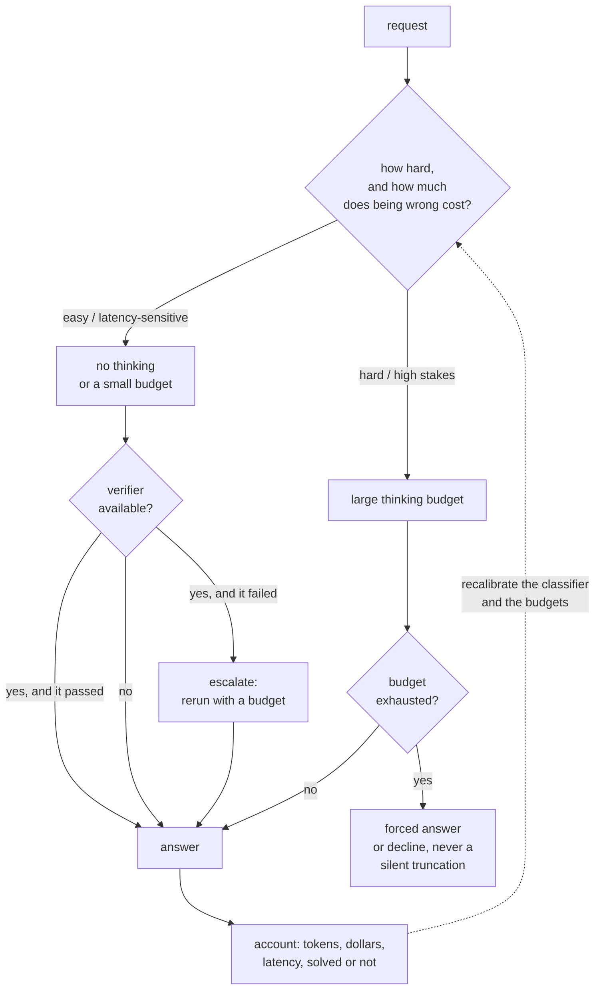

# Reasoning Models and Test-Time Compute

An interviewer rarely says "explain chain of thought." They say: **"We switched to a
reasoning model. Quality went up, but p99 latency is unpredictable and the bill
tripled. What do you do?"**

That question is a systems question. A model that thinks before answering turns
output length from a roughly fixed cost into a heavy-tailed random variable, and
every downstream property (latency tail, KV pressure, queueing, cost per request,
autoscaling) inherits that tail. It is also an allocation question: thinking is a
quality axis you can buy per request, so the design is not "reasoning on or off"
but "which requests get how much, and who decides."

The [post-training chapter](../post-training/) covers how these models are *made*
(RLHF, GRPO, verifiable rewards). This chapter covers what happens when you have to
*serve* one.

## Sections

1. [Clarifying the requirements](01-clarifying-requirements.md) - the dialogue that scopes it, and the two consequences that fall out.
2. [Framing test-time compute](02-frame-test-time-compute.md) - sequential vs parallel scaling, what it buys, where it does nothing, and the shape of the curve.
3. [Budgets, latency, and the tail](03-budgets-and-latency.md) - output length as a random variable, queueing under high service-time variance, truncation policy, streaming UX.
4. [Allocating the budget](04-allocation-and-routing.md) - effort routing, difficulty prediction, cascades, early exit, and the arithmetic that decides between them.
5. [Verification](05-verification.md) - the multiplier that makes parallel sampling worth anything: executors, symbolic checks, process and outcome reward models, and how verifiers get gamed.
6. [Serving and scaling](06-serving-and-scaling.md) - KV pressure, preemption, batching interaction, speculative decoding on thinking tokens, capacity planning, cost per solved task.
7. [How teams do it in production](07-how-teams-do-it-in-production.md) - where real designs diverge; named comparison with first-party links.
8. [Interview Q&A](08-interview-qa.md) - commonly asked, tricky, and commonly answered wrong.
9. [Summary](09-summary.md) - one-page recap, mermaid, test-yourself questions, further reading.
10. [Putting it together: the complete build](10-putting-it-together.md) - a default stack, the workload simulated under three policies, and a runnable queueing and cost model.

## The decision on one page

The accounting arrow is the part teams skip. Without recording whether each request
was actually solved, you cannot compute the only metric that ranks these policies
correctly, which is **cost per solved task**, not cost per request or accuracy alone.

## Companion chapters

- [Fine-tuning and post-training](../post-training/) covers how reasoning behavior is trained in (RLHF, DPO, GRPO, verifiable rewards).
- [Serving LLM inference at scale](../inference-serving/) owns batching, speculative decoding, and the serving stack this chapter puts under stress.
- [Cost optimization and model routing](../cost-optimization/) owns routing and cascades in general; this chapter specializes them to a spend-per-request axis.
- [Benchmarking a model](../benchmark-eval/) owns the cost-matched comparison a reasoning model must be evaluated with.
- [Agent orchestration](../agents/) owns the multi-step loop, which is the other place variable compute shows up.
