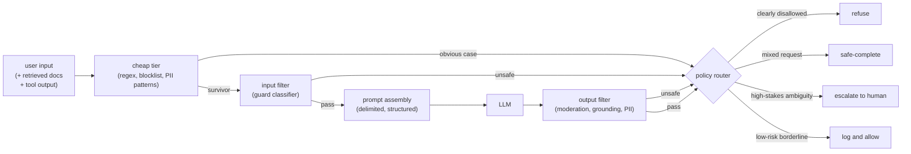

# 2. Framing the system

## The three stages

The system has three distinct stages, and keeping them distinct is where most
designs go wrong. Collapsing them into one "safety call" means you cannot tune
each independently, you cannot cascade cheap-to-expensive, and you cannot route
different outcomes to different policy decisions.

**Input filtering** runs before the LLM sees anything. Its job is to catch clearly
harmful requests, flag injection attempts hidden in user text, and redact PII so it
never reaches the model or gets logged. This stage must be fast; it sits on the
critical path before the main model even starts.

**Output filtering** runs on the LLM's generation. Its job is to catch harmful
completions that slipped past the input stage (a benign prompt can still yield an
unsafe answer), verify grounding in RAG contexts, and strip PII the model may have
surfaced from retrieved documents. This stage can partially run in parallel with
generation.

**Policy routing** is the decision layer that turns a guard verdict into an action.
A guard firing does not automatically mean "block." The policy router decides
whether to refuse, produce a safe-completion of the benign part, escalate to a
human, or log and allow with monitoring.

**How it works.** Every input, including retrieved documents and tool output, first
meets a cheap tier of regex, blocklists, and PII patterns that resolves the obvious
cases without paying for a model. Inputs that survive the cheap tier go to a guard
classifier; if it judges them unsafe they short-circuit to the policy router, and if
they pass they move on to prompt assembly, where trusted instructions and untrusted
data are kept in delimited, structured form before the LLM runs. The model's output
is not trusted either: it passes through an output filter for moderation, grounding,
and surfaced-PII checks, and both the unsafe and pass verdicts feed the same policy
router. That router is the single decision point that converts a guard verdict into
one of four actions, refuse, safe-complete, escalate to a human, or log and allow,
which is why a guard firing is a signal to the router rather than an automatic block.
Keeping the three stages separate is what lets each be tuned and cascaded
independently instead of collapsing into one opaque safety call.

## Inputs and outputs of the system

The system takes two kinds of inputs: text that came from the user (trusted only
in the sense that you know who sent it) and text that arrived from outside the
application's control boundary (retrieved documents, web pages, tool results). The
second category must be treated as adversarial. You do not know what is in a
retrieved document; it could contain injected instructions designed to hijack the
model.

The output of the system is either a safe response, a refusal, a safe-completion,
an escalation trigger, or a log entry. It is not a boolean.

## Why instructions in the system prompt are the weakest layer

System-prompt instructions ("never discuss harmful topics") are necessary and
never sufficient. They are a suggestion the model usually follows and that a
patient attacker can often work around. The guard models and deterministic policy
code in this design are separate decisions: a classifier does not share the base
model's persuadability, and a code-side action gate fires regardless of what the
model was argued into.

A strong answer leans on layers two and three (classifiers and deterministic code)
and treats the system-prompt layer as a backstop that raises the cost of
low-effort attacks, not as a primary defense.
