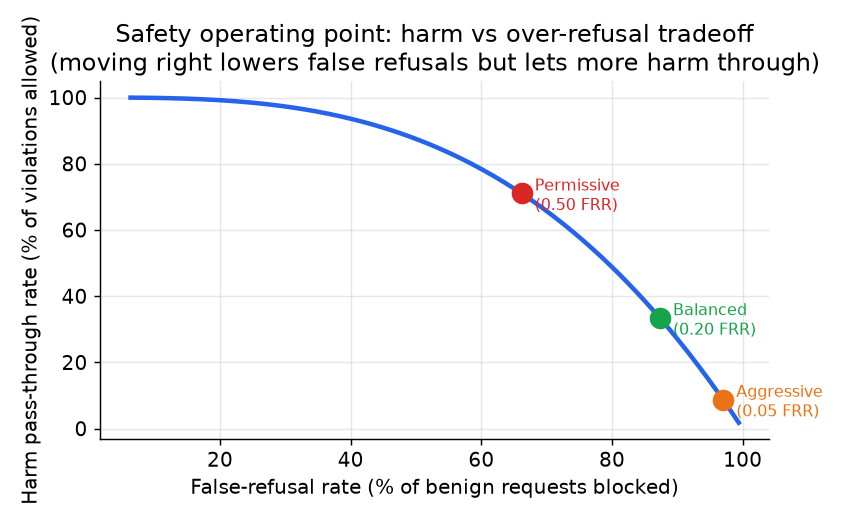

# 4. Output guardrails

Output guardrails run on the LLM's generation before it reaches the user. They
catch a different class of problem from input guards: a perfectly benign prompt can
still yield an unsafe completion, a hallucinated claim, or a regurgitation of
another user's private data. Input guards are necessary but not sufficient.

## Toxicity and policy classifiers

A toxicity classifier scores the completion for harmful content: violence,
self-harm, sexual content, hate speech. A policy classifier scores for
domain-specific violations: off-topic replies in a customer-service product,
medical advice in an application that is not licensed to give it, financial
recommendations with disclaimed caveats.

Both are typically implemented as guard models: fine-tuned transformers trained on
labeled examples of the categories the product enforces. The key design point is
that they run on the output text as a separate decision, independent of the main
model. An attacker who successfully jailbreaks the base model's refusal training
still has to get past the output classifier, which did not participate in the
conversation and cannot be argued with.

Salesforce's Einstein Trust Layer uses a hybrid of deterministic rules plus a model
for seven toxicity categories: pure-model scoring misses obvious violations, and
pure rules miss nuance. The hybrid is more robust than either alone.

## Groundedness classifiers (for RAG)

In a RAG product, an additional class of unsafe output is an ungrounded claim: the
model stated something that is not supported by the retrieved sources. In a
high-stakes domain (legal, medical, financial), an ungrounded hallucination is a
safety issue, not just a quality issue.

A groundedness classifier compares the generated text against the retrieved chunks
and returns a support score. NVIDIA's NeMo Guardrails uses AlignScore for this.
Thomson Reuters' CoCounsel grounds legal answers in a trusted corpus and runs
1,500 automated tests per night to verify the grounding holds.

The key insight is that groundedness and toxicity are orthogonal: a perfectly
polite, non-toxic output can still be an unsafe hallucination in a regulated
domain.

## The operating point: recall, precision, and the KL-anchored objective

Setting a classifier threshold is a business decision, not a default. The tradeoff
is explicit: a lower threshold blocks more harm but blocks more legitimate requests
too.

Define the catch rate (true positive rate) as:

$$\text{Recall} = \frac{TP}{TP + FN}$$

And the false-refusal rate (false positive rate) as:

$$\text{FRR} = \frac{FP}{FP + TN}$$

The operating point is the threshold that sets both. Reporting only the catch rate
is misleading. Anthropic's Constitutional Classifiers dropped the attack success
rate from 86% to 4.4% on an adversarial eval set, and also held the benign
production refusal rate increase to 0.38%, which is the number that proves low
over-blocking.

A useful way to state the operating point constraint is: fix the false-refusal rate
budget and read off the catch rate you can achieve, or vice versa:

$$\text{Recall} \Bigl|_{\text{FRR} \leq \delta} = \max \Bigl\lbrace \frac{TP}{TP + FN} : \frac{FP}{FP + TN} \leq \delta \Bigr\rbrace$$

During training, the KL-anchored objective keeps refusal training from wrecking
benign behavior:

$$\max_{\pi} \; \mathbb{E}_{x \sim D}\bigl[R_{\text{safe}}(x, \pi)\bigr] - \beta \cdot \text{KL}\bigl(\pi \;\|\; \pi_{\text{ref}}\bigr)$$

The refusal reward pushes the policy to decline harmful prompts. The KL term to
the reference model penalizes drift from benign behavior. A large $\beta$ keeps
the model helpful to legitimate users; a small $\beta$ increases catch rate but
raises the benign refusal rate.

*Moving the operating point rightward (lower threshold) reduces false refusals but
allows more harm through. The curve is the product's safety-helpfulness frontier;
the operating point is a business decision, not a technical default. Illustrative.*

## When to use which output guard

| Reach for | When | Instead of |
|---|---|---|
| Small fine-tuned toxicity classifier | High-QPS output moderation; policy is stable; need low latency on every completion | A guard-LLM on the output path, which adds 80-150ms in series |
| Guard-LLM output classifier | Taxonomy flexibility matters; moderate QPS; you want category-level verdicts for routing | A binary toxic/not-toxic signal that cannot distinguish what kind of violation to route to |
| Grounding classifier (AlignScore or similar) | RAG product in a high-stakes domain (legal, medical, financial) | Assuming the LLM only uses retrieved content; hallucination and toxicity are orthogonal |
| Hybrid rules plus model (Salesforce) | Enterprise platform where deterministic rules must never miss obvious cases | Pure-model scoring that can miss rule-level violations and is harder to audit |
| Streaming token-level classifier | You want to cut off mid-generation and avoid returning partial unsafe output (Anthropic) | Waiting for the full completion before checking, which already surfaced unsafe tokens |
| G-Eval LLM-judge scorer (OpenAI cookbook) | Qualitative domain-specific criteria that are hard to encode in a trained classifier; low QPS | High-QPS paths; an LLM judge inherits the base model's persuadability and costs a full generation |
| Human review escalation | High-stakes ambiguity in regulated domains; appeals (Thomson Reuters, Roblox) | Automated hard-block on irreversible decisions where a false positive causes real harm |

**Tools.** Guard-LLM output classifiers include Llama Guard (Meta) and ShieldGemma (Google); NeMo Guardrails (NVIDIA) orchestrates output rails and uses AlignScore for groundedness, and Guardrails AI provides output validators plus a hybrid rules-and-model layer. Small fine-tuned toxicity classifiers such as Detoxify run on Hugging Face Transformers for the low-latency path, and streaming token-level checks are wired into the serving loop so generation can be cut off mid-stream. LLM-judge scorers along the G-Eval pattern are built on whichever frontier model you already call, and human-review escalation is a workflow and queue you build around the automated verdicts.

**Worked example.** A document-AI team ships a RAG assistant that answers questions over regulated financial filings, where a polite but ungrounded claim is itself a safety failure. On every completion they run a small fine-tuned toxicity classifier for low latency, but because toxicity and groundedness are orthogonal they add a grounding classifier that compares the answer against the retrieved chunks rather than assuming the model only used its sources. Since obvious rule-level violations must never slip through for audit reasons, they pair the models with deterministic rules in a hybrid rather than pure-model scoring. They set the classifier threshold by fixing a false-refusal budget and reading off the catch rate they can hit, and route the small slice of high-stakes ambiguous outputs to human review instead of hard-blocking, since a false positive on an irreversible decision would cause real harm.
