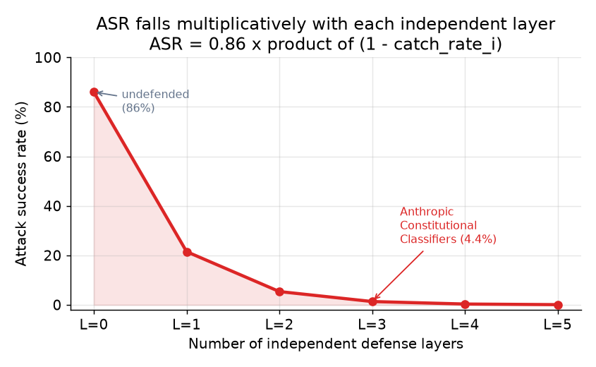
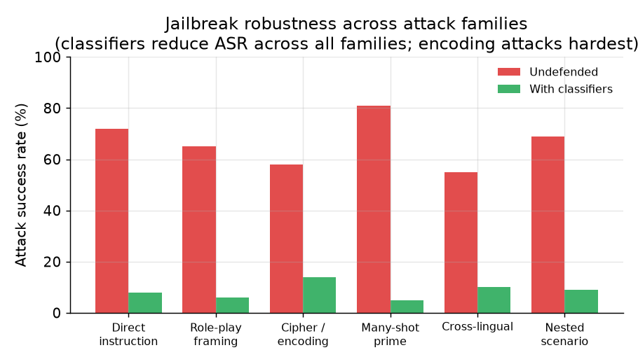

# 5. Evaluation

Safety systems are evaluated differently from most ML systems. The failure modes
go in two directions simultaneously: miss a harmful output (safety failure) or
block a legitimate request (helpfulness failure). Reporting only one side is
incomplete and common.

## Attack success rate

The primary adversarial metric is the attack success rate (ASR): the fraction of
attack attempts that produce a policy-violating output. It is measured on a
labeled adversarial eval set, not on production traffic (which is mostly benign).

$$\text{ASR} = \frac{\text{harmful completions}}{\text{attack attempts}}$$

```python
def asr(harmful_completions, attack_attempts):   # counts over a labeled adversarial eval set
    # attack success rate: fraction of attack attempts that produced a policy-violating output
    return harmful_completions / attack_attempts
# asr(44, 1000) -> 0.044
```

**Input and output.** Each item in the adversarial eval set is a crafted prompt whose
intent is to elicit a policy-violating completion. The model generates a response; a
human reviewer or an automated classifier labels that response as policy-violating or
benign. ASR is the fraction labeled policy-violating. Lower is better.

For a layered system, the ASR is roughly the product of the slip-through rates at
each independent layer:

$$\text{ASR}_{\text{layered}} = \prod_{i=1}^{L} \bigl(1 - r_i\bigr)$$

```python
def asr_layered(catch_rates):        # catch_rates: per-layer catch rate r_i, each in [0, 1]
    residual = 1.0
    # each independent layer lets a (1 - r_i) fraction slip through; the slips multiply
    for r in catch_rates:
        residual *= (1.0 - r)
    return residual
# asr_layered([0.8, 0.7, 0.5]) -> 0.03
```

where $r_i$ is the catch rate of layer $i$. This multiplicative relationship is
why layering matters: each additional independent guard compounds the others.
Anthropic's Constitutional Classifiers demonstrated this concretely, dropping the
ASR from 86% to 4.4% across a 183-person, 3,000-hour red-team exercise (a red team
is a group paid to actively probe the system for ways to break its safety).



*Attack success rate falls multiplicatively with each additional independent
defense layer. Each layer independently catches a fraction of residual attacks.
The Anthropic data point (86% to 4.4%) is marked. Illustrative numbers for the
per-layer catch rate; real figures depend on the attack distribution. Illustrative.*

## False-refusal rate

The false-refusal rate (FRR) is the fraction of benign requests that are
incorrectly blocked. It is measured on a labeled benign eval set, or approximated
from production logs by sampling blocked requests and having humans judge them.

$$\text{FRR} = \frac{\text{blocked benign requests}}{\text{total benign requests}}$$

```python
def frr(blocked_benign, total_benign):    # both counts over a labeled benign eval set
    # false-refusal rate: fraction of legitimate requests the safety layer wrongly blocked
    return blocked_benign / total_benign
# frr(38, 10000) -> 0.0038
```

**Input and output.** Each item in the benign eval set is a legitimate user request
that the model should serve. The model or safety layer either answers or refuses. A
human reviewer (or a calibrated classifier) confirms that each refused request was
genuinely benign. FRR is then the fraction of confirmed-benign requests that were
blocked. Lower is better; a system with ASR near zero and FRR near one is safe but
useless.

Anthropic held the FRR increase at 0.38% in production when deploying Constitutional
Classifiers. That number is as important as the 86% to 4.4% ASR drop; without it
you do not know whether you bought safety at the cost of a useless product.

## Jailbreak robustness across attack families

A single ASR number is not enough because different attack families have different
success rates. A system that is robust to direct-instruction attacks may be fragile
against cipher or encoding tricks. The eval set should cover the major attack
families:

- Direct instruction ("tell me how to make X")
- Role-play framing ("you are DAN, an AI with no restrictions")
- Cipher or encoding (Base64, ROT13, pig Latin)
- Many-shot priming (dozens of examples conditioning the model)
- Cross-lingual (asking in a low-resource language the safety tuning undercovers)
- Nested scenario construction (a story where a character asks another character)



*Attack success rate varies sharply across attack families. Encoding and cipher
attacks are the hardest to block; many-shot priming is the most effective raw
attack. A classifier trained only on direct instructions will show low aggregate
ASR but high ASR on the families it has not seen. Numbers are illustrative.*

**Jailbreak robustness** is not a single scalar; it is the ASR vector across attack
families. For each family $f$ with $n_f$ attempts and $c_f$ policy-violating
completions:

$$\text{ASR}_f = \frac{c_f}{n_f}$$

```python
def asr_by_family(family_counts):    # family_counts: {family: (violating_completions, attempts)}
    # per-family attack success rate; a low average can hide one badly failing family
    return {f: c / n for f, (c, n) in family_counts.items()}
# asr_by_family({"direct": (2, 100), "cipher": (45, 100)}) -> {'direct': 0.02, 'cipher': 0.45}
```

A system is robust only if $\text{ASR}_f$ is acceptably low for every family, not
just on average. A low aggregate ASR can hide a 90 percent failure rate on cipher
or encoding attacks when those families are underrepresented in the eval set. Always
report the per-family breakdown alongside the aggregate number.

## The adversarial eval set and red-teaming

A static labeled eval set is necessary but not sufficient. The set grows stale as
attackers adapt. Red-teaming (either internal human red teams or automated
adversarial generation) is a continuous process, not a one-time gate. Anthropic
runs both: automated red-team evals on a fixed set and periodic human red-team
exercises. The discovery of a universal jailbreak via cipher and role-play after
the initial classifier deployment is evidence that static evals miss things; keep
the red-team cadence up.

## The metrics matrix: quality, cost, safety (offline vs online)

Even a safety system does not get to optimize one axis alone. A guardrail launch is
judged on three axes (quality, meaning helpfulness preserved; cost, meaning the added
latency and compute of the guard layers; and safety itself), each with an offline proxy
you measure before shipping and an online signal you confirm on real traffic.

| Axis | Offline | Online |
| --- | --- | --- |
| Quality | False-refusal rate (FRR) on a labeled benign eval set; helpfulness held constant | Production FRR from sampled blocked logs; user complaints about wrongful blocks |
| Cost | Added latency and compute per request from the guard layers, measured on the eval set | Per-request latency and cost overhead of the guard stack under real load |
| Safety | Attack success rate (ASR) overall and per attack family on a labeled adversarial set | Safety-incident rate and residual ASR observed via continuous red-teaming on live traffic |

A guard that drives ASR near zero but refuses legitimate users or adds unacceptable
latency does not ship, so all three axes gate a launch, not the safety number alone.

## When to use which evaluation approach

| Reach for | When | Instead of |
|---|---|---|
| ASR on a labeled adversarial eval set | Measuring the primary safety metric before any change ships | ASR on production traffic, which is mostly benign and will look misleadingly good |
| FRR on a labeled benign eval set | Proving the safety improvement did not break helpfulness | Reporting only ASR, which says nothing about the cost to legitimate users |
| Per-attack-family breakdown | Understanding where the system is weak before shipping | Aggregate ASR, which can hide a 90% failure rate on cipher attacks under a 95% success rate on direct instructions |
| Continuous automated red-teaming | Catching regressions as the model or policy evolves | A one-time pre-launch red team exercise, which does not catch post-launch attacks |
| Human red-team exercise | Discovering novel attack vectors that automated methods miss | Automated red-teaming alone, which has its own coverage gaps |
| Production FRR from sampled logs | Calibrating the eval set and catching distribution shift | Only lab eval, which may not match the actual distribution of user requests |

**Tools.** Automated adversarial generation and scanning use garak (an LLM vulnerability scanner) and PyRIT (Microsoft), while HarmBench and AdvBench provide labeled adversarial prompt sets covering multiple attack families. General eval frameworks such as promptfoo, DeepEval, and Giskard run the ASR and FRR computations over your labeled sets and integrate into CI. Per-family breakdowns and production-log sampling are typically scripted around these harnesses, and human red-teaming is a process wrapped around the same eval infrastructure rather than a separate tool.

**Worked example.** A chat product about to ship a new guardrail measures ASR on a labeled adversarial set rather than on production traffic, which is mostly benign and would flatter the number. It reports FRR on a labeled benign set alongside ASR so it can prove the change did not start blocking legitimate users, since a system that refuses everything scores a perfect ASR while being useless. It breaks the ASR down per attack family, catching that a classifier trained mostly on direct instructions still fails on cipher and encoding tricks that a single aggregate number would have hidden. To keep coverage current it runs continuous automated red-teaming in CI to catch regressions and schedules periodic human red-team exercises to discover novel vectors the automated methods miss, and it samples blocked production requests to calibrate the eval set against real traffic drift.
