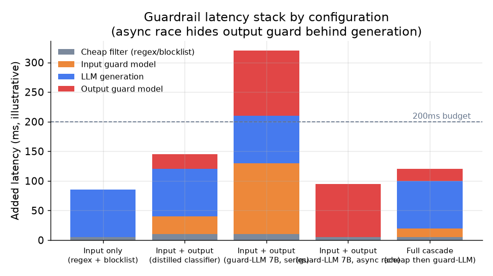

# 6. Serving and scaling

## The latency problem

Every guard you add is time on the critical path. A chat product with a 200ms
total budget cannot stack three model calls in series: a 7B input guard at 100ms,
a 30B main LLM, and a 7B output guard at 100ms is already 200ms before the main
model even runs. The serving design is not about adding guards; it is about
choosing which guards can run fast enough, which can run in parallel, and which
can be moved off the critical path entirely.

## The cascade: cheap-to-expensive

The most important latency lever is the cascade shape. Run the cheapest possible
check first; only escalate to the expensive guard for the fraction of traffic that
survives the cheap tier.

For input guards: a regex and blocklist catches obvious patterns in microseconds. A
small distilled classifier adds 10-30ms and catches the next tier. A full guard-LLM
(80-150ms) only sees the small residual that the cheap tiers flagged as ambiguous.
Roblox's distilled classifiers handle the vast majority of their 750k RPS at the fast tier;
the expensive decision runs on only a small fraction of traffic.

For output guards: a fast fine-tuned toxicity classifier runs in 20-40ms. An
LLM-judge guardrail runs in 80-150ms and is reserved for borderline verdicts.

The expected cost of the cascade:

$$\mathbb{E}[C] = c_{\text{cheap}} + p_{\text{escalate}} \cdot c_{\text{guardLLM}}$$

When $p_{\text{escalate}}$ is small (most traffic clears the cheap tier), the
expensive guard barely registers in aggregate cost. When $p_{\text{escalate}}$ is
large, the cascade design is wrong: either the cheap tier is miscalibrated or the
cheap tier is undersized for the threat.

## Async parallelism

The second latency lever is parallelism. An output guard and the main LLM
generation do not have to be strictly serial. If the generation has no observable
side effects before completion (it does not send emails, call APIs, or trigger
actions mid-stream), you can race the guard against generation:

$$T_{\text{total}} = \max\bigl(T_{\text{guard}}, T_{\text{gen}}\bigr) \quad \text{vs series: } T_{\text{guard}} + T_{\text{gen}}$$

The OpenAI cookbook pattern uses asyncio to race the input guard against the main
completion call, canceling the loser. If the guard fires, the completion is
canceled; if the guard clears, the completion is already done and the guard result
is discarded.

The critical caveat: this only works when generation has no side effects before the
block fires. If the model can execute tool calls or send messages mid-stream,
parallelism can leak an unsafe action before the verdict lands. Async racing is a
latency trick for side-effect-free generation, not a universal pattern.

## Guard model placement

| Configuration | Added latency (illustrative) | Coverage | Best for |
|---|---|---|---|
| Input only (regex + blocklist) | 5-10ms | Catches explicit policy violations and obvious attack templates; misses completions | Extremely tight latency budget; acceptable to trust the model's output safety tuning |
| Input + output (distilled classifiers) | 30-60ms total | Catches both attack classes; classifiers are fast enough for high QPS | Consumer product at high QPS; stable policy taxonomy |
| Input + output (guard-LLM 7B, series) | 160-300ms total | Full taxonomy flexibility; highest recall | Lower-QPS workflows; async pipelines where latency is not critical |
| Input + output (guard-LLM, async race) | 80-150ms (parallelized) | Same coverage; guard latency hidden behind generation | Side-effect-free generation; latency budget of 150-200ms |
| Full cascade (cheap then guard-LLM for ambiguous) | 35-80ms (most traffic on cheap tier) | Near-parity with full guard-LLM at fraction of cost | High-QPS with complex policy; willing to tune cascade thresholds |

*Latency stack for five configurations. Async racing eliminates the output guard
from the critical path when generation is side-effect-free. The full cascade keeps
most traffic on the cheap tier while applying the expensive guard only to ambiguous
inputs. Numbers are illustrative; actual latency depends on hardware and model
size.*

## Scaling the guard tier

At very high QPS, guard models compete with the main LLM for GPU capacity. The
solution is a separate guard serving tier batched and scaled independently. NeMo
Guardrails registers LlamaGuard as a separate vLLM engine; Roblox scales its
distilled text and voice classifiers on independent GPU pools sized to each
modality's RPS.

Batching matters: a guard model serving one request at a time wastes GPU. A
separate tier can accumulate requests across users and batch them efficiently,
driving GPU utilization up without adding latency to the median request.

## Bottlenecks

| Bottleneck | First sign | Fix | Tradeoff |
|---|---|---|---|
| Guard model latency on critical path | p50 latency exceeds budget; guard is the slow step | Cascade: cheap tier first; async race if generation is side-effect-free | Some risky traffic reaches the expensive tier; some tokens surface before block fires |
| GPU contention between guard and LLM | Both latency and throughput degrade at peak | Separate guard tier with independent GPU pool and batching | More infra; network hop between tiers |
| False positives causing user friction | Support tickets about blocked legitimate requests | Tune thresholds per category; use safe-complete instead of hard block on borderline verdicts | Slightly higher pass-through on borderline harmful content |
| Injection over untrusted content at scale | RAG-sourced harmful outputs; user reports of injected actions | Structural isolation (spotlighting, delimiting) plus code-side action gates; probabilistic detector | Design complexity; encoding tricks add content-processing overhead |
| Audit log volume | Storage cost at 10k+ RPS with full request logging | Log the guard verdict and reason, not the full input; sample the full input for a fraction | Reduced forensic depth on sampled requests |

**Detail.** The guard-latency row's async race is only sound when generation has no
side effects: you launch the guard classifier and the LLM in parallel and drop the
stream if the guard fires first, but a model that can send email or issue a refund
cannot race and must gate serially, which is why the tradeoff column warns that some
tokens surface before the block. The GPU-contention row isolates the guard onto its
own pool precisely because a small guard model (Llama Guard, Meta) batches very
differently from a large generator: co-scheduling them lets long generations stall
the latency-critical guard requests queued behind them.
