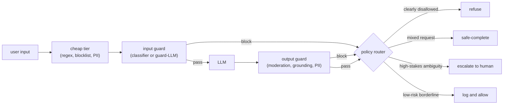

# Safety, Moderation, and Guardrails

An interviewer rarely says "design the safety layer." They say **"we are putting
an LLM in front of real users, and it reads content we do not control. Design the
system that blocks harmful output, resists manipulation, and does not wreck latency
or annoy legitimate users."**

That framing contains the whole difficulty. The model is the easy part. The hard
part is that you are wrapping a probabilistic system that will, given the right
input, do something you did not intend. The signal in this interview is whether you
think in layers, treat untrusted text as untrusted, and respect the latency budget
instead of bolting on five model calls.

## Sections

1. [Clarifying the requirements](01-clarifying-requirements.md) - the dialogue that scopes the problem, and the two consequences that fall out immediately.
2. [Framing the system](02-frame-the-system.md) - input filtering, output filtering, and policy routing as distinct stages.
3. [Input guardrails](03-input-guardrails.md) - jailbreak and prompt-injection defense, PII detection, and when to use which.
4. [Output guardrails](04-output-guardrails.md) - toxicity, groundedness, and policy classifiers; the operating-point math.
5. [Evaluation](05-evaluation.md) - attack success rate, false-refusal rate, jailbreak robustness, and the adversarial eval set.
6. [Serving and scaling](06-serving-and-scaling.md) - the guardrail latency chain, cascade design, and async parallelism.
7. [How teams do it in production](07-how-teams-do-it-in-production.md) - Anthropic, Roblox, Microsoft, Meta, Google, OpenAI, Cloudflare, and why they diverge.
8. [Interview Q&A](08-interview-qa.md) - commonly asked, tricky, and commonly answered wrong, with clear answers.
9. [Summary](09-summary.md) - the one-page recap, a mermaid pipeline, test-yourself questions, and further reading.

## The whole system on one page

Read the sections in order the first time; they build on each other. Each opens
with the question an interviewer actually asks, then answers it.
