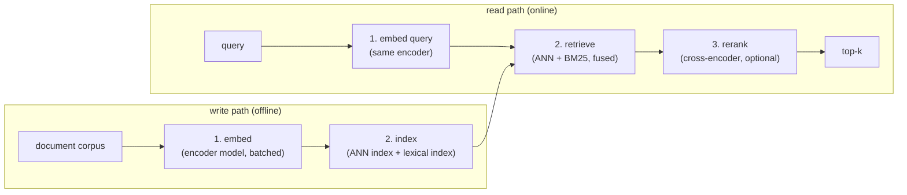

# 2. Framing the system

## The four stages

Semantic search is not one step; it is a pipeline with four distinct stages,
each with a different cost profile and recall/precision tradeoff. Getting the
boundaries right is the whole design.

**Stage 1: embed.** The encoder model maps text to a fixed-size vector. On the
write path this is a bulk, throughput-bound job. On the read path it is a
per-query, latency-bound operation. The encoder is its own service and its
output dimension is the single number that drives the entire cost structure
downstream (more on this in section 3).

**Stage 2: index.** The write path builds two indexes: a vector index for dense
semantic retrieval and a lexical index (an inverted list, BM25 or SPLADE) for
exact-term retrieval. These run independently at query time and their results
are fused. Either alone has a blind spot the other covers.

**Stage 3: retrieve.** At query time, the query is embedded, sent to both
indexes in parallel, and the two result lists are fused (typically with
reciprocal rank fusion). The retrieve stage optimizes recall at a cheap per-item
cost. It must return a candidate set broad enough to cover relevant documents
even if ordering is imperfect.

**Stage 4: rerank.** The reranker takes the top candidates from retrieve (say
100) and rescores them with a heavier cross-encoder model that reads the query
and document together. It optimizes precision at the top of the list. It is
optional: skip it when a downstream model will re-score anyway, or when
latency does not allow it.

## Input and output

**Input (online query path):**
- A text query (natural language, a keyword string, or a structured expression).
- Optional structured filters (date range, category, author, etc.).
- A value of k (how many results to return).

**Output:**
- A ranked list of k document IDs with optional scores and metadata.

**Input (offline write path):**
- A stream of documents (inserts, updates, deletes).
- Each document has text content and optional structured fields.

**Output:**
- An updated vector index and lexical index, within the freshness SLA.

## Why each stage is necessary

The classic shortcut is to skip directly to "embed everything and do nearest
neighbor." That misses three things.

First, the lexical index is not optional. Dense embeddings capture meaning but
miss exact tokens: a query for "OOM-killer error 137" may retrieve semantically
related text about memory limits rather than the exact error page. BM25 or
SPLADE handles this without any model.

Second, retrieve and rerank are separate because cost profiles are opposite. A
bi-encoder can score a query against 100 million documents (via the ANN index)
at sub-millisecond cost per item. A cross-encoder needs the full query and
document text together and is thousands of times more expensive per pair. Running
it over 100 million documents is not possible; running it over a 100-document
shortlist is cheap and lifts precision sharply.

Third, the indexing stage is not trivial. The choice of index structure commits
the tradeoff between recall, latency, and memory for the lifetime of the service
until it is re-indexed.
