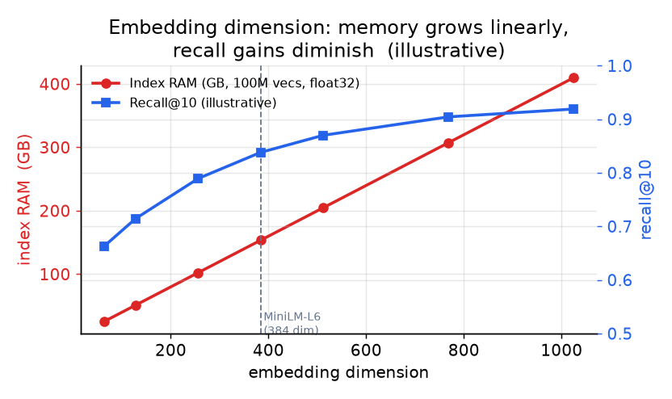

# 3. The embedding service

The encoder model is the source of every vector in the system. Its output
dimension, its latency, and how quickly it re-embeds a changed document
propagate into every downstream cost. Getting the encoder right before touching
the index is important.

## Model choice

Two families of models matter here.

**Bi-encoders (sentence transformers, e.g., BGE, MiniLM, E5, multilingual-e5).**
These encode a query or document independently into a single vector. They are
the right choice for retrieval because the document side can be precomputed
offline. At query time only the query is encoded online, and the dot product
(or cosine) against precomputed document vectors is what the ANN index computes.
BGE-large-en and multilingual-e5-large are strong general-purpose baselines;
all-MiniLM-L6 (384-dim) is the standard small, fast option when memory is tight.

See what an encoder-only bi-encoder looks like end to end:
[all-MiniLM-L6 in the Model Zoo](https://www.neurarch.com/?import=https://raw.githubusercontent.com/neurarch-ai/awesome-llm-model-zoo/main/architectures/all-minilm-l6/model.json).
The pooling layer and the final embedding dimension are the two architectural
knobs that drive your index RAM budget.

**Cross-encoders.** These read query and document together and produce a
relevance score but not a standalone vector. They are more accurate but cannot
precompute offline. Reserve them for the reranking stage over a small shortlist,
not for retrieval over the full corpus.

**Dimension is the central cost knob.** At 100 million documents in float32, a
384-dim model needs about 153 GB of raw vector storage; a 1024-dim model needs
about 409 GB. The ANN index adds graph edges (HNSW) or codes (PQ) on top. Pick
the smallest model that clears your recall bar, not the largest model on the
leaderboard.

*As embedding dimension grows, index RAM scales linearly, while recall gains
flatten. Choosing a 384-dim model instead of 1024-dim cuts memory by 62% with
only a modest recall penalty on most corpora. Illustrative curves; measure on
your data.*

Some models support **Matryoshka representation learning**: the vector's prefix
(say, the first 512 dims of a 4096-dim vector) is itself a valid shorter
embedding. LinkedIn uses this to run ANN retrieval at 2048 dims for cheap
approximate search and then feed the full 4096-dim vector to the ranking stage,
all from a single model training run. This is the right trick when you want a
cheap retrieval stage and a more precise ranking stage without maintaining two
separate encoder models.

## Two workloads on the same model

The encoder does two very different jobs and should be deployed to match each.

**Write path (bulk embedding):** embed the entire corpus on first load, then
re-embed documents that change. This is throughput-bound, not latency-bound.
Batch aggressively (batch size 256 or larger), run on GPU for throughput, and
pipeline the work asynchronously. Freshness SLA (minutes, in this design) sets
the maximum tolerable lag between a document change and its vector being updated
in the index.

**Read path (query embedding):** embed one query per request, latency-bound.
Cache query embeddings: the same or near-identical query often arrives many
times. Instacart, for example, runs a two-tower items model served via FAISS
ANN with daily index rebuilds, separating the offline embedding work from the
online query path. A 50ms total budget leaves perhaps 5ms for query embedding,
so cache misses must still be fast; a 384-dim MiniLM-L6 inference on CPU is
around 5ms per query single-threaded.

## Freshness

A document inserted or changed must become searchable within the freshness SLA.
The encoder embeds it (asynchronously), the resulting vector is upserted into
the index, and the document's text is added to the lexical index. The two writes
are independent and may land slightly out of sync, which is acceptable if both
indexes are eventually consistent within the SLA.

Model upgrades are a special case. Change the encoder model and every vector in
the system must be re-embedded: old and new vectors live in different spaces and
cannot be mixed in one index. Plan model upgrades as a full re-index event,
building the new index alongside the old, dual-reading for validation, then
cutting over. This is a storage and cost event, not just a software deploy.

## When to use which model

| Reach for | When | Instead of |
|---|---|---|
| Small bi-encoder (MiniLM-L6, 384-dim) | Memory or latency is the binding constraint; the domain is general English text | A large model when a benchmark says "large wins" but your RAM bill does not agree |
| Large bi-encoder (BGE-large-en, E5-large, 1024-dim) | You have the RAM and retrieval recall is short of the bar with the small model | The small model at the same recall level |
| Multilingual bi-encoder (multilingual-e5-large) | Queries or documents span multiple languages | An English-only model on multilingual data (Dropbox measured a wide MRR gap) |
| Matryoshka-trained model | You want different dimensions for retrieval vs ranking from one training run | Training and maintaining two separate encoders per stage |
| Cross-encoder | Reranking a shortlist of 100 candidates for final ordering | Retrieval over the full corpus, which makes cross-encoder cost infeasible |
| Domain-specific fine-tuned model | Your corpus is highly specialized (code, biomedical, legal) and MTEB models miss key terms | Off-the-shelf models when domain-specific recall is measurably below the bar |

**Tools.** Bi-encoders and cross-encoders are both served through sentence-transformers, which loads the MiniLM, BGE, E5, and multilingual-e5 checkpoints and exposes cross-encoder rerankers from the same API. Domain fine-tuning uses the same library's training loops, and the MTEB benchmark is the standard way to compare candidates before committing. Some checkpoints are trained with Matryoshka representation learning so one model yields several valid dimensions; the resulting vectors then land in a vector index such as FAISS (Meta), Qdrant, or Weaviate whose RAM budget is set directly by the chosen dimension.

**Provenance.** The bi-encoder and cross-encoder split traces to Sentence-BERT (UKP Darmstadt, 2019), and the resulting vectors land in indexes such as FAISS (Meta).

**Worked example.** A search product with a general English corpus and a tight 50ms budget picks a small 384-dim MiniLM-L6 bi-encoder over a 1024-dim model, because memory and query latency are the binding constraints and the recall penalty is modest on general text. If measured retrieval recall then fell short of the bar and the RAM was available, it would move up to a large bi-encoder like BGE-large or E5-large at the same recall target. When queries and documents started spanning languages, it would switch to a multilingual-e5 encoder rather than run an English-only model on multilingual data. It reserves a cross-encoder strictly for reranking a shortlist, never for retrieval over the full corpus, and reaches for a domain fine-tuned model only if a specialized corpus like code or biomedical text measurably misses key terms.
