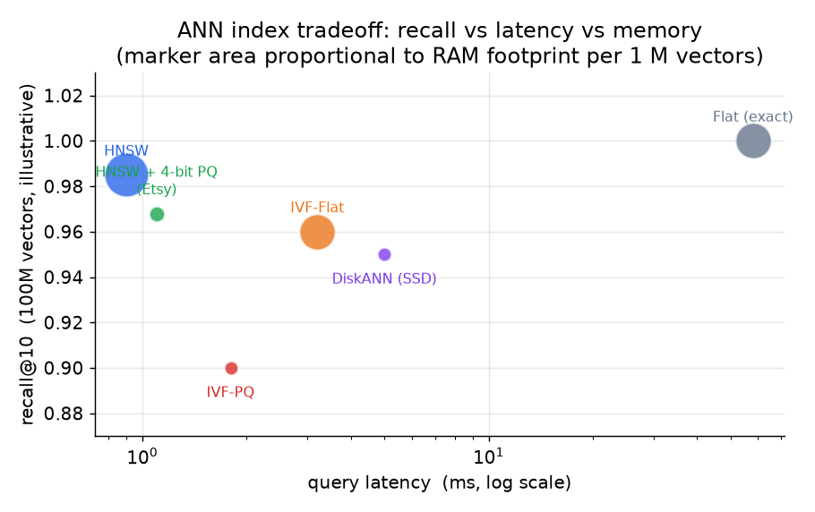

# 4. The vector index

The index choice commits the recall/latency/memory tradeoff for the service.
It is not a default; it is a design decision that must be justified from the
corpus size, query throughput, memory budget, and update rate.

## Why approximate search

Exact nearest-neighbor search scans all vectors for every query. At 100 million
vectors and 1 microsecond per vector, one query takes 100 seconds. We trade a
small recall loss for a large speedup by using approximate nearest neighbor
(ANN) search: most queries retrieve essentially the same results, and the ones
that differ are handled by the reranking stage.

## The four main structures

*Flat (exact) search is the recall ceiling and the latency floor; it is too
slow for 100M vectors online. HNSW gives the best recall at a given latency
but stores the graph plus full vectors and is RAM-heavy. IVF-PQ cuts memory
dramatically at some recall cost and is the pragmatic choice at billion scale.
DiskANN pushes vectors to SSD and is competitive in recall while keeping DRAM
cost low. Illustrative positions; calibrate on your data.*

### Flat (brute-force exact search)

Scan all vectors, compute exact distances. Recall is 1.0 by definition. Use
it to establish the ground-truth recall ceiling when evaluating approximate
indexes. Never use it as the production index at 100M vectors.

### HNSW (hierarchical navigable small world graph)

HNSW builds a multi-layer graph where each node is a vector and edges connect
approximate neighbors at different scales. At query time, a greedy graph
traversal from a high-level entry point descends toward the nearest neighbors.
Recall and latency are controlled by the search parameter `ef` (the beam
width during traversal): higher `ef` raises recall and latency together.
Insertions are incremental: a new vector is linked into the existing graph
without a full rebuild, which is why HNSW handles the minutes-cadence upserts
required by this design's freshness SLA.

Memory cost is the main drawback. HNSW stores the full-precision vectors plus
the graph edges: roughly `(dim * 4 + M * 8)` bytes per vector, where `M` is
the number of edges per node (typically 16 to 64). At 100 million vectors with
dim = 384 and M = 32, that is around 178 GB. Spotify's Voyager (wrapping
hnswlib) compresses vectors to 8-bit floats (E4M3) and reports a 4x memory
reduction.

### IVF-PQ (inverted file plus product quantization)

IVF-PQ clusters vectors into `nlist` cells (Voronoi partition). At query time,
only the `nprobe` closest cluster centroids are searched, reducing the scan to
`nprobe / nlist` of the corpus. Product quantization then compresses each
vector into a short code by splitting it into `m` subspaces and quantizing
each independently. The code size in bytes is `m * ceil(b / 8)` where `b`
is the bits per subspace code.

The math for sizing:

$$\text{raw index size} = n \times d \times 4 \quad \text{bytes (float32)}$$

$$\text{PQ code size per vector} = m \times \left\lceil \frac{b}{8} \right\rceil \quad \text{bytes}$$

$$\text{PQ compression ratio} = \frac{d \times 4}{m \times \left\lceil b / 8 \right\rceil}$$

With `d = 384`, `m = 24`, `b = 8` (one byte per subspace), each vector
compresses from 1536 bytes to 24 bytes, a 64x reduction. Meta's Faiss uses
this structure to serve billion-scale indexes in manageable RAM budgets.

The cost of IVF-PQ is recall loss from quantization: compressed scores are
approximate, so a rescoring step (paging back the true vectors for the
candidate shortlist) recovers precision. The knobs `nprobe` and `m` / `b`
let you tune recall against latency and memory at query time without rebuilding.

### HNSW with product quantization (HNSW + PQ)

Stores HNSW graph edges at full precision but compresses vector payloads with
PQ. Etsy uses HNSW with 4-bit PQ on their search index, trading recall for
memory, and recovers precision with a full-precision rescore of the shortlist.
This gives HNSW's excellent graph traversal recall with a smaller RAM footprint.

### DiskANN (Vamana graph, SSD-backed)

DiskANN builds a Vamana graph (similar in spirit to HNSW) but stores full
vectors on SSD and keeps only compressed DRAM-resident codes for graph
traversal. A query routes through the graph using cheap DRAM reads, then
pages full vectors from SSD only for the final candidates. Microsoft reports
95% recall at about 5ms latency on one billion vectors using commodity SSD
hardware, a 5-10x denser packing per machine than DRAM-only ANN. The latency
floor is set by SSD random-read time, not compute. The streaming variant
(FreshDiskANN) supports concurrent inserts and deletes without a full rebuild.

## ScaNN and the MIPS distinction

Google's ScaNN targets maximum inner product search (MIPS), which is the
objective for two-tower retrieval with dot-product similarity. Its key insight
is that minimizing average reconstruction error (the default PQ objective) is
wrong for MIPS: what matters is preserving the highest inner products, not
the average. ScaNN penalizes quantization error parallel to the query vector
with an anisotropic loss term:

$$\mathcal{L}\_{aniso} = \eta \lVert r_{\parallel} \rVert^{2} + \lVert r_{\perp} \rVert^{2}, \quad r = x - \tilde{x},\quad \eta \gt 1$$

where $r_{\parallel}$ is the error component parallel to the query and
$r_{\perp}$ the orthogonal component. Penalizing $r_{\parallel}$ more
preserves the high inner products that rank first. ScaNN achieves the best recall-vs-QPS on ann-benchmarks for CPU-bound serving.
**Reusing a Euclidean-tuned quantizer for inner-product search quietly loses
recall; ScaNN's anisotropic loss is the fix.**

## When to use which index

| Reach for | When | Instead of |
|---|---|---|
| HNSW (Spotify, Vespa) | Corpus fits in RAM, highest recall at latency, and incremental inserts are required | IVF-PQ when memory is not the constraint and churn is low |
| IVF-PQ (Meta Faiss) | Billion-scale corpus on a RAM budget; quantization recall loss is acceptable | HNSW when the corpus fits in RAM and you want maximum recall |
| HNSW + 4-bit PQ (Etsy) | HNSW graph quality desired, but the full-precision footprint is too large | Full-precision HNSW when memory is available |
| DiskANN (Microsoft) | A billion vectors must fit on one commodity machine; SSD latency is acceptable | Keeping full vectors in DRAM when the cost is prohibitive |
| ScaNN anisotropic PQ | Two-tower inner-product search (MIPS) on CPU-bound serving | A Euclidean-tuned PQ that silently loses inner-product recall |
| Flat / brute force | Small corpus, or establishing a recall ceiling to measure ANN against | ANN at 100M scale where linear scan is too slow |

The two design questions to answer before picking an index: (1) does the corpus
fit in RAM, and (2) is the catalog stable or does it churn? Stable and fits in
RAM: HNSW. Billion-scale RAM-constrained: IVF-PQ. Billion vectors on one box:
DiskANN. MIPS objective: ScaNN or ScaNN-style anisotropic loss. Those four
cover the space of production choices.
