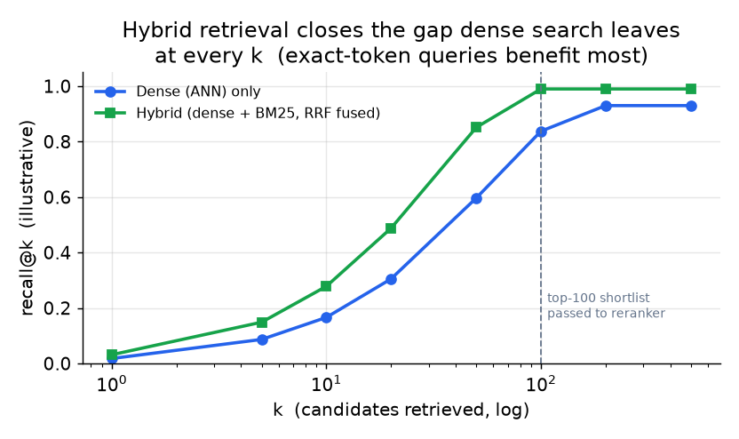
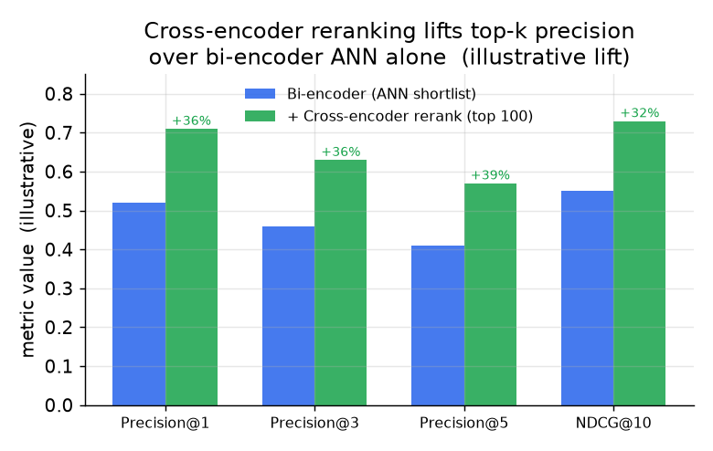

# 5. Hybrid search and reranking

Dense retrieval is not enough by itself. This section covers why, how to fuse
dense and lexical signals, and when to add a cross-encoder reranker on top.

## Why pure dense retrieval has blind spots

A bi-encoder maps text into a continuous vector space. The dot product between
query and document vectors measures semantic similarity as learned from the
training corpus. This is powerful for paraphrase matching and intent retrieval
but has two failure modes.

**Exact-token misses.** Queries containing rare tokens (product SKUs, error
codes, names, version strings, technical identifiers) may retrieve semantically
related documents that do not contain the exact token. A query for
"OOM-killer exit code 137" might retrieve a paragraph about memory management
that never uses the string "137." A user searching for that code wants the exact
match. Lexical search handles this without a model: BM25 scores a document by
weighted term overlap with the query, so "137" in the document scores high for
the query "137."

**Out-of-domain terms.** Tokens the encoder never saw in training (new product
names, internal jargon, foreign-language rare words) have no meaningful
representation in the embedding space. BM25 or SPLADE treats them as ordinary
tokens and still retrieves exact matches.

Hybrid search, running dense and lexical retrieval in parallel and fusing the
results, reliably beats either channel alone across query mixes that include both
natural-language questions and exact-token lookups.



*Hybrid retrieval (dense plus BM25, fused with RRF) lifts recall at every k
compared to dense alone. The gap is largest at small k because exact-term
queries land near the top in the lexical channel. Illustrative; the gap depends
on the fraction of exact-token queries in your mix.*

## Lexical retrieval options

**BM25 (probabilistic term weighting).** The standard inverted-index baseline.
Fast, no model required, exact token matches are perfect. IDF downweights common
terms and TF rewards dense mention. The baseline to beat in any hybrid system;
all major search engines expose it natively.

Concretely, BM25 sums one score per shared term: an IDF weight (rare terms count
for more) times a saturating, length-normalized term frequency.

```python
import math

def bm25_term(f, df, n_docs, dl, avgdl, k1=1.5, b=0.75):   # f: term freq in doc, df: docs holding the term
    idf = math.log((n_docs - df + 0.5) / (df + 0.5) + 1)    # rarer terms (small df) score higher
    tf = (f * (k1 + 1)) / (f + k1 * (1 - b + b * dl / avgdl))  # saturating tf, penalized for long docs
    return idf * tf                                          # one term's contribution; sum over query terms
# round(bm25_term(3, 10, 1000, 90, 100), 2) -> 7.79
```

**SPLADE (sparse learned model).** SPLADE is a neural model that produces
sparse weight vectors over the vocabulary, similar in shape to BM25 but learned
to expand queries and documents with related terms. "memory error" in a query
might expand to also cover "OOM," "segfault," "swap," giving retrieval that
blends the term precision of BM25 with semantic expansion. SPLADE vectors are
stored as inverted lists in an existing search engine (Fare uses it on top of
Elasticsearch). The cost is that SPLADE expands posting lists, increasing index
size, and it requires running the SPLADE model at index time (write path) and at
query time.

## Fusing dense and lexical results

The two channels return separate ranked lists. The simplest and most robust
fusion is **reciprocal rank fusion (RRF)**:

$$\text{RRF-score}(d) = \sum_{r \in \text{channels}} \frac{1}{k_0 + \text{rank}_r(d)}$$

In code it is a dozen lines: sum a rank-based reciprocal across channels, no score
normalization anywhere.

```python
def rrf(rank_lists, k0=60):        # rank_lists: one ranked list of doc ids per channel
    scores = {}
    for lst in rank_lists:
        for rank, doc in enumerate(lst, start=1):     # rank is 1-based
            scores[doc] = scores.get(doc, 0.0) + 1.0 / (k0 + rank)
    return sorted(scores, key=scores.get, reverse=True)
# a doc ranked 1st in both channels scores 2/(60+1); channels never compare raw scores
```

where $k_0$ is a small constant (typically 60). A document that ranks 1st in
both channels gets a score of $2 / (60 + 1)$; one that ranks 10th in one and
50th in the other gets a lower combined score. RRF is robust to score scale
differences between channels (dense cosine similarity and BM25 BM25 scores are
not on the same scale), requires no tuning of mixing weights, and has shown
consistent gains in retrieval benchmarks.

Alternatively, linearly interpolate the normalized scores from each channel with
a tuned mixing weight alpha:

$$s(d) = \alpha \cdot s_{\text{dense}}(d) + (1 - \alpha) \cdot s_{\text{BM25}}(d)$$

```python
def linear_fuse(dense, bm25, alpha=0.5):     # dense, bm25: {doc_id: normalized_score in [0,1]}
    docs = set(dense) | set(bm25)            # union of docs seen by either channel
    fused = {d: alpha * dense.get(d, 0.0) + (1 - alpha) * bm25.get(d, 0.0) for d in docs}
    return sorted(fused, key=fused.get, reverse=True)   # best combined score first
# linear_fuse({"a": 0.9, "b": 0.2}, {"b": 0.8, "c": 0.5}, 0.5) -> ['b', 'a', 'c']
```

This gives more control over the mix but requires calibration and normalization
of scores across channels, and alpha may need tuning per query class.

## Cross-encoder reranking

After the fused retrieval returns a shortlist of, say, 100 candidates, a
cross-encoder can reorder them. A cross-encoder reads the query and document
together in one forward pass and outputs a relevance score. Because it models
interactions between query and document tokens (attention across both), it is
significantly more accurate than a bi-encoder for fine-grained relevance
judgments. The cost is thousands of times higher per pair: a cross-encoder
cannot be used over the full corpus, only over the shortlist.



*A cross-encoder reranker applied to the top-100 shortlist consistently lifts
precision at ranks 1, 3, and 5 and NDCG@10 over the bi-encoder alone.
Illustrative; gains depend on query mix and model family.*

Cross-encoder reranking is optional and should be gated on latency budget.
The decision tree: if the surface shows results directly to a human who cares
about the order of the top 3 results, add a reranker. If the shortlist feeds a
downstream model that will re-score anyway, skip it.

## When to use which

| Reach for | When | Instead of |
|---|---|---|
| Dense (ANN) only | The corpus is clean, on-domain text with no exact-term queries; queries are always natural language | Hybrid when your query mix never includes exact tokens or rare identifiers |
| Hybrid dense + BM25 (RRF) | Queries include a mix of natural language and exact terms (SKUs, codes, names); this is the expected default at senior level | Dense alone when exact-term recall matters |
| Dense + SPLADE | You want semantic query expansion with lexical interpretability and have an existing Elasticsearch or OpenSearch cluster | A second dense model when the problem is term-mismatch, not semantic gap |
| RRF fusion | Mixing channels with incompatible score scales (always true for dense vs BM25) | Linear interpolation that requires careful score normalization and per-class tuning |
| Cross-encoder reranker | Top-k order matters to a human reader; budget allows 10-30ms extra; downstream model does not re-score | Bi-encoder for final ordering when the downstream stage will rank anyway |
| Skip reranking | The shortlist feeds a downstream ranker; total latency budget is tight | Adding a reranker that duplicates work already done downstream |

**Tools.** BM25 is native to the Lucene-based engines (Elasticsearch, OpenSearch) and to Tantivy, and SPLADE stores its learned sparse vectors as inverted lists inside those same engines. Dense and hybrid retrieval with built-in RRF fusion is offered by Qdrant, Weaviate, and Vespa, so both channels and the fusion can live in one system. Cross-encoder rerankers come from sentence-transformers, ColBERT provides late-interaction reranking, and Cohere Rerank is a hosted reranking API.

**Provenance.** BM25 is Robertson and Walker (1994) and Reciprocal Rank Fusion is Cormack et al. (2009). Cross-encoder rerankers descend from Sentence-BERT (UKP Darmstadt, 2019); ColBERT (Stanford, 2020) is the late-interaction alternative and Cohere Rerank (Cohere) the hosted option.

**Worked example.** An enterprise-RAG team whose users mix natural-language questions with exact-token lookups (error codes, internal SKUs, jargon) runs hybrid dense plus BM25 rather than dense alone, because pure dense retrieval misses the exact and out-of-domain tokens that BM25 catches for free. It fuses the two ranked lists with reciprocal rank fusion instead of linear score interpolation, since dense cosine and BM25 scores are not on the same scale and RRF needs no per-class weight tuning. Where it wants semantic query expansion with lexical interpretability and already runs an OpenSearch cluster, it adds SPLADE rather than standing up a second dense model. Because the results are shown directly to a human who cares about the top few, it adds a cross-encoder reranker over the fused shortlist within its latency budget, but it would skip that reranker if the shortlist merely fed a downstream ranker that re-scores anyway.
