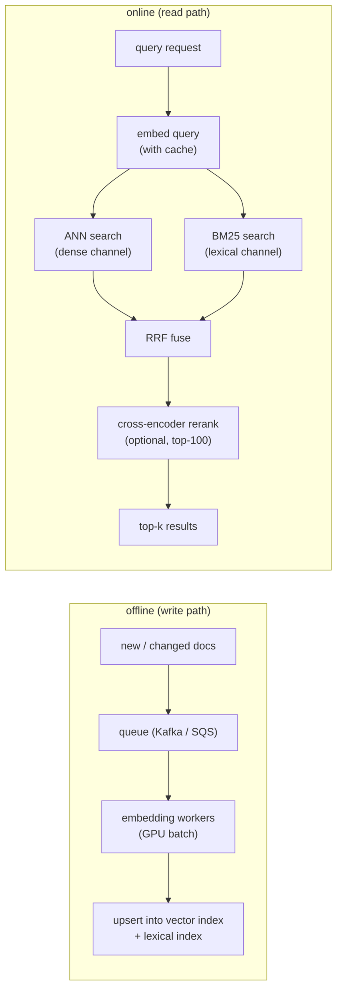

# 6. Serving and scaling

## The latency budget

The 50ms p99 target covers the entire search call. Spending it wisely requires
knowing where each stage contributes and where the slack is.

A realistic breakdown for the online (read) path:

| Stage | Typical cost | Notes |
|---|---|---|
| Query embedding (cache hit) | 0-1 ms | Cached vectors returned immediately |
| Query embedding (cache miss) | 4-8 ms | Encoder inference; 384-dim MiniLM on CPU |
| ANN search (dense channel) | 2-15 ms | Depends on index type, ef/nprobe, sharding |
| BM25 search (lexical channel) | 2-8 ms | Runs in parallel with ANN; inverted index lookup |
| RRF fusion | 1 ms | Trivially fast |
| Cross-encoder rerank (optional) | 10-30 ms | Top-100 candidates; can be skipped |
| Network + overhead | 2-5 ms | Between service hops |

Dense ANN search and cross-encoder reranking are the two movable costs. Query
embedding caching and parallel execution of the two search channels are the
two levers that open budget for reranking.

## Offline and online paths

**How it works.** The two paths never touch the same critical path. On the offline
side, new or changed documents land on a durable queue so ingestion spikes do not
stall, GPU embedding workers pull batches off that queue to amortize model cost, and
the resulting vectors are upserted into both the vector index and the lexical index
so the two channels stay in sync. On the online side a query is embedded once,
through a cache that absorbs repeated queries, and the single query vector fans out
in parallel to the ANN dense channel and the BM25 lexical channel. Their two ranked
lists are combined by RRF fusion, which needs no shared score scale, and only the
fused shortlist (top-100) is handed to the optional cross-encoder reranker before the
final top-k is returned. Decoupling this way lets the write path optimize for
throughput and the read path optimize for latency, and it is why the reranker sees a
small candidate set rather than the whole corpus.

## Sharding and replication

**Shard for capacity.** If the full 100M-vector index does not fit in the RAM
of one machine, partition it: shard 1 holds documents 0-25M, shard 2 holds
25M-50M, and so on. Each query fans out to all shards in parallel and the
results are merged before fusion. Latency stays nearly constant as the corpus
grows, because each shard searches a fixed-size sub-index.

**Replicate for QPS.** Multiple replicas of each shard handle concurrent
queries. A stateless HNSW replica loads the index into memory on start and
serves queries with no shared state (Spotify deploys stateless Kubernetes pods,
each holding the index in RAM).

## Filters: push inside the index, not after

When queries include attribute filters (date range, category, owner ID), a
naive approach post-filters: run ANN over all 100M vectors, then discard
filtered documents. If 99% of documents fail the filter, you wasted 99% of
the ANN budget.

**Push filters inside the index.** IVF allows restricting which clusters are
searched before scanning codes: a category filter eliminates whole clusters,
so the scan touches only the relevant partition. Vespa's HNSW-IF design
naturally handles this by coupling the HNSW graph for dense retrieval to an
inverted file that supports attribute filtering without full-graph traversal.

If the filter is very selective (less than 1% of documents pass), a partition
strategy beats ANN: maintain a separate small index per filter value and route
filtered queries to the right sub-index directly.

## Freshness: incremental upserts

A full index rebuild at 100M documents is slow and expensive. The freshness SLA
(minutes) requires incremental upserts.

**HNSW** supports incremental inserts natively: a new vector is linked into
the existing graph. Deletes require tombstoning (mark deleted, exclude from
results) and periodic compaction to free memory.

**IVF-PQ** assigns a new vector to its nearest centroid and appends it to the
corresponding posting list. No rebuild is needed for new vectors. If the data
distribution drifts over time (new product categories, seasonal shifts), the
centroids become stale and recall drifts; periodic re-clustering (not a full
rebuild) corrects this.

**DiskANN** (FreshDiskANN) supports concurrent inserts and deletes against the
SSD-backed Vamana graph with no full rebuild.

## Bottlenecks

| Bottleneck | First sign | Fix | Tradeoff |
|---|---|---|---|
| Query embedding latency (cache miss) | p99 for new queries spikes above budget | Cache frequently re-used embeddings; smaller encoder model | Slight recall loss from smaller model |
| Index RAM exceeds budget | OOM on index nodes | IVF-PQ or 4-bit PQ compression; reduce embedding dim; shard across more machines | Recall loss from quantization |
| ANN search latency too high | ANN contributes bulk of latency budget | Lower `ef` / `nprobe`; add more shards; switch index structure | Recall loss |
| Recall too low (dense blind spots) | Queries with exact tokens miss relevant documents | Add lexical channel (BM25 / SPLADE) and fuse | Two channels to maintain |
| Filter performance degrades | Queries with selective filters are slow or miss documents | Push filters inside the index; add per-partition sub-indices | More index structures to manage |
| Stale index | New documents not searchable within SLA | Streaming upsert pipeline; smaller batch cadence | Write-path complexity |
| Reranker tail latency | p99 spikes when reranker runs | Truncate reranker input; make reranker optional per query class | Precision loss on queries that skip it |
| Index rebuild on model upgrade | Zero-downtime impossible with a single index | Build new index alongside old; dual-read; cut over | 2x storage temporarily |

**Detail.** The ANN-search-latency row's two knobs come from the two index families:
ef (ef_search) is HNSW's beam width, the number of candidate nodes kept while
descending the navigable graph (Malkov and Yashunin, 2016), while nprobe is IVF-PQ's
cell count, how many inverted lists a query scans (Jegou et al.; FAISS by Meta). Both
trade recall for latency roughly linearly, so lower them only after confirming recall
stays above the bar. The recall-too-low row adds a lexical channel because dense
vectors blur exact tokens; BM25 (Robertson and Walker, 1994) recovers SKUs, codes,
and rare identifiers the encoder never learned to separate.
