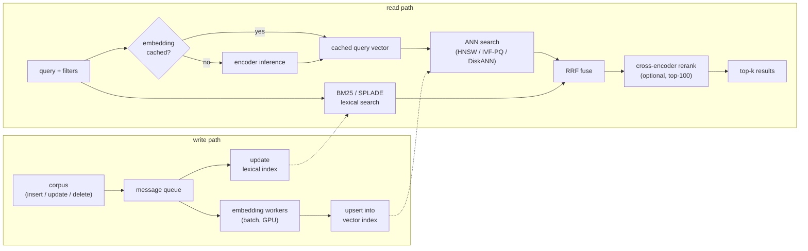

# 9. Summary

## One-page recap

- **The system has two paths.** Offline: encode the corpus in bulk and build an
  ANN index plus a lexical index. Online: embed the query, search both indexes
  in parallel, fuse results, optionally rerank a shortlist.

- **Embedding dimension is the central cost knob.** Index RAM scales linearly
  with dimension; recall gains diminish. Pick the smallest model that clears
  your recall bar. Matryoshka embeddings serve two quality levels (retrieval
  and ranking) from one training run.

- **The index choice commits the recall/latency/memory tradeoff.** HNSW for
  best recall when the corpus fits in RAM; IVF-PQ for billion-scale RAM budgets;
  DiskANN for billion vectors on one commodity machine; ScaNN anisotropic PQ
  for inner-product search. Match to the memory regime and update rate, not
  to a default.

- **Hybrid search is the expected default, not optional.** Dense embeddings miss
  exact-token queries (SKUs, error codes, rare names). Run BM25 or SPLADE in
  parallel with ANN and fuse with RRF. Hybrid reliably beats either channel
  alone across mixed query types.

- **Compressed first-phase scores are approximate; always rescore.** Any
  quantization (PQ, int8, 4-bit) makes ANN scores imprecise. Page back the
  full-precision vectors for the top candidates and recompute exact scores.
  Never trust compressed scores as final.

- **Model upgrades are a full re-index event.** Old and new vectors cannot
  share one space. Build the new index alongside, dual-read for validation,
  then cut over. Budget 2x storage temporarily.

- **Evaluate with recall@k at the k passed downstream, on a time-based split,
  then gate on an online A/B.** Offline recall at k=10 is wrong if you pass
  500 to the next stage. Post-filter recall at the wrong k is not meaningful
  for the downstream system.

## The system on one page

## Test yourself

1. Why does running both dense ANN and BM25 in parallel beat either alone,
   even when the dense model is large and recent?
2. You have 100M vectors at 768 dimensions in float32. Estimate the raw index
   memory. How does switching to int8 and to 4-bit PQ with 48 subspaces each
   change that number?
3. A filter passes 0.5% of the corpus. Why does a naive post-filter after ANN
   fail, and what is the correct design?
4. When would you pick DiskANN over HNSW, and when would you pick ScaNN over
   IVF-PQ?
5. A team upgraded the embedding model and recall dropped in production
   immediately after. What is the most likely cause?
6. Explain why quantization error parallel to the query vector hurts MIPS recall
   more than orthogonal error, and which system addresses this explicitly.

## Further reading

- Dense reference (comparison, math, all case studies):
  [topics/08-semantic-search-and-embeddings.md](../../topics/08-semantic-search-and-embeddings.md).
- Per-company teardowns and interview question banks:
  [tools/teardowns/08.md](../../tools/teardowns/08.md) and
  [tools/comparisons/08.md](../../tools/comparisons/08.md).
- Trace a real bi-encoder end to end, see the pooling layer and the embedding
  dimension that drives your index RAM:
  [all-MiniLM-L6 in the Model Zoo](https://www.neurarch.com/?import=https://raw.githubusercontent.com/neurarch-ai/awesome-llm-model-zoo/main/architectures/all-minilm-l6/model.json).
- Multimodal embeddings (text and images in one space):
  [CLIP ViT-B/32 in the Model Zoo](https://www.neurarch.com/?import=https://raw.githubusercontent.com/neurarch-ai/awesome-llm-model-zoo/main/architectures/clip-vit-b32/model.json).
