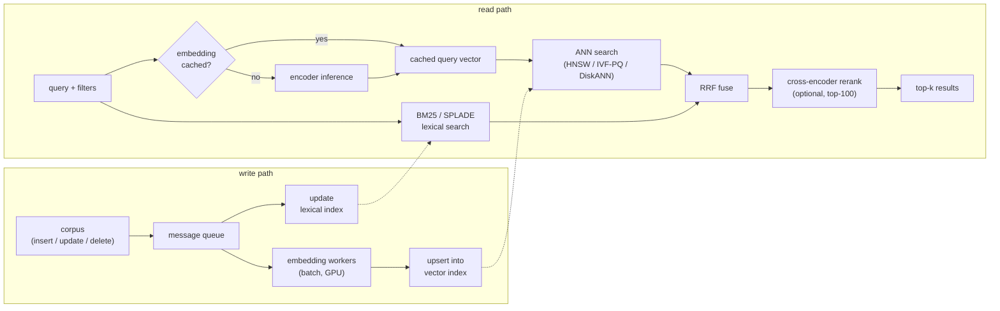

# 9. Summary

## One-page recap

- **The system has two paths.** Offline: encode the corpus in bulk and build an
  ANN index plus a lexical index. Online: embed the query, search both indexes
  in parallel, fuse results, optionally rerank a shortlist.

- **Embedding dimension is the central cost knob.** Index RAM scales linearly
  with dimension; recall gains diminish. Pick the smallest model that clears
  your recall bar. Matryoshka embeddings serve two quality levels (retrieval
  and ranking) from one training run.

- **The index choice commits the recall/latency/memory tradeoff.** HNSW for
  best recall when the corpus fits in RAM; IVF-PQ for billion-scale RAM budgets;
  DiskANN for billion vectors on one commodity machine; ScaNN anisotropic PQ
  for inner-product search. Match to the memory regime and update rate, not
  to a default.

- **Hybrid search is the expected default, not optional.** Dense embeddings miss
  exact-token queries (SKUs, error codes, rare names). Run BM25 or SPLADE in
  parallel with ANN and fuse with RRF. Hybrid reliably beats either channel
  alone across mixed query types.

- **Compressed first-phase scores are approximate; always rescore.** Any
  quantization (PQ, int8, 4-bit) makes ANN scores imprecise. Page back the
  full-precision vectors for the top candidates and recompute exact scores.
  Never trust compressed scores as final.

- **Model upgrades are a full re-index event.** Old and new vectors cannot
  share one space. Build the new index alongside, dual-read for validation,
  then cut over. Budget 2x storage temporarily.

- **Evaluate with recall@k at the k passed downstream, on a time-based split,
  then gate on an online A/B.** Offline recall at k=10 is wrong if you pass
  500 to the next stage. Post-filter recall at the wrong k is not meaningful
  for the downstream system.

## The system on one page

```mermaid
flowchart LR
  subgraph Write["write path"]
    DOCS["corpus<br/>(insert / update / delete)"] --> Q["message queue"]
    Q --> EW["embedding workers<br/>(batch, GPU)"]
    EW --> VUP["upsert into<br/>vector index"]
    Q --> LUP["update<br/>lexical index"]
  end
  subgraph Read["read path"]
    REQ["query + filters"] --> ECACHE{"embedding<br/>cached?"}
    ECACHE -->|"yes"| EVec["cached query vector"]
    ECACHE -->|"no"| EINF["encoder inference"]
    EINF --> EVec
    EVec --> ANN["ANN search<br/>(HNSW / IVF-PQ / DiskANN)"]
    REQ --> BM25["BM25 / SPLADE<br/>lexical search"]
    ANN --> RRF["RRF fuse"]
    BM25 --> RRF
    RRF --> RR["cross-encoder rerank<br/>(optional, top-100)"]
    RR --> TOP["top-k results"]
  end
  VUP -.-> ANN
  LUP -.-> BM25
```

## Test yourself

Answers are collapsed. Attempt each question before opening one.

1. Why does running both dense ANN and BM25 in parallel beat either alone,
   even when the dense model is large and recent?

   

Answer

   Because the two channels fail on different queries, and model size does not
   close a lexical gap. A bi-encoder scores the angle between two learned
   vectors, so it matches paraphrases ("OOM" and "out of memory" share no term
   yet land near each other) but blurs rare tokens: a query for "OOM-killer exit
   code 137" can retrieve a paragraph about memory management that never
   contains the string "137". BM25 scores weighted exact-term overlap, so
   identifiers, SKUs, version strings, and internal jargon are perfect matches
   for free. Even a flawless encoder cannot represent a product code minted
   after its training data was collected: the tokenizer falls back to subword
   pieces and places the code near strings with similar spelling, which is
   spelling similarity masquerading as meaning. Since neither mechanism subsumes
   the other, the production answer is to run both in parallel and fuse on rank
   with **RRF**, which needs no shared score scale and no per-class weight
   tuning. Section [1](01-clarifying-requirements.md) pinned a query mix of
   natural language plus exact codes, which is why
   [5](05-hybrid-and-reranking.md) treats hybrid as the expected default rather
   than an optimization.

   

2. You have 100M vectors at 768 dimensions in float32. Estimate the raw index
   memory. How does switching to int8 and to 4-bit PQ with 48 subspaces each
   change that number?

   

Answer

   Raw storage is `n * d * 4` bytes, so `100e6 * 768 * 4` is about **307 GB**,
   and that is vectors only. **int8** stores one byte per dimension instead of
   four: 768 bytes per vector, about **77 GB**, a 4x cut (Spotify's Voyager
   reports exactly 4x with E4M3 8-bit floats, and Dropbox uses 8-bit with custom
   scaling). **4-bit PQ with 48 subspaces** compresses each vector to
   `m * ceil(b / 8)` bytes, so 48 bytes per vector, about **4.8 GB**, a
   compression ratio of `(768 * 4) / 48` = 64x. Two things the arithmetic hides.
   First, the index is more than the payload: HNSW adds roughly `M * 8` bytes of
   graph edges per vector, another ~26 GB at M = 32, which is why the chapter's
   own 384-dim build lands near 178 GB full precision before quantization.
   Second, both compressed forms produce approximate scores, so you must page
   the full-precision vectors back for the shortlist and rescore; never trust
   compressed scores as final. See [4](04-vector-index.md) for the sizing math
   and [3](03-the-embedding-service.md) for dimension as the cost knob.

   

3. A filter passes 0.5% of the corpus. Why does a naive post-filter after ANN
   fail, and what is the correct design?

   

Answer

   A post-filter fails because the ANN search ranks by similarity with no
   knowledge of the filter, so passers show up in the candidate list at roughly
   the filter's base rate. At a 0.5% pass rate a top-100 candidate list contains
   about half a passing document in expectation, so recall craters and many
   queries return nothing; asking the index for enough candidates to guarantee k
   of them multiplies latency by the inverse of the pass rate, roughly 200x
   here. The correct design has two tiers. **Push the filter inside the index**:
   IVF can restrict which cells are scanned before touching any codes, and
   Vespa's HNSW-IF couples the dense graph to an inverted file so attribute
   filtering does not require a full-graph traversal. **Below roughly 1% pass
   rate, partition instead**: maintain a separate sub-index per filter value and
   route the filtered query straight to it. Note that this is also the case
   where HNSW is weakest, because the graph reaches the target region by walking
   stepping-stone nodes that themselves fail the filter: skip them and the path
   can disconnect, keep them and the budget goes to nodes that can never be
   returned. Sections [6](06-serving-and-scaling.md) and
   [8](08-interview-qa.md).

   

4. When would you pick DiskANN over HNSW, and when would you pick ScaNN over
   IVF-PQ?

   

Answer

   **DiskANN over HNSW when the corpus does not fit in DRAM**, specifically when
   a billion vectors must live on one commodity machine and SSD latency is
   acceptable. DiskANN keeps a Vamana graph traversable from compressed
   DRAM-resident codes and pages full vectors from SSD only for final
   candidates; Microsoft reports 95% recall at about 5ms on one billion vectors,
   a 5-10x denser packing per machine, with the latency floor set by SSD
   random-read time rather than compute, and FreshDiskANN adds concurrent
   inserts and deletes. Stay on HNSW when the corpus fits in RAM and you want the
   best recall at a given latency with free incremental inserts. **ScaNN over
   IVF-PQ when the similarity objective is maximum inner product search**, which
   is the case for two-tower dot-product retrieval. Ordinary PQ minimizes average
   reconstruction error, an objective tuned to Euclidean distance, so reusing it
   for MIPS quietly loses recall on exactly the highest-inner-product items;
   ScaNN's anisotropic loss fixes that and reports 2x QPS at equal recall on
   glove-100-angular plus the best recall-vs-QPS on ann-benchmarks for CPU-bound
   serving. The decision reduces to two questions from
   [4](04-vector-index.md): does the corpus fit in RAM, and is the metric inner
   product or Euclidean. Section [7](07-how-teams-do-it-in-production.md) shows
   the same split across real deployments.

   

5. A team upgraded the embedding model and recall dropped in production
   immediately after. What is the most likely cause?

   

Answer

   Old and new vectors are being mixed in one index. A new encoder produces
   vectors in a **different space**, so the distance between a document vector
   written by the old model and a query vector produced by the new one is
   meaningless, and the search returns near-random neighbors for whatever share
   of the index was not re-embedded. Nothing errors, which is why the symptom is
   a recall drop rather than a failure. The rule from
   [3](03-the-embedding-service.md) is that a model upgrade is a **full
   re-index event, not a rolling deploy**: every vector in the system must be
   re-embedded. The safe procedure is to build the new index alongside the old,
   validate recall on a labeled set, dual-read for a period, then cut over, and
   to budget 2x storage for the overlap. If the re-index really was complete,
   check the two next-likeliest causes: the query side and the document side are
   no longer running the same encoder, or the search-breadth knobs (`ef`,
   `nprobe`) were never re-tuned for the new dimension, which
   [8](08-interview-qa.md) notes can cap recall no matter how good the model is.

   

6. Explain why quantization error parallel to the query vector hurts MIPS recall
   more than orthogonal error, and which system addresses this explicitly.

   

Answer

   Because MIPS ranks by the dot product with the query, and only the component
   of the quantization residual along the query direction moves that dot
   product. Split the residual $r = x - \tilde{x}$ into a parallel part
   $r_{\parallel}$ and an orthogonal part $r_{\perp}$: the error in the inner
   product is exactly the parallel part, while orthogonal error is invisible to
   the ranking. Standard product quantization minimizes average reconstruction
   error, which weights both components equally; that is the right objective for
   Euclidean nearest neighbor but the wrong one for MIPS, so the codebook spends
   its budget shrinking error that cannot change the ranking while leaving
   parallel error on the items with the largest inner products, which are
   precisely the ones that should rank first. **Google's ScaNN** addresses this
   explicitly with an anisotropic loss,
   $\eta \lVert r_{\parallel} \rVert^{2} + \lVert r_{\perp} \rVert^{2}$
   with $\eta > 1$, penalizing the parallel component more heavily.
   The practical warning from
   [4](04-vector-index.md) is that a Euclidean-tuned quantizer reused for
   inner-product search loses recall silently, with no error and no alarm. The
   two fixes are ScaNN-style anisotropic PQ, or L2-normalizing the vectors and
   switching the index to cosine, since MIPS and Euclidean nearest neighbor
   coincide only for unit-norm vectors ([8](08-interview-qa.md)).

   

## Further reading

- The capstone: [the complete build](10-putting-it-together.md), where every
  choice in this chapter is committed once for the scenario, sized, rebuilt
  under two other constraint sets, and compressed into a runnable one-file
  ANN index.
- Dense reference (comparison, math, all case studies):
  [topics/08-semantic-search-and-embeddings.md](../../topics/08-semantic-search-and-embeddings.md).
- Per-company teardowns and interview question banks:
  [tools/teardowns/08.md](../../tools/teardowns/08.md) and
  [tools/comparisons/08.md](../../tools/comparisons/08.md).
- Trace a real bi-encoder end to end, see the pooling layer and the embedding
  dimension that drives your index RAM:
  [all-MiniLM-L6 in the Model Zoo](https://www.neurarch.com/?import=https://raw.githubusercontent.com/neurarch-ai/awesome-llm-model-zoo/main/architectures/all-minilm-l6/model.json).
- Multimodal embeddings (text and images in one space):
  [CLIP ViT-B/32 in the Model Zoo](https://www.neurarch.com/?import=https://raw.githubusercontent.com/neurarch-ai/awesome-llm-model-zoo/main/architectures/clip-vit-b32/model.json).
