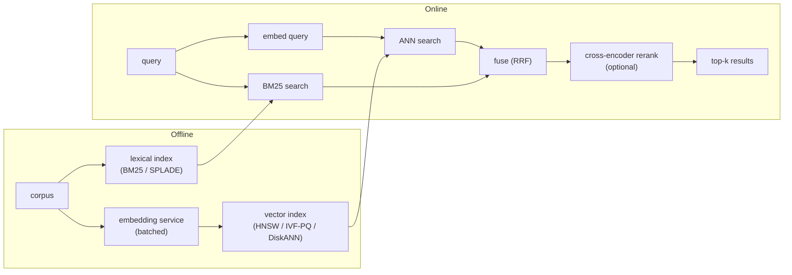

# Semantic Search and Embedding Service

An interviewer rarely says "design a vector database." They say **"design the
search service that finds the 100 most relevant documents out of 100 million in
under 50 milliseconds."** That is a semantic search and embedding service: an
encoder that turns text into vectors, an index that finds similar vectors fast,
and a pipeline that fuses dense semantic matching with lexical signal so neither
blind spot kills the product.

This chapter builds the service end to end and shows how Spotify, LinkedIn,
Etsy, Instacart, Meta, Google, and Microsoft actually ship it.

## Sections

1. [Clarifying the requirements](01-clarifying-requirements.md) -- the dialogue
   that scopes the problem before any design starts.
2. [Framing the system](02-frame-the-system.md) -- the four stages (embed,
   index, retrieve, rerank) and what flows between them.
3. [The embedding service](03-the-embedding-service.md) -- model choice,
   batching, dimension as a cost knob, and freshness.
4. [The vector index](04-vector-index.md) -- flat vs IVF vs HNSW vs PQ,
   the recall/latency/memory tradeoff, and the math behind it.
5. [Hybrid search and reranking](05-hybrid-and-reranking.md) -- why dense
   alone is not enough, BM25/SPLADE fusion, and cross-encoder reranking.
6. [Serving and scaling](06-serving-and-scaling.md) -- the latency budget,
   filters, sharding, freshness, and the bottleneck table.
7. [How teams do it in production](07-how-teams-do-it-in-production.md) --
   where the real designs diverge and first-party write-ups.
8. [Interview Q&A](08-interview-qa.md) -- commonly asked, tricky, and
   commonly answered wrong, with clear answers.
9. [Summary](09-summary.md) -- one-page recap, mermaid overview, and
   self-test questions.

## The whole system on one page

Read the sections in order the first time; each one builds on what came before.
