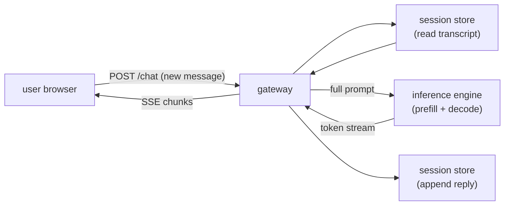

# 2. The streaming model

## Why stream at all

A language model does not produce a reply all at once. It decodes one token at a
time, each token conditioning on the previous ones. This means the first token
is available almost immediately after prefill, while the last token arrives
seconds later.

Streaming exploits this. Instead of buffering the full reply and sending it at
the end, you flush each token to the client the moment the model emits it. The
user sees the reply building in real time, and the product feels fast even when
the total generation takes several seconds.

The metric users care about is **time-to-first-token (TTFT)**: the gap between
submitting a message and seeing the first character appear. TTFT is dominated by
prefill (reading the prompt and computing the KV cache), not by decode. The felt
latency of the rest of the reply is shaped by the decode speed, which for a
moderately sized model on a modern GPU runs fast enough that token-by-token
delivery looks fluid.

The formula is:

$$T_{\text{felt}} = T_{\text{TTFT}} + (N - 1) \cdot t_{\text{inter}}$$

where $N$ is the number of tokens generated and $t_{\text{inter}}$ is the
inter-token gap. Users judge $T_{\text{TTFT}}$; the tail rides on the per-token
term.

A stream feels smooth only when the decode step plus one transport hop stays
under about 20 to 40 ms per token, which is roughly human reading speed.

## Input and output

**Input to the streaming layer per turn:**
- Session id (routes the request to the right replica)
- New user message (text)
- Auth token

**Output from the streaming layer per turn:**
- A stream of token events, delivered incrementally
- A completion event (or error event) at the end
- Optional: metadata on each chunk (token id, finish reason, usage counters)

The session store handles the transcript; the client does not send history on
each request. The gateway reads the transcript from the store, prepends it to
the new message, submits the full prompt to the inference engine, and pipes the
token stream back to the client.

## SSE versus WebSockets

Two transports dominate text streaming:

**Server-sent events (SSE)** run over a plain HTTP connection. The server opens
a chunked response, sends lines formatted as `data: ...`, and the client reads
them through the browser's `EventSource` API or a plain fetch stream. SSE is
one-directional: server to client only. That is all that is needed for token
delivery. SSE works through standard HTTP proxies and load balancers, needs no
special handshake, and is simple to operate.

**WebSockets** establish a persistent, full-duplex connection after an HTTP
upgrade handshake. Both sides can send at any time. The duplex channel is useful
when the client needs to signal the server mid-stream: live interrupt ("stop
this generation"), voice barge-in, or multiplexed concurrent requests over a
single connection (Cloudflare's AI Gateway tags every message with an `eventId`
for exactly this reason). WebSockets are heavier to operate, do not traverse all
proxies transparently, and require explicit correlation ids when many streams
share one socket.

**When to use which.**

| Reach for | When | Instead of |
|---|---|---|
| SSE | One-directional token delivery over plain HTTP (the common text-chat default) | WebSocket, unless you genuinely need duplex |
| WebSocket | Duplex mid-stream signaling: live interrupts, multiplexed streams, auth via subprotocol (Cloudflare DO, Slack, Discord) | SSE when the channel is server-to-client only |
| WebRTC over UDP | Voice audio, to avoid head-of-line blocking on packet loss | TCP-based transports for audio |
| Throttled edit loop | Platforms that cannot stream natively (Teams, some Discord modes), Vercel's fallback path | Native streaming when the platform supports it |

*Transport options plotted by connection overhead and capability richness.
Bubble size represents operational complexity. SSE sits at low overhead, low
capability: it is purpose-built for one-directional token delivery and nothing
else. WebSocket adds duplex capability at higher overhead. WebRTC is the richest
but heaviest, worth it only for voice where UDP matters. The throttled edit loop
(Vercel fallback) has high overhead (repeated API calls) but the lowest
capability, used only when the target platform does not support streaming natively.
Illustrative.*

Default to SSE for text. The SSE model matches the token-delivery pattern
perfectly, it is simpler to debug, and HTTP load balancers understand it without
configuration. Reach for WebSockets only when the product needs duplex
signaling.

## The streaming path in detail

The gateway is the only stateful proxy here. It reads the transcript, fans out
to the inference engine, and writes the completed reply back to the store once
generation finishes (or is cancelled).

## TTFT vs concurrent streams

*Time-to-first-token climbs as concurrent streams grow. Without continuous
batching, each new stream waits for an inference slot to free up, and TTFT grows
roughly linearly with load. Continuous batching (see
[topic 04](../../topics/04-inference-serving-at-scale.md)) lets many decodes
share a GPU simultaneously, keeping TTFT flatter until the hardware is
genuinely saturated. Below the saturation point, TTFT is essentially a prefill
cost. Above it, queuing dominates. Illustrative.*

The key insight from this plot: once the saturation point is passed, TTFT is
determined by the queue length, not by the model or the hardware. Continuous
batching raises the saturation point; after that, the only levers are queue
management and infrastructure scaling.
