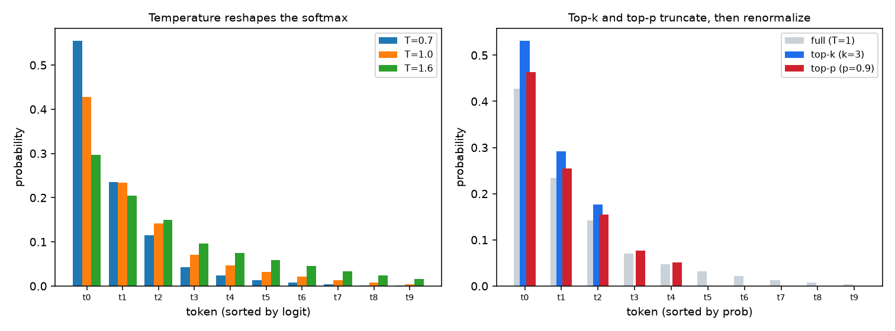
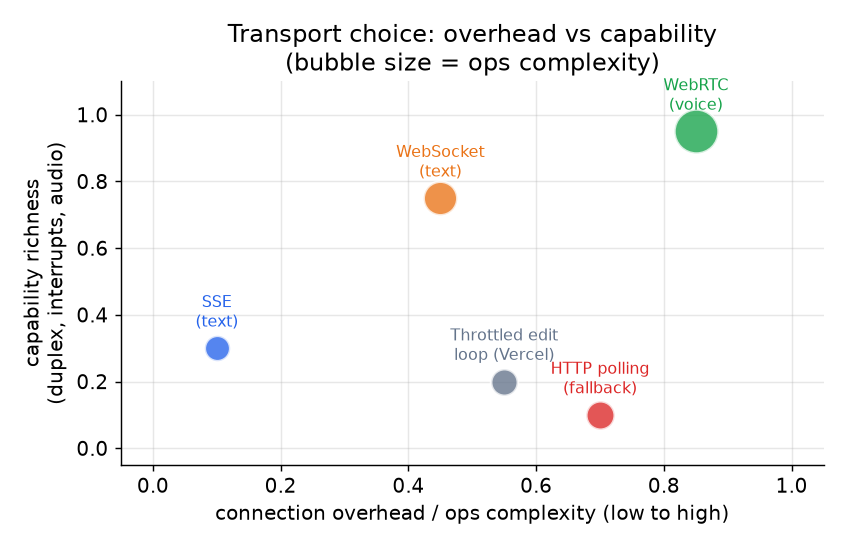
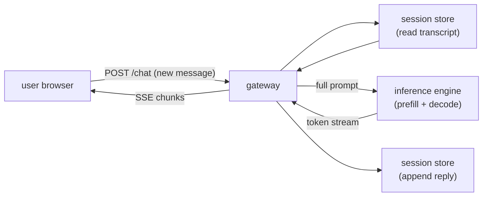
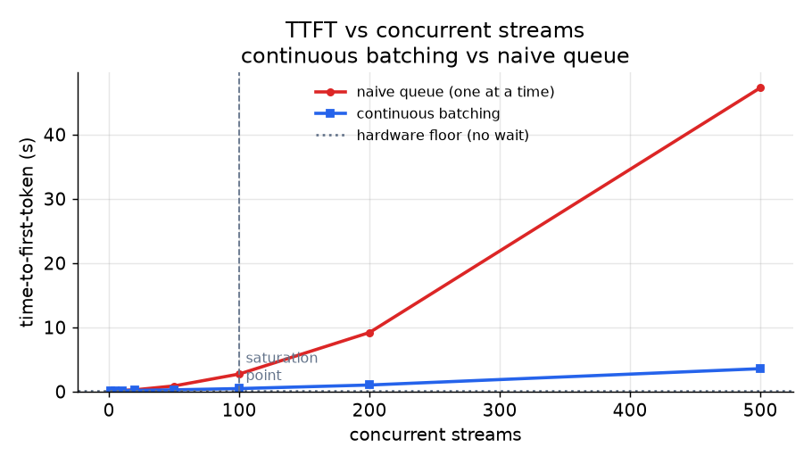

# 2. The streaming model

## Why stream at all

A language model does not produce a reply all at once. It decodes one token at a
time, each token conditioning on the previous ones. This means the first token
is available almost immediately after prefill, while the last token arrives
seconds later.

Streaming exploits this. Instead of buffering the full reply and sending it at
the end, you flush each token to the client the moment the model emits it. The
user sees the reply building in real time, and the product feels fast even when
the total generation takes several seconds.

The metric users care about is **time-to-first-token (TTFT)**: the gap between
submitting a message and seeing the first character appear. TTFT is dominated by
prefill (reading the prompt and computing the KV cache), not by decode. The felt
latency of the rest of the reply is shaped by the decode speed, which for a
moderately sized model on a modern GPU runs fast enough that token-by-token
delivery looks fluid.

The formula is:

$$T_{\text{felt}} = T_{\text{TTFT}} + (N - 1) \cdot t_{\text{inter}}$$

where $N$ is the number of tokens generated and $t_{\text{inter}}$ is the
inter-token gap. Users judge $T_{\text{TTFT}}$; the tail rides on the per-token
term.

A stream feels smooth only when the decode step plus one transport hop stays
under about 20 to 40 ms per token, which is roughly human reading speed.

## Input and output

**Input to the streaming layer per turn:**
- Session id (routes the request to the right replica)
- New user message (text)
- Auth token

**Output from the streaming layer per turn:**
- A stream of token events, delivered incrementally
- A completion event (or error event) at the end
- Optional: metadata on each chunk (token id, finish reason, usage counters)

The session store handles the transcript; the client does not send history on
each request. The gateway reads the transcript from the store, prepends it to
the new message, submits the full prompt to the inference engine, and pipes the
token stream back to the client.

## Controlling the output: temperature, top-k, top-p

Each streamed token is sampled from the model's next-token distribution, and three
knobs on the request shape that distribution. They are the parameters a product
tunes for "creative" versus "deterministic" behavior, so it is worth knowing
exactly what each does to the probabilities.

- **Temperature** $T$ divides the logits before the softmax: $p_i = \text{softmax}(z_i / T)$. $T < 1$ sharpens the distribution toward the top token (more deterministic); $T > 1$ flattens it (more diverse); $T \to 0$ is greedy argmax.
- **Top-k** keeps only the $k$ highest-probability tokens and renormalizes, cutting the long tail of low-probability (often incoherent) tokens.
- **Top-p (nucleus)** keeps the smallest set of tokens whose cumulative probability reaches $p$, then renormalizes. Unlike top-k it adapts: a confident step keeps few tokens, an uncertain step keeps many.



*Left: temperature reshapes the softmax, with T=0.7 concentrating mass on the top
token and T=1.6 spreading it toward the tail. Right: on the same T=1 distribution,
top-k (k=3) hard-truncates to three tokens while top-p (p=0.9) keeps the nucleus
of five that together reach 0.9 probability, both renormalized. Illustrative
logits.*

In production, top-p around 0.9 to 0.95 with a moderate temperature is the common
default; top-k and top-p are often combined (apply both filters, then sample).

## SSE versus WebSockets

Two transports dominate text streaming:

**Server-sent events (SSE)** run over a plain HTTP connection. The server opens
a chunked response, sends lines formatted as `data: ...`, and the client reads
them through the browser's `EventSource` API or a plain fetch stream. SSE is
one-directional: server to client only. That is all that is needed for token
delivery. SSE works through standard HTTP proxies and load balancers, needs no
special handshake, and is simple to operate.

Each token becomes one SSE event: `data:` field lines terminated by a blank line,
with optional `event:` name and `:` comment lines (used for heartbeat pings):

```python
def sse_frame(data, event=None):        # SSE wire format: field lines, blank line ends the event
    lines = []
    if event is not None:
        lines.append(f"event: {event}")          # optional event name
    for line in data.split("\n"):                 # a multi-line payload becomes several data: fields
        lines.append(f"data: {line}")
    return "\n".join(lines) + "\n\n"              # trailing blank line dispatches the event
# sse_frame("hi") -> "data: hi\n\n"; sse_frame("[DONE]", event="done") -> "event: done\ndata: [DONE]\n\n"
```

**The resumption detail SSE gives you for free, and its trap.** The browser's
`EventSource` client auto-reconnects when the connection drops, and on reconnect
it resends the id of the last event it saw in a `Last-Event-ID` request header,
provided the server tagged its events with an `id:` field. That is the built-in
mechanism for resuming a token stream across a flaky network without restarting
generation. The trap is that it only works if the server buffered the tokens
emitted since that id: LLM decoding is not replayable, so a gateway that keeps no
per-stream buffer will either lose the tokens generated during the gap or be
forced to regenerate from scratch, and the user sees the stream come back
mid-word with a hole in it. Either tag events with ids and retain a short
ring buffer of recent tokens keyed by session, or disable auto-reconnect and
treat a drop as a full disconnect (section 04). Relying on `EventSource`
reconnect without server-side buffering is a silent correctness bug, not a
resilience feature.

**WebSockets** establish a persistent, full-duplex connection after an HTTP
upgrade handshake. Both sides can send at any time. The duplex channel is useful
when the client needs to signal the server mid-stream: live interrupt ("stop
this generation"), voice barge-in, or multiplexed concurrent requests over a
single connection (Cloudflare's AI Gateway tags every message with an `eventId`
for exactly this reason). WebSockets are heavier to operate, do not traverse all
proxies transparently, and require explicit correlation ids when many streams
share one socket.

### Compare and contrast: SSE vs WebSocket

The two are easy to conflate because from the client's point of view they do
the same thing for chat: hold one long-lived connection open and push tokens as
they are produced, no polling. The mechanics underneath diverge in
directionality, protocol identity, and what happens when the connection breaks.

| Dimension | SSE | WebSocket |
|---|---|---|
| Push model | server pushes events over a held-open connection | same: server pushes frames over a held-open connection |
| Starts as an HTTP request | yes, and stays plain HTTP (a chunked response) | yes, but upgrades away from HTTP into a distinct framed protocol |
| Directionality | server to client only; client input needs a separate plain HTTP request | full duplex on one socket; client can signal mid-stream |
| Reconnection | built into the standard: `EventSource` auto-reconnects and resends `Last-Event-ID` | none in the protocol; you build reconnect, backoff, and resume yourself |
| Infrastructure path | anything that speaks HTTP (proxies, load balancers, CDNs) passes it unmodified | intermediaries must support the upgrade; some proxies and corporate middleboxes do not |
| Message framing | text events with `data:` lines; text-oriented | binary or text frames; multiplexing many streams needs your own correlation ids |

The difference changes the design at two moments: when the client must talk
during generation (barge-in, live interrupt, audio frames), the duplex socket
stops being optional; and when flaky networks matter, SSE's standardized
resume-by-id means the recovery story is mostly server-side buffering, while a
WebSocket product must design that entire loop from scratch.

**When to use which.**

| Reach for | When | Instead of |
|---|---|---|
| SSE | One-directional token delivery over plain HTTP (the common text-chat default) | WebSocket, unless you genuinely need duplex |
| WebSocket | Duplex mid-stream signaling: live interrupts, multiplexed streams, auth via subprotocol (Cloudflare DO, Slack, Discord) | SSE when the channel is server-to-client only |
| WebRTC over UDP | Voice audio, to avoid head-of-line blocking on packet loss | TCP-based transports for audio |
| Throttled edit loop | Platforms that cannot stream natively (Teams, some Discord modes), Vercel's fallback path | Native streaming when the platform supports it |

**Provenance.** Server-Sent Events is a W3C/WHATWG web standard (the HTML
`EventSource` interface over a long-lived HTTP response), which is why plain HTTP
load balancers and browsers understand it with no extra configuration; WebSocket,
WebRTC, and the throttled edit loop are the alternatives for when SSE's
one-directional model is not enough.



*Transport options plotted by connection overhead and capability richness.
Bubble size represents operational complexity. SSE sits at low overhead, low
capability: it is purpose-built for one-directional token delivery and nothing
else. WebSocket adds duplex capability at higher overhead. WebRTC is the richest
but heaviest, worth it only for voice where UDP matters. The throttled edit loop
(Vercel fallback) has high overhead (repeated API calls) but the lowest
capability, used only when the target platform does not support streaming natively.
Illustrative.*

Default to SSE for text. The SSE model matches the token-delivery pattern
perfectly, it is simpler to debug, and HTTP load balancers understand it without
configuration. Reach for WebSockets only when the product needs duplex
signaling.

## The streaming path in detail



**How it works.** A turn is a single POST carrying only the new message and a
session id, not the whole transcript. The gateway first reads the prior transcript
from the session store, concatenates it with the new message, and hands that full
prompt to the inference engine, which prefills the prompt into a KV cache and then
decodes token by token. As each token is emitted it flows back through the gateway
and is written to the client as an SSE chunk, so the user sees the reply build in
real time rather than waiting for the whole generation. When decoding finishes (or
is cancelled) the gateway appends the completed reply to the session store, which
is what keeps the client stateless and lets the next turn resume from durable
history. The gateway is the one component that touches every hop; the store holds
state and the inference engine holds the transient KV cache.

The gateway is the only stateful proxy here. It reads the transcript, fans out
to the inference engine, and writes the completed reply back to the store once
generation finishes (or is cancelled).

## TTFT vs concurrent streams



*Time-to-first-token climbs as concurrent streams grow. Without continuous
batching, each new stream waits for an inference slot to free up, and TTFT grows
roughly linearly with load. Continuous batching (see
[topic 04](../../topics/04-inference-serving-at-scale.md)) lets many decodes
share a GPU simultaneously, keeping TTFT flatter until the hardware is
genuinely saturated. Below the saturation point, TTFT is essentially a prefill
cost. Above it, queuing dominates. Illustrative.*

The key insight from this plot: once the saturation point is passed, TTFT is
determined by the queue length, not by the model or the hardware. Continuous
batching raises the saturation point; after that, the only levers are queue
management and infrastructure scaling.
