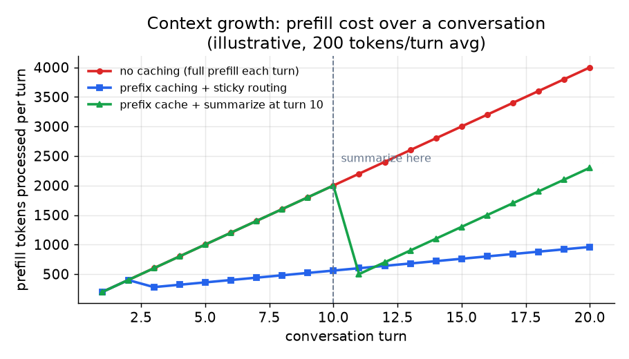

# 3. Session and memory

## The growing-context problem

Every language model reply is conditioned on everything that came before.
In a multi-turn chat, "everything before" is the full conversation transcript,
and it grows by roughly one user message plus one assistant reply on every turn.
This creates two concrete problems:

**Cost grows per turn.** The model re-reads the whole transcript at the start
of each turn during prefill. Prefill cost scales with context length, so turn
five costs more than turn one, and turn twenty costs more than turn five. For a
product with millions of daily active users, this is a real infrastructure bill.

**You eventually hit the context limit.** Every model has a maximum context
window. A long session that blows past it either errors out mid-conversation or
must drop older turns silently, neither of which is good.

Both problems have practical mitigations. Understanding the mitigations, and
their tradeoffs, is what separates a good answer from a generic one.

## Where state lives: the fundamental choice

The first design decision is where the conversation transcript lives.

**Client-side (stateless server).** The client stores the transcript and sends
the full history on every request. The server is stateless: it takes a prompt,
generates a reply, and returns it. The design is horizontally trivial and
requires no session affinity. The cost is that the client carries growing
payloads, the server cannot perform server-side summarization, and a malicious
client can send an arbitrarily large transcript.

**Server-side (stateful server).** The server holds the transcript in a session
store. The client sends only the new message. The server reads history from the
store, runs the model, and writes the reply back. Server-side state enables
server-controlled summarization, tighter security, and smaller per-request
payloads. The cost is that subsequent turns must be routed to the right replica
(sticky routing, covered below).

Most production chat products with long sessions or strong security requirements
choose server-side state.

## Prefix caching and sticky routing

Prefix caching is the single biggest win for multi-turn latency and cost. The
idea is that the system prompt and the head of the conversation are identical
across turns: they are a common prefix. If the inference engine has already
computed the KV cache for that prefix, it can reuse it instead of recomputing
prefill from scratch. Only the new message (the truly novel suffix) needs a
fresh prefill pass.

The catch: prefix caching only helps if the follow-up turn lands on the
**same replica** that already holds the cached KV state. If a different replica
handles the request, the cache is cold and the savings vanish.

So prefix caching and sticky routing are a pair: you cannot have one without the
other. Route a session consistently to its replica (keyed on session id), and
treat the cache as an optimization hint rather than a hard pin: a hot session
must still be movable if the replica goes down or overloads.

## Summarization and truncation

Once a session runs long, neither prefix caching nor sticky routing can prevent
the context from eventually hitting the model's limit. The mitigation is to
bound growth:

**Summarization.** When the transcript crosses a threshold, run a cheap
summarization call over the oldest turns and replace them with the summary. The
conversation continues with the summary as a compressed preamble. This loses
some fidelity to the original wording but keeps the session alive and costs
manageable.

**Truncation.** Drop the oldest turns once the window fills. Simpler than
summarization but loses information hard: a reference to something said early in
a long conversation disappears silently.

**Sliding window.** Keep only the last $k$ turns. Bounded cost, predictable
behavior, best for short-memory chatbots where early context is rarely relevant.

*Prefill tokens processed per turn under three strategies. Without caching, cost
grows linearly with turns. Prefix caching with sticky routing keeps the marginal
cost near the size of the new message, until the context grows past the cached
prefix. Adding summarization at turn 10 resets the context length and holds it
bounded for the rest of the session. Illustrative, 200 tokens per turn average.*

## When to use which session strategy

| Reach for | When | Instead of |
|---|---|---|
| Client-side transcript | Simple bots, stateless edge deployments, no long-session requirement | Server-side state, when you need summarization or smaller payloads |
| Server-side store (Redis, Postgres) | Long sessions, server-controlled summarization, multi-device continuity | Client-side, when the simplicity matters more than control |
| Prefix caching plus sticky routing | Multi-turn sessions where per-turn prefill cost climbs with history | Stateless routing, where every turn is a full-prefill cache miss |
| Summarization at a threshold | Sessions that must stay alive past hundreds of turns | Truncation, when you can tolerate losing early context entirely |
| Sliding window | Short-memory bots, bounded-cost products | Summarization, when earlier context is genuinely irrelevant |

## Session resumability

Our requirements included session resumability across browser closes and device
switches. That means:

- The session id must be persistent and tied to the user account, not to the
  browser tab or connection.
- The full transcript (or its summary) must be persisted in the session store
  (Redis or a database), not held in memory only.
- On reconnect, the gateway reads the transcript from the store and picks a
  replica with a warm cache for that session id, if one exists.

The sticky-routing key is the session id. The cache is best-effort: if no warm
replica is available, the turn runs with a cold cache and pays full prefill
cost. This is correct and expected behavior, not a failure.
