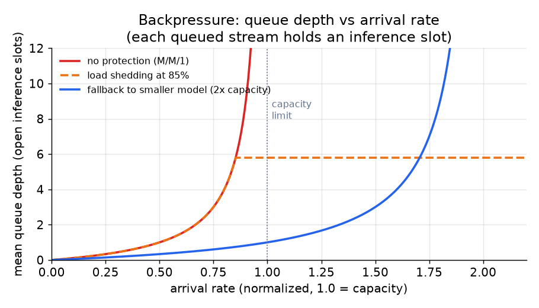

# 4. Backpressure and concurrency

## Why inference slots are the scarce resource

In a streaming chat system, the binding constraint on GPU capacity is not
requests per second. It is **concurrent streams in flight**. Each open stream
pins an inference slot for its entire decode duration: a generation that takes
ten seconds holds a slot for ten seconds, regardless of how many tokens the
client actually read. This is fundamentally different from a stateless request
workload where each request is short.

The consequence: a slow consumer, a user who opened a tab and walked away, or
an abandoned generation all silently eat GPU capacity until the slot is
explicitly freed. At scale, a few thousand orphaned streams can crowd out
legitimate traffic.

Every design decision in this section flows from that one fact.

## Cancellation: the stop button is a capacity mechanism

When the user clicks the stop button, the correct response is not merely "stop
sending tokens to the client." It is:

1. Close the client connection.
2. Send a cancellation signal to the inference engine.
3. Free the inference slot.

Skipping step 2 means the model keeps decoding into the void. At a busy
deployment, that is one slot that could be serving a real request instead.
Propagating cancel to the engine is non-trivial in practice (it requires the
inference server to support mid-generation interrupt, which vLLM and TGI both
do), but it is not optional at scale.

## Disconnect detection

A client that closes the browser tab does not send an explicit cancel. The
gateway must detect the dead connection and abort the corresponding generation.
This is done by watching for a write error when the next token arrives: if the
write fails, the connection is gone, and the generation should be aborted.

The gap between client drop and abort detection is typically one inter-token
interval. At a decode rate of 30 tokens/second, that is roughly 33 ms, which
is acceptable. The real risk is a client that hangs at the TCP level without
closing cleanly, masking the drop. A heartbeat on the SSE channel (a periodic
`:ping` comment line) ensures the gateway detects a dead connection even when
TCP does not signal it.

## Backpressure

Backpressure is what happens when the model produces tokens faster than the
client can consume them. The network buffer between the gateway and the client
fills up; writes start blocking; and if nothing bounds this, the gateway thread
hangs waiting for the client to drain its buffer.

The correct policy is bounded buffering: the gateway maintains a per-stream
buffer of at most $B$ tokens. If the buffer fills before the client drains it:

- **Block the decode loop** (simplest, but this holds the inference slot).
- **Drop tokens** (lossy, only acceptable for non-text media like audio where
  smoothness beats completeness).
- **Abort the stream** (treat a hopelessly slow consumer like a disconnect).

For text chat, blocking the decode loop is the right answer in most cases,
because losing tokens produces garbled output. The buffer should be small enough
that a truly dead consumer is detected quickly by the TCP-level write failure.

## Fair scheduling

When multiple streams share a GPU via continuous batching, one long-running
generation should not starve short ones. In practice, continuous batching
handles this naturally: the scheduler interleaves decode steps across all
in-flight requests, so short generations finish early and free their slots
without waiting for long ones to complete.

The remaining fairness concern is at queueing time: when all slots are occupied,
new requests queue. Fair scheduling means that requests do not starve while
behind one very large generation. A simple FIFO queue is fair in this sense,
though a priority queue (Pro users ahead of free-tier users, for example) is
straightforward to add.

## Queue depth and the saturation point

$$\text{mean queue depth} = \frac{\rho}{1 - \rho}, \quad \rho = \frac{\lambda}{\mu}$$

where $\lambda$ is the arrival rate of streams, $\mu$ is the completion rate
(slots freed per second), and $\rho$ is utilization. Below $\rho = 1$, the
queue is bounded. At $\rho = 1$, the queue grows without bound. At
$\rho \gt 1$, the system is overloaded.

*Mean queue depth as a function of arrival rate under three policies. With no
protection, queue depth diverges as utilization approaches 1. Load shedding
caps the queue at 85% utilization by returning a retry response (HTTP 429 or a
visible "busy" message) to excess requests. Falling back to a smaller model
effectively doubles throughput, raising the saturation point and keeping the
queue shallow at higher arrival rates. Illustrative M/M/1 model.*

## When to use which concurrency strategy

| Reach for | When | Instead of |
|---|---|---|
| Cancel on disconnect plus bounded buffer | Always: every production streaming deployment. Orphaned streams silently eat capacity | Ignoring disconnect, which causes gradual slot exhaustion |
| Abort-on-slow-consumer | A consumer is hopelessly far behind and the buffer is full | Blocking indefinitely, which holds the inference slot |
| Load shedding with a clear retry signal | Overload is temporary and clients can retry | Silent queueing that looks like a hang to the user |
| Fallback to a smaller model | A quality dip is preferable to a blank screen during a spike | Hard failure, which is always worse for the user |
| Priority queue (Pro ahead of free) | Different user tiers need differentiated latency | FIFO when all users have the same SLA |
| Horizontal scale-out | Sustained overload that cannot be absorbed by batching or fallback | Unbounded queueing, which masks a structural capacity problem |
