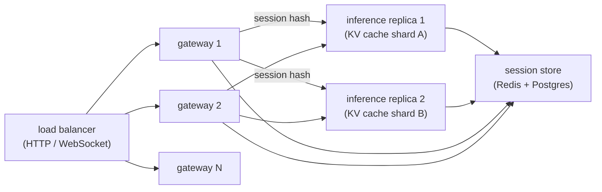
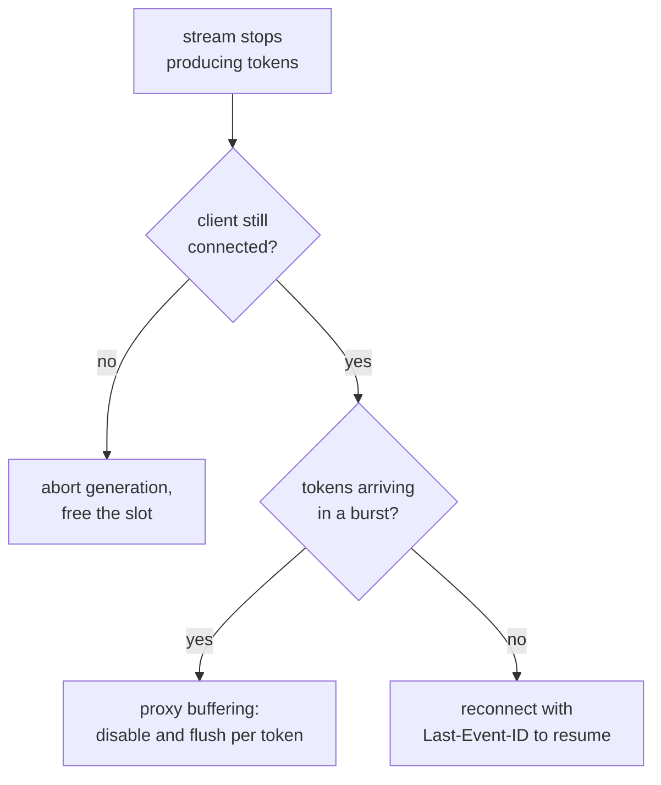

# 6. Serving and scaling

## The three layers

A production streaming chat system has three distinct serving layers, each with
different scaling properties:

**The gateway layer** accepts client connections, handles auth, reads session
state, and streams tokens back. It is stateless with respect to model weights
but stateful with respect to the streaming connection. Gateway instances scale
horizontally with connection count. The sticky-routing requirement means a
session's connection should prefer the gateway node that has affinity to the
inference replica holding the warm KV cache, but this is soft affinity: any
gateway can reach any inference replica.

**The inference layer** runs the model. It is the GPU-bound resource. Concurrent
streams are the binding constraint. Continuous batching lets the inference
engine interleave decode steps across many in-flight streams, multiplying
effective throughput. Scaling out means adding GPU replicas; sessions should
route preferentially to the replica with their cached KV.

**The session store** holds transcripts, summaries, and routing metadata. It is
read on every turn and written at turn completion. Redis is the common choice
(low latency, simple TTL management). A relational database is used as a durable
backing store when the session must survive a Redis eviction.

## Bottlenecks and scaling levers

| Bottleneck | First sign | Fix | Tradeoff |
|---|---|---|---|
| High TTFT | p95 TTFT exceeds target at modest load | Prefix caching + sticky routing; reduce prefill (summarize history) | Routing complexity; fidelity loss on summarization |
| Slot exhaustion | Queue depth climbs; new streams wait seconds before first token | Add GPU replicas; enable continuous batching if not already on; shed or fall back to smaller model | Cost; quality dip on fallback |
| Cache misses across turns | TTFT high even at low concurrency | Enforce session-sticky routing; monitor hit rate | Routing constraint limits load balancing flexibility |
| Orphaned streams eating slots | Slot utilization high but user QPS low | Cancel on disconnect; heartbeat + server-side timeout | Requires inference-engine interrupt support |
| Session store latency | Gateway blocked reading transcript | Move to Redis; pipeline read with auth check | Redis cost and ops |
| Cost per long session | Per-session LLM spend climbing with turn count | Summarization; truncation; sliding window | Fidelity loss |
| Overload spikes | TTFT spikes on traffic surge; retries amplify load | Load shedding with retry-after; fallback to smaller model | Quality dip |

**Detail.** The high-TTFT row's prefix-caching fix works because a multi-turn chat
re-sends the whole transcript every turn, so the inference engine can reuse the KV
state of the shared prefix instead of recomputing prefill over it, collapsing
per-turn prefill toward the new message length only; the catch is that this pays off
only when sticky routing lands the follow-up turn on the replica that already holds
that warm cache, which is why the cache-miss row and the sticky-routing fix are the
same coin. The orphaned-streams row matters because a disconnected SSE client does
not free the decode slot on its own: a TCP close may not surface until the next write
to the socket, so the fix pairs a server-side heartbeat and timeout with an
inference-engine abort call, and without engine-level interrupt support the slot
stays pinned for the full generation.

## Capacity math

The number of concurrent streams a deployment can serve is:

$$N_{\text{streams}} = \frac{G \cdot \text{tok/s/GPU}}{\bar{t}_{\text{decode}} \cdot f_{\text{batch}}}$$

where $G$ is the number of GPU replicas, $\bar{t}_{\text{decode}}$ is the mean
decode throughput per stream in tokens per second, and $f_{\text{batch}}$ is
the continuous-batching efficiency factor (typically 1.5 to 3x over
single-stream throughput). The practical limit is set by memory bandwidth
before compute: large models at low batch sizes are memory-bandwidth-bound, so
each stream gets only a fraction of peak FLOP/s.

The implication: doubling GPU count doubles the concurrent-stream capacity.
Falling back to a model with half the parameter count roughly doubles decode
speed (fewer memory reads per token), which raises the concurrent-stream ceiling
without adding hardware.

## Gateway to inference affinity

The sticky-routing key is the session id. The gateway's load balancer hashes
the session id to pick the inference replica. Consistent hashing means that
adding or removing a replica rebalances only a fraction of sessions, rather
than all of them.

When a replica fails, the consistent-hash ring redistributes its sessions to
neighbors. Those sessions pay a one-turn cache miss (cold prefill) and then warm
up their cache on the new replica. This is the correct behavior: correctness is
not affected, only one turn's latency cost is elevated.

## The deployment topology

Any gateway can reach any inference replica (correctness) but the hash
preferentially routes a session to the replica with its warm cache
(performance). The session store is shared; it is the durable record of the
conversation.

## Implementation and training pitfalls

Streaming chat breaks in ways a request-response service never does: connections
die silently, proxies buffer the stream you meant to flush, and a disconnected
client keeps burning a GPU slot. The recurring failures on the serving path:

| Problem | Symptom | Fix |
|---|---|---|
| Orphaned streams pinning slots | Slot utilization is high while user QPS is low | Cancel on disconnect with a heartbeat plus server-side timeout, and call the inference-engine abort so the decode slot frees |
| Half-open TCP not detected | A dropped client is not noticed until the next write to the socket | Send server-side heartbeats or pings on an interval and enforce an idle timeout rather than trusting the socket state |
| SSE reconnection gaps or dupes | Reconnecting clients lose tokens or restart the reply from the top | Assign idempotent event ids and honor Last-Event-ID with a short server replay buffer so the stream resumes where it stopped |
| Buffering proxy defeats streaming | Tokens arrive in one burst at the end instead of incrementally | Disable proxy buffering (for example X-Accel-Buffering: no) and flush per token or per small batch |
| Sticky-routing cache miss | TTFT is high even at low concurrency | Consistent-hash on session id to the replica holding the warm KV cache and monitor the hit rate |
| Retry storm amplification | A TTFT spike triggers client retries that multiply load and deepen the spike | Shed load with Retry-After and require exponential backoff with jitter on the client |
| Session store eviction | A transcript vanishes mid-conversation after a cache eviction | Back the Redis TTL with a durable store so the session survives eviction |
| Slot exhaustion | New streams queue for seconds before the first token | Add GPU replicas, enable continuous batching, and fall back to a smaller model under pressure |

Treat every stream as something that can disconnect at any token: free slots on
disconnect, make reconnection resumable, and keep proxies from buffering the
output you worked to stream.
