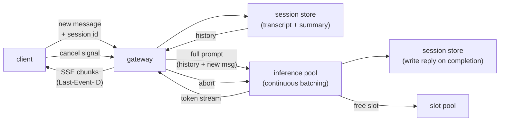

# 9. Summary

## One-page recap

- **Stream tokens because perceived latency is TTFT.** The model decodes one
  token at a time; deliver each token immediately. Users judge the gap before the
  first character, not the total generation time.

- **SSE for text, WebRTC for voice.** SSE is one-directional HTTP, purpose-built
  for token delivery and simple to operate. WebSocket is the right reach when
  you need duplex mid-stream signaling. WebRTC over UDP is mandatory for voice:
  TCP head-of-line blocking stalls audio on packet loss in a way that SSE's
  dropped text token never would.

- **Server-side state creates a sticky-routing requirement.** Prefix caching
  reuses the KV cache for the stable head of the conversation, cutting multi-turn
  prefill cost and latency. It only works when the follow-up turn lands on the
  same replica. Stickiness is best-effort; correctness does not depend on it.

- **Concurrent streams are the capacity unit.** Each open stream pins an
  inference slot for its entire decode duration. Orphaned streams (dropped
  clients, abandoned generations) silently eat GPU. Cancel on disconnect,
  bound buffers, and propagate cancel to the inference engine. This is capacity
  management, not hygiene.

- **Context grows and you pay for it.** Summarize or truncate before the context
  limit, not after. Prefix caching handles the stable head; summarization handles
  the tail. Without a bound on growth, a long session either errors out or
  becomes prohibitively expensive.

- **Degrade visibly under overload.** Queue with a displayed wait, shed with a
  clear retry signal, fall back to a smaller model. Silent hangs are always
  worse than an honest error.

## The system on one page

## Test yourself

1. Why does TTFT matter more than total generation time from the user's
   perspective, and what does that mean for how you optimize the serving layer?

2. You want to use prefix caching to cut multi-turn latency. What routing
   invariant must hold for the cache to be useful, and what happens when it is
   violated?

3. A user opens two browser tabs for the same session. Walk through what happens
   when both tabs send a message at the same time. Which breaks first: the session
   store, the sticky routing, or the slot accounting?

4. Your inference pool is at 90% utilization. Traffic spikes 30%. What do you
   do, in order, and what does each step cost?

5. Explain why WebSocket is the wrong transport for voice audio, and what you
   would use instead. Be specific about the failure mode.

6. The context window for a user on turn 50 is running long. What are your
   options, what do you lose with each, and when do you trigger each?

## Further reading

- Dense reference (comparison tables, math, all case studies):
  [topics/10-realtime-streaming-chat.md](../../topics/10-realtime-streaming-chat.md).
- The decoder behind the stream (the model generating the tokens):
  [Llama-3 8B live graph](https://www.neurarch.com/?import=https://raw.githubusercontent.com/neurarch-ai/awesome-llm-model-zoo/main/architectures/llama3-8b/model.json).
  The attention block is where KV cache growth and prefix caching reuse
  happen. Grouped-query attention keeps the KV cache memory footprint small
  as context grows; prefix caching bounds the per-turn prefill cost. Keep
  the two distinct.
- Related topics: [topic 02](../../topics/02-long-context-and-kv-cache.md)
  (KV cache math), [topic 04](../../topics/04-inference-serving-at-scale.md)
  (continuous batching).
