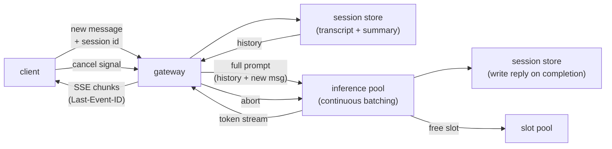

# 9. Summary

## One-page recap

- **Stream tokens because perceived latency is TTFT.** The model decodes one
  token at a time; deliver each token immediately. Users judge the gap before the
  first character, not the total generation time.

- **SSE for text, WebRTC for voice.** SSE is one-directional HTTP, purpose-built
  for token delivery and simple to operate. WebSocket is the right reach when
  you need duplex mid-stream signaling. WebRTC over UDP is mandatory for voice:
  TCP head-of-line blocking stalls audio on packet loss in a way that SSE's
  dropped text token never would.

- **Server-side state creates a sticky-routing requirement.** Prefix caching
  reuses the KV cache for the stable head of the conversation, cutting multi-turn
  prefill cost and latency. It only works when the follow-up turn lands on the
  same replica. Stickiness is best-effort; correctness does not depend on it.

- **Concurrent streams are the capacity unit.** Each open stream pins an
  inference slot for its entire decode duration. Orphaned streams (dropped
  clients, abandoned generations) silently eat GPU. Cancel on disconnect,
  bound buffers, and propagate cancel to the inference engine. This is capacity
  management, not hygiene.

- **Context grows and you pay for it.** Summarize or truncate before the context
  limit, not after. Prefix caching handles the stable head; summarization handles
  the tail. Without a bound on growth, a long session either errors out or
  becomes prohibitively expensive.

- **Degrade visibly under overload.** Queue with a displayed wait, shed with a
  clear retry signal, fall back to a smaller model. Silent hangs are always
  worse than an honest error.

## The system on one page

```mermaid
flowchart LR
  C["client"] -->|"new message<br/>+ session id"| GW["gateway"]
  GW --> SS["session store<br/>(transcript + summary)"]
  SS -->|"history"| GW
  GW -->|"full prompt<br/>(history + new msg)"| INF["inference pool<br/>(continuous batching)"]
  INF -->|"token stream"| GW
  GW -->|"SSE chunks<br/>(Last-Event-ID)"| C
  INF --> SS2["session store<br/>(write reply on completion)"]
  C -->|"cancel signal"| GW
  GW -->|"abort"| INF
  INF -->|"free slot"| POOL["slot pool"]
```

## Test yourself

Answers are collapsed. Attempt each question before opening one.

1. Why does TTFT matter more than total generation time from the user's
   perspective, and what does that mean for how you optimize the serving layer?

   

Answer

   Users feel the blank screen, not the total. Felt latency decomposes as
   $T_{\text{felt}} = T_{\text{TTFT}} + (N - 1) \cdot t_{\text{inter}}$, and the
   first term is the one people judge: a five-second reply that starts in 300ms
   feels faster than a two-second reply that shows nothing until it is complete.
   Note what streaming does *not* buy you: decode throughput and time-to-last-token
   are unchanged, so the entire win is responsiveness (section
   [8](08-interview-qa.md)). For the serving layer that splits the work in two.
   **TTFT is dominated by queueing plus prefill**, so it is improved by prefix
   caching, sticky routing, and chunked prefill; **inter-token latency is set by
   decode throughput**, so it is improved by batching policy and hardware, and a
   stream reads as fluid when decode plus one transport hop stays under roughly
   20 to 40 ms per token (section [2](02-the-streaming-model.md)). Do not blend
   them into one latency number, because raising the batch ceiling cuts cost per
   token while worsening inter-token latency and leaving TTFT roughly alone. And
   past the saturation point neither lever applies: TTFT is set by queue length,
   so the only remaining knobs are shedding, fallback, and replicas.

   

2. You want to use prefix caching to cut multi-turn latency. What routing
   invariant must hold for the cache to be useful, and what happens when it is
   violated?

   

Answer

   The follow-up turn must land on the **same inference replica** that already
   holds the KV cache for that conversation's prefix, which in practice means a
   consistent hash of the session id from gateway to replica (sections
   [3](03-session-and-memory.md) and [6](06-serving-and-scaling.md)). When the
   invariant is violated the cache is cold and the turn pays full prefill over the
   entire transcript again, so TTFT is high even at low concurrency. This is a
   **performance failure, not a correctness failure**: the session store still
   holds the transcript, so the turn is right, just slower. Read the hit-rate curve
   to tell the two causes apart: a dip that recovers within a turn or two is
   consistent-hash rebalancing after a scale-up or a replica loss, because the very
   turn that misses also warms the new replica, whereas a persistently low rate
   means a routing bug sending the same session somewhere different every turn.
   Design stickiness as best-effort rather than a hard pin, since the events that
   break it (restarts, scale-ups, failovers) cluster at exactly the moments of
   highest stress, so a system that is only correct on the warm path fails
   preferentially during incidents.

   

3. A user opens two browser tabs for the same session. Walk through what happens
   when both tabs send a message at the same time. Which breaks first: the session
   store, the sticky routing, or the slot accounting?

   

Answer

   **The session store breaks first.** Both tabs POST the same session id, so
   consistent hashing sends both to the same replica and sticky routing is fine;
   slot accounting is also fine, because two streams take two slots and each is
   freed on completion, cancel, or disconnect (section
   [4](04-backpressure-and-concurrency.md)). The damage is in the read-modify-write
   around the transcript: both turns read the same history, prefill from the same
   prefix, and then each writes its assistant reply on completion, so the second
   write lands on a transcript that no longer matches what it was generated
   against and one turn's context is silently lost. Idempotency does not save you
   here, because the request-id dedup in section [5](05-reliability.md) is built to
   collapse a *retry* of one message, and these are two genuinely different
   messages. The fix is a per-session lock or serialization point in front of the
   store, which is exactly why Vercel's Chat SDK reaches for Redis or Postgres
   distributed locks (section
   [7](07-how-teams-do-it-in-production.md)); the alternative is to make one tab's
   turn wait, or to accept the second one only after the first commits. There is a
   secondary cost too: two concurrent turns on one session mean two prefills over
   the same prefix, so the prefix cache helps the second one only if the engine has
   already finished caching the first.

   

4. Your inference pool is at 90% utilization. Traffic spikes 30%. What do you
   do, in order, and what does each step cost?

   

Answer

   First read the arithmetic: at $\rho = 0.9$ mean queue depth is
   $0.9 / 0.1 = 9$, and a 30% spike puts $\rho$ near 1.17, which is past
   $\rho = 1$ where the queue grows without bound (section
   [4](04-backpressure-and-concurrency.md)). Step zero, and it is free: check
   whether slot utilization is high while user QPS is low, which means orphaned
   streams are pinning slots and the real fix is cancel-on-disconnect plus the SSE
   heartbeat, not capacity. **Step one, shed with a clear retry signal**: HTTP 429
   with `Retry-After` past a threshold, which costs some users an honest error but
   prevents the retry-amplification spiral where silently queued requests time out
   and duplicate themselves. **Step two, fall back to a smaller model**: halving the
   parameter count roughly doubles decode speed, so the same fleet carries roughly
   twice the streams, at the cost of a visible quality dip that is still better than
   a blank screen. **Step three, scale out horizontally**: add GPU replicas, which
   costs money, takes minutes, and makes the consistent-hash ring rebalance so a
   fraction of sessions pay a one-turn cold prefill. A priority queue that puts Pro
   users ahead of free-tier traffic sits alongside these as a policy choice, not a
   capacity fix (section [6](06-serving-and-scaling.md)).

   

5. Explain why WebSocket is the wrong transport for voice audio, and what you
   would use instead. Be specific about the failure mode.

   

Answer

   Use **WebRTC over UDP**, not WebSocket. The failure mode is **TCP
   head-of-line blocking**: WebSocket runs on TCP, which guarantees ordered
   delivery by retransmitting a lost packet, so every frame already buffered behind
   the loss waits for the retransmit. For a text token that is a slight delay
   nobody notices; for audio a roughly 200ms retransmit stall is an audible gap
   that destroys conversational flow. UDP inverts the tradeoff: a lost 20ms frame
   is simply dropped, which is barely audible, and WebRTC additionally bundles
   jitter buffering, echo cancellation, congestion control, and NAT traversal
   (LiveKit, section [7](07-how-teams-do-it-in-production.md)). The backpressure
   policy flips with the transport: for audio you drop late frames because
   smoothness beats completeness, where for text you block the decode loop because
   dropping tokens garbles the reply (section
   [10](10-putting-it-together.md)). The margin matters because voice already
   spends its whole budget elsewhere:
   $L_{\text{voice}} = L_{\text{STT}} + L_{\text{turn}} + L_{\text{LLM}} + L_{\text{TTS}} + L_{\text{net}}$
   is already over a second before the network with a 300ms endpointing floor, so
   there is nothing left to absorb a transport stall. Section
   [8](08-interview-qa.md) calls picking WebSocket for voice the single most common
   transport mistake in this interview.

   

6. The context window for a user on turn 50 is running long. What are your
   options, what do you lose with each, and when do you trigger each?

   

Answer

   Four options, and the trigger rule is the same for all of them: act at a
   threshold *before* the context limit, not after it errors out mid-conversation
   (section [3](03-session-and-memory.md)). **Prefix caching with sticky routing**
   is not really an option but a prerequisite: it stops the stable head from being
   recomputed every turn, but it does not stop the transcript from growing, so it
   handles cost and not the limit. **Summarization** runs a cheap call over the
   oldest turns and replaces them with a compressed preamble; you lose fidelity to
   the original wording, and it is the right default for long sessions users return
   to, fired once the transcript crosses a token threshold. **Truncation** drops the
   oldest turns and is simpler, but it loses information hard and silently, so an
   early reference just disappears. **A sliding window of the last $k$ turns** gives
   bounded, predictable cost and suits short-memory bots where early context is
   genuinely irrelevant. What you should not do is grow the stored context to make
   the model "smarter": every extra stored token is re-read in prefill next turn,
   and old turns compete with the current question for attention, so a bounded
   summarized context often answers better as well as cheaper (section
   [8](08-interview-qa.md)).

   

## Further reading

- The capstone: [the complete build](10-putting-it-together.md), where every
  choice in this chapter is committed once for the scenario, sized, rebuilt
  under two other constraint sets, and compressed into a runnable one-file
  stream.
- Dense reference (comparison tables, math, all case studies):
  [topics/10-realtime-streaming-chat.md](../../topics/10-realtime-streaming-chat.md).
- The decoder behind the stream (the model generating the tokens):
  [Llama-3 8B live graph](https://www.neurarch.com/?import=https://raw.githubusercontent.com/neurarch-ai/awesome-llm-model-zoo/main/architectures/llama3-8b/model.json).
  The attention block is where KV cache growth and prefix caching reuse
  happen. Grouped-query attention keeps the KV cache memory footprint small
  as context grows; prefix caching bounds the per-turn prefill cost. Keep
  the two distinct.
- Related topics: [topic 02](../../topics/02-long-context-and-kv-cache.md)
  (KV cache math), [topic 04](../../topics/04-inference-serving-at-scale.md)
  (continuous batching).
