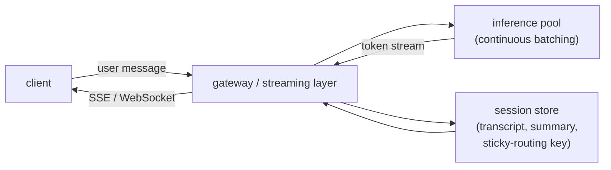

# Realtime Streaming Chat

An interviewer rarely says "design SSE." They say **"design the serving and
application layer for a multi-turn streaming chat product. Tell me how tokens
reach the user, how conversation state is managed, and how the system holds up
under load and disconnects."**

That is this chapter. It is about everything that wraps the model: the transport
that carries tokens to the client, the session store that keeps context across
turns, the backpressure logic that protects GPU capacity, and the graceful
degradation paths that keep the product responsive when traffic spikes.

The model internals, the KV cache memory math, and continuous batching are
covered in [topic 02](../../topics/02-long-context-and-kv-cache.md) and
[topic 04](../../topics/04-inference-serving-at-scale.md). This chapter picks
up where those leave off.

## Sections

1. [Clarifying the requirements](01-clarifying-requirements.md) -- the dialogue that scopes the problem.
2. [The streaming model](02-the-streaming-model.md) -- token streaming, time-to-first-token, SSE versus WebSockets.
3. [Session and memory](03-session-and-memory.md) -- conversation state, context window management, prefix caching.
4. [Backpressure and concurrency](04-backpressure-and-concurrency.md) -- backpressure, cancellation, fair scheduling.
5. [Reliability](05-reliability.md) -- reconnect, partial output, idempotency.
6. [Serving and scaling](06-serving-and-scaling.md) -- concurrent streams, bottlenecks table.
7. [How teams do it in production](07-how-teams-do-it-in-production.md) -- divergence table with first-party links.
8. [Interview Q&A](08-interview-qa.md) -- commonly asked, tricky, and commonly answered wrong.
9. [Summary](09-summary.md) -- recap, mermaid, test yourself, further reading.

## The whole system on one page

Read the sections in order the first time. Each opens with the question an
interviewer actually asks, then answers it in terms that carry into a real
system.
