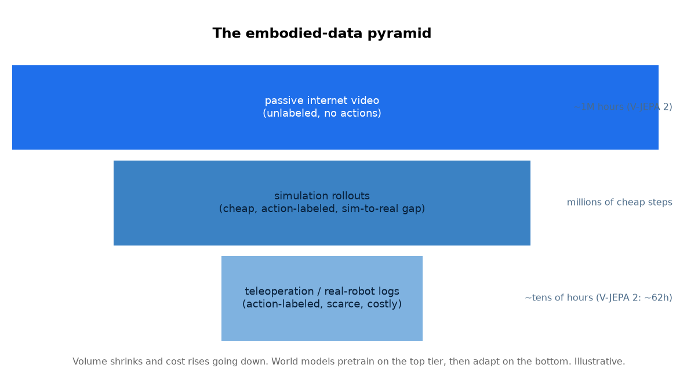

# 3. Data

The defining data fact of embodied world models is scarcity where it matters most.
Passive video is nearly free and endless; action-labeled robot data is expensive
and tiny. The whole training strategy falls out of this asymmetry.

*Volume shrinks and cost rises going down the pyramid. World models pretrain on the
abundant top tier to learn how the world moves, then adapt on the scarce
action-labeled bottom tier so the model becomes controllable. Illustrative
magnitudes; V-JEPA 2 reports roughly a million hours of video pretraining followed
by adaptation on the order of tens of hours of robot footage.*

## The three tiers

**Passive internet video (top, abundant).** Unlabeled clips of the world moving:
people cooking, objects falling, cars driving. There are no action labels, so a
model learns *dynamics* (what tends to happen next) but not *control* (what happens
if I do this). This tier is what makes world models feasible: you cannot collect a
million hours of robot teleoperation, but that much video already exists. The catch
is that passive video shows the world evolving without an agent's intervention, so
it teaches prediction, not yet controllability.

**Simulation rollouts (middle, cheap and action-labeled).** A physics simulator
generates unlimited action-labeled trajectories at near-zero marginal cost, with
perfect state access for supervision. The catch is the **sim-to-real gap**: contact
dynamics, friction, sensor noise, and lighting differ from reality, so a model that
overfits simulator quirks fails on hardware. Domain randomization (varying textures,
masses, and dynamics during simulation) is the standard mitigation.

**Teleoperation and real-robot logs (bottom, scarce and precise).** A human drives
the robot, or the robot logs its own attempts, producing the only data that is both
action-labeled and drawn from the true deployment distribution. It is the gold
standard and the bottleneck: every hour is expensive, so you spend it on adaptation
and evaluation, not on training a model from scratch.

## The pretraining-then-adaptation recipe

The pyramid dictates the recipe used across modern systems: **pretrain the dynamics
self-supervised on the huge passive-video tier**, which is where the model learns
that dropped objects fall and pushed objects slide, then **adapt with
action-conditioning on the small robot tier**, which is where the model learns how
*its own actions* change the world. Simulation sits in the middle as a scalable
source of action-labeled data and, crucially, as the continuous evaluation
environment (section 5).

## Data hazards specific to embodiment

- **Distribution shift by embodiment.** Data collected on one robot arm may not
  transfer to another with different kinematics. Report which embodiments the data
  covers.
- **Causal confounding in passive video.** Because passive video has no actions,
  the model can learn correlations ("the cup moves") without the cause ("a hand
  pushed it"). Action-conditioned adaptation is what disentangles this.
- **Teleoperation bias.** Human demonstrators are smooth and near-optimal, so the
  model rarely sees recovery from mistakes. Mixing in autonomous (and failed)
  rollouts covers the states a deployed policy will actually hit.
- **Sim realism budget.** More realistic simulation narrows the sim-to-real gap but
  costs compute; domain randomization trades a little average realism for much
  better worst-case transfer.
