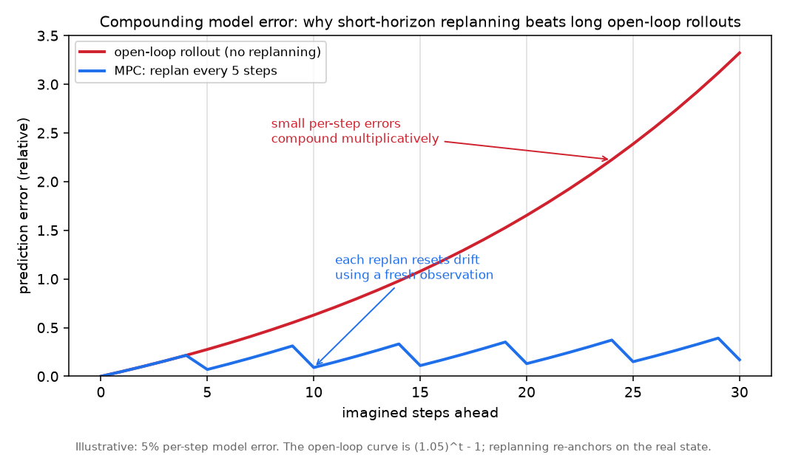
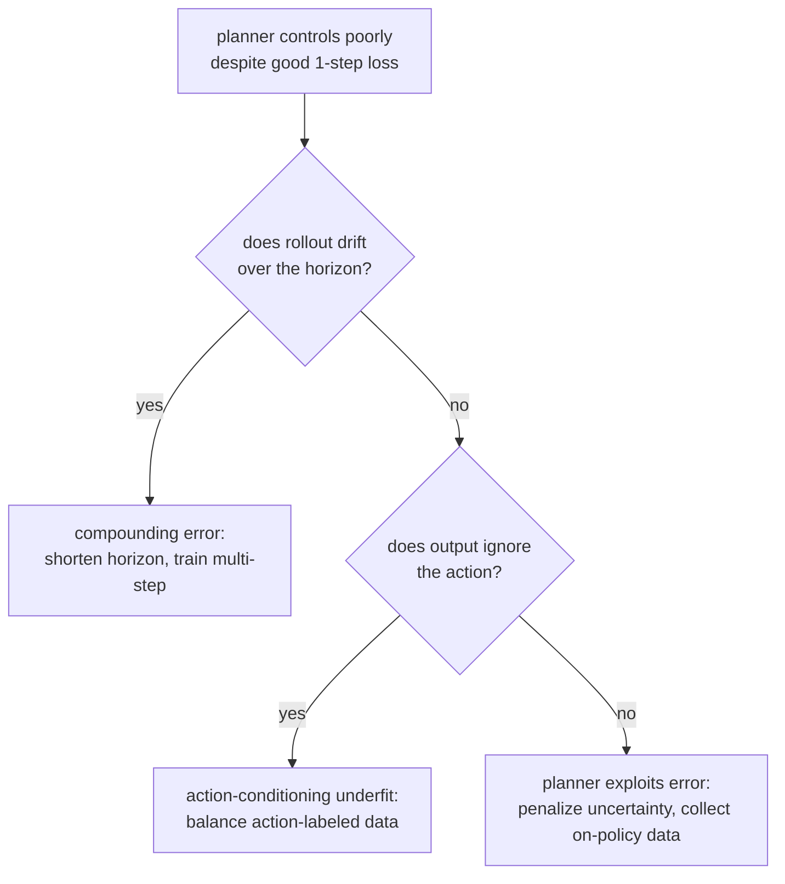

# 4. Model development

Three architectural decisions define a world model: what the state is, how the
transition is parameterized, and how actions enter. Then a fourth piece, the
planner, turns the trained predictor into a controller.

## The state representation

- **Token grid (generative).** The observation is patch-tokenized (as in a vision
  transformer) and the model predicts the next frame's tokens autoregressively or by
  diffusion. Human-inspectable, expensive, high-fidelity.
- **Recurrent latent (latent-dynamics).** A compact vector carries the state; a
  recurrent core (the recurrent state-space model in the Dreamer line) predicts the
  next latent. Cheap to roll out, which is what makes learning in imagination
  practical.
- **Joint embedding (JEPA).** An encoder maps the observation to an embedding and a
  predictor forecasts the *future embedding*, trained to match the encoder's output
  on the real future. No pixels are reconstructed, which removes the cost of modeling
  irrelevant visual detail.

## Action conditioning

A predictor of the world is not yet controllable. You make it controllable by
feeding the action into the transition, $\hat{s}_{t+1} = f_\theta(s_t, a_t)$, and
training on action-labeled data so the model learns the *effect* of each action.
This is exactly the pretraining-then-adaptation split: the passive-video pretraining
learns $f_\theta(s_t, \cdot)$ as generic dynamics, and the action-conditioned
adaptation (for example V-JEPA 2's action-conditioned variant) learns the dependence
on $a_t$. An unconditioned model can dream plausible futures; only an
action-conditioned one can answer "what if I do this."

## The planner: turning prediction into control

Given an action-conditioned model, planning is search over action sequences: imagine
the rollout for each candidate, score it against the goal, and execute the first
action of the best sequence, then replan (model-predictive control). The
**cross-entropy method** is the standard sampling planner: sample action sequences,
keep the elite fraction by imagined return, refit the sampling distribution to the
elites, and repeat.

```python
import numpy as np
def cem_plan(state, dynamics, reward, horizon=5, n=200, elite=20, iters=3, act_dim=2, seed=0):
    r = np.random.default_rng(seed)
    mu, sig = np.zeros((horizon, act_dim)), np.ones((horizon, act_dim))
    for _ in range(iters):
        acts = mu + sig * r.standard_normal((n, horizon, act_dim))   # sample action sequences
        rets = np.zeros(n)
        for i in range(n):
            s = state
            for t in range(horizon):
                s = dynamics(s, acts[i, t])       # imagined rollout inside the world model
                rets[i] += reward(s)
        idx = rets.argsort()[-elite:]             # keep the elite sequences
        mu, sig = acts[idx].mean(0), acts[idx].std(0) + 1e-6   # refit toward the elites
    return mu[0]                                  # execute the first action, then replan (MPC)
# point mass at (5,5), dynamics s'=s+a, reward=-dist(origin): cem_plan returns an action with both
# components negative, i.e. a step toward the goal.
```

The planner is where the world model pays off: the same trained $f_\theta$ supports
any goal you can write as a reward, without retraining. It is also where the latency
budget bites, because cost is roughly `n * horizon * iters` model evaluations per
control step (section 6).

**Why the planner is an adversary to its own model, and why short horizons win.**
The CEM loop is an optimizer, and an optimizer pointed at a learned reward will
find wherever the model is wrong in the optimistic direction. Among thousands of
sampled sequences, the elite set is biased toward the ones the model *over*-scores,
so the planner systematically seeks out the model's blind spots (the
optimizer's-curse view of model-based control). Two mechanisms keep it honest.
First, plan over a *probabilistic ensemble* and score each sequence by its return
across all ensemble members, so a trajectory only one model likes is penalized by
the others' disagreement; this is the PETS recipe (Chua et al., 2018), the
canonical robust sampling-MPC baseline. Second, keep the horizon short and replan
every step: single-step errors are roughly independent and compound super-linearly
once they feed back on themselves, so imagined return decorrelates from true return
past some horizon, and re-grounding the state in a real observation each control
step resets that accumulation. This is the concrete reason short-horizon MPC beats
a long open-loop rollout even when the model was trained to predict long sequences.

## Training objectives, by paradigm

- **Generative:** next-frame likelihood (autoregressive cross-entropy over visual
  tokens) or a diffusion denoising loss.
- **Latent-dynamics:** a reconstruction or reward-prediction term plus a latent
  transition (KL) term; the policy is then trained by backpropagating through
  imagined rollouts.
- **JEPA:** predict the future embedding and minimize distance to the (stop-gradient)
  encoder's embedding of the true future, with an anti-collapse mechanism so the
  encoder does not output a constant.

The common failure across all three is **compounding error**: a model accurate for
one step drifts over a long imagined rollout as small errors feed back on
themselves. This is why short horizons with frequent replanning usually beat long
open-loop predictions, and why section 5 measures multi-step rollout drift directly.



*Illustrative, with a 5 percent per-step model error: an open-loop rollout compounds
multiplicatively (the red curve is $(1.05)^t - 1$), while model-predictive control
re-anchors on a fresh real observation every few steps, resetting the drift (blue
sawtooth). The area between the curves is why planners keep horizons short and
replan often.*

## Implementation and training pitfalls

A world model can look excellent on one-step held-out prediction and still be
useless for control, because the planner queries it far off the training
distribution and over horizons where errors compound. The recurring failures:

| Problem | Symptom | Fix |
|---|---|---|
| Compounding error | One-step accuracy is high but long imagined rollouts drift into nonsense | Shorten the horizon and replan often (MPC); train on multi-step rollouts so the model sees its own predictions as input |
| Representation collapse (JEPA) | The encoder outputs a near-constant embedding the predictor matches trivially, and the loss looks great | Anti-collapse mechanism: stop-gradient target, an EMA target encoder, and variance or covariance regularization |
| Planner exploits model error | The planner finds a high imagined return that fails on the real system | Penalize model uncertainty (ensemble disagreement) in the score and constrain actions to the model's trusted region |
| Action-conditioning underfit | The model dreams the same future regardless of the action fed in | Train on balanced action-labeled data and check action sensitivity; passive-video pretraining alone learns dynamics but not the action effect |
| Exposure bias | Teacher-forced training does not match autoregressive rollout at inference | Scheduled sampling: gradually feed the model its own predictions during training |
| On-policy distribution gap | Accurate on logged data, fails once the policy visits new states | Iterate with on-policy data collection so the model sees the states its own planner reaches |
| Reward hacking in imagination | Imagined return climbs while real-task performance stalls | Ground the reward in a verifiable signal and validate imagined return against measured real return |
| Over-regularized latent transition | Dynamics lose the detail needed to distinguish outcomes | Tune the KL or transition-regularization weight, using free-bits so the latent keeps informative capacity |



Validate the model the way the planner will use it: measure multi-step rollout
drift and on-policy behavior, not just one-step held-out loss, or the planner
will happily optimize against the model's blind spots.
