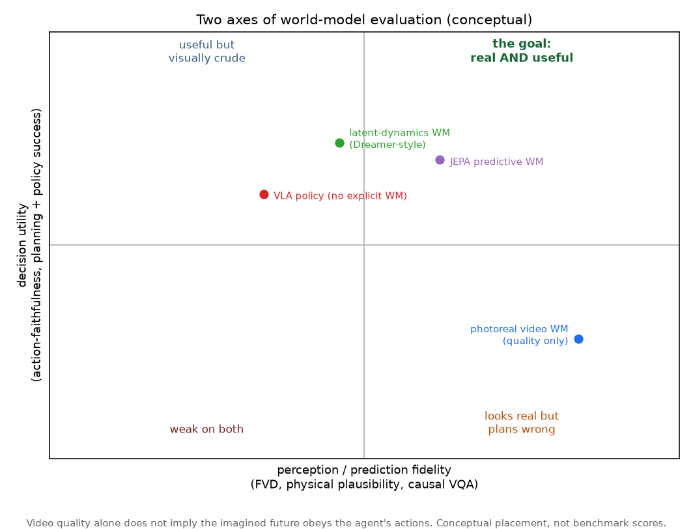
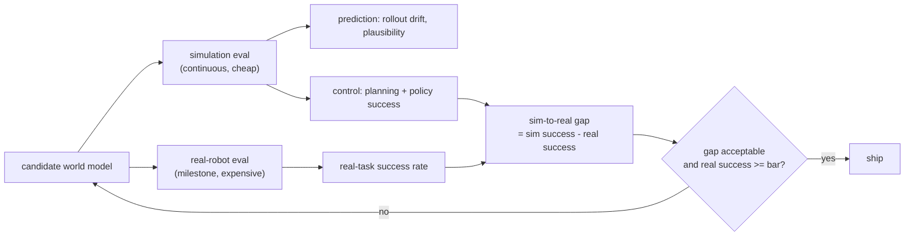

# 5. Evaluation

This is the section the interview is really testing, and the one most candidates get
wrong. A world model has two independent things to be good at, and optimizing the
first without the second produces a model that looks impressive and controls badly.



*The two axes are independent. The horizontal axis is perception fidelity: does the
predicted future look right (Frechet Video Distance, physical-plausibility tests,
causal video question answering). The vertical axis is decision utility: does using
the model actually help an agent act (action-faithfulness, planning success,
downstream policy success). A photoreal video model can sit far right and low, the
"looks real but plans wrong" quadrant. The deliverable lives in the top-right.
Conceptual placement, not benchmark scores.*

## Axis 1: perception and prediction fidelity

Measures whether the predicted future resembles reality.

- **Frechet Video Distance (FVD):** distributional distance between generated and
  real video features. Standard for generative world models, and by itself a weak
  proxy for control.
- **Physical plausibility:** does the prediction obey physics. Meta shipped IntPhys
  2 for exactly this (distinguishing plausible from implausible scenes) alongside
  V-JEPA 2 (arXiv:2506.09985).
- **Causal understanding:** given a scene and an intervention, does the model
  predict the correct consequence (Meta's CausalVQA and Minimal Video Pairs
  benchmarks).
- **Open-loop rollout drift:** how fast the imagined trajectory diverges from the
  true one as you predict further ahead. This is the fidelity metric that most
  directly predicts control quality, because compounding error is what breaks
  planning.

```python
import numpy as np
def rollout_error(model, s0, actions, true_states):
    # model(s, a) -> predicted next state. Imagine forward with NO ground-truth
    # correction and measure how far the imagined trajectory drifts from reality.
    s, err = s0, 0.0
    for t, a in enumerate(actions):
        s = model(s, a)                              # roll the world model forward open-loop
        err += np.linalg.norm(s - true_states[t])    # drift versus the true state at step t
    return err / len(actions)
# a perfect model returns 0.0; a model biased by 0.1 per step over 3 steps returns 0.2
# (the drift accumulates, which is exactly the compounding error that breaks long horizons).
```

## Axis 2: decision utility (the one that counts)

Measures whether an agent using the model succeeds.

- **Action-faithfulness:** does the imagined future respond correctly to the agent's
  chosen action, as opposed to producing a plausible but action-independent
  continuation. Recent position work argues this, not video quality, is the property
  that matters for embodied models (arXiv:2606.15032; the WorldArena benchmark,
  arXiv:2602.08971, evaluates functional utility rather than pixel quality).
- **Planning success rate:** fraction of tasks solved when the model is used inside
  a planner (for example the cross-entropy method from section 4).
- **Downstream policy success:** train or plan a policy with the model, then measure
  task success. This is the north star.

## The evaluation pipeline: sim continuously, real at milestones



**How it works.** Two evaluation tracks run at different cadences because they cost
different amounts. The simulation track runs on every candidate: it is cheap and
GPU-parallel, so it reports both prediction metrics (rollout drift, plausibility)
and control metrics (planning and policy success) continuously, catching
regressions fast. The real-robot track runs only at milestones because every trial
costs human time and hardware wear; it measures success on physical tasks. The two
numbers combine into the metric that actually gates a release, the **sim-to-real
gap** (simulator success minus real-hardware success): a model can look great in sim
and collapse on hardware, and only this gap surfaces it. The gate ships a model only
when real success clears the bar *and* the gap is small enough that the cheap sim
number can be trusted as a proxy going forward.

## The sim-to-real gap

The single most important number in embodied evaluation. A model that scores 90
percent in simulation and 40 percent on hardware has a 50-point gap, which means the
simulator is not a trustworthy proxy and every sim result is suspect. Report success
in both settings and the gap explicitly; a small gap is what lets you iterate cheaply
in sim and trust the result. Domain randomization and more realistic contact physics
narrow the gap; overfitting simulator artifacts widens it.

## What not to do

Do not report a single generative metric (FVD) and call it evaluated. Do not report
only simulation success. Do not evaluate open-loop video quality when the product is
closed-loop control. The recurring interview failure is confusing a good-looking
prediction with a useful one.
