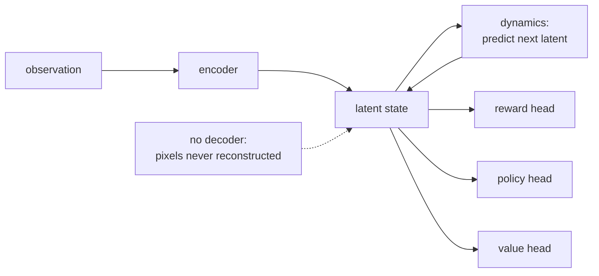

# 8. Interview Q&A

## Commonly asked

**Q: What is a world model, in one sentence?**
A learned predictor of how an environment evolves given the current state and an
action, so an agent can imagine the consequences of a plan before acting.

**Q: Why not just train a policy directly with reinforcement learning?**
Because real-world action-labeled data is scarce and real rollouts are slow and
risky. A world model lets you pretrain dynamics on abundant passive video and then
plan or learn a policy inside cheap imagined rollouts, spending precious real data
on adaptation and evaluation rather than on training from scratch.

**Q: Why is action-conditioning the crucial step?**
An unconditioned model learns what tends to happen; only a model conditioned on the
agent's action learns what happens *if I do this*. Control needs the second. That is
why systems pretrain on passive video for generic dynamics, then adapt on
action-labeled data to make the model controllable.

## Tricky

**Q: Your video world model has a state-of-the-art FVD. Is it a good world model?**
Not necessarily. FVD measures how realistic the generated video looks, which is the
perception axis. A model can be photoreal and still fail the decision axis if the
predicted future does not respond correctly to the agent's action. Report
action-faithfulness and downstream task success, not just FVD.

**Q: Your model plans well in simulation. Why might it fail on the real robot?**
The sim-to-real gap. Simulated contact dynamics, friction, sensor noise, and
lighting differ from reality, so a model that overfits simulator quirks transfers
poorly. Always report success in both settings and the gap between them; domain
randomization and better contact physics narrow it.

**Q: Why prefer a short planning horizon when a longer one sees further?**
Compounding error. A model accurate for one step drifts over a long imagined
rollout as small errors feed back on themselves, so a long open-loop plan is often
less accurate than a short horizon with frequent replanning, and it costs more
compute per control step.

**Q: MuZero plans without ever reconstructing the environment's observations. How
does it learn a model useful for planning then?**
MuZero (DeepMind) trains a latent dynamics model end-to-end so that only the
quantities planning needs are predicted: from an encoded state it learns a transition
function plus reward, policy, and value heads, and it optimizes these purely so the
predicted rewards, policies, and values match what actually happened along real
trajectories. It has no decoder and never tries to reproduce pixels, so the latent
state is free to discard everything visually salient but decision-irrelevant, and its
tree search plans entirely in that learned latent space. The lesson for world models:
a model can be excellent for control while useless as a video generator, because
reconstruction and decision utility are different objectives. That is the same split
behind JEPA-predictive models like V-JEPA 2 (Meta, 2025), which predict in embedding
space rather than pixel space.

*MuZero learns only the quantities planning needs (next latent, reward, policy,
value) and never reconstructs observations, so its state is optimized for decisions
rather than for looking realistic.*

## Commonly answered wrong

**Q: Should the world model run on the robot or in the data center?**
"On the robot" is only half right. On the robot, you run a cheap-state model (latent
or embedding) inside the control loop under a hard latency budget. In the data
center, you run the (often heavier, generative) model in bulk to make synthetic data
and to evaluate policies. Many production programs get more value from the offline
role than the online one.

**Q: How do you evaluate it?**
The wrong answer is a single generative metric. The right answer is two axes,
perception fidelity (rollout drift, plausibility, causal prediction) and decision
utility (action-faithfulness, planning and policy success), measured continuously in
simulation and at milestones on real hardware, with the sim-to-real gap reported
explicitly as the release gate.

**Q: Is a vision-language-action model a world model?**
Not by itself. A VLA maps observation plus goal to actions; it reacts. It becomes a
world-*action* model when you couple it with an explicit predictive model so it can
imagine and plan, not only react.

**Q: A model that generates realistic long videos is a world model, right?**
Not on its own. A world model must be action-conditioned: given the current state
and an action, it predicts the next state, so a planner can ask "what happens if I do
this?" A pure video generator produces one plausible continuation but not the
counterfactual futures for different actions, which is exactly what planning needs.
That is the difference that makes Genie (DeepMind, 2024) a world model: it learns a
latent action space so the generated frames respond to chosen actions, rather than
rolling forward a single unconditioned continuation. Realism (FVD) measures the
perception axis; action-conditioning is what buys the decision axis. A generator with
no action input is a data source at best, not something you can plan through.
