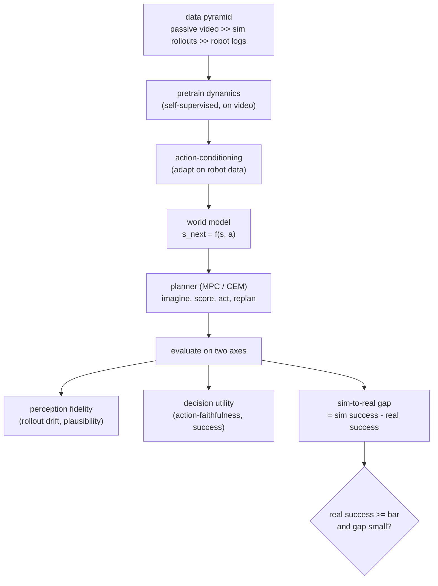

# 9. Summary

A world model is a learned predictor of how an environment evolves under an agent's
actions. It exists so an agent can imagine consequences before acting, and it earns
its place through downstream task success, not through how photoreal its predictions
look.

## The one-page recap

- **Frame** the job first: predict or act, pixels or latents, sim only or sim and
  real. Control is the usual north star, which makes success rate the metric.
- **Four paradigms:** generative-video (fidelity, synthetic data), latent-dynamics
  (cheap control), JEPA-predictive (efficient, self-supervised planning), and
  VLA/world-action (end-to-end policies).
- **Data** is a pyramid: pretrain on abundant passive video, adapt on scarce
  action-labeled robot data, use simulation as the cheap middle tier and the
  continuous eval environment.
- **Evaluate on two independent axes**, perception fidelity and decision utility,
  in sim continuously and on real hardware at milestones, and report the
  sim-to-real gap as the gate. Video quality is not control quality.
- **Serve in two regimes:** cheap-state models plan on the robot under a latency
  budget; heavier generative models run offline to make synthetic data and to
  evaluate policies.

## Test yourself

1. Name the four world-model paradigms and one system for each.
2. Why does the data pyramid force a pretrain-then-adapt recipe?
3. What is action-faithfulness, and why can a high-FVD model still fail it?
4. Write the per-control-step cost of a cross-entropy-method planner and name two
   ways to cut it.
5. What is the sim-to-real gap and why is it the release gate?
6. When is a world model more valuable offline than on the robot?

## Further reading (first-party)

- World Models, Ha and Schmidhuber, 2018: [arXiv:1803.10122](https://arxiv.org/abs/1803.10122).
- DreamerV3, Mastering Diverse Domains through World Models: [arXiv:2301.04104](https://arxiv.org/abs/2301.04104).
- MuZero, planning with a learned model: [arXiv:1911.08265](https://arxiv.org/abs/1911.08265).
- Meta V-JEPA 2: [arXiv:2506.09985](https://arxiv.org/abs/2506.09985).
- DeepMind Genie: [arXiv:2402.15391](https://arxiv.org/abs/2402.15391).
- Wayve GAIA-1: [arXiv:2309.17080](https://arxiv.org/abs/2309.17080).
- OpenVLA: [arXiv:2406.09246](https://arxiv.org/abs/2406.09246).
- NVIDIA Cosmos: [nvidia.com/en-us/ai/cosmos](https://www.nvidia.com/en-us/ai/cosmos/).
- WorldArena embodied world-model benchmark: [arXiv:2602.08971](https://arxiv.org/abs/2602.08971).
- World-action-model reading list: [Awesome-WAM](https://github.com/OpenMOSS/Awesome-WAM).

A companion book covers the classic-ML half in the
[ML System Design Interview](https://github.com/neurarch-ai/awesome-ml-system-design)
repository. Built by [Neurarch](https://www.neurarch.com).
