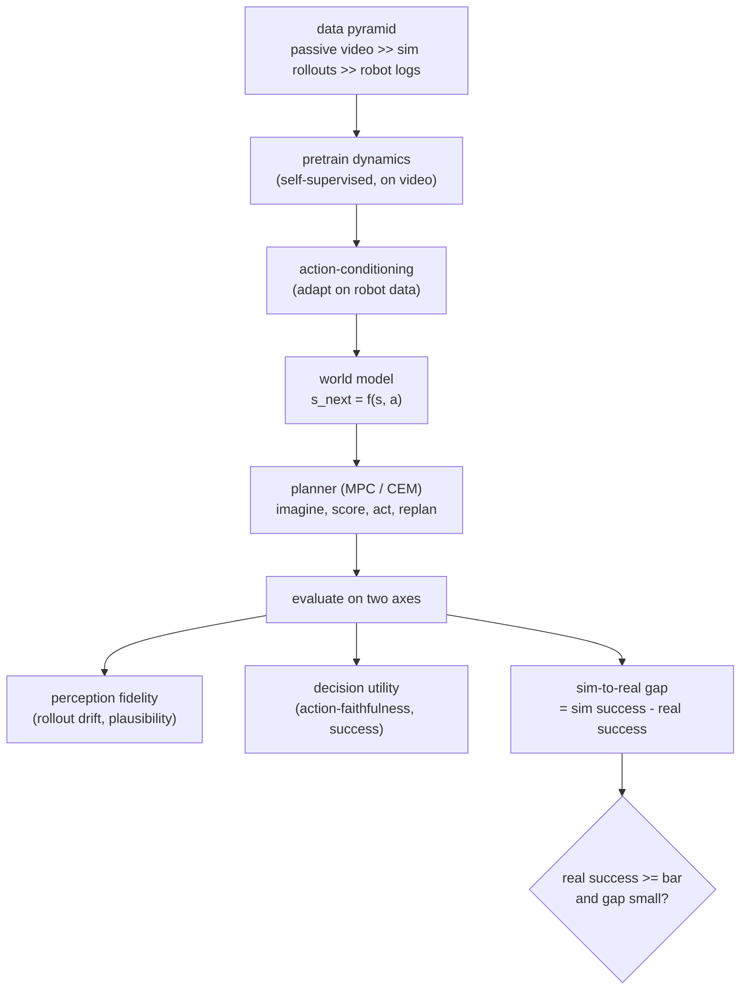

# 9. Summary

A world model is a learned predictor of how an environment evolves under an agent's
actions. It exists so an agent can imagine consequences before acting, and it earns
its place through downstream task success, not through how photoreal its predictions
look.

## The one-page recap

```mermaid
flowchart TB
  DATA["data pyramid<br/>passive video >> sim rollouts >> robot logs"] --> PRE["pretrain dynamics<br/>(self-supervised, on video)"]
  PRE --> ADAPT["action-conditioning<br/>(adapt on robot data)"]
  ADAPT --> WM["world model<br/>s_next = f(s, a)"]
  WM --> PLAN["planner (MPC / CEM)<br/>imagine, score, act, replan"]
  PLAN --> EVAL["evaluate on two axes"]
  EVAL --> P["perception fidelity<br/>(rollout drift, plausibility)"]
  EVAL --> U["decision utility<br/>(action-faithfulness, success)"]
  EVAL --> GAP["sim-to-real gap<br/>= sim success - real success"]
  GAP --> SHIP{"real success >= bar<br/>and gap small?"}
```

- **Frame** the job first: predict or act, pixels or latents, sim only or sim and
  real. Control is the usual north star, which makes success rate the metric.
- **Four paradigms:** generative-video (fidelity, synthetic data), latent-dynamics
  (cheap control), JEPA-predictive (efficient, self-supervised planning), and
  VLA/world-action (end-to-end policies).
- **Data** is a pyramid: pretrain on abundant passive video, adapt on scarce
  action-labeled robot data, use simulation as the cheap middle tier and the
  continuous eval environment.
- **Evaluate on two independent axes**, perception fidelity and decision utility,
  in sim continuously and on real hardware at milestones, and report the
  sim-to-real gap as the gate. Video quality is not control quality.
- **Serve in two regimes:** cheap-state models plan on the robot under a latency
  budget; heavier generative models run offline to make synthetic data and to
  evaluate policies.

## Test yourself

Answers are collapsed. Attempt each question before opening one.

1. Name the four world-model paradigms and one system for each.

   

Answer

   **Generative / video** (predict future frames directly; a token grid or diffusion
   state): DeepMind's Genie, Wayve's GAIA-1, NVIDIA Cosmos. **Latent-dynamics /
   model-based RL** (a compact recurrent latent state, policy learned by imagining
   rollouts inside it): DreamerV3, or MuZero, which models only the quantities
   planning needs. **JEPA-predictive** (predict the future *embedding* rather than
   pixels, so no reconstruction cost): Meta's V-JEPA 2. **VLA / world-action**
   (observation plus a language goal mapped straight to actions): OpenVLA, Physical
   Intelligence's pi-0, NVIDIA Isaac GR00T. They differ in what space $s$ lives in
   and how $f_\theta$ is supervised, and that choice sets the cost profile: video
   models are photoreal but expensive and mostly offline, latent and JEPA models are
   cheap enough to roll forward inside a control loop, and VLAs are one fixed forward
   pass with no imagined future at all. Section
   [2](02-frame-as-ml-task.md) lays out all four and when to reach for each.

   

2. Why does the data pyramid force a pretrain-then-adapt recipe?

   

Answer

   Because the tier that teaches physics and the tier that teaches control are
   different tiers, and neither can do the other's job. The top tier is passive
   internet video: abundant and nearly free, but it has **no action labels**, so it
   teaches dynamics (what tends to happen next) and not controllability (what happens
   if I do this). The bottom tier is teleoperation and real-robot logs: action-labeled
   and drawn from the true deployment distribution, but so scarce that it cannot teach
   physics from scratch. So you pretrain the dynamics self-supervised on the huge
   video tier, then adapt with action-conditioning on the small robot tier, with
   simulation as the cheap action-labeled middle tier and the continuous eval
   environment. V-JEPA 2 is the public instance of the proportions: roughly a million
   hours of video pretraining, then adaptation on the order of tens of hours of robot
   footage. The recipe is forced, not chosen (sections [3](03-data.md) and
   [10](10-putting-it-together.md)).

   

3. What is action-faithfulness, and why can a high-FVD model still fail it?

   

Answer

   **Action-faithfulness** is whether the imagined future responds *correctly to the
   agent's chosen action*, as opposed to producing a plausible but action-independent
   continuation. It lives on the decision-utility axis; FVD lives on the perception
   axis, and section [5](05-evaluation.md) is built around the fact that the two axes
   are independent. A model can top the FVD leaderboard and still ignore its action
   input entirely, because FVD compares the *distribution* of generated futures to the
   distribution of real ones, and predicting the most typical continuation is often
   the easiest way to look realistic. Planning asks the opposite question, how the
   future *changes* across different actions, which a typicality-driven objective
   never rewards. That is the "looks real but plans wrong" quadrant, and it is why the
   chapter refuses to accept a single generative metric as evaluation
   (section [8](08-interview-qa.md)).

   

4. Write the per-control-step cost of a cross-entropy-method planner and name two
   ways to cut it.

   

Answer

   Model calls per control step is $n \times \text{horizon} \times \text{iters}$,
   where $n$ is the number of sampled action sequences and iters is the number of
   CEM refinement rounds. The chapter's worked numbers: 200 samples,
   horizon 5, 3 iterations is about 3,000 world-model evaluations for every single
   action, and a 10 Hz control loop gives all of them about 100 milliseconds. Three
   levers cut it, any two of which answer the question. **Cheap state:** roll forward
   a small latent vector or embedding instead of a full frame, which is why
   latent-dynamics and JEPA models dominate real-time control. **Batched rollouts:**
   the $n$ sequences are independent, so evaluate them as one batched GPU forward pass
   rather than a Python loop. **Shorter horizon with more replanning:** cheaper *and*
   more accurate, because prediction error compounds. See sections
   [4](04-model-development.md) and [6](06-serving-and-scaling.md).

   

5. What is the sim-to-real gap and why is it the release gate?

   

Answer

   The **sim-to-real gap** is simulator success rate minus real-hardware success rate,
   and section [5](05-evaluation.md) calls it the single most important number in
   embodied evaluation. A model at 90 percent in simulation and 40 percent on hardware
   has a 50-point gap, which means the simulator is not a trustworthy proxy and every
   sim result you have is suspect. It gates releases because the two evaluation tracks
   run at different cadences for cost reasons: sim runs continuously and is
   effectively free on GPU-parallel simulators, real-robot trials cost human time and
   hardware wear so they run only at milestones. The gate therefore ships only when
   real success clears the bar *and* the gap is small enough that the cheap sim number
   can be trusted as a proxy going forward. A widening gap is the early warning that
   the model is learning simulator quirks (idealized friction, noiseless sensors,
   repeated textures) rather than physics; domain randomization and better contact
   physics narrow it.

   

6. When is a world model more valuable offline than on the robot?

   

Answer

   Whenever the model is too heavy to meet the control loop's per-step latency budget
   but the job it is good at has no latency constraint at all. Two offline jobs pay
   for themselves: **synthetic data generation**, minting action-labeled trajectories
   and rare or dangerous scenarios that are expensive to collect on hardware, and
   **bulk policy evaluation**, running a candidate policy thousands of times against
   the model or a simulator built from it before touching real hardware. Both are
   throughput problems, so you batch large on GPU-parallel infrastructure instead of
   optimizing tail latency. NVIDIA's Cosmos is positioned exactly here, and section
   [6](06-serving-and-scaling.md) notes the offline regime is often the higher-value
   one in production. The fleet-vehicle column in
   [10](10-putting-it-together.md) is the extreme case: no online planner at all, and
   the world model's whole product is the scenario coverage the fleet never logged.

   

## Further reading (first-party)

- The capstone: [the complete build](10-putting-it-together.md), where every
  choice in this chapter is committed once for the scenario, costed, rebuilt
  under two other constraint sets, and compressed into a runnable one-file planner.
- World Models, Ha and Schmidhuber, 2018: [arXiv:1803.10122](https://arxiv.org/abs/1803.10122).
- DreamerV3, Mastering Diverse Domains through World Models: [arXiv:2301.04104](https://arxiv.org/abs/2301.04104).
- MuZero, planning with a learned model: [arXiv:1911.08265](https://arxiv.org/abs/1911.08265).
- Meta V-JEPA 2: [arXiv:2506.09985](https://arxiv.org/abs/2506.09985).
- DeepMind Genie: [arXiv:2402.15391](https://arxiv.org/abs/2402.15391).
- Wayve GAIA-1: [arXiv:2309.17080](https://arxiv.org/abs/2309.17080).
- OpenVLA: [arXiv:2406.09246](https://arxiv.org/abs/2406.09246).
- NVIDIA Cosmos: [nvidia.com/en-us/ai/cosmos](https://www.nvidia.com/en-us/ai/cosmos/).
- WorldArena embodied world-model benchmark: [arXiv:2602.08971](https://arxiv.org/abs/2602.08971).
- World-action-model reading list: [Awesome-WAM](https://github.com/OpenMOSS/Awesome-WAM).

A companion book covers the classic-ML half in the
[ML System Design Interview](https://github.com/neurarch-ai/awesome-ml-system-design)
repository. Built by [Neurarch](https://www.neurarch.com).
