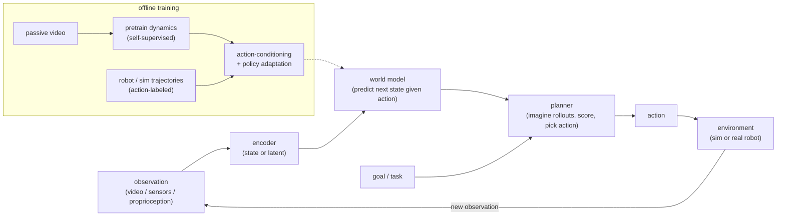

# World Models and Embodied Agents

> **Style note.** This is a frontier chapter. It keeps the same teach-first,
> Candidate/Interviewer framing and the frame-data-model-evaluate-serve arc as the
> rest of the book, but the subject (a learned model of an environment that an
> agent can plan inside) leans more toward robotics and reinforcement learning than
> production LLM serving. The design lens stays the same: what you build, how you
> train it, and above all how you know it works, evaluated on embodied agents in
> simulation and on real hardware.

An interviewer at a frontier lab rarely says "build a world model." They say
**"we want one model that predicts what happens next in the physical world, and we
will judge it by whether a robot using it succeeds at tasks it never saw, in sim
and on real hardware."** That is a world-action model, and the trap is to answer
with video-generation quality (how photoreal the predicted frames look). The
signal is knowing that a world model earns its keep through **action-faithfulness**
(does the imagined future obey the agent's action) and downstream task success, not
pixels.

A **world model** is a learned predictor of how an environment evolves, optionally
conditioned on an agent's actions. Give it the current state and a candidate action
and it returns the likely next state, so an agent can imagine the consequences of a
plan before committing to it in the real world. When the same model also emits the
action, it is a **world-action model (WAM)**.

## Sections

1. [Clarifying the requirements](01-clarifying-requirements.md) - the dialogue that scopes which world-model job you are actually being asked to build.
2. [Framing as an ML task](02-frame-as-ml-task.md) - the four paradigms (generative-video, latent-dynamics, JEPA-predictive, VLA/world-action) and when to use which.
3. [Data](03-data.md) - the embodied-data pyramid: abundant passive video, cheap sim rollouts, scarce action-labeled robot logs.
4. [Model development](04-model-development.md) - tokenizer-plus-transformer vs recurrent latent state vs joint-embedding predictor, action conditioning, and the planning loop.
5. [Evaluation](05-evaluation.md) - the two axes (perception fidelity vs decision utility), sim benchmarks, real-robot success, and the sim-to-real gap. The centerpiece.
6. [Serving and scaling](06-serving-and-scaling.md) - planning-time compute, on-robot latency, and using world models offline for synthetic data and policy evaluation.
7. [How teams do it in production](07-how-teams-do-it-in-production.md) - Meta, NVIDIA, DeepMind, Wayve, and Physical Intelligence, with first-party links.
8. [Interview Q&A](08-interview-qa.md) - commonly asked, tricky, and commonly answered wrong.
9. [Summary](09-summary.md) - the one-page recap, full-system diagram, and self-test.

## The whole system on one page

**How it works.** The loop is closed-loop control wrapped around a learned
predictor. An encoder turns the raw observation into the state the model reasons
over (a compact latent for latent-dynamics and JEPA models, a token grid for
generative-video models). The world model rolls that state forward under candidate
actions, the planner scores the imagined rollouts against the goal and picks the
best next action, and the environment (a simulator during development, a real robot
at deployment) returns the next observation, which re-enters the loop. Training is
offline and two-staged: pretrain the dynamics on abundant passive video to learn
how the world moves, then adapt on scarce action-labeled trajectories so the model
becomes controllable. The dashed edge is the only thing that connects the two: the
adapted model is what the online planner queries.

A companion chapter, [Agent Orchestration](../agents/), covers software agents that
plan over tools rather than physical dynamics; this chapter is its embodied
counterpart. See also [Multimodal Serving](../multimodal/) for the vision-language
encoders these models reuse, and [Evaluating LLM Systems](../evaluation/) for the
offline-plus-online eval discipline that section 5 extends to sim and real.
