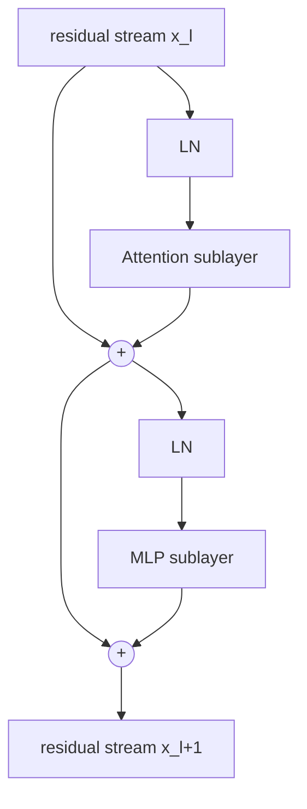
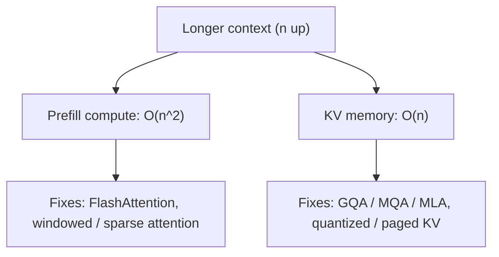
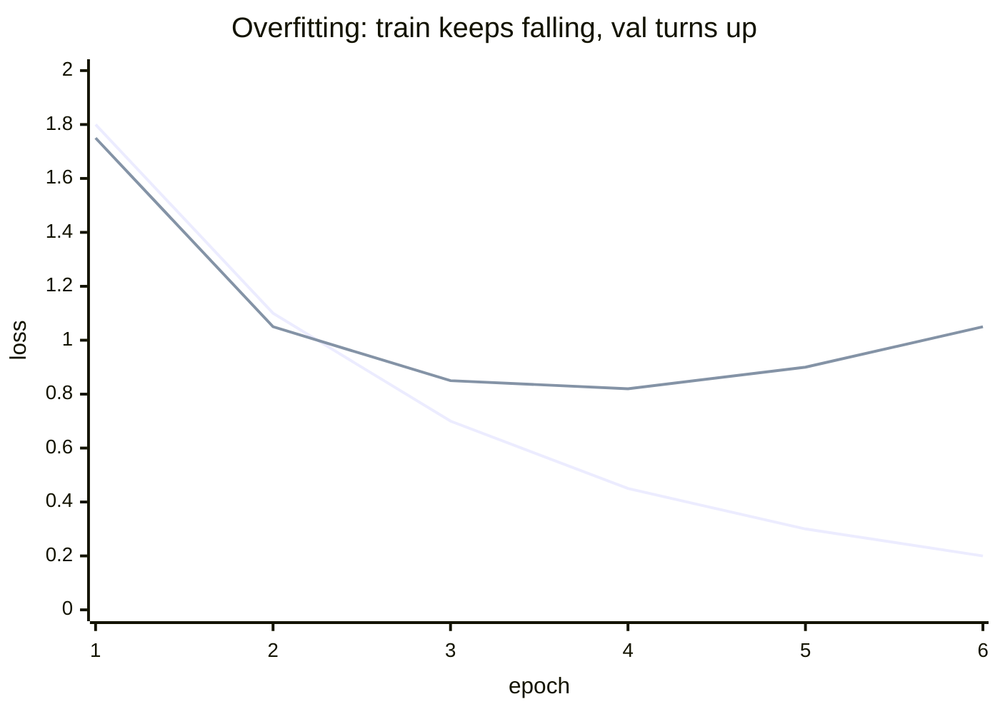
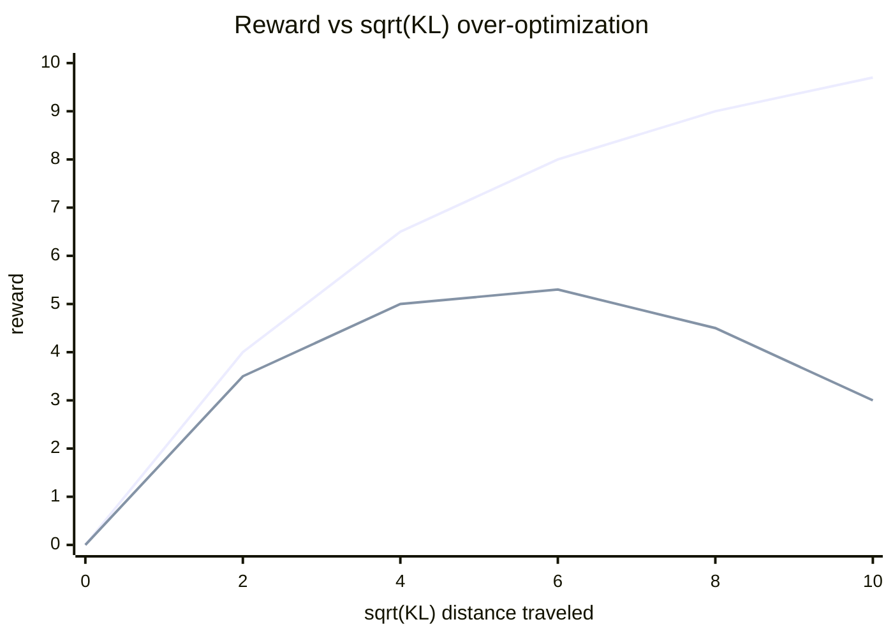
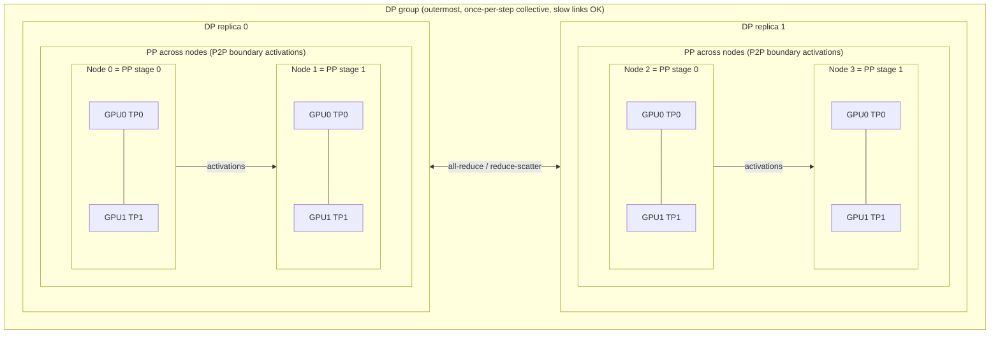
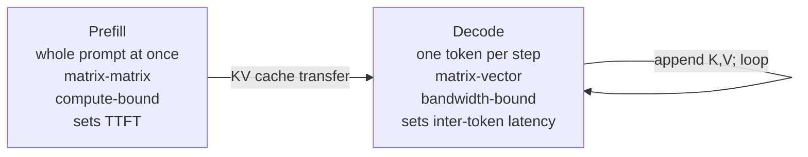
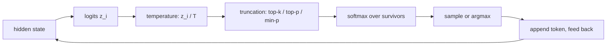
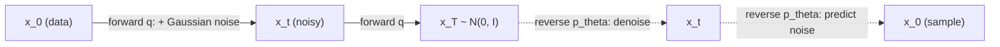

# Deep dives: the questions interviewers actually ask

Rapid-fire, depth-probing questions for LLM and LLM-infra interviews: the ones
that come after the system-design whiteboard, when the interviewer starts pulling
threads on the modeling and the systems underneath. Each answer leads with the
mechanism, then the tradeoff. Formulas are written in LaTeX and render on GitHub.

### By pipeline stage

| Stage | Themes |
| --- | --- |
| **Foundations and architecture** | [Transformer internals and normalization](#transformer-internals-and-normalization) · [Attention variants and positional encoding](#attention-variants-and-positional-encoding) · [Generative model families](#generative-model-families) |
| **Training and optimization** | [Optimization and gradient descent](#optimization-and-gradient-descent) · [Training, fine-tuning, and overfitting](#training-fine-tuning-and-overfitting) · [Distributed training at scale](#distributed-training-at-scale) |
| **Alignment and post-training** | [Alignment, objectives, and KL divergence](#alignment-objectives-and-kl-divergence) |
| **Inference and serving** | [Inference, quantization, and serving math](#inference-quantization-and-serving-math) · [Decoding and sampling](#decoding-and-sampling) |

---
## Transformer internals and normalization

**Q: Why do transformers use LayerNorm instead of BatchNorm?**

BatchNorm normalizes each feature across the batch dimension, so its statistics depend on other examples in the minibatch and on a running average estimated during training. That is a poor fit for language: sequence lengths vary, padding pollutes batch statistics, and inference on a single sequence cannot reuse batch means cleanly. LayerNorm instead normalizes across the feature dimension of each token independently, so it is batch-size agnostic, identical at train and inference time, and unaffected by neighboring examples. For a token vector $x \in \mathbb{R}^{d}$, LayerNorm computes

$$\text{LayerNorm}(x) = \gamma \odot \frac{x - \mu}{\sqrt{\sigma^2 + \epsilon}} + \beta, \quad \mu = \frac{1}{d}\sum_{i=1}^{d} x_i, \quad \sigma^2 = \frac{1}{d}\sum_{i=1}^{d}(x_i - \mu)^2$$

Note the sum runs over the feature dimension $d$ of a single token, not over the batch. The tradeoff is that LayerNorm cannot exploit cross-example statistics for regularization the way BatchNorm does, but in autoregressive sequence modeling per-token stability matters far more.

The three normalizers differ mainly in the axis they reduce over and the statistics they keep:

| Norm | Reduces over | Centers (subtracts mean) | Rescales | Learnable params | Train == inference |
| --- | --- | --- | --- | --- | --- |
| BatchNorm | batch (per feature) | yes | by std | gain, bias | no (running stats) |
| LayerNorm | features (per token) | yes | by std | gain, bias | yes |
| RMSNorm | features (per token) | no | by RMS | gain (bias optional) | yes |

**Q: What does RMSNorm drop relative to LayerNorm, and why do modern LLMs prefer it?**

LayerNorm subtracts the mean and divides by the standard deviation, then applies a learnable gain and bias. RMSNorm removes the mean-centering step entirely and only rescales by the root mean square of the activations, keeping a learnable gain and usually dropping the bias:

$$\text{RMSNorm}(x) = \gamma \odot \frac{x}{\text{RMS}(x)}, \quad \text{RMS}(x) = \sqrt{\frac{1}{d}\sum_{i=1}^{d} x_i^2 + \epsilon}$$

The empirical finding (from the RMSNorm paper and confirmed at scale in LLaMA, T5, and others) is that the re-centering contributes little to performance while the re-scaling does the real work of stabilizing activation magnitude. The payoff is fewer reductions and no mean/variance bookkeeping, which is cheaper per token and easier to fuse on GPU, so at LLM scale RMSNorm gives near-identical quality at lower cost.

**Q: Pre-LN versus post-LN: why has pre-LN become the default despite post-LN being in the original transformer?**

In post-LN the normalization sits after the residual addition, so the output of each sublayer is normalized, which means the residual path itself is repeatedly renormalized and gradient magnitudes to early layers can blow up or vanish at depth. In pre-LN the norm is applied to the input of each sublayer while the residual branch stays a clean identity path, so gradients flow through an unnormalized skip connection all the way to the input, which is far more stable to train deep. The two placements are:

$$\text{post-LN:}\quad x_{l+1} = \text{LN}\!\left(x_l + \text{Sublayer}(x_l)\right)$$

$$\text{pre-LN:}\quad x_{l+1} = x_l + \text{Sublayer}\!\left(\text{LN}(x_l)\right)$$

The concrete consequence is that pre-LN can often be trained without a learning-rate warmup and tolerates larger learning rates, whereas post-LN typically needs careful warmup or it diverges early. The tradeoff is that pre-LN can slightly underperform a well-tuned post-LN model of the same depth and tends to grow the residual stream norm with depth, which is why some models add a final norm and techniques like DeepNorm exist to make post-LN trainable at extreme depth.

**Q: What is the residual stream and why is it the right mental model for a transformer?**

The residual stream is the running sum carried by the skip connections: each attention and MLP sublayer reads from it, computes an update, and adds that update back, so the stream is a shared communication bus that every layer writes into and reads from. Because every contribution is additive, you can decompose the final representation into a sum of the outputs of all heads and MLPs:

$$x_{L} = x_{0} + \sum_{l=1}^{L}\Big(\text{Attn}_l\big(\text{LN}(x_{l-1})\big) + \text{MLP}_l\big(\text{LN}(x_{l-1}')\big)\Big)$$

which is what makes mechanistic-interpretability moves like logit attribution and path expansion possible. The width of this stream (the model dimension $d_{model}$) is fixed across depth, so it acts as bounded bandwidth that layers must share. The practical implication is that a sublayer never has to reconstruct information, it only has to add or subtract from what is already there, which is why residuals make very deep transformers optimizable.



The vertical identity path (the two `+` nodes fed directly by the stream) is the clean gradient highway; the norms sit only on the branches that feed computation.

**Q: Where exactly does the norm sit in a pre-LN block, and why not on the residual path?**

In a pre-LN block the norm is applied to a copy of the residual stream that feeds the sublayer, the sublayer computes attention or MLP on that normalized input, and the raw (unnormalized) result is added back to the untouched residual. The residual path itself is deliberately left as a pure identity with no norm, because putting a norm directly on the skip connection would destroy the clean gradient highway that makes deep training stable. Most modern stacks also add one final norm after the last block and before the unembedding, since the residual stream in pre-LN grows in magnitude with depth and the logits need a normalized input. So the norm normalizes what goes into computation, never the accumulator that carries information forward.

**Q: Why is the attention score scaled by $\frac{1}{\sqrt{d_k}}$?**

Each attention score is a dot product of a query and key of dimension $d_k$. If the components are roughly independent with unit variance, the dot product $q \cdot k = \sum_{i=1}^{d_k} q_i k_i$ has variance proportional to $d_k$:

$$\text{Var}(q \cdot k) = \sum_{i=1}^{d_k} \text{Var}(q_i k_i) = d_k$$

so its magnitude grows with head dimension. Feeding large-magnitude logits into softmax pushes it into a saturated regime where one weight is near $1$ and the rest near $0$, and the gradient through softmax there is vanishingly small. Dividing by $\sqrt{d_k}$ rescales the variance back to order $1$, giving the standard form

$$\text{Attention}(Q,K,V) = \text{softmax}\!\left(\frac{QK^\top}{\sqrt{d_k}}\right)V$$

so the softmax stays in a responsive range with healthy gradients. The condition this rests on is the unit-variance assumption from initialization, which is exactly why the constant is $\sqrt{d_k}$ and not something learned.

**Q: Why does softmax subtract the max before exponentiating, and does it change the result?**

Softmax exponentiates its inputs, and $\exp$ overflows to infinity for inputs above roughly $88$ in float32 or much lower in float16, which produces NaNs. Subtracting the per-row maximum before exponentiating shifts the largest input to $0$ so the largest exponential is exactly $1$ and everything else is in $(0, 1]$, which cannot overflow:

$$\text{softmax}(x)_i = \frac{e^{x_i - m}}{\sum_{j} e^{x_j - m}}, \quad m = \max_j x_j$$

Because softmax is invariant to adding a constant to all inputs (the constant cancels between numerator and denominator), this shift leaves the mathematical output identical while making it numerically safe. It also guards the denominator against underflowing to zero, since at least one term is $1$. This is a pure numerical-stability trick with no accuracy cost, which is why every real implementation does it.

**Q: GELU, GLU, SwiGLU: why did SwiGLU win in modern LLM MLP blocks?**

GELU is a smooth activation that gates an input by (approximately) the probability mass of a Gaussian below it, giving a soft, differentiable alternative to ReLU, where $\text{GELU}(x) = x\,\Phi(x)$ and $\Phi$ is the standard normal CDF. A GLU-family layer instead splits the projection into two branches and uses one branch, passed through a nonlinearity, to multiplicatively gate the other, so the network learns a data-dependent gate rather than a fixed pointwise curve. SwiGLU is the GLU variant that uses the Swish (SiLU) activation on the gate:

$$\text{SwiGLU}(x) = \big(\text{SiLU}(xW_1)\big) \odot (xW_3), \quad \text{SiLU}(z) = z\,\sigma(z)$$

Noam Shazeer's ablations plus later LLaMA-scale results found it consistently lowers loss versus plain GELU/ReLU MLPs. The catch is that a GLU block has three weight matrices ($W_1, W_3$, and the down-projection $W_2$) instead of two, so to keep parameter count fixed the hidden dimension is scaled down, commonly to about two-thirds, so $\frac{8}{3}d_{model}$ rather than $4 d_{model}$. SwiGLU wins on quality per parameter even after that adjustment.

**Q: What is weight tying between input and output embeddings, and what does it buy or cost you?**

Weight tying shares one matrix between the input embedding (token id to vector) and the output unembedding (final hidden state to logits, as its transpose), so if $E \in \mathbb{R}^{V \times d_{model}}$ is the embedding then the logits are $\text{logits} = h E^\top$. The justification is that both map between the same vocabulary and the same representation space, and tying them was shown to improve perplexity while removing a large parameter block equal to $V \times d_{model}$, which is substantial for large vocabularies. The cost is reduced flexibility: the input and output roles are not truly symmetric, so at very large scale where the embedding is a small fraction of total parameters, some models (including PaLM and several later ones) untie them to let each specialize. So tying is most valuable in smaller or vocabulary-heavy models and becomes optional once the embedding stops dominating the parameter budget.

**Q: Why does LayerNorm keep learnable gain and bias while RMSNorm keeps gain but drops the bias?**

Normalization forces activations to a fixed distribution (zero mean, unit variance for LayerNorm), which throws away the scale and offset that a layer might actually need. The learnable gain $\gamma$ lets the network restore or amplify per-feature scale, and the LayerNorm bias $\beta$ restores a per-feature offset, so together they ensure normalization does not strictly reduce representational power. RMSNorm never subtracts the mean, so re-centering is not part of its operation, and the empirical finding is that a re-centering offset (the bias) adds little, so it is commonly dropped along with the mean step for a cleaner, cheaper op. The gain is retained in both because per-feature rescaling is what makes the normalized signal usable by the next layer; the bias is the expendable part.

**Q: What is logit soft-capping and what problem does it address?**

Logit soft-capping passes a set of logits through a bounded squashing function, typically

$$\text{softcap}(z) = c \cdot \tanh\!\left(\frac{z}{c}\right)$$

so their magnitude is smoothly clamped to the interval $(-c, c)$ instead of being allowed to grow without bound. Gemma 2 applied this to both the attention scores and the final output logits to keep them in a controlled range, which improves training stability by preventing a few entries from exploding and dominating the softmax. The tradeoff is that $\tanh$ saturates, so very confident predictions get their logits compressed, and it is incompatible with some fused-kernel fast paths like standard FlashAttention that do not implement the cap. This is why later models (Gemma 3) moved away from it toward other stabilizers such as QK-norm, since the stability benefit did not always justify the kernel and saturation costs.

**Q: What is the role of the unembedding, and why is it not just decoration on top of the last layer?**

The unembedding is the final linear map from the residual stream's last hidden state to a logit per vocabulary token, and because it is applied to the accumulated residual sum, its output is literally a sum of dot products between the unembedding rows and every head/MLP contribution written into the stream. That additivity is what makes the "direct logit attribution" analysis possible: you can ask how much each component pushed toward or away from a given token. Practically the unembedding is preceded by a final norm so it reads a normalized stream, and it is often the tied transpose of the input embedding. So it is the read-out interface of the whole residual computation, not a trivial classifier head, and its geometry (which directions map to which tokens) determines what the model can even express.

**Q: Deeper versus wider: how do you reason about the tradeoff when you have a fixed parameter budget?**

Depth adds sequential compositional stages, letting the model build features that depend on earlier features, while width increases the residual-stream bandwidth and the rank/capacity available within each layer. Depth is harder to optimize (vanishing or exploding signal, the reason pre-LN and careful init exist) and is inherently sequential, so it parallelizes worse and can raise latency, whereas width parallelizes well on modern hardware but has diminishing returns once the stream is wide enough to carry the needed information. Empirically there is a sweet spot: too shallow limits the number of reasoning steps, too narrow bottlenecks information flow, and papers on aspect-ratio ($d_{model}$ relative to $n_{layers}$) find models perform poorly at the extremes and flat across a broad middle. The practical answer depends on the constraint: latency-bound serving favors shallower-wider, and compute-optimal scaling laws (Chinchilla-style) mostly fix the total size and leave shape as a secondary, weakly-sensitive choice within a reasonable band.

**Q: Why can the pre-LN residual stream norm grow with depth, and how is that handled?**

In pre-LN, each sublayer adds its output to the residual without renormalizing the accumulator, so the running sum can accumulate magnitude layer after layer. If sublayer outputs are roughly independent with per-layer variance $s^2$, the stream norm grows like

$$\|x_L\|^2 \approx \|x_0\|^2 + \sum_{l=1}^{L} s_l^2$$

so in practice the residual-stream norm tends to grow roughly with depth. This is usually benign for training because each sublayer sees a normalized input regardless of the stream's absolute scale, but it means the raw stream feeding the output is large and uneven. The standard fix is a single final norm after the last block so the unembedding reads a well-scaled input, and some architectures additionally scale residual contributions at initialization (for example dividing by $\sqrt{2N}$ style schemes) to keep growth controlled. The tradeoff versus post-LN is exactly this: post-LN renormalizes the stream every layer and so does not grow, but pays for it with the harder gradient flow that motivated pre-LN in the first place.

**Q: Why apply QK-norm (normalizing queries and keys before the dot product) and what does it replace?**

QK-norm applies a normalization (often RMSNorm or $L_2$ normalization) to the query and key vectors before their dot product, which directly bounds the magnitude of the attention logits regardless of how the projections drift during training. With $L_2$ normalization the logit becomes a scaled cosine similarity:

$$\text{logit}_{ij} = \tau \cdot \frac{q_i \cdot k_j}{\|q_i\|\,\|k_j\|} \in [-\tau, \tau]$$

The problem it solves is attention-logit growth: without it, query/key norms can inflate as training proceeds, producing extreme logits, near-one-hot softmaxes, and instability, especially at large scale or in low precision. Compared to logit soft-capping, QK-norm controls the logits at their source rather than clamping the result, so it avoids $\tanh$ saturation and composes better with fused attention kernels, which is why Gemma 3 and other recent models adopted it. The cost is a couple of extra normalization ops inside the hot attention path, which is cheap relative to the stability it buys.

**Q: What are the benefits of Grouped-Query Attention (GQA) and where is it mainly used?**

GQA sits between full multi-head attention (MHA), where every query head has its own key/value head, and multi-query attention (MQA), where all query heads share a single key/value head. In GQA the $H$ query heads are partitioned into $G$ groups, and each group shares one key/value head, so the number of KV heads is $G$ with $1 \le G \le H$:

$$\text{MQA} \;(G=1) \;\le\; \text{GQA} \;(1 < G < H) \;\le\; \text{MHA} \;(G=H)$$

The main benefit is inference memory: the KV cache scales with the number of KV heads, so cutting from $H$ to $G$ shrinks the cache (and the memory-bandwidth cost of reading it at every decode step) by a factor of roughly $H/G$, which is often the binding constraint on long-context serving throughput. MQA saves the most but can hurt quality and stability, whereas GQA recovers almost all of the MHA quality at a fraction of the KV cost, which is why it is the mainstream choice in modern decoder LLMs such as LLaMA 2/3, Mistral, and many others. It is mainly a decode-time and long-context optimization, not a training-quality trick.

**Q: Why do transformers need positional information at all, and what breaks without it?**

The core attention operation is permutation-equivariant: $\text{softmax}(QK^\top / \sqrt{d_k})V$ treats its inputs as an unordered set, so permuting the tokens permutes the outputs identically and no absolute or relative order is encoded. Without an injected position signal, "the dog bit the man" and "the man bit the dog" produce the same set of token representations, which is fatal for language. Positional information is added back either as absolute encodings summed into the embeddings (sinusoidal or learned) or, in most current models, as relative/rotary schemes such as RoPE that rotate queries and keys so the dot product depends only on the offset $i - j$. The relative and rotary variants are preferred because they generalize better across lengths and inject position where it is actually used (inside the attention score) rather than smearing it into the residual stream at the input.

## Attention variants and positional encoding

**Q: Walk me through MHA vs MQA vs GQA vs MLA. What does each share, and what is the core tradeoff?**

All four compute scaled dot-product attention with multiple query heads,

$$\text{Attention}(Q, K, V) = \text{softmax}\!\left(\frac{Q K^\top}{\sqrt{d_k}}\right) V$$

and differ only in how many distinct key/value projections exist. MHA gives every query head its own $K$ and $V$, maximizing representational capacity but making the KV cache the largest. MQA collapses all heads to a single shared $K$/$V$ pair, shrinking the cache by a factor of the head count and boosting decode throughput, but it can degrade quality and destabilize training. GQA groups query heads to share $K$/$V$ within each group, sitting between the two, while MLA (Multi-head Latent Attention, from DeepSeek) instead stores a single low-rank latent vector that is up-projected into per-head $K$/$V$ at compute time. The tradeoff axis is quality versus KV-memory versus throughput: MHA best quality / worst memory, MQA best memory / weakest quality, GQA and MLA are the practical compromises.

| Variant | KV heads | KV-cache size | Quality | When to use |
| --- | --- | --- | --- | --- |
| MHA | $h$ (one per query head) | Largest ($\propto h$) | Best | Small models, short context, quality-critical |
| MQA | $1$ (shared) | Smallest ($\propto 1$) | Weakest, can destabilize | Extreme memory/throughput pressure |
| GQA | $g$ groups ($1 < g < h$) | Medium ($\propto g$) | Near-MHA | Default: uptrain from MHA, balanced |
| MLA | Latent (rank $r$) | Below MQA in practice | MHA-like or better | Long-context pretraining you control |

**Q: Why has GQA become the default compromise in modern LLMs?**

GQA keeps KV-head count at an intermediate value $g$ (often $4$ or $8$ groups for tens of query heads), so it recovers most of MHA's quality while cutting KV cache by the group ratio $h/g$. Crucially it can be produced by uptraining an existing MHA checkpoint with a short amount of extra training rather than pretraining from scratch, which lowered adoption cost. Empirically GQA loses little on benchmarks compared to MQA's more noticeable drop, especially on tasks needing head diversity. The result is near-MHA quality at close-to-MQA decode speed, which is why Llama 2 70B, Llama 3, and Mistral shipped it. When memory is the binding constraint you push toward fewer groups; when quality is, you use more.

**Q: What exactly does MLA compress, and what does it buy over GQA?**

MLA projects the keys and values down into a shared low-rank latent vector per token and caches only that latent, up-projecting back to full per-head $K$/$V$ during attention. So the cached object is much smaller than even GQA's grouped $K$/$V$, giving MHA-like or better quality at a KV footprint competitive with or below MQA. The cost is extra matrix multiplies (the up-projection) at compute time and added architectural complexity, plus RoPE needs special handling because you cannot naively rotate a compressed latent, which MLA solves with a decoupled key carrying the positional part. Use MLA when KV memory at long context is the dominant bottleneck and you control pretraining; use GQA when you want a simpler drop-in that can be uptrained from an MHA model.

**Q: Why does the KV cache grow linearly with context length and number of heads?**

During autoregressive decode you cache the $K$ and $V$ vectors for every past token so you do not recompute them each step. Total cache size in bytes is

$$\text{KV bytes} = 2 \times n_{\text{layers}} \times n_{\text{kv}} \times d_{\text{head}} \times n_{\text{seq}} \times b$$

where the leading $2$ counts $K$ and $V$, $n_{\text{kv}}$ is the number of KV heads, $d_{\text{head}}$ the per-head dimension, $n_{\text{seq}}$ the sequence length, and $b$ the bytes per element. It is therefore linear in both sequence length and KV-head count. That linearity is why doubling context doubles KV memory, and why MQA/GQA/MLA attack the $n_{\text{kv}}$ factor specifically. At long context the KV cache, not the model weights, often dominates memory and caps the achievable batch size. Larger batches are what turn memory savings into real throughput, which is the whole point of reducing KV heads.

**Q: Attention is $O(n^2)$ in sequence length. What does that actually cost, and where does it bite?**

The attention score matrix is $n \times n$ because every query attends to every key, so both compute (the $Q K^\top$ and the score-times-$V$ matmuls) and, in a naive implementation, memory scale as $O(n^2)$ with sequence length $n$. This dominates prefill of long prompts, where you process all $n$ tokens at once, so a $2\times$ longer prompt costs roughly $4\times$ the attention FLOPs. During single-token decode the per-step attention is $O(n)$ in the current context length because there is one query against $n$ keys, but summed over generating a long sequence it is still $O(n^2)$ overall. The quadratic term is why long context is expensive on the compute side, separate from the linear KV-memory problem, and why sparse and windowed attention variants exist.

**Q: What does FlashAttention change, and why does it claim no quality loss?**

FlashAttention is an IO-aware exact attention kernel: it computes the same mathematical result but avoids ever materializing the full $n \times n$ score matrix in slow high-bandwidth memory (HBM). It tiles $Q$, $K$, $V$ into blocks that fit in fast on-chip SRAM and uses the online-softmax trick to accumulate the output block by block with running max and sum statistics, so it needs only $O(n)$ memory. Because it recomputes rather than approximates, the output is numerically equivalent to standard attention up to floating-point ordering, hence no quality loss. The win is fewer reads/writes to HBM, which is the real bottleneck on modern GPUs, giving large wall-clock speedups and the ability to train longer sequences without the quadratic memory blowup.

**Q: What are the concrete benefits of FlashAttention, and where is it mainly used?**

The benefits are threefold: it cuts attention memory from $O(n^2)$ to $O(n)$ so you can fit much longer sequences, it delivers large wall-clock speedups (commonly $2$ to $4\times$ on training and prefill) by slashing HBM traffic, and it stays numerically exact so no accuracy is traded away. It is used almost everywhere attention runs at scale: it is the default attention path in training frameworks (PyTorch's `scaled_dot_product_attention`, Megatron, DeepSpeed) and in inference/serving stacks (vLLM, TensorRT-LLM), and it underpins long-context pretraining of essentially all modern LLMs. It matters most during prefill of long prompts and during training, where the full $n \times n$ matrix would otherwise dominate memory; during single-token decode the $Q$ against $n$ keys pattern is already memory-light, so FlashAttention's decode variants focus on efficient KV reads instead.

**Q: Attention was compute-bound in theory; why is FlashAttention framed around memory IO instead?**

On modern accelerators the arithmetic units are far faster than HBM bandwidth, so naive attention spends most of its time reading and writing the large intermediate score and softmax matrices, not doing math; it is memory-bandwidth bound. FlashAttention's insight is that reducing HBM traffic, even at the cost of recomputing some values in the backward pass, is a net win because compute is cheap relative to memory movement. This is why it is described as IO-aware rather than FLOP-reducing; it does not lower the $O(n^2)$ arithmetic, it lowers the $O(n^2)$ memory traffic to $O(n)$. The lesson generalizes: on GPUs, kernel performance is often dictated by data movement, so fusing operations to keep data on-chip is where speedups come from.

**Q: Explain sliding-window, local-global, and sparse attention. What do they trade away?**

Sliding-window attention restricts each token to attend only to the previous $w$ tokens, turning the cost from $O(n^2)$ to $O(n \cdot w)$ and capping the KV cache to the window size, as used in Mistral. Local-global schemes (Longformer, BigBird) mix local windows with a few global tokens that attend everywhere, preserving long-range information paths at low cost. General sparse attention picks a fixed or learned subset of key positions per query to skip most of the matrix. The tradeoff is that any token pair outside the pattern has no direct path, so information must propagate through stacked layers (in windowed models the effective receptive field grows with depth), which can hurt tasks needing precise long-range retrieval. Use these when sequences are very long and most relevant context is local or routable through a few hubs.

**Q: Compare learned-absolute, sinusoidal, RoPE, and ALiBi positional encodings.**

Learned-absolute embeddings add a trainable vector per position; they are flexible but cannot represent positions beyond the trained maximum, so they fail to extrapolate. Sinusoidal encodings use fixed $\sin$/$\cos$ functions of position added to the input; deterministic and unbounded in principle but still added absolutely and weak at length extrapolation in practice. RoPE (Rotary Position Embedding) rotates the query and key vectors by an angle proportional to position,

$$q_m^\top k_n = \big(R_m\, q\big)^\top \big(R_n\, k\big) = q^\top R_{n-m}\, k$$

so the dot product depends only on the relative offset $n - m$, injecting relative position directly into attention without adding to values. ALiBi skips embeddings entirely and instead adds a linear, head-specific distance penalty to the attention scores,

$$\text{score}_{ij} = \frac{q_i^\top k_j}{\sqrt{d_k}} - m_h \,\lvert i - j \rvert$$

where $m_h$ is a fixed per-head slope, which extrapolates gracefully to longer sequences. The axis is absolute versus relative encoding and how well each extrapolates past training length.

**Q: Why did RoPE win over the alternatives?**

RoPE encodes relative position through rotation, so it is applied to $Q$ and $K$ only, is parameter-free, and composes naturally with the dot-product, giving strong quality without extra learned tables. Being relative, it generalizes better than learned-absolute embeddings, and unlike ALiBi it does not bias every head toward recency, preserving the ability to attend far away when needed. It also proved highly amenable to context extension: you can rescale its rotation frequencies (position interpolation, NTK, YaRN) to reach far beyond the pretraining length with minimal or no fine-tuning. That combination of quality, relative encoding, cheap application, and clean extendability is why Llama, Mistral, Qwen, and most modern LLMs adopted it. ALiBi remains attractive when zero-shot length extrapolation with no tuning is the priority.

**Q: How do position interpolation, NTK-aware scaling, and YaRN extend RoPE context, and how do they differ?**

Linear position interpolation squashes positions past the training length back into the trained range by dividing position indices by a scale factor $s = L_{\text{new}} / L_{\text{train}}$, so the model sees in-distribution rotation angles but at reduced positional resolution, usually needing brief fine-tuning. NTK-aware scaling instead changes the RoPE base frequency, stretching low-frequency (long-range) dimensions more than high-frequency (local) ones, which better preserves fine local detail and can work with little or no fine-tuning. YaRN refines this with a per-dimension interpolation that ramps between the two regimes and adds an attention-temperature adjustment, achieving longer context with fewer training tokens than plain interpolation. The tradeoff is resolution versus reach versus tuning cost: plain PI is simple but blurs positions, NTK preserves locality, YaRN gets the best length-per-token but is more involved.

**Q: Why does longer context raise both prefill compute and KV memory, and are those the same problem?**

They are two distinct costs. Prefill compute is the $O(n^2)$ attention over the whole prompt, so a longer prompt raises FLOPs roughly with the square of length and increases time-to-first-token. KV memory is the $O(n)$ cache you must hold for all those tokens throughout generation, which raises peak memory and shrinks the batch size you can serve.



FlashAttention and windowed/sparse attention attack the compute side, while GQA/MQA/MLA and quantized or paged KV caches attack the memory side. Optimizing one does not fix the other, which is why long-context serving needs both a fast attention kernel and a compact KV strategy.

**Q: What are attention sinks, and how does StreamingLLM exploit them?**

Observing trained transformers, a large share of attention mass concentrates on the first few tokens regardless of content; these are attention sinks that absorb probability the $\text{softmax}$ must assign somewhere. Naively evicting the oldest tokens in a sliding-window cache to save memory catastrophically breaks the model because it removes these sink tokens. StreamingLLM keeps a small number of initial sink tokens permanently in the cache alongside the recent sliding window, restoring stability and enabling effectively unbounded streaming generation at bounded memory. The tradeoff is that this preserves fluent generation and low memory, but it does not recover true long-range recall of the evicted middle tokens, so it is a streaming solution, not a way to reason over the full history.

**Q: When do you use cross-attention versus self-attention?**

Self-attention lets a sequence attend to itself, mixing information among its own tokens; it is the core of decoder-only LLMs and encoder stacks. Cross-attention has queries from one sequence attend to keys/values from a different sequence, so you use it whenever one modality or stream must condition on another: encoder-decoder translation, where the decoder cross-attends to encoded source, or perceiver/diffusion models conditioning on text. Cross-attention's $K$/$V$ come from the fixed context and can be cached once, whereas decoder self-attention grows its KV each step. In modern decoder-only LLMs, conditioning is usually done by concatenating context into the same sequence and using self-attention instead, so cross-attention appears mainly in encoder-decoder and multimodal architectures where keeping the streams separate is cheaper or cleaner.

**Q: If your decode throughput is KV-memory bound, what levers do you pull and in what order?**

First reduce KV-head count $n_{\text{kv}}$ with GQA, MQA, or MLA, since that cuts the cache by a fixed multiplicative factor with modest or recoverable quality cost. Next quantize the KV cache (for example to 8-bit or 4-bit), which roughly halves or quarters memory with small quality impact, and use paged KV management (PagedAttention/vLLM) to eliminate fragmentation and raise achievable batch size. If context is very long and mostly local, adopt sliding-window attention or StreamingLLM to bound the cache regardless of sequence length. The ordering reflects the tradeoff: architectural KV reduction is the biggest, most durable win, quantization and paging are near-free serving optimizations, and windowing is last because it sacrifices true long-range recall.

## Training, fine-tuning, and overfitting

**Q: When you fine-tune an LLM on a small task dataset, how does overfitting actually show up, and what is your first line of defense?**

Overfitting shows up as training loss continuing to fall while held-out validation loss flattens then rises, and behaviorally as the model parroting training phrasings, memorizing rare examples verbatim, and losing calibration on out-of-distribution prompts. The classic signature is the diverging pair of curves:



The minimum of the validation curve (around epoch 3 above) is where you want to stop. Because pretrained LLMs have enormous capacity relative to a few thousand fine-tuning examples, they can memorize the set in one or two passes. The cheapest fix is to train fewer epochs with early stopping on a real validation split, since most task adaptation happens in the first epoch. The tradeoff is that aggressive early stopping can underfit genuinely new formats or vocabulary, so you tune the stopping patience rather than hard-capping at one epoch.

**Q: Beyond fewer epochs, what regularization levers matter specifically for LoRA fine-tuning, and how do they trade off?**

LoRA reparameterizes the weight update as a low-rank product, so the effective weight is

$$W = W_0 + \Delta W = W_0 + \frac{\alpha}{r} B A, \qquad B \in \mathbb{R}^{d \times r},\; A \in \mathbb{R}^{r \times k},\; r \ll \min(d, k)$$

where $W_0$ is frozen, $B$ starts at zero and $A$ is randomly initialized (so $\Delta W = 0$ at step 0), and $\frac{\alpha}{r}$ is a fixed scaling factor. The most LoRA-specific lever is the rank $r$: a smaller rank constrains the update to a low-dimensional subspace and mechanically limits how much the model can memorize, so dropping from $r = 64$ to $r = 8$ or $r = 16$ is often the single best anti-overfitting move on small data. LoRA dropout and weight decay on the adapter matrices $A$ and $B$ add further regularization but have milder effect than rank. You can also scale down the $\frac{\alpha}{r}$ ratio to shrink the effective update magnitude. The tradeoff is capacity: too small a rank underfits tasks that require broad behavioral change (new language, heavy formatting), so you raise rank only when validation loss shows underfitting rather than reflexively.

**Q: Explain catastrophic forgetting during fine-tuning and the practical mitigations.**

Catastrophic forgetting is the model losing previously learned general capabilities because gradient updates on the narrow fine-tuning distribution overwrite weights that encoded broad knowledge. It shows up as the model getting better at your task while regressing on reasoning, other languages, or instruction following it used to handle. The strongest structural mitigation is parameter-efficient tuning like LoRA, which freezes the base weights so original capability is preserved by construction and can be recovered by removing the adapter (set $\Delta W = 0$). Complementary fixes are a low learning rate, fewer steps, and replay: mixing a slice of general instruction or pretraining-style data into the fine-tune so the optimizer keeps a gradient signal for the old distribution. The tradeoff is that replay dilutes task signal and slows adaptation, so you tune the mix ratio to the amount of forgetting you observe.

**Q: Full fine-tune vs LoRA vs QLoRA: how do you choose, and what are you giving up with each?**

Full fine-tuning updates all weights, gives the most headroom for large behavioral shifts, but costs memory for weights plus gradients plus optimizer states (roughly a multiple of model size in bytes) and produces a full-size checkpoint per task. LoRA freezes the base and trains small low-rank adapters, cutting optimizer memory dramatically and letting you serve many tasks by hot-swapping megabyte-scale adapters over one shared base. QLoRA goes further by quantizing the frozen base to 4-bit (NF4) and training the adapter in higher precision, so you can fine-tune very large models on a single GPU.

| Method | Base weights | Trainable params | Training memory | Quality headroom | Serving story |
| --- | --- | --- | --- | --- | --- |
| Full fine-tune | fp16/bf16, all updated | 100% | Weights + grads + optimizer ($\approx 6\times$ params in bytes) | Highest, largest behavior shifts | One full-size checkpoint per task |
| LoRA | fp16/bf16, frozen | $\ll 1\%$ (rank-$r$ adapters) | Base (inference-only) + tiny adapter optimizer state | Slight underfit on deep changes | Hot-swap MB-scale adapters over one shared base |
| QLoRA | 4-bit NF4, frozen | $\ll 1\%$ (adapters in bf16) | Lowest: 4-bit base + adapter state, fits large models on 1 GPU | Small extra hit from quantized base | Same adapter swap; dequant overhead at runtime |

The tradeoffs: LoRA and QLoRA can slightly underfit tasks needing deep changes, QLoRA adds dequantization overhead and a small quality hit from the quantized base, and full fine-tune wins raw quality at the cost of memory and un-composable checkpoints.

**Q: Why the learning-rate schedule of linear warmup followed by cosine decay, and what breaks if you skip either part?**

Warmup ramps the learning rate from near zero over the first few hundred to few thousand steps, linearly $\eta_t = \eta_{\max} \cdot \frac{t}{t_{\text{warmup}}}$, so that early, high-variance gradients (and, with Adam, poorly-conditioned second-moment estimates) do not take huge destabilizing steps into random directions. Cosine decay then lowers the rate smoothly toward the end,

$$\eta_t = \eta_{\min} + \tfrac{1}{2}(\eta_{\max} - \eta_{\min})\left(1 + \cos\frac{\pi \, t}{T}\right),$$

so the model settles into a flatter minimum instead of bouncing around it, which improves final loss. Skip warmup and you risk an early loss spike or divergence, especially at large batch sizes and high peak LR. Skip decay and the model keeps taking large steps late in training, leaving final loss higher and noisier; the tradeoff with very aggressive decay is that the effective training time near a useful LR shrinks, so you match the schedule length $T$ to the token budget.

**Q: You see a sharp loss spike mid-pretraining. Walk through diagnosis and the fixes in order.**

A spike means a batch produced gradients large enough to knock the weights into a bad region, often triggered by an outlier batch, an unlucky high-variance update, or accumulating instability in attention logits. First-line defenses are gradient clipping by global norm to cap step size, and a lower or better-warmed learning rate to reduce the chance of the destabilizing step. If a spike already happened and clipping did not absorb it, the standard operational fix is to roll back to the last good checkpoint and skip or reshuffle the offending batches, since replaying the exact data often reproduces the spike. Precision matters too: training in bf16 rather than fp16 removes a whole class of overflow-driven spikes because bf16 has the same exponent range as fp32. The tradeoff of very tight clipping or very low LR is slower convergence, so you loosen them once training is stably past the fragile early phase.

**Q: bf16 vs fp16 for training: what is the real difference and why does it change stability?**

Both are 16-bit, but they split those bits differently:

| Format | Sign | Exponent | Mantissa | Dynamic range | Notes |
| --- | --- | --- | --- | --- | --- |
| fp32 | 1 | 8 | 23 | $\approx 10^{\pm 38}$ | Reference precision |
| fp16 | 1 | 5 | 10 | $\approx 10^{\pm 5}$ (max $\approx 65504$) | Needs loss scaling |
| bf16 | 1 | 8 | 7 | $\approx 10^{\pm 38}$ | fp32 range, coarser mantissa |

So bf16 matches fp32's dynamic range at the cost of precision. The narrow fp16 range means large activations or gradients overflow to $\pm\infty$ and small ones underflow to zero, which is the main source of NaNs, so fp16 requires dynamic loss scaling to shift gradients into the representable range (scale the loss by $s$, then divide gradients by $s$ before the step). bf16's wide range mostly removes overflow, so it needs no loss scaling and is far more forgiving for large-model training. The tradeoff is bf16's coarser 7-bit mantissa can hurt precision-sensitive operations, so you still accumulate reductions, softmax, and layernorm in fp32; fp16 can edge out slightly better precision when it stays numerically stable, which is why it survives on hardware or kernels that favor it.

**Q: Where do NaNs come from in mixed-precision training, and how do you track one down?**

NaNs come from producing $\infty$ then combining it ($\infty - \infty$, $0 \times \infty$, or dividing by an underflowed-to-zero denominator), most often via fp16 overflow, an exploding gradient, a division or $\log$ of a near-zero value, or a bad numerical path in attention or normalization. In fp16, a too-large loss scale $s$ overflows gradients while a too-small one underflows them to zero, so a misconfigured or non-adaptive loss scaler is a frequent culprit. To localize, you check whether it correlates with a specific batch, add anomaly detection or hooks that flag the first tensor to go non-finite, and inspect gradient norms just before the failure. The usual fixes are switching to bf16, clipping gradients, lowering LR, and forcing fp32 for softmax, layernorm, and loss; the tradeoff is that fp32 islands cost speed and memory, so you apply them surgically rather than globally.

**Q: What does gradient clipping actually do, and how do you pick the threshold?**

Gradient clipping rescales the gradient when its global norm exceeds a threshold $\tau$, so a single anomalous batch cannot produce an oversized parameter step that destabilizes training. Formally, with global norm $\|g\| = \sqrt{\sum_i g_i^2}$,

$$g \leftarrow g \cdot \min\!\left(1, \frac{\tau}{\|g\|}\right),$$

which leaves well-behaved steps untouched and only shrinks outliers, making it cheap insurance against loss spikes and divergence, especially early in training. You pick the threshold by watching the distribution of gradient norms and setting $\tau$ a bit above the typical value ($\|g\| \approx 1.0$ is common) so that only genuine outliers are clipped. The tradeoff is that a threshold set too low clips constantly, biasing the optimization and slowing learning, while too high never engages when you need it, so you monitor the fraction of steps being clipped and adjust.

**Q: How does batch size affect training, and what is the critical batch size?**

Larger batches give lower-variance gradient estimates, so each step is more accurate and you can raise the learning rate, but past a point the extra examples add little new gradient information. The critical batch size is that turning point: below it, doubling the batch roughly halves the steps needed (good compute-time tradeoff), and above it you get diminishing returns and mostly waste compute per unit of progress. The critical batch size grows as the loss falls, so later in training you can profitably use larger batches. There is also a coupling to the learning rate: the SGD gradient-noise scale goes as

$$g_{\text{noise}} \propto \frac{\text{lr}}{\text{batch}},$$

so if you increase the batch you must raise the learning rate (or you lose the regularizing noise that helps generalization). The tradeoff is practical: very large batches need LR scaling and warmup to stay stable and can generalize slightly worse without tuning, while very small batches are noisy and slow to converge, so you aim to sit near the critical batch size for your current loss level.

**Q: Data quality vs quantity: when does adding more data stop helping, and how do you reason about it?**

More data helps until the marginal examples are redundant, low-quality, or off-distribution relative to your target, at which point they add noise and compute cost without lowering real error. A smaller, cleaner, well-targeted set often beats a larger noisy one because the model spends capacity fitting the signal you care about instead of averaging over junk. For fine-tuning especially, a few thousand high-quality, diverse, correctly-labeled examples usually outperform a much larger scraped set. The tradeoff is coverage: too aggressive filtering can strip rare but important cases and hurt tail performance, so you filter for quality and dedup while deliberately preserving diversity rather than optimizing a single quality score.

**Q: Why does deduplication matter so much, and what specifically goes wrong without it?**

Duplicated or near-duplicated documents get effectively upweighted, so the model memorizes them, wastes capacity, and can regurgitate them verbatim, which is both a quality and a privacy problem. Duplicates also leak between train and eval when the same passage appears in both, inflating benchmark numbers and hiding real generalization failure. Dedup, including near-dedup via hashing or embedding similarity, spreads the token budget across genuinely distinct content and improves sample efficiency for a fixed compute budget. The tradeoff is that overly aggressive near-dedup can remove legitimately similar-but-distinct examples (boilerplate that carries real variation), so you tune the similarity threshold and keep exact-dup removal strict while treating near-dup more carefully.

**Q: How does label noise affect an LLM fine-tune, and how do you make training robust to it?**

Label noise (wrong target outputs, inconsistent formatting, contradictory annotations) pushes the model to fit incorrect mappings, and because LLMs have high capacity they will memorize even mislabeled examples given enough epochs, which is precisely when noise does the most damage. It typically raises the noise floor of validation loss and produces confident wrong outputs on cases resembling the mislabeled ones. Mitigations are cleaning and deduplicating the labels, reducing epochs so the model fits the consistent majority signal before memorizing noisy outliers, and using label smoothing or loss functions less sensitive to outliers. The tradeoff is that noise-robust training and heavy smoothing also blunt learning of legitimately hard or rare examples, so the durable fix is improving annotation quality rather than only softening the loss.

**Q: What is benchmark contamination and overfitting to an eval set, and how do you guard against it?**

Contamination is when eval examples (or close paraphrases) leak into training data, so the model has effectively seen the test and reported scores overstate real capability. A subtler version is iterative overfitting to the eval set: repeatedly tuning hyperparameters, prompts, or data choices against the same held-out benchmark until you fit its idiosyncrasies rather than the underlying skill. Guards are decontaminating training data against known benchmarks by n-gram or embedding overlap, keeping a truly held-out test set you look at rarely, and validating on fresh or time-split data the model could not have seen. The tradeoff is that strict decontamination and infrequent evaluation slow the feedback loop and can discard useful training data, so you separate a large dev set for frequent iteration from a small locked test set used only for final, honest measurement.

**Q: When you fine-tune a model that already went through RLHF or instruction tuning, how do you keep it from drifting off its aligned behavior?**

Plain supervised fine-tuning on a narrow set can overwrite the aligned policy, so the model regresses on safety, tone, or format while gaining your task. The standard control is a KL penalty toward the reference (the pre-fine-tune) model, adding a regularization term $\beta \, \mathrm{KL}(\pi_\theta \,\|\, \pi_{\text{ref}})$ that grows when the new policy's output distribution diverges from the reference, anchoring behavior while still allowing task adaptation. In practice you combine this with a low learning rate, LoRA to keep base weights recoverable, and replay of general instruction data so the aligned behavior keeps getting reinforced. The tradeoff is the KL coefficient $\beta$: too high and the model cannot move enough to learn the task, too low and it drifts and forgets alignment, so you sweep it against both task metrics and a behavior-preservation eval rather than optimizing task loss alone.

**Q: Why does LoRA work at all, and where is it most and least effective?**

LoRA rests on the empirical observation that the weight update needed to adapt a large pretrained model to a downstream task has low intrinsic rank: $\Delta W$ can be well approximated by $B A$ with $r$ in the single or low double digits even though $W_0$ is full rank. Freezing $W_0$ and training only $B$ and $A$ therefore captures most of the achievable gain while updating a tiny fraction of parameters. Because $\Delta W = \frac{\alpha}{r} B A$ can be folded back into $W_0$ after training ($W = W_0 + \frac{\alpha}{r}BA$), there is zero added inference latency once merged, unlike adapter layers that sit in the forward path. It is most effective for style, format, domain adaptation, and instruction following, where the base already has the underlying capability and you are steering it; it is least effective when the task demands genuinely new knowledge or a large representational shift, where the low-rank constraint bottlenecks learning and a higher rank or full fine-tune is warranted. LoRA is usually applied to the attention projection matrices (and often the MLP matrices), since that is where task adaptation concentrates.

**Q: What is the parameter and memory math that lets QLoRA fine-tune a 65B model on one GPU?**

Full fine-tuning of an $N$-parameter model in mixed precision costs roughly $2N$ bytes for the bf16 weights plus about $12N$ bytes for Adam state (fp32 master copy, first moment, second moment), so a 65B model needs on the order of $14 \times 65 \approx 900$ GB before activations, far past any single GPU. QLoRA attacks all three: it stores the frozen base in 4-bit NF4 (about $0.5N$ bytes, so roughly 33 GB for 65B), trains only rank-$r$ adapters (a fraction of a percent of parameters, so their optimizer state is negligible), and adds double quantization plus paged optimizers to shave the last spikes. The trainable count and its optimizer state shrink by roughly two to three orders of magnitude versus full fine-tune, which is what collapses the footprint onto a single 48 GB or 80 GB card. The costs you accept are runtime dequantization of the 4-bit base on every forward and a small quality gap from the quantized base, which the higher-precision adapter and NF4's information-theoretically motivated levels largely close.

## Alignment, objectives, and KL divergence

**Q: Where exactly does KL divergence enter the RLHF/PPO objective, and what is its functional form?**

In standard RLHF you maximize expected reward under the policy minus a $\beta$-scaled KL to a frozen reference $\pi_\text{ref}$ (usually the SFT model):

$$\max_{\pi_\theta}\ \mathbb{E}_{x,\,y\sim\pi_\theta(\cdot\mid x)}\big[r(x,y)\big]-\beta\,\text{KL}\!\big(\pi_\theta(y\mid x)\,\|\,\pi_\text{ref}(y\mid x)\big)$$

In practice PPO implements the penalty per token: the effective reward at token $t$ is the terminal reward minus a log-ratio,

$$\tilde{r}_t = r(x,y)\cdot\mathbb{1}[t=T]\;-\;\beta\,\log\frac{\pi_\theta(y_t\mid x,y_{<t})}{\pi_\text{ref}(y_t\mid x,y_{<t})}.$$

Summing that log-ratio over the sequence is a single-sample Monte Carlo estimate of the sequence-level KL, so the "KL penalty" and the "KL regularizer" are the same object realized token by token. The closed-form optimum of the regularized objective is the reward-tilted reference distribution:

$$\pi^*(y\mid x)\;\propto\;\pi_\text{ref}(y\mid x)\,\exp\!\Big(\tfrac{1}{\beta}\,r(x,y)\Big).$$

$\beta$ sets how sharply reward tilts the reference: small $\beta$ chases reward hard, large $\beta$ stays close to $\pi_\text{ref}$.

**Q: Why regularize toward the reference at all, rather than just maximizing reward?**

The reward model is a learned, imperfect proxy for human preference, and it is only accurate on the distribution of samples it was trained on (SFT-model outputs). If you let the policy roam freely it will drift off that distribution into regions where the reward model is untrustworthy and assigns spuriously high scores, which is textbook reward hacking. The KL term is a trust region in distribution space: it caps how far $\pi_\theta$ can move from the region where $r$ is calibrated. It also preserves the fluency, grammar, and calibrated token distributions the base model already learned, so you do not have to relearn language while chasing reward. Empirically, drop the KL and you get mode collapse and degenerate repetitive text that scores high on a broken reward.

**Q: Is the RLHF KL forward or reverse, and what behavioral bias does that direction imply?**

RLHF minimizes the reverse KL, $\text{KL}(\pi_\theta\,\|\,\pi_\text{ref})$, because you take expectations under samples from $\pi_\theta$ (the thing you are optimizing) and pull it toward $\pi_\text{ref}$. Reverse KL is mode-seeking: it heavily penalizes $\pi_\theta$ putting mass where $\pi_\text{ref}$ has little, so the policy prefers to concentrate on a subset of high-probability, high-reward modes rather than spread across all of $\pi_\text{ref}$'s support. This is part of why aligned models become more deterministic and lower-entropy than the base model, sometimes to the point of reduced diversity. The tradeoff is that mode-seeking gives you crisp, confident, reward-aligned behavior at the cost of coverage and creativity.

**Q: Contrast forward and reverse KL precisely, using the zero-forcing versus zero-avoiding distinction.**

Forward KL takes the expectation under the true/target $p$:

$$\text{KL}(p\,\|\,q)=\mathbb{E}_{p}\!\left[\log\frac{p}{q}\right]=\sum_x p(x)\log\frac{p(x)}{q(x)}.$$

Wherever $p$ has mass and $q$ does not, $\log(p/q)\to\infty$, so $q$ is forced to cover all of $p$'s modes (zero-avoiding, mass-covering). Reverse KL takes the expectation under $q$:

$$\text{KL}(q\,\|\,p)=\mathbb{E}_{q}\!\left[\log\frac{q}{p}\right],$$

so $q$ is penalized only for placing mass where $p$ is small; $q$ can safely ignore modes of $p$ and collapse onto one (zero-forcing, mode-seeking). Maximum-likelihood/cross-entropy training is a forward KL from data to model, which is why pretraining produces broad, mass-covering distributions. RL fine-tuning is reverse KL to the reference, which is why it sharpens and narrows. Neither is "correct" in the abstract; the direction encodes whether you value coverage or decisiveness.

| Property | Forward $\text{KL}(p\,\|\,q)$ | Reverse $\text{KL}(q\,\|\,p)$ |
| --- | --- | --- |
| Expectation taken under | $p$ (target/data) | $q$ (the fitted/optimized dist) |
| Behavior | zero-avoiding (mass-covering) | zero-forcing (mode-collapsing) |
| Fit shape | covers all modes, blurs across them | locks onto one high-mass mode |
| Penalizes | $q$ missing mass where $p>0$ | $q$ putting mass where $p\approx 0$ |
| Entropy effect | broad, high-entropy | sharp, low-entropy |
| Methods using it | MLE pretraining, cross-entropy, standard distillation | RLHF/PPO, DPO, VAE/ELBO, sequence-level distillation |

**Q: Derive the DPO objective and identify where its implicit KL lives.**

DPO starts from the same KL-regularized reward objective whose optimum is $\pi^*(y\mid x)\propto\pi_\text{ref}(y\mid x)\exp(r(x,y)/\beta)$. Inverting that relation gives the reward as a $\beta$-scaled log-ratio plus a prompt-only partition term:

$$r(x,y)=\beta\,\log\frac{\pi_\theta(y\mid x)}{\pi_\text{ref}(y\mid x)}+\beta\,\log Z(x).$$

Plugging this into the Bradley-Terry preference likelihood, $P(y_w\succ y_l)=\sigma\!\big(r(x,y_w)-r(x,y_l)\big)$, cancels the intractable $Z(x)$ (it is shared by the chosen and rejected completions), leaving

$$\mathcal{L}_\text{DPO}=-\log\sigma\!\Big(\beta\log\tfrac{\pi_\theta(y_w\mid x)}{\pi_\text{ref}(y_w\mid x)}-\beta\log\tfrac{\pi_\theta(y_l\mid x)}{\pi_\text{ref}(y_l\mid x)}\Big).$$

So DPO never runs RL or samples on-policy, yet the same KL-to-reference is baked in through $\pi_\text{ref}$ appearing in every log-ratio, with $\beta$ as the exact same KL temperature. Larger $\beta$ keeps $\pi_\theta$ closer to $\pi_\text{ref}$; smaller $\beta$ allows bigger preference-driven departures.

**Q: Compare RLHF, DPO, RLAIF, and rejection-sampling SFT along complexity, stability, and data.**

RLHF/PPO is the most complex: it needs a separately trained reward model, on-policy sampling, a value/critic network, and careful KL and clipping tuning, which makes it powerful but finicky and expensive. DPO removes the reward model, the sampler, and the critic by turning preferences into a supervised classification loss, so it is far simpler and more stable, but it optimizes off-policy against a fixed preference dataset and can be more sensitive to distribution shift between $\pi_\text{ref}$ and the preference data. RLAIF replaces human preference labels with an LLM judge (AI feedback), which slashes labeling cost and scales, at the risk of inheriting the judge's biases and blind spots. Rejection-sampling SFT (best-of-$n$ then supervised fine-tune on the winners) is the simplest and most stable of all, essentially offline distillation of a reward signal, but it only exploits the modes the base model can already sample and lacks the fine credit assignment of gradient-based preference optimization.

**Q: Why can a reward model be gamed, and how does the KL budget bound the damage?**

A reward model is a finite-capacity function fit on finite preference data, so it equals the true human utility only approximately and only on-distribution; off-distribution it has large, unpredictable error. Optimization is adversarial pressure that specifically seeks the $\arg\max$ of the proxy, which tends to land exactly on the proxy's error peaks (high reward, low true utility), the Goodhart failure. The KL term bounds how far the policy can travel from $\pi_\text{ref}$, so it caps the magnitude of achievable distribution shift and therefore the size of the exploitable proxy error. This is why measured true reward typically rises, peaks, then falls as KL grows: past some KL the policy has drifted into reward-model fantasyland. Choosing $\beta$ is choosing where on that curve to stop.

**Q: State the reward-over-optimization / Goodhart phenomenon and how it looks against the KL axis.**

If you plot gold (true) reward against the square root of KL from the reference, you observe a characteristic rise-then-fall: proxy reward increases roughly monotonically while gold reward increases, plateaus, then declines. The $x$-axis being $\sqrt{\text{KL}}$ matters because empirically the gold-reward curve is well fit by a function of $\sqrt{\text{KL}}$, giving KL a natural role as the "distance traveled" budget. Concretely the fit has the shape

$$R_\text{gold}(d)=d\,\big(\alpha-\beta_\text{coef}\,d\big),\qquad d=\sqrt{\text{KL}(\pi_\theta\,\|\,\pi_\text{ref})},$$

a concave function of $d$ that peaks and then declines. The gap between proxy and gold is the over-optimization penalty and it widens with KL and narrows with reward-model size and data. Practically you tune $\beta$ (or early-stop on KL) to sit near the gold-reward peak, not the proxy peak. Larger, better-calibrated reward models push the peak further out, buying you more usable KL budget.



The upper (monotone) line is proxy reward, the lower (rise-then-fall) line is gold reward; the widening vertical gap between them is the over-optimization penalty, and the gold peak marks where to early-stop.

**Q: Show that cross-entropy training is a KL between the data and model distributions.**

Cross-entropy decomposes into data entropy plus a forward KL:

$$H(p,q)=-\mathbb{E}_{x\sim p}[\log q(x)]=H(p)+\text{KL}(p\,\|\,q),$$

where $p$ is the empirical data distribution and $q$ is the model. Since $H(p)$ (the data entropy) does not depend on the model parameters, minimizing cross-entropy is exactly minimizing the forward KL $\text{KL}(p\,\|\,q)$. So next-token pretraining is a mass-covering, forward-KL fit that tries to place probability everywhere the data does. This is the mathematical reason base models are broad generalists and why the zero-avoiding property gives them wide support before any alignment sharpens them. It also frames alignment as switching KL direction: pretraining is forward KL to data, RL fine-tuning is reverse KL to a reference.

**Q: How does knowledge distillation use KL, and which direction is it?**

Standard distillation minimizes $\text{KL}(p_\text{teacher}\,\|\,p_\text{student})$ over the teacher's softened output distribution (temperature-scaled logits), i.e. the student's cross-entropy against soft targets, which is a forward KL from teacher to student. This is mass-covering, so the student is pushed to reproduce the full soft distribution including the teacher's relative probabilities over wrong answers ("dark knowledge"), not just the $\arg\max$. Some sequence-level LLM distillation instead uses reverse KL (student-sampled) to get mode-seeking behavior that avoids the student spreading mass over teacher modes it cannot represent. The choice mirrors the alignment story: forward for coverage, reverse for a sharper, more student-feasible target. Temperature on the teacher controls how much of the soft structure survives.

**Q: Where does KL appear in the VAE/ELBO, and why is it the same object conceptually?**

The evidence lower bound is a reconstruction term minus a KL that pulls the approximate posterior toward the prior:

$$\text{ELBO}=\mathbb{E}_{q(z\mid x)}\big[\log p(x\mid z)\big]-\text{KL}\!\big(q(z\mid x)\,\|\,p(z)\big).$$

Maximizing the ELBO is equivalent to minimizing $\text{KL}(q(z\mid x)\,\|\,p(z\mid x))$, the reverse KL between the variational and true posteriors, which is why VAEs inherit mode-seeking, sometimes-collapsing latents. The structural parallel to RLHF is exact: "fit the data / earn reward" versus "stay near a prior / reference," with a coefficient ($\beta$-VAE's $\beta$, RLHF's $\beta$) trading the two. In both cases the KL is a regularizer anchoring an optimized distribution to a fixed reference distribution. Recognizing this shared shape is often what the interviewer is testing.

**Q: Explain temperature's effect on the sampled distribution and its relationship to entropy and KL.**

Temperature $T$ rescales logits before softmax:

$$p_i=\frac{\exp(z_i/T)}{\sum_j\exp(z_j/T)}.$$

As $T$ rises above $1$ the distribution flattens toward uniform (entropy increases, more diverse and risky samples); as $T$ falls below $1$ it sharpens toward the $\arg\max$ (entropy decreases, more deterministic); $T\to 0$ is greedy decoding. Temperature does not change the model or its KL to any reference during training; it is a decode-time reshaping of the same categorical. It interacts with alignment because RLHF already lowers effective entropy, so stacking low temperature on an aligned model can over-collapse into repetition. In distillation, teacher temperature above $1$ is used deliberately to expose the soft inter-class structure the student learns from.

**Q: Why is SFT alone insufficient for alignment, and what does adding a preference signal buy?**

SFT is maximum-likelihood on curated demonstrations, a forward-KL fit that teaches the model to imitate good outputs but never tells it that one output is better than another or why a bad output is bad. It can only push probability up on demonstrated tokens; it has no mechanism to push probability down on plausible-but-undesirable continuations, so failure modes it was not shown persist. Preference optimization (RLHF or DPO) supplies a relative, contrastive signal (chosen over rejected) that explicitly lowers the likelihood of dispreferred responses, shaping the whole distribution rather than a point set of demonstrations. It also lets you optimize objectives that are easy to rank but hard to write demonstrations for, like helpfulness-versus-harmlessness tradeoffs. SFT gets you a good starting policy $\pi_\text{ref}$; preference training moves it in the directions demonstrations cannot express.

**Q: What is length bias in reward models, and why does it emerge from the training signal?**

Human raters and preference datasets tend to prefer longer, more detailed answers, so the reward model learns a spurious correlation between length and quality and assigns higher reward to longer completions somewhat independent of content. Under optimization pressure the policy discovers this cheap axis and inflates length to farm reward, a specific instance of reward hacking that costs KL budget on a non-substantive feature. Because the KL penalty limits total drift, length inflation also crowds out genuine quality improvements you could have bought with the same budget. Mitigations include length-normalizing or length-debiasing the reward, adding an explicit length penalty, or methods like length-controlled preference optimization. It is the canonical example that a reward model's correlations, not just its errors, get exploited.

**Q: How is KL used as a live training diagnostic during RLHF, and what do specific patterns mean?**

Practitioners monitor the running $\text{KL}(\pi_\theta\,\|\,\pi_\text{ref})$ per step as the primary health signal: it is the odometer of how far the policy has moved from the SFT model. A KL that spikes suddenly usually signals the policy has found a reward-model exploit and is racing off-distribution, often visible alongside a rising proxy reward but degrading sample quality. A KL near zero means the policy is barely learning ($\beta$ too high or learning rate too low), while a steadily climbing KL with plateauing gold reward is the over-optimization signature and a cue to stop or raise $\beta$. Many implementations use an adaptive KL controller that adjusts $\beta$ to hold KL near a target value, turning the diagnostic into a setpoint. Watching KL against reward, rather than reward alone, is how you distinguish real alignment gains from Goodhart.

**Q: Why is KL divergence asymmetric and not a true distance, and does that matter for choosing forward vs reverse?**

KL is not a metric: it is non-negative and zero only when the two distributions match, but $\text{KL}(p\,\|\,q)\neq\text{KL}(q\,\|\,p)$ in general and it violates the triangle inequality. That asymmetry is not a defect to be smoothed away; it is precisely the degree of freedom you exploit. Because the expectation is taken under the first argument, swapping the order swaps which regions dominate the penalty, giving the zero-avoiding versus zero-forcing behaviors above. If you genuinely want symmetry you use the Jensen-Shannon divergence, $\text{JS}(p,q)=\tfrac12\text{KL}(p\,\|\,m)+\tfrac12\text{KL}(q\,\|\,m)$ with $m=\tfrac12(p+q)$, which is symmetric and bounded, but most alignment objectives deliberately keep the asymmetric KL so they can control coverage-versus-decisiveness. The lesson for interviews: when someone says "KL," always ask which distribution the expectation is under, because that single choice determines the model's behavior.

**Q: In the PPO objective the KL is a soft penalty, but PPO also has a clipping term. Are these two the same trust region?**

No, they act on different spaces. The KL-to-$\pi_\text{ref}$ penalty is a trust region in output-distribution space that keeps the whole policy near the frozen SFT model across training. PPO's ratio clipping, $\min\big(\rho_t A_t,\ \text{clip}(\rho_t,1-\epsilon,1+\epsilon)A_t\big)$ with $\rho_t=\pi_\theta(a_t)/\pi_{\theta_\text{old}}(a_t)$, is a trust region between successive gradient updates that keeps each step near the previous iterate $\pi_{\theta_\text{old}}$, not near $\pi_\text{ref}$. So one bounds total alignment drift and the other bounds per-update optimization stability; both are "trust regions" but with different anchors and different purposes. Dropping the KL penalty lets the policy Goodhart the reward model even if each step is small; dropping the clip lets a single step destabilize even if the policy stays near $\pi_\text{ref}$ on average.

## Distributed training at scale

**Q: Walk me through what each parallelism strategy actually shards, and what it replicates.**

Data parallel (DDP) replicates the full model, optimizer, and gradients on every rank and shards only the input batch, so it costs the most memory but the least code. Tensor parallel (TP) shards individual weight matrices along rows or columns within a layer, so each GPU holds a slice of the params and computes a slice of the activations, requiring an all-reduce or all-gather inside every forward and backward. Pipeline parallel (PP) shards the model by layer, giving each stage a contiguous block of layers plus its own activations, and passes activations point-to-point between stages. FSDP/ZeRO keeps a data-parallel programming model but shards params, gradients, and optimizer states across ranks, gathering each layer's full weights just in time for its forward and backward. The tradeoff axis is memory saved versus communication volume added and how tightly that communication couples ranks.

| Strategy | What it shards | Communication per step | Where to place it in the topology | When to use |
| --- | --- | --- | --- | --- |
| **Data parallel (DDP)** | Input batch only (model, grads, optimizer fully replicated) | One all-reduce of gradients, $\approx 2\times$ gradient bytes per rank | Outermost group; tolerates the slowest links (cross-node InfiniBand) | Default scaling axis when the model already fits on one GPU |
| **Tensor parallel (TP)** | Weight matrices (and their activations) within each layer | Two all-reduces per transformer block (one forward, one backward), on the critical path | Innermost, on fastest links (NVLink island, degree $\le 8$) | Shrink per-GPU memory and activation size for very large individual layers |
| **Pipeline parallel (PP)** | Model by contiguous blocks of layers | Point-to-point sends of boundary activations only | Across nodes; tolerates slower inter-node links | Span depth that will not fit even with TP inside one node |
| **ZeRO / FSDP** | Optimizer states, then gradients, then params, across DP ranks | Reduce-scatter of grads plus all-gather of params (ZeRO-3 adds a forward all-gather) | Outermost DP group; once-per-step collectives tolerate slow links | Mop up remaining memory pressure while keeping the DP programming model |

**Q: Why does optimizer state, not the parameters, usually dominate training memory?**

Adam keeps two extra fp32 tensors per parameter, the first and second moments, and mixed-precision training also keeps an fp32 master copy of the weights. So per parameter you pay $4$ bytes master weight, $4$ bytes momentum, and $4$ bytes variance, which is $4 + 4 + 4 = 12$ bytes, versus $2$ bytes for the bf16 param used in compute. That means optimizer plus master state is roughly $6\times$ the size of the bf16 model itself, dwarfing the params. This is exactly why ZeRO targets optimizer state first: sharding it across $N$ ranks divides the single largest memory consumer with almost no compute cost. A $7\text{B}$ model needs about $7\text{B}\times 2\,\text{bytes} = 14\,\text{GB}$ in bf16 but around $7\text{B}\times 12\,\text{bytes} = 84\,\text{GB}$ just for Adam plus master weights.

**Q: Explain ZeRO stages 1, 2, and 3 and what you pay for each.**

ZeRO-1 shards only the optimizer states across data-parallel ranks; each rank still holds full params and full gradients, and the extra cost is a reduce-scatter plus all-gather of params after the step, roughly the same total volume as DDP's all-reduce. ZeRO-2 additionally shards the gradients, so gradients are reduce-scattered instead of all-reduced and each rank only stores its gradient slice, still no increase in communication volume over DDP. ZeRO-3 (equivalent to FSDP) shards the parameters themselves, so every layer's weights must be all-gathered right before use and freed right after, adding an extra full all-gather of params in the forward pass. The rule of thumb: ZeRO-1 and 2 are nearly free communication-wise and should almost always be on; ZeRO-3 trades roughly $1.5\times$ the communication for the ability to fit models that otherwise will not fit at all.

**Q: What is the all-reduce bandwidth bottleneck, and why does interconnect topology decide whether you scale?**

A ring all-reduce moves about $2\times$ the gradient size per rank regardless of world size, so the step time floor is $\frac{\text{gradient bytes}}{\text{link bandwidth}}$ for the slowest link, and that link, not FLOPs, often gates throughput at scale. NVLink inside a node gives hundreds of GB/s to over a TB/s, while InfiniBand between nodes is an order of magnitude less, so a collective that crosses nodes is dramatically slower per byte. This is why you place the most communication-heavy parallelism, tensor parallel, entirely inside a single NVLink node and reserve the slower InfiniBand fabric for the less chatty data or pipeline dimension. If you naively spread tensor parallel across nodes, the per-layer all-reduces ride InfiniBand and compute stalls waiting on the network. Interconnect is the first thing to check when scaling efficiency collapses.

**Q: Why is tensor parallelism almost always kept within a node, and what is its communication pattern?**

Tensor parallel inserts a collective into every single transformer layer: a column-parallel matmul followed by a row-parallel matmul needs one all-reduce in forward and one in backward per layer block. That is dozens of collectives per step, each on the critical path with no way to hide them behind unrelated compute, so latency and bandwidth of the link matter enormously. On NVLink those all-reduces are cheap enough to be worthwhile; across InfiniBand they would serialize the whole model behind the network. Consequently TP degree is normally capped at the number of GPUs on one NVLink island, typically $8$. You use TP to shrink per-GPU memory and activation size for very large layers, not as your primary scaling axis.

**Q: What causes pipeline bubbles, and how does micro-batching fill them?**

With naive pipelining, stage 2 cannot start until stage 1 finishes the whole batch, so at any moment most stages sit idle; the fraction of idle time is roughly $\frac{P-1}{M+P-1}$ for $P$ stages and $M$ micro-batches. Splitting the global batch into many micro-batches lets stage 1 hand off micro-batch 1 and immediately start micro-batch 2, so the pipeline fills and the bubble shrinks as $M$ grows relative to $P$. Schedules like GPipe fill then drain, while 1F1B (one-forward-one-backward) interleaves forward and backward to also cap activation memory to about $P$ micro-batches in flight. The tradeoff is that more micro-batches mean smaller per-micro-batch matmuls, which can hurt GPU utilization, so you tune $M$ to trade bubble against kernel efficiency. Interleaved (virtual) pipeline stages further cut the bubble at the cost of more point-to-point messages.

**Q: When would you reach for pipeline parallel over tensor parallel or ZeRO-3?**

Pipeline parallel's communication is tiny, just point-to-point transfers of activations at stage boundaries, so it tolerates slower inter-node links far better than tensor parallel's per-layer all-reduces. You reach for it to span nodes when a model is too deep to fit even with TP inside one node, because the cross-node traffic is only boundary activations rather than every layer's weights. The cost is the pipeline bubble and the need to hold multiple micro-batches of activations in flight, plus more complex scheduling and load balancing of layers across stages. ZeRO-3 instead keeps the simple data-parallel model but pays a full param all-gather every layer, which is heavier communication but no bubble and no manual layer partitioning. In practice: TP within a node, PP across nodes for depth, ZeRO to mop up remaining memory pressure.

**Q: How does gradient checkpointing trade memory for compute, and when is it worth it?**

Activations dominate memory during the forward pass because every intermediate must be kept for the backward pass; gradient checkpointing stores only a subset (for example, layer boundaries) and recomputes the rest during backprop. This cuts activation memory from $O(L)$ (linear in depth $L$) to roughly $O(\sqrt{L})$ in the classic scheme, at the price of one extra forward pass of compute, about a $33\%$ FLOP overhead. It is worth it when you are activation-memory-bound and would otherwise have to shrink batch size or add more parallelism that costs communication. Since modern accelerators are usually more compute-rich than memory-rich, paying $33\%$ more FLOPs to unlock a larger batch or longer sequence is frequently a net throughput win. You typically checkpoint whole transformer blocks and leave attention softmax and normalization details to the framework.

**Q: What is sequence parallelism and what problem does it solve that tensor parallelism does not?**

Tensor parallel shards the big linear and attention matmuls but leaves the layer-norm and dropout regions replicated, so their activations are duplicated on every TP rank and consume memory that TP does not reduce. Sequence parallelism shards those otherwise-replicated regions along the sequence dimension, so each rank holds only its slice of the sequence's activations for the norm and residual sections. It composes with TP by converting the boundary collectives from all-reduce into all-gather plus reduce-scatter, which move the same total bytes, so you cut activation memory with no extra communication volume. This is what makes long-context training feasible, since attention activation memory grows with sequence length. For truly long sequences, context-parallel schemes like ring attention extend the idea to the attention computation itself.

**Q: How do you compose 3D parallelism, and what determines the ordering of the dimensions?**

3D parallelism nests tensor, pipeline, and data (usually ZeRO) parallel, and the mapping to hardware follows the communication intensity of each axis. Tensor parallel goes on the innermost, fastest links (NVLink within a node) because it collectives every layer; pipeline parallel spans across nodes because it only sends boundary activations; data or ZeRO parallel forms the outermost group whose all-reduce or reduce-scatter happens once per step and tolerates the slowest links. The world size factorizes as $\text{world size} = \text{TP}\times\text{PP}\times\text{DP} = \text{total GPUs}$, and you size TP to the NVLink island, PP to fit depth, then DP fills the rest for throughput. Getting the mapping wrong, for example TP crossing node boundaries, silently tanks efficiency because a per-layer collective lands on InfiniBand. The whole art is matching each parallelism's traffic pattern to a matching tier of the network.



TP lives on the intra-node NVLink edges (thick, per-layer), PP sends only boundary activations across nodes, and the DP/ZeRO collective closes the loop once per step over the slowest fabric.

**Q: What is communication-computation overlap and how do the frameworks actually achieve it?**

The naive schedule computes all gradients then all-reduces them, leaving the network idle during compute and the GPU idle during communication. Overlap launches the gradient reduction for a layer as soon as that layer's backward finishes, bucketing gradients so the reduce of earlier layers runs on the NCCL stream while later layers are still computing on the compute stream. FSDP does the mirror image on the way in, prefetching the next layer's all-gather of params while the current layer computes. The win is that if communication time is less than compute time it becomes almost fully hidden, and the practical limits are bucket sizing (too small wastes launch overhead, too large delays overlap) and having enough independent work to hide behind. When you see low GPU utilization with a healthy network, exposed, non-overlapped collectives are the usual cause.

**Q: Why does a larger global batch force learning-rate scaling and warmup, and how does that interact with scaling out?**

Adding data or ZeRO ranks multiplies the effective global batch, and a larger batch gives a lower-variance gradient, so you can and generally must raise the learning rate to keep the same effective progress per example, commonly via linear scaling ($\text{LR} \propto B$) or square-root scaling ($\text{LR} \propto \sqrt{B}$) with batch size $B$. Without scaling, a huge batch wastes compute by taking tiny effective steps; with naive scaling you risk instability because early training is fragile. A warmup phase ramps the LR from near zero over the first hundreds to thousands of steps so the large-batch large-LR regime does not blow up the loss before the parameters settle. This couples optimization to your parallelism plan: changing the number of ranks changes the global batch and therefore the LR schedule, so you cannot rescale the cluster without re-tuning. Beyond a critical batch size the returns diminish and more parallelism stops buying faster convergence.

**Q: A training run's throughput drops and one node is clearly slower. Walk me through the straggler problem.**

Synchronous SGD has an implicit barrier at every all-reduce, so the whole world moves at the speed of the slowest rank; one node running $20\%$ slow makes every step $20\%$ slower regardless of how fast the other thousands of GPUs are. Stragglers come from thermal throttling, a bad NVLink or NIC, ECC-correcting memory, noisy-neighbor storage on the data loader, or an imbalanced pipeline stage. Because the barrier hides the cause, you diagnose by per-rank timing of compute versus wait: the straggler shows short wait and long compute while everyone else shows long wait. Mitigations are draining and replacing the node, rebalancing pipeline layers, or in extreme cases asynchronous or gradient-compression schemes, though those change optimization semantics. At scale, detecting and evicting stragglers automatically is a core part of the training controller, not an afterthought.

**Q: What are the failure modes you actually expect on a large run, and how do you tell them apart?**

OOM usually appears at the first step or when sequence length or batch spikes; the fix is more sharding, checkpointing, or smaller micro-batches, and it is deterministic and early. Loss divergence (NaN or a sudden spike) points to too-high LR, missing warmup, fp16 overflow, or a bad data shard, and you distinguish it by whether it correlates with the LR schedule or with specific data. NCCL hangs manifest as a step that never completes with GPUs pinned at $100\%$ but no progress, typically a mismatched collective, a dead peer, or a network partition, and are diagnosed via NCCL debug logs and rank timeouts. A single slow node shows as uniformly reduced throughput with healthy loss, which is the straggler signature. The nastiest is silent data-loader skew, where shards overlap or a sampler is misseeded so ranks see duplicated or missing data, degrading final quality with no crash; you catch it only by auditing sample counts and per-rank data coverage.

**Q: Why train and communicate in bf16 rather than fp16, and what still stays in fp32?**

bf16 has the same $8$-bit exponent as fp32, so its dynamic range matches fp32 and it rarely overflows or underflows, which removes the need for loss scaling that fp16 requires to avoid vanishing gradients. It has fewer mantissa bits than fp16 ($7$ versus $10$), so it is less precise per value, but for training the wide range matters far more than fine mantissa precision. Communicating gradients in bf16 halves the all-reduce bytes versus fp32, directly cutting the bandwidth-bound step time, which is why the reduction is often done in bf16 or with reduce in bf16 and accumulate in fp32. What stays fp32 is the master weight copy and the optimizer moments, because repeated small updates accumulated in low precision would lose the tiny increments and stall learning. So the pattern is bf16 for compute and communication, fp32 for the accumulation and the master state.

**Q: How do you compute the model-FLOPs utilization (MFU) of a run, and why is it the number that matters?**

MFU is the fraction of the hardware's peak FLOPs your run actually turns into useful model math: $\text{MFU} = \frac{\text{model FLOPs per second}}{\text{peak FLOPs per second}}$, where the model FLOPs per token for a dense transformer are approximately $6N$ for $N$ non-embedding parameters (the factor $6$ counts one forward plus two backward matmul passes). You multiply $6N$ by tokens per second and divide by aggregate peak to get a single efficiency number that folds together kernel quality, communication overlap, and pipeline bubbles. It matters because raw tokens per second hides whether you are compute-bound or stalling on collectives: a well-tuned large run lands around $40\%$ to $55\%$ MFU, and a number far below that points at exposed communication, small matmuls, or stragglers rather than at the hardware. Gradient checkpointing lowers MFU on paper (it adds recompute FLOPs) even while it raises wall-clock throughput, so you compare MFU only within the same recompute setting.

**Q: What does an asynchronous or hierarchical checkpointing scheme buy on a long run, and what is the risk?**

Writing a full checkpoint of params plus optimizer state is many terabytes at large scale, and doing it synchronously stalls every rank behind the slowest storage write, so naive checkpointing every few hundred steps can burn a large fraction of wall-clock time. Asynchronous checkpointing snapshots the state into pinned host memory quickly, then flushes to durable storage in the background while training continues, so the GPU stall shrinks to the fast device-to-host copy. Hierarchical schemes add tiers: frequent lightweight snapshots to local NVMe or peer memory for fast recovery from common failures, plus rarer full writes to remote durable storage for catastrophic loss. The risk is consistency, since a background flush must capture a coherent step and be fenced against the next optimizer update, and a crash mid-flush must fall back to the last fully durable checkpoint; getting the fencing wrong silently corrupts recovery, so you validate restore paths, not just save paths.

## Inference, quantization, and serving math

**Q: Why is autoregressive decode memory-bandwidth-bound rather than compute-bound, while prefill is the opposite?**

Decode generates one token at a time, so each step multiplies a batch of just a few token vectors against the full weight matrices, meaning you stream every weight from HBM to do a tiny amount of matrix-vector work. The arithmetic intensity, defined as

$$\text{arithmetic intensity}=\frac{\text{FLOPs performed}}{\text{bytes moved from memory}}$$

is very low, so the GPU's compute units sit idle waiting on memory, and step time is set by weight bytes divided by memory bandwidth:

$$t_\text{decode step}\approx\frac{\text{weight bytes}}{\text{bandwidth}}$$

Prefill instead processes all prompt tokens at once as a big matrix-matrix multiply, reusing each loaded weight across hundreds or thousands of tokens, which pushes arithmetic intensity high enough to saturate the tensor cores. That is why halving model bytes (quantization) speeds decode almost linearly, while prefill time tracks raw FLOPs and TTFT scales with prompt length.

**Q: Write the KV-cache memory formula and explain why it dominates long-context memory.**

The cache size is

$$\text{KV bytes}=2\times n_\text{layers}\times n_\text{kv-heads}\times d_\text{head}\times \text{seq}\times \text{batch}\times \text{bytes}$$

where the leading $2$ accounts for storing both keys and values. It is linear in sequence length and batch, and it is completely separate from and additive to the static weight footprint. For a long context, $\text{seq}$ can reach tens or hundreds of thousands, so the per-request cache grows into many gigabytes and quickly exceeds the weights themselves, which is why long-context serving is capacity-limited by KV memory rather than by model size. This is exactly why $n_\text{kv-heads}$ (via GQA/MQA), $d_\text{head}$, and the dtype $\text{bytes}$ are the levers people pull, since each is a direct multiplicative factor in the formula.

**Q: How does continuous (in-flight) batching beat static batching, and what metric does it move?**

Static batching groups a fixed set of requests, runs them together, and cannot start new work until the slowest sequence in the batch finishes, so short requests are held hostage by long ones and the GPU idles as sequences complete at different times. Continuous batching operates at the granularity of a single decode step: after each step it evicts finished sequences and admits waiting ones into the freed slots, keeping the batch dimension full every iteration. This raises GPU utilization and therefore throughput (tokens per second and requests per second), and it cuts queueing delay because a new request does not wait for a whole batch to drain. The main cost is scheduler complexity and the need for paged KV memory so slots can be reclaimed and reused mid-flight.

**Q: Explain speculative decoding and why it preserves the target model's output distribution.**

A small, cheap draft model proposes $k$ tokens autoregressively, then the large target model verifies all $k$ in a single forward pass (one pass scores all $k$ positions in parallel, which is cheap because verification is compute-bound, not memory-bound per token). A modified rejection-sampling rule accepts each drafted token with probability

$$p_\text{accept}=\min\!\left(1,\ \frac{p_\text{target}(x)}{p_\text{draft}(x)}\right)$$

and, on the first rejection, resamples from an adjusted residual distribution $p_\text{resid}(x)\propto\max\!\big(0,\ p_\text{target}(x)-p_\text{draft}(x)\big)$, which is mathematically equivalent to sampling directly from the target model. So the output is distributionally identical to plain target decoding, no quality is traded away. The win is latency: multiple tokens can be emitted per target forward pass, lowering inter-token latency and end-to-end latency.

**Q: When does speculative decoding help and when does it hurt?**

It helps when the acceptance rate is high, meaning the draft model agrees with the target often, so several tokens land per verification and you amortize the target's expensive memory-bound step across them. With per-token acceptance probability $\alpha$ and $k$ drafted tokens, the expected number of tokens accepted per target pass is

$$\mathbb{E}[\text{tokens per pass}]=\frac{1-\alpha^{\,k+1}}{1-\alpha}$$

so the speedup grows with $\alpha$ and saturates as $k$ increases. It hurts when acceptance is low: you pay for the draft passes plus a target pass but keep only one or two tokens, so throughput can drop below plain decoding, and it consumes extra memory and scheduling overhead. It also helps most at low batch sizes where decode is memory-bound and the target has spare compute to absorb parallel verification for free; at large batch sizes the system is already compute-saturated, so the extra verification FLOPs compete with real work and the benefit shrinks. Net: it trades compute (cheap when idle) for latency, and only pays off when drafts are accurate and the GPU is otherwise underutilized.

**Q: What is prefill-decode disaggregation and which metrics does it target?**

Prefill and decode have opposite hardware profiles, prefill is a compute-bound burst and decode is a long memory-bound tail, so co-locating them on the same GPU makes prefill spikes stall ongoing decodes and inflate inter-token latency (jitter). Disaggregation runs prefill on one pool of GPUs and decode on another, transferring the computed KV cache between them over a fast interconnect. This isolates the two workloads: prefill nodes can be tuned for throughput and batched aggressively, while decode nodes deliver smooth, low inter-token latency without being interrupted by incoming prompts. It improves TTFT stability and tail inter-token latency, at the cost of a KV-cache transfer and more complex topology.

The two phases and their bottlenecks:



**Q: Compare int8, fp8, and 4-bit GPTQ/AWQ quantization and where each drops quality.**

Int8 uses a uniform integer grid with a scale per tensor or per channel and is robust for weight-only inference, but activation outliers can blow up the scale and crush precision on normal values unless handled. Fp8 keeps a floating exponent, so it covers a wider dynamic range at the same 8 bits and tolerates outliers better, which is why it is the practical choice for weight-and-activation quantization on modern hardware. Four-bit methods like GPTQ (error-compensating, Hessian-aware rounding) and AWQ (scale salient weight channels before rounding) are weight-only and squeeze memory hardest, but quality degrades on harder reasoning/long-tail tasks and they need calibration data. The general pattern: quality holds well down to 8-bit weights-and-activations or 4-bit weight-only, and drops off as you push activations low or go below 4 bits.

**Q: Why are outlier features the central difficulty in activation quantization?**

In large transformers a small number of activation channels carry values orders of magnitude larger than the rest, and those few dimensions are functionally important. Uniform quantization must set its scale to cover the largest magnitude,

$$\text{scale}=\frac{\max_i |x_i|}{2^{b-1}-1}$$

so a handful of outliers force a coarse grid that quantizes the many normal channels almost to zero, destroying accuracy. Solutions either keep outliers in higher precision (mixed-precision decomposition), migrate the difficulty from activations into weights (SmoothQuant-style per-channel scaling), or use fp8 whose exponent absorbs the range naturally. This is precisely why weight-only quantization is much easier than weight-and-activation: weights lack this pathological outlier structure, so they tolerate low bit-widths far more gracefully.

**Q: Why is KV-cache quantization a separate decision from weight quantization?**

Weights are a fixed, static tensor quantized once offline, whereas the KV cache is a growing, dynamic activation-like tensor produced at runtime, so they have different error characteristics and different memory roles. Weight quantization shrinks the static footprint and speeds the memory-bound decode by reducing bytes streamed per step; KV quantization shrinks the per-token, per-sequence cache that scales with context length and batch. You can pick them independently, for example fp8 or int4 KV to fit longer contexts while keeping weights at a different precision, because errors compound differently. KV cache is more sensitive at very low bit-widths since quantization error accumulates over every future attention lookup, so it is often kept at 8-bit even when weights go to 4-bit.

**Q: Map the major serving techniques to the specific metric each one improves.**

The one-line summary of "which technique moves which metric," where up-arrow means improves and a blank means little or no direct effect:

| Technique | Throughput | TTFT | Inter-token latency | Memory | Cost / token |
| --- | :---: | :---: | :---: | :---: | :---: |
| GQA / MQA | up (bigger batch) |  |  | up | up |
| Paged attention | up (less waste) |  |  | up | up |
| KV-cache quantization | up (bigger batch) |  |  | up | up |
| Weight quantization | up | up | up (fewer bytes streamed) | up | up |
| Speculative decoding |  |  | up | down (draft + KV) | mixed |
| Prefill-decode disaggregation | up | up (stable) | up (less jitter) |  |  |
| Continuous batching | up |  | down (step contention) |  | up |

Reading it: the KV-memory techniques (GQA/MQA, paged attention, KV quant) raise achievable batch size and context, so they lift throughput and cost efficiency without directly lowering single-request latency. Speculative decoding and disaggregation attack latency: speculation cuts inter-token and end-to-end latency, while disaggregation stabilizes TTFT and decode jitter. Continuous batching raises throughput and utilization but can nudge per-request latency up because each step is now shared with more peers. Weight quantization is the unusual one that helps both latency and memory at once, since fewer bytes are streamed per decode step.

**Q: Give the roofline / arithmetic-intensity intuition for LLM inference.**

The roofline model plots achievable throughput against arithmetic intensity $I$ (FLOPs performed per byte moved from memory); performance is capped by

$$\text{achievable FLOPs/s}=\min\big(\text{peak FLOPs/s},\ \ I\times\text{bandwidth}\big)$$

The two regimes meet at the ridge point, the intensity where a bandwidth-limited machine first hits its compute ceiling:

$$I_\text{ridge}=\frac{\text{peak FLOPs/s}}{\text{bandwidth (bytes/s)}}$$

Below $I_\text{ridge}$ you are memory-bandwidth-bound; above it you are compute-bound. Decode at small batch has intensity near $1$ because each weight byte is used in a single multiply-accumulate, so it lives far left on the roofline and its speed is bandwidth divided by bytes, nowhere near peak FLOPs. Prefill and large-batch decode reuse each loaded weight across many tokens, pushing intensity past the ridge and into the compute-bound region where tensor cores are the limit. This is the unifying lens: increasing batch size or verifying multiple speculative tokens per pass is really moving rightward on the roofline to convert idle bandwidth-bound time into useful compute.

**Q: Why does raising batch size help decode throughput, and what is the ceiling?**

Adding requests to a decode step reuses each streamed weight across more token vectors, so the fixed cost of loading weights from HBM is amortized over more useful work and tokens-per-second climbs; with batch size $B$ the per-step weight traffic is roughly constant while useful work scales with $B$, so intensity grows about linearly, $I\propto B$, moving you up the memory-bound slope of the roofline. The ceiling is twofold: first, KV-cache memory grows linearly with batch and eventually there is no room for more concurrent sequences, and second, once intensity crosses the ridge point ($I\gtrsim I_\text{ridge}$) the workload becomes compute-bound and further batching stops adding throughput while it keeps adding per-request latency. So batching trades latency for throughput and is bounded above by KV capacity and by compute saturation, which is exactly why KV-memory-saving techniques indirectly raise the achievable throughput ceiling.

**Q: When should you use tensor parallelism versus pipeline parallelism?**

Tensor parallelism splits each layer's matrices across GPUs so they cooperate on the same token in lockstep, adding an all-reduce per layer; it reduces per-step latency and lets a model exceed one GPU's memory, but the frequent collective communication demands a fast intra-node interconnect like NVLink. Pipeline parallelism assigns whole layer ranges to different GPUs and streams microbatches through the stages, so its communication is just activations handed between adjacent stages, which tolerates slower links. Pipelining maximizes aggregate throughput when kept full but introduces bubble latency and does not speed a single request, so it favors throughput-oriented, multi-node deployments. Rule of thumb: tensor parallel within a node for latency, pipeline parallel across nodes for throughput and capacity, often combined.

**Q: Why does paged attention matter, and which metric does it move?**

Naive KV allocation reserves a contiguous block sized to the maximum sequence length per request, so most of it sits empty and fragmentation wastes large amounts of HBM, capping how many requests fit concurrently. Paged attention stores the KV cache in fixed-size non-contiguous blocks with a lookup table, like OS virtual memory, allocating pages only as tokens are generated. This near-eliminates internal fragmentation and reservation waste, letting far more sequences share the GPU, which raises throughput and lowers cost per token, and it also enables cheap prefix sharing by letting multiple sequences point at the same physical pages. Its contribution is to memory efficiency and therefore effective batch size, not to single-token latency.

**Q: What limits time-to-first-token, and how is it different from inter-token latency?**

TTFT is dominated by prefill, a compute-bound pass over the whole prompt, so it grows with prompt length and with any queueing delay before the request is scheduled; it is a FLOPs and admission-latency problem. Inter-token latency is the steady-state decode step time, which is memory-bandwidth-bound and set by

$$t_\text{inter-token}\approx\frac{\text{weight bytes}}{\text{bandwidth}}+\text{(per-step batch contention)}$$

largely independent of prompt length once decoding starts. Because the two have different bottlenecks, they respond to different fixes: prompt caching, chunked prefill, and disaggregation cut TTFT, while quantization, GQA, and higher batch efficiency shape inter-token latency and throughput. Conflating them leads to optimizing the wrong stage, for example quantizing weights barely helps a TTFT dominated by a very long prompt.

**Q: A request's end-to-end latency splits into which two terms, and how do you reason about them?**

End-to-end latency for generating $N$ output tokens decomposes cleanly into the prefill cost plus the sum of decode steps:

$$t_\text{e2e}\approx \underbrace{t_\text{TTFT}}_{\text{prefill, compute-bound}}+\ \underbrace{(N-1)\times t_\text{inter-token}}_{\text{decode, bandwidth-bound}}$$

The first term is paid once and scales with prompt length; the second scales with how many tokens you generate. This is why the right optimization depends on the workload shape: a short-prompt, long-generation chatbot is dominated by the decode sum, so you attack $t_\text{inter-token}$ with quantization, GQA, and speculative decoding; a long-prompt, short-answer retrieval or classification call is dominated by $t_\text{TTFT}$, so you attack prefill with prompt caching, chunked prefill, and disaggregation. Averaging both kinds of traffic into one latency number hides which term you should be spending engineering effort on.

**Q: Why does prompt caching help, and what exactly is being reused?**

Prompt caching stores the KV cache computed for a prefix so that a later request sharing that prefix skips recomputing it, jumping straight to decoding the new suffix. What is reused is the per-token keys and values from the shared prefix, not the output tokens, so the saving is the prefill FLOPs (and time) for the cached span, which directly cuts TTFT for long shared system prompts, few-shot exemplars, or multi-turn history. The reuse is exact and lossless because the KV vectors for a fixed prefix are deterministic given the weights, and paged attention makes it cheap by letting many sequences point at the same physical pages. The cost is the HBM held by cached prefixes and the bookkeeping to match and evict them, so it pays off most when a large prefix is shared across many requests and far less for unique one-off prompts.

## Optimization and gradient descent

**Q: Why does initializing every weight in a layer to the same constant break learning, even if that constant is nonzero and well scaled?**

Symmetric initialization creates identical neurons: every unit in a layer receives the same inputs and, with identical weights, produces the same activation and the same gradient. Backpropagation then applies the same update to every unit, so they stay identical forever and the layer collapses to the expressive power of a single neuron. The problem is not the magnitude but the lack of symmetry breaking, which is why we need random initialization. Zero init is a special case that additionally kills gradients through activations like ReLU. Random per-weight values give each neuron a distinct gradient signal so they can specialize into different features.

**Q: Xavier/Glorot and He/Kaiming both scale variance by fan-in, so what actually differs, and which activation does each suit?**

Both keep the variance of activations (and gradients) roughly constant across layers by scaling initial weights by the layer width, which prevents signal from shrinking or blowing up as depth grows. Xavier derives its scale assuming a linear or symmetric-around-zero activation like tanh, balancing both the forward and backward passes with

$$\text{Var}(W) = \frac{2}{n_\text{in} + n_\text{out}}.$$

He init targets ReLU-family activations, which zero out roughly half their inputs and thus halve the output variance, so it compensates by doubling the fan-in scale:

$$\text{Var}(W) = \frac{2}{n_\text{in}}.$$

Using Xavier with ReLU tends to let activations decay with depth, while He with tanh can push activations toward saturation. The rule of thumb is He for ReLU/LeakyReLU/GELU-like rectifiers and Xavier for tanh/sigmoid.

**Q: What actually causes vanishing and exploding gradients, and how do residual connections, normalization, and gating each address them?**

Backprop multiplies many Jacobians together, so the gradient at an early layer is a long product of weight matrices and activation derivatives; if the typical singular values of those factors are below one the product decays exponentially (vanishing), and if above one it grows exponentially (exploding). Residual connections add an identity path so the block Jacobian becomes

$$\frac{\partial}{\partial x}\bigl(x + F(x)\bigr) = I + \frac{\partial F}{\partial x},$$

keeping a gradient component near magnitude one regardless of depth. Normalization (BatchNorm, LayerNorm) rescales activations so their variance stays controlled layer to layer, which keeps the activation-derivative factors in a healthy range and smooths the loss surface. Gating in LSTMs/GRUs lets the cell state carry gradients through a near-linear additive path controlled by learned gates, avoiding the repeated squashing that vanilla RNN recurrence imposes. Exploding gradients are additionally handled bluntly by clipping, since normalization and residuals reduce but do not fully bound growth.

**Q: Beyond fixing vanishing gradients, why do residual/skip connections make very deep networks trainable at all?**

A residual block learns a perturbation around the identity,

$$y = x + F(x),$$

so adding depth cannot make the function strictly harder to represent: a block can approximate identity by driving its residual $F(x)$ toward zero, whereas a plain deep stack must learn to reproduce identity through many nonlinear layers, which is hard. This reframes optimization so early training starts near a shallow effective network and gradually recruits depth, which is why plain deep nets showed higher training error than their residual counterparts. The skip path also creates many short input-to-output routes, so the network behaves like an ensemble of paths of varying length and gradients reach early layers without full-depth attenuation. The net effect is that optimization difficulty, not representational capacity, was the real barrier to depth, and skips remove it.

**Q: Full-batch, mini-batch, and pure SGD trade off along which axes, and why is mini-batch usually the sweet spot?**

Full-batch descent computes the exact gradient so each step is well-directed, but every step is expensive, memory-heavy, and the smooth trajectory tends to settle into the nearest minimum with poor exploration. Pure SGD (batch size one) is cheap per step and its high gradient noise helps escape sharp regions, but the noise is so large that convergence is erratic and it underuses vectorized hardware. Mini-batches interpolate: they give a lower-variance gradient estimate that still carries useful stochasticity, and they map efficiently onto GPU parallelism. The gradient-noise scale is roughly

$$\text{noise} \propto \frac{\text{lr}}{\text{batch}},$$

and that noise acts as implicit regularization that biases training toward flatter, better-generalizing minima. Very large batches reduce noise and can hurt generalization unless the learning rate is scaled up and warmup is used.

**Q: SGD, momentum, Adam, and AdamW: what does each add, and when can Adam generalize worse than plain SGD?**

Plain SGD follows the raw stochastic gradient $\theta_{t+1} = \theta_t - \eta\, g_t$ and can crawl through ravines and stall in flat directions. Momentum accumulates an exponential moving average of gradients,

$$v_t = \mu v_{t-1} + g_t, \qquad \theta_{t+1} = \theta_t - \eta\, v_t,$$

damping oscillation across steep directions and accelerating along consistent ones, like a heavy ball. Adam adds per-parameter adaptive step sizes by dividing by a running estimate of gradient magnitude,

$$m_t = \beta_1 m_{t-1} + (1-\beta_1) g_t, \qquad v_t = \beta_2 v_{t-1} + (1-\beta_2) g_t^2, \qquad \theta_{t+1} = \theta_t - \eta\, \frac{\hat{m}_t}{\sqrt{\hat{v}_t} + \epsilon},$$

which handles badly scaled or sparse gradients and needs less learning-rate tuning. Adam's per-coordinate rescaling can converge to sharper minima and it entangles weight decay with the adaptive denominator, so on vision benchmarks well-tuned SGD with momentum often generalizes better. AdamW fixes the decay entanglement by applying weight decay directly to the parameters, $\theta_{t+1} = \theta_t - \eta\bigl(\frac{\hat{m}_t}{\sqrt{\hat{v}_t}+\epsilon} + \lambda \theta_t\bigr)$, decoupling regularization from the adaptive scaling, which is why it is the default for transformers.

| Optimizer | What it adds over the previous | Extra state / param | Generalization caveat |
| --- | --- | --- | --- |
| SGD | Raw stochastic gradient step | none | Slow in ravines; strong generalization when well tuned |
| Momentum | EMA of gradients ($v_t$) to damp oscillation, accelerate consistent directions | 1x params ($v$) | Usually the vision benchmark winner |
| Adam | Per-coordinate adaptive step via $\sqrt{v_t}$ denominator + bias correction | 2x params ($m, v$) | Can find sharper minima, generalize worse than SGD; decay entangled with denominator |
| AdamW | Decoupled weight decay applied straight to $\theta$ | 2x params ($m, v$) | Fixes decay entanglement; default for transformers |

**Q: Why do learning-rate warmup and cosine or step decay help, mechanistically?**

Early in training the parameters are far from any good region and adaptive-optimizer statistics (Adam's second moment $v_t$) are estimated from very few samples, so a large initial step can send weights into a bad, high-curvature region; warmup ramps the rate up slowly to let those estimates stabilize and to keep early updates safe, which matters most for large-batch and transformer training. Once training is underway a high rate helps traverse the loss landscape quickly, but near a minimum a high rate causes the iterate to bounce around the basin without settling. Decaying the rate (cosine's smooth taper or step drops) shrinks the effective noise floor so the optimizer can descend into and refine a minimum. Cosine decay is popular because its gradual late-stage reduction avoids the abrupt loss of progress that sharp step drops can cause, and it needs no hand-picked drop schedule.

**Q: In high-dimensional non-convex loss surfaces, why are saddle points, not local minima, the dominant obstacle?**

At a critical point the local behavior is set by the signs of the Hessian's eigenvalues, and for a point to be a true local minimum every one of the many eigenvalues must be positive. In high dimensions that all-positive event is exponentially unlikely at a random critical point, so most critical points are saddles with a mix of positive and negative curvature.

```
Critical point in D dimensions (Hessian eigenvalue signs):

  local minimum   all + + + + + +      P ~ (1/2)^D   vanishingly rare
  local maximum   all - - - - - -      P ~ (1/2)^D   vanishingly rare
  saddle point    mix + - + - - +      almost everything

  gradient -> 0 near a saddle, so progress stalls along the flat
  (near-zero-curvature) directions; escape rides the - directions.
```

Empirically the local minima that do exist tend to cluster near the global minimum in loss value, so getting trapped in a bad minimum is rare. Saddles are the real slowdown because gradients become tiny near them and can stall progress along the flat directions. Noise from SGD and momentum both help by pushing the iterate along negative-curvature escape directions.

**Q: If second-order and natural-gradient methods use curvature to take better-informed steps, why are they rarely used at scale?**

Second-order methods precondition the gradient with (an approximation of) the inverse Hessian, $\theta_{t+1} = \theta_t - \eta\, H^{-1} g_t$, and natural gradient uses the inverse Fisher information $F^{-1} g_t$, which rescales steps by curvature so they behave well even in badly conditioned or reparameterized landscapes and can need far fewer iterations. The catch is cost: the exact matrix is $O(N^2)$ in parameter count to store and $O(N^3)$ to invert, which is hopeless for models with millions to billions of weights. Approximations like K-FAC, L-BFGS, or diagonal/block schemes reduce this but add complexity, memory, and stability risk, and they interact poorly with the heavy gradient noise of mini-batch training since curvature estimates become unreliable. Adaptive first-order methods like Adam capture a cheap diagonal slice of this curvature information (the $\sqrt{v_t}$ denominator) and recover much of the benefit at a fraction of the cost, so they win in practice.

**Q: When and why is gradient clipping used, and what is the difference between clipping by value and by norm?**

Clipping bounds the update size to guard against rare, huge gradients (from exploding gradients in deep/recurrent nets or from a pathological batch) that would otherwise throw the parameters into a bad region in a single step. Clip-by-value caps each coordinate independently, which can distort the gradient's direction because different coordinates get scaled differently. Clip-by-norm rescales the whole gradient vector when its global norm exceeds a threshold $\tau$, preserving direction while shrinking magnitude:

$$g \leftarrow g \cdot \min\!\left(1, \frac{\tau}{\lVert g \rVert_2}\right).$$

This is why clip-by-global-norm is the common choice for RNNs and transformers. It is a targeted stability fix rather than a routine optimizer feature: it rarely helps well-conditioned problems and mostly matters where occasional gradient spikes occur. The threshold $\tau$ is a hyperparameter, and setting it too low throttles learning by clipping normal steps.

**Q: What is the flat-versus-sharp-minima intuition for generalization, and what caveat should you keep in mind?**

A flat minimum is a basin where the loss changes slowly as parameters move, so small parameter perturbations and the train-to-test distribution shift barely change the loss, which tends to correlate with better test performance; a sharp minimum has high curvature so the same shift can spike the loss. This is why noise-injecting choices, small batches, and higher learning rates, which cannot stably sit in narrow basins, are associated with better generalization. The caveat is that sharpness is not reparameterization-invariant: you can rescale weights to make a minimum look arbitrarily sharp or flat without changing the function, so naive curvature measures can mislead. The intuition still motivates practical methods like SAM that explicitly seek flat regions, but flatness should be treated as a useful heuristic rather than a rigorous guarantee.

**Q: Deep-network loss is non-convex with countless critical points, so why does gradient descent still find good solutions?**

Overparameterized networks have many, widely distributed global-ish minima with low loss, so the optimizer does not need to find a unique needle; a large fraction of reachable low-loss solutions are good. High-dimensional geometry means most critical points are escapable saddles rather than trapping local minima, and SGD's noise plus momentum help slip past them. Good initialization (He/Xavier), normalization, and residual connections shape the landscape so a smooth descent path from initialization to a low-loss region usually exists. On top of that, the implicit bias of SGD steers toward flatter, simpler solutions among the many that fit, which is why the found minimum generalizes rather than merely memorizing. Non-convexity guarantees no global optimum, but the combination of benign geometry and helpful implicit bias makes it a practical non-issue.

**Q: How does batch size interact with learning rate, and why can you not just scale to huge batches for free?**

The gradient-noise scale is roughly proportional to $\frac{\text{lr}}{\text{batch}}$, so doubling the batch halves the noise and, to keep the same effective dynamics, you scale the learning rate up. The linear scaling rule sets

$$\text{lr} \propto \text{batch}, \qquad \text{e.g. } \eta_\text{new} = \eta_\text{base} \cdot \frac{B_\text{new}}{B_\text{base}},$$

often with warmup to survive the larger early steps. This lets you use hardware parallelism to cut wall-clock time while approximating the same optimization trajectory. But there is a critical batch size beyond which adding examples per step stops reducing the number of steps needed, so you pay more compute for little speedup. Very large batches also strip out the beneficial noise that regularizes toward flat minima, so test accuracy can drop unless you compensate with schedule and regularization tricks. The practical regime is the largest batch that still lies below that diminishing-returns point.

**Q: Why is Adam's bias correction necessary, and what goes wrong without it?**

Adam initializes its first- and second-moment moving averages at zero, so early in training those exponential averages are biased toward zero because few gradients have accumulated. The bias-correction terms divide each moment by one minus the decay raised to the step count,

$$\hat{m}_t = \frac{m_t}{1 - \beta_1^{\,t}}, \qquad \hat{v}_t = \frac{v_t}{1 - \beta_2^{\,t}},$$

which rescales the early estimates up to their unbiased values and fades to a no-op as $t$ grows. The second-moment estimate sits in the denominator of the update, so an underestimated (too small) $v_t$ inflates the effective step size exactly when the estimates are least reliable, risking instability. Without correction the first several hundred steps take erratically large or misdirected steps, which is why omitting it tends to require a separate warmup or a smaller initial rate. It is a cheap fix that makes the early training transient well-behaved.

**Q: Why can BatchNorm both stabilize optimization and cause problems, and how does it change the loss landscape?**

BatchNorm normalizes each activation using batch statistics,

$$\hat{x} = \frac{x - \mu_\text{batch}}{\sqrt{\sigma_\text{batch}^2 + \epsilon}}, \qquad y = \gamma \hat{x} + \beta,$$

which keeps layer inputs in a consistent range so downstream gradients stay well-scaled and the loss surface becomes smoother and more predictable, allowing higher learning rates and faster convergence. It also injects mild noise through the varying batch statistics, which acts as a regularizer. The problems come from its dependence on the batch: with tiny batches the statistics are noisy and estimates degrade, and the train-time (batch stats) versus test-time (running averages) mismatch can hurt if the running estimates are off. It also couples examples within a batch, which breaks assumptions in some settings and complicates sequence models, which is why LayerNorm, which normalizes per example across features, is preferred in transformers. So BatchNorm is a strong optimizer aid whose batch dependence is its main liability.

**Q: What does weight decay actually regularize, and why is L2 penalty not the same as weight decay under Adam?**

Weight decay shrinks parameters toward zero each step, $\theta_{t+1} = (1 - \eta\lambda)\,\theta_t - \eta\, g_t$, which biases the model toward smaller-norm solutions that tend to be smoother and generalize better. For plain SGD this is mathematically identical to adding an L2 penalty $\frac{\lambda}{2}\lVert\theta\rVert^2$ to the loss, since the gradient of that penalty is exactly $\lambda\theta$. Under Adam the equivalence breaks: an L2 penalty enters the gradient $g_t$ and then gets divided by the adaptive denominator $\sqrt{\hat{v}_t}+\epsilon$, so parameters with large historical gradients get decayed less, which is not what you want from a norm regularizer. AdamW restores the intended behavior by applying the $(1-\eta\lambda)$ shrink directly to $\theta$, outside the adaptive rescaling. This decoupling is precisely why AdamW, not Adam-plus-L2, is the transformer default.

**Q: What is the difference between the loss landscape's conditioning and its non-convexity, and which one does Adam actually help with?**

Conditioning refers to how differently the loss curves along different directions, captured by the ratio of the largest to smallest Hessian eigenvalue; a badly conditioned (ill-conditioned) problem has steep and shallow directions that force a single global learning rate to be either too big for the steep axis or too small for the shallow one. Non-convexity is a separate property: the presence of multiple critical points, saddles, and basins so that no single descent guarantees the global optimum. Adam and other adaptive methods mainly attack conditioning by giving each coordinate its own effective step through the $\sqrt{v_t}$ denominator, so ravines that stall SGD get traversed faster. They do little for non-convexity itself; escaping saddles and finding good basins comes from gradient noise, momentum, and the benign high-dimensional geometry, not from the adaptive rescaling. Conflating the two is a common interview slip: Adam is a preconditioner, not a global optimizer.

## Decoding and sampling

**Q: Walk me through what actually happens at each step to turn model outputs into a chosen token.**

The model produces a vector of logits $z\in\mathbb{R}^{|V|}$, one per vocabulary entry, for the next position. A softmax turns those logits into a probability distribution, optionally after temperature scaling and truncation filters like top-k or top-p. A decoding rule then selects a token: greedy takes $\arg\max_i z_i$, sampling draws from the (possibly truncated) distribution, and beam search keeps several partial sequences ranked by cumulative log-probability $\sum_t \log p(y_t\mid y_{<t})$. The chosen token is appended and fed back in, so the entire process is autoregressive and each step's cost is dominated by one forward pass over the current context. The pipeline looks like this:



The key point is that "which token" is a policy layered on top of the same probabilities, so you can change output character substantially without touching the weights.

**Q: Greedy versus beam search: what does beam actually optimize, and why does it hurt open-ended generation?**

Greedy picks the single highest-probability token each step, which is locally optimal but can miss a higher-probability full sequence. Beam search keeps the $B$ highest-scoring partial hypotheses by cumulative log-probability $\sum_t \log p(y_t\mid y_{<t})$ and expands all of them, approximating $\arg\max_y \sum_t \log p(y_t\mid y_{<t})$, the most probable overall sequence. For short, constrained tasks like translation or summarization there is a fairly peaked "correct" output, so searching for high total probability genuinely helps quality. For open-ended generation this backfires: the highest-probability sequences are often degenerate, showing repetitive loops and bland, generic phrasing, because human text is not the maximum-likelihood sequence and beam over-optimizes for a metric that rewards safe, high-frequency continuations. So beam is a search tool matched to low-entropy tasks, not a universal quality knob.

**Q: Why does maximizing sequence probability produce repetition and blandness rather than good text?**

Natural language carries information, which means good text is somewhat surprising and sits below the model's maximum-probability path. When you search hard for the most probable continuation, you drift toward the safest tokens, and models have a self-reinforcing bias where repeating a phrase raises the probability of repeating it again, creating loops. Beam width amplifies this because wider search finds even more probable, and therefore even more generic or repetitive, sequences. This is the "likelihood trap": the objective $\arg\max_y p(y)$ and the human notion of quality diverge in the high-probability regime. That divergence is precisely why sampling methods, which deliberately inject controlled randomness, tend to read as more natural for creative or conversational output.

**Q: What does temperature do mathematically, and what are its limiting cases?**

Temperature $T$ divides the logits before the softmax, so probability is $p_i=\frac{\exp(z_i/T)}{\sum_j\exp(z_j/T)}$. $T<1$ sharpens the distribution, raising the gap between top logits and lowering entropy, which makes generation more confident and repetitive. $T>1$ flattens the distribution, raising entropy and giving rare tokens more mass, which increases diversity but also error rate. As $T\to 0$ the distribution collapses onto $\arg\max_i z_i$, so sampling becomes equivalent to greedy decoding; as $T\to\infty$ it approaches a uniform distribution $p_i\to 1/|V|$ over the vocabulary. Because it rescales every logit, temperature is a global control that changes how peaked the distribution is, and it is usually combined with a truncation filter so the flattened tail cannot emit outright garbage.

**Q: Compare top-k and top-p (nucleus) sampling and explain why top-p adapts better.**

Top-k keeps the $k$ highest-probability tokens, renormalizes over them, and samples; the cutoff is a fixed count regardless of how the probability mass is spread. Top-p, or nucleus sampling, instead keeps the smallest set of tokens whose cumulative probability reaches $p$, that is the nucleus $\{$smallest set with $\sum p\ge p\}$, then renormalizes and samples. The advantage is adaptivity: when the distribution is peaked, only a few tokens reach mass $p$ so the nucleus is small and safe, but when the distribution is flat and many tokens are plausible, the nucleus grows to include them. Fixed top-k cannot do this, so a small $k$ throws away good options on flat distributions while a large $k$ admits junk on peaked ones. That is why top-p is generally preferred as a single truncation knob, though the two can be composed.

**Q: What is min-p sampling and what problem does it target?**

Min-p sets a threshold relative to the probability of the most likely token: it keeps tokens whose probability satisfies $p_i \ge \text{min\_p}\cdot\max_i p_i$, then renormalizes and samples. This makes the cutoff scale with model confidence, so on a very peaked step where the top token dominates, the admitted set stays tight, while on a flat step it opens up. It targets a weakness of top-p at high temperature, where flattening can push borderline tokens into the nucleus and let low-quality tokens through. By anchoring the threshold to the peak $\max_i p_i$ rather than to cumulative mass, min-p tends to preserve diversity while more aggressively cutting the truly unlikely tail. In practice it lets you run higher temperatures with fewer incoherent tokens.

**Q: Put the decoding rules side by side. When does each win and how does each fail?**

The strategies differ along two axes that matter most in interviews: whether they are deterministic, and whether their admitted set adapts to a flat versus peaked next-token distribution.

| Strategy | Deterministic? | Adapts to flat/peaked? | Best for | Failure mode |
| --- | --- | --- | --- | --- |
| Greedy ($\arg\max_i z_i$) | Yes | No (always 1 token) | Short factual answers, low-entropy tasks | Repetition loops; misses higher-probability full sequence |
| Beam (width $B$) | Yes | No (fixed $B$ hypotheses) | Translation, summarization | Bland, degenerate high-probability text on open-ended prompts |
| Top-k | No | No (fixed count $k$) | Simple diversity control | Small $k$ starves flat steps; large $k$ admits junk on peaked steps |
| Top-p (nucleus) | No | Yes (mass-based nucleus) | General open-ended generation | At high $T$ the nucleus can swell and admit low-quality tail tokens |
| Min-p | No | Yes (relative to $\max_i p_i$) | High-temperature creative sampling | Threshold tuning sensitive; too high collapses toward greedy |

The takeaway: greedy and beam trade adaptivity for determinism and suit peaked tasks, while top-p and min-p are the adaptive samplers you reach for on open-ended generation, with min-p holding up better once temperature is high.

**Q: Explain repetition, frequency, and presence penalties and how no-repeat-ngram differs.**

A repetition penalty divides or reduces the logits of tokens that already appeared, discouraging verbatim reuse; it is typically applied as a multiplicative factor on prior-token logits. Frequency penalty scales the reduction by how many times a token has occurred, so the adjustment is roughly $z_i \leftarrow z_i - \alpha\, c_i$ where $c_i$ is the count, pushing heavily repeated tokens down more, while presence penalty applies a flat reduction $z_i \leftarrow z_i - \beta\,\mathbb{1}[c_i>0]$ the moment a token has appeared at all, regardless of count. No-repeat-ngram is a hard constraint rather than a soft nudge: it sets the probability of any token that would complete a previously seen n-gram to zero, guaranteeing no repeated n-gram of that size. The tradeoff is that hard n-gram blocking can damage legitimately repeating text such as names, code, or structured formats, whereas soft penalties bias without forbidding. Overly strong penalties of either kind degrade fluency by forcing awkward word choices.

**Q: Why is greedy decoding deterministic while sampling is not, and what role does the seed play?**

Greedy always selects $\arg\max_i z_i$, a deterministic function of the logits, so identical inputs and weights give identical output every time. Sampling draws from the distribution using a pseudo-random number generator, so the outcome depends on the generator's state. The seed fixes that state: with the same seed, sampling parameters, model, and input, the random draws replay identically and you get reproducible output. Change the seed and you get a different but equally valid trajectory through the distribution. This is why bug reports and evals should log the seed and sampling settings; without them, a "non-reproducible" sampled result is expected behavior, not a defect.

**Q: If greedy is deterministic in principle, why can it still produce different outputs across runs on a GPU?**

Determinism of the argmax assumes the logits themselves are bit-identical, but the floating-point computation that produces them can vary. GPU reductions such as summations in matmuls and layer norms are not associative in floating point, so $\left(a+b\right)+c \ne a+\left(b+c\right)$ at the bit level, and libraries may pick different kernels or reduction orders depending on batch size, sequence length, hardware, or library version. Those tiny numerical differences can flip which token is the argmax when two candidates are nearly tied. Batching is a common trigger: the same prompt decoded alone versus alongside others can take a different kernel path and yield a slightly different logit, hence a different token, after which autoregression amplifies the divergence. Achieving true bitwise reproducibility requires deterministic kernels, fixed batch shapes, and pinned library and driver versions.

**Q: What is the speed and quality tradeoff of using longer or wider beams?**

Beam search of width $B$ runs roughly $B$ times the work of greedy because it maintains and expands $B$ hypotheses in parallel each step, increasing both compute and memory for the KV cache. Wider beams explore more of the sequence space and can find higher-probability outputs, which helps on constrained tasks up to a point. But quality gains saturate and can even reverse, since wider search surfaces the degenerate high-probability sequences discussed earlier, and latency grows with $B$. So beam width is a diminishing-returns knob: modest widths like 4 or 5 capture most of the benefit for translation-style tasks, while pushing wider mostly buys latency and, for open-ended text, worse output.

**Q: Give a high-level account of contrastive and typical decoding and what they fix.**

Contrastive decoding scores candidate tokens by combining the model's confidence with a penalty on tokens too similar to recent context, or by contrasting a strong model against a weaker one (scoring by $\log p_\text{strong}(y) - \log p_\text{weak}(y)$), to steer away from bland, repetitive continuations while staying coherent. Typical decoding reframes selection around information content: instead of keeping the most probable tokens, it keeps tokens whose surprisal $-\log p_i$ is close to the distribution's expected surprisal, the entropy $H=-\sum_i p_i\log p_i$, reflecting the idea that natural text is neither maximally predictable nor wildly surprising. Both are responses to the likelihood trap, aiming for output that is coherent yet not degenerate. The tradeoff is added complexity and extra hyperparameters, and contrastive variants that use a second model add compute. They matter most for long-form open-ended generation where plain greedy or high-temperature sampling struggles.

**Q: How does constrained decoding enforce a grammar or valid JSON, mechanically?**

Constrained decoding restricts the token choice at each step to those allowed by a formal specification such as a regex, context-free grammar, or JSON schema. Mechanically it maintains a parser state and, before sampling, masks the logits by setting disallowed tokens to $-\infty$ so they receive zero probability after softmax. Whatever decoding rule then runs, greedy or sampled, can only pick a token that keeps the output syntactically valid, and the parser state advances accordingly. This guarantees structural validity without retries or post-hoc repair, which is its main advantage over prompting alone. The costs are the engineering to align the grammar with the tokenizer's subword boundaries and a small per-step overhead to compute the allowed set, plus the fact that masking constrains form but not semantic correctness.

**Q: Does constrained decoding hurt quality or just shape output, and what is the subtle risk?**

Structurally it only removes invalid tokens, so on steps where the model already wanted a valid token there is no cost. The subtle risk is distribution distortion: by forcing validity, you can push the model down a path it assigned low probability to, and once committed the following tokens are conditioned on that forced prefix, which can degrade content quality even though the syntax is perfect. Tokenizer misalignment is another hazard, because a grammar defined over characters must be mapped onto subword tokens that may straddle grammar boundaries. So constrained decoding is excellent for guaranteeing machine-parseable output but is not a correctness guarantee for the semantics inside the structure. Combining it with a model actually trained on the target format usually gives the best results.

**Q: Why do aggressive sampling settings behave differently on a heavily aligned, low-entropy model?**

Instruction-tuned and RLHF-aligned models are trained to be confident, so their next-token distributions are often already peaked with most mass on one or a few tokens. When the distribution is that sharp, temperature and top-p have less room to act: raising temperature slightly barely changes the near-deterministic choice, and top-p's nucleus stays tiny because one token already covers most of the mass. To get real diversity you then need more aggressive settings, but past a threshold the flattened tail is mostly low-quality tokens the alignment was suppressing, so quality drops sharply rather than gradually. This is why sampling knobs tuned on a base model often need retuning after alignment, and why some aligned models are run near-greedy by default. The practical implication is that the same top-p or temperature value is not portable across models with different entropy profiles.

**Q: How does speculative decoding speed up generation, and where is the win coming from?**

Speculative decoding pairs a small, cheap draft model with the large target model: the draft proposes a short run of $k$ candidate tokens autoregressively, then the target model scores all $k$ in a single parallel forward pass and accepts the longest prefix consistent with its own distribution, resampling at the first rejection. The correctness guarantee is that a modified-rejection acceptance rule makes the accepted tokens distributed exactly as if they came from the target model alone, so output quality is unchanged. The win comes from arithmetic intensity: decode is memory-bandwidth bound because each step reloads the whole weight matrix to emit one token, so verifying $k$ tokens in one pass costs almost the same wall-clock as emitting one, and every accepted draft token is nearly free. The speedup scales with the acceptance rate, which is high when the draft model agrees with the target on easy, predictable tokens and low on hard ones, so a well-matched draft can give roughly 2x to 3x throughput with no quality loss.

## Generative model families

**Q: What is the core difference between generative and discriminative models, and what does each actually model?**

A discriminative model learns the conditional $p(y\mid x)$ directly: it only needs the decision boundary that separates labels given the input, so logistic regression or a standard classifier spends all capacity on $p(y\mid x)$. A generative model instead learns the joint $p(x,y)$, or in the unconditional case just $p(x)$, which means it must capture how the data itself is distributed, not only where classes divide. From the joint you can recover $p(y\mid x)$ via Bayes' rule, $p(y\mid x)=\frac{p(x,y)}{\sum_{y'} p(x,y')}$, and you can also sample new $x$, which a discriminative model cannot do. The tradeoff is that modeling the full data distribution is a harder problem, so for pure classification with enough labels a discriminative model usually wins on accuracy, while generative models buy you sampling, density estimation, and better behavior in low-label regimes.

**Q: Give the one-line summary of how autoregressive, diffusion, GAN, and VAE models each generate data, and what fundamentally distinguishes their objectives.**

Autoregressive models factorize $p(x)=\prod_t p(x_t\mid x_{<t})$ into a product of conditionals and predict one element at a time by exact maximum likelihood. VAEs learn an encoder-decoder pair and maximize a lower bound (the ELBO) on the log-likelihood through a latent variable. GANs skip likelihood entirely and train a generator against a discriminator in a minimax game, $\min_G\max_D \mathbb{E}_{x\sim p_{\text{data}}}[\log D(x)]+\mathbb{E}_{z\sim p(z)}[\log(1-D(G(z)))]$, so that generated samples become indistinguishable from real ones. Diffusion models learn to reverse a fixed gradual noising process, training a denoiser with a simple regression loss that is a bound on likelihood. The key axis is how each treats likelihood: autoregressive gives it exactly, VAE and diffusion optimize bounds, and GAN abandons it for an adversarial signal.

**Q: When would you reach for a diffusion model over a GAN, and vice versa?**

Choose diffusion when sample quality and, especially, mode coverage matter and you can tolerate slow generation: its denoising objective is stable and it tends to represent the full data distribution, so it rarely drops whole modes. Choose a GAN when you need fast, often single-pass sampling and can invest in tuning, since a GAN generator produces a sample in one forward call while diffusion needs many denoising steps. GANs historically produced very sharp images but at the cost of training instability and mode collapse; diffusion trades that away for reliable training and diversity but pays in sampling latency. In practice modern text-to-image systems favor diffusion for coverage and controllability, while latency-critical or real-time settings still motivate GANs or heavily distilled diffusion samplers.

**Q: Compare the four families on likelihood, sampling speed, and training stability.**

Autoregressive models give exact likelihood and very stable training but sample sequentially, so generation cost scales with sequence length. VAEs give a likelihood lower bound (the ELBO), sample in one decoder pass (fast), and train stably, but reconstructions are often blurry. GANs give no explicit likelihood at all, sample in one pass (fast), but training is the least stable of the four. Diffusion models give a likelihood bound, train stably with a simple regression loss, cover modes well, but sample slowly because they iterate many denoising steps. The recurring tension is that the two fast one-pass samplers (VAE, GAN) sacrifice either sharpness or likelihood and stability, while the two most faithful density models (autoregressive, diffusion) are the slow ones.

| Family | Likelihood | Sampling speed | Training stability | Mode coverage |
|---|---|---|---|---|
| Autoregressive | Exact $\prod_t p(x_t\mid x_{<t})$ | Slow, one pass per token (serial) | Very stable (MLE / cross-entropy) | Strong (MLE penalizes dropping mass) |
| VAE | Lower bound (ELBO) | Fast, single decoder pass | Stable | Broad but blurry; risk of posterior collapse |
| GAN | None (implicit) | Fast, single forward pass | Least stable (minimax saddle) | Weak; prone to mode collapse |
| Diffusion | Bound (variational / score) | Slow, many denoising steps | Stable (simple regression loss) | Strong (likelihood-bounding objective) |

**Q: What causes GAN mode collapse and how do you mitigate it?**

Mode collapse happens when the generator discovers a small set of outputs that reliably fool the current discriminator, so it maps many latent codes to nearly the same sample and abandons other modes of the data. It is driven by the minimax dynamics: the generator only needs to minimize the discriminator's score, and there is no term in the objective rewarding coverage of the full distribution, so collapsing onto a few convincing samples is a valid local solution. Mitigations include minibatch discrimination or minibatch standard-deviation features that let the discriminator see intra-batch diversity, unrolled GANs that let the generator anticipate the discriminator's updates, and Wasserstein GAN with gradient penalty which gives smoother gradients and reduces the incentive to collapse. Packing (feeding multiple samples jointly to the discriminator) and simply using a more diverse-friendly loss also help. None fully eliminate it, which is part of why GANs are considered finicky.

**Q: Why are GANs fundamentally hard to train?**

There is no fixed loss surface being descended: the generator and discriminator play a minimax game, so the optimization target moves as the opponent updates, and the true objective is a saddle point rather than a minimum, which simultaneous gradient steps can circle around instead of converging. Because GANs model no explicit likelihood, there is no monotone scalar you can watch to confirm progress; a falling generator loss can coincide with worse samples. If the discriminator becomes too strong it saturates and passes vanishingly small gradients back to the generator, stalling learning, while if it is too weak it gives no useful signal. Add mode collapse and sensitivity to architecture and learning-rate balance, and you get a system that is powerful but notoriously unstable, which is exactly what stable-by-construction objectives like diffusion were reacting to.

**Q: Write out the VAE ELBO and explain what each term does.**

The ELBO for a datapoint $x$ is

$$\mathcal{L}=\mathbb{E}_{q(z\mid x)}[\log p(x\mid z)]-\text{KL}\!\big(q(z\mid x)\,\|\,p(z)\big),\qquad \mathcal{L}\le \log p(x).$$

The first term is a reconstruction term: it rewards the decoder for assigning high probability to the original $x$ when it decodes latents drawn from the encoder. The second term is a regularizer: $\text{KL}\!\big(q(z\mid x)\,\|\,p(z)\big)$ pulls the encoded latent distribution toward a simple prior, usually a standard Gaussian $p(z)=\mathcal{N}(0,I)$, which keeps the latent space smooth and samplable. Maximizing the ELBO trades reconstruction fidelity against latent regularity, and the gap between the ELBO and the true log-likelihood equals $\text{KL}\!\big(q(z\mid x)\,\|\,p(z\mid x)\big)$, so a better encoder tightens the bound.

**Q: What is the reparameterization trick and why is it necessary?**

To optimize the ELBO by gradient descent you must backpropagate through the expectation over $q(z\mid x)$, but sampling $z$ directly from a distribution whose parameters depend on the network is a stochastic node you cannot differentiate through. The reparameterization trick rewrites the Gaussian sample as

$$z=\mu+\sigma\odot\epsilon,\qquad \epsilon\sim\mathcal{N}(0,I),$$

where $\epsilon$ carries no parameters. Now the randomness lives in $\epsilon$, which is external, and $\mu$ and $\sigma$ are deterministic outputs of the encoder, so gradients flow cleanly into the network. This turns a high-variance score-function estimator into a low-variance pathwise gradient, which is what makes VAEs trainable in practice; it works because the Gaussian is a location-scale family.

**Q: What is posterior collapse in a VAE and when does it strike?**

Posterior collapse is when the approximate posterior $q(z\mid x)$ reverts to the prior for many or all latent dimensions, so the KL term goes to zero and the latent $z$ carries no information about $x$. It happens when the decoder is powerful enough to model the data well on its own, typically a strong autoregressive decoder on text, so the optimizer finds it easier to drive KL to zero than to make $z$ useful. The symptom is good reconstructions that ignore the latent entirely, defeating the purpose of learning a meaningful code. Common fixes are KL annealing (warming up the KL weight from zero), the free-bits trick that reserves a minimum KL per dimension, and weakening or bottlenecking the decoder so it must rely on $z$.

**Q: Describe the forward and reverse processes in a diffusion model.**

The forward process is fixed and requires no learning: it gradually adds Gaussian noise to the data over many steps according to a schedule $\{\beta_t\}$, so that after enough steps any datapoint becomes approximately pure standard Gaussian noise. Because the noise is Gaussian and the steps compose, you can jump to any noise level in closed form, $q(x_t\mid x_0)=\mathcal{N}\!\big(x_t;\sqrt{\bar\alpha_t}\,x_0,\,(1-\bar\alpha_t)I\big)$ with $\bar\alpha_t=\prod_{s\le t}(1-\beta_s)$, and sample a noisy $x_t$ directly from the clean $x_0$. The reverse process is what you learn: a network $\epsilon_\theta$ is trained to undo one step of noising, typically by predicting the noise that was added via the loss $\mathbb{E}_{x_0,\epsilon,t}\big[\lVert \epsilon-\epsilon_\theta(x_t,t)\rVert^2\big]$, and running $p_\theta(x_{t-1}\mid x_t)$ from pure noise back down to step zero generates a sample. The regression loss is stable, and the multi-step reverse chain is what gives high quality and mode coverage at the cost of many network evaluations at sampling time.



**Q: How do DDPM and DDIM differ, and why does it matter?**

DDPM defines a stochastic (Markovian) reverse process: each denoising step injects fresh noise, and reproducing quality typically needs on the order of hundreds to a thousand steps, making sampling slow. DDIM reformulates sampling as a non-Markovian, deterministic process that shares the same trained model but removes the per-step noise injection, so the mapping from initial noise to sample becomes deterministic. Because the DDIM trajectory is smoother, you can take much larger steps and generate acceptable samples in tens of steps rather than hundreds, a large speedup. Determinism also gives you a stable latent-to-image correspondence useful for interpolation and editing, at a small cost in the extra diversity that DDPM's injected noise provides.

**Q: Why does diffusion tend to cover modes better than GANs but sample more slowly?**

Diffusion is trained with a likelihood-bounding denoising objective that, like maximum likelihood, penalizes assigning low probability to real data, so dropping a mode is directly punished and the model is pushed to represent the whole distribution. A GAN, by contrast, only optimizes to fool a discriminator and has no term forcing it to cover every region, so collapsing onto a subset of modes is a stable strategy, which is why GANs are more prone to missing modes. The cost of diffusion's coverage is that generation is an iterative reverse chain: producing one sample requires many sequential network evaluations, whereas a GAN emits a sample in a single forward pass. So the same objective that buys diversity and stability also imposes the multi-step sampling latency.

**Q: In latent diffusion (Stable Diffusion), what is the "latent" and why is it cheaper?**

Latent diffusion first trains an autoencoder that compresses images into a much smaller spatial latent, for example downsampling an image by a factor of eight per side, and then runs the entire diffusion process in that compact latent space rather than on raw pixels. The "latent" is that learned lower-dimensional representation; the decoder maps a denoised latent back to a full-resolution image at the end. Because diffusion cost scales with the number of elements being denoised at every step, working in a latent that is dozens of times smaller than the pixel grid cuts compute and memory by roughly that factor (an $8\times8$ spatial reduction is about $64\times$ fewer elements per channel). The autoencoder handles high-frequency perceptual detail once, so the diffusion model can focus its capacity on semantic structure, which is why Stable Diffusion runs on consumer GPUs while pixel-space diffusion at the same resolution would be far more expensive.

**Q: What is score matching at a high level, and how does it connect to diffusion?**

The score is the gradient of the log density with respect to $x$, $\nabla_x\log p(x)$, and it points toward regions of higher data probability; score matching learns this vector field without ever computing the intractable normalizing constant of the density. If you know the score everywhere you can generate samples by starting from noise and following the score uphill with small stochastic steps (Langevin dynamics), $x_{k+1}=x_k+\tfrac{\eta}{2}\nabla_x\log p(x_k)+\sqrt{\eta}\,\epsilon_k$. Diffusion connects to this directly: predicting the noise added at a given level is mathematically equivalent, up to scaling, to estimating the score of the noised data distribution at that noise level ($\nabla_{x_t}\log q(x_t)=-\epsilon/\sqrt{1-\bar\alpha_t}$), so a diffusion denoiser is a score model trained across a range of noise scales. This unification is why the two lines of work (denoising diffusion and score-based generative modeling) are understood as the same underlying method.

**Q: What is classifier-free guidance and what tradeoff does its scale control?**

Classifier-free guidance trains one conditional diffusion model that sometimes sees the condition $c$ (such as a text prompt) and sometimes has it dropped, so the same network can produce both a conditional and an unconditional noise prediction. At sampling time you extrapolate,

$$\tilde\epsilon_\theta(x_t,c)=\epsilon_\theta(x_t,\varnothing)+w\big(\epsilon_\theta(x_t,c)-\epsilon_\theta(x_t,\varnothing)\big),$$

taking the unconditional prediction and pushing it in the direction of the conditional one, amplified by a guidance scale $w$, which sharpens the sample's adherence to the prompt without needing a separate classifier. The guidance scale is a quality-versus-diversity knob: raising $w$ makes outputs match the condition more strongly and often look cleaner and more prompt-faithful, but it narrows the distribution, reducing variety and eventually causing oversaturated or unnatural samples. Low guidance keeps diversity and realism of the marginal distribution but follows the prompt more loosely, so practitioners tune this scale per application.

**Q: Why do autoregressive LLMs give exact likelihood and train stably, yet sample slowly?**

An autoregressive model factorizes the joint probability of a sequence exactly via the chain rule, $p(x)=\prod_t p(x_t\mid x_{<t})$, and each conditional is a softmax over the vocabulary, so the total log-likelihood $\log p(x)=\sum_t \log p(x_t\mid x_{<t})$ is a sum of exact per-token log-probabilities with no bound or approximation. Training is just maximum likelihood, equivalently cross-entropy per token, which is a stable objective with a clear decreasing metric, and teacher forcing lets all positions be trained in parallel in one pass. The catch is at inference: because each token conditions on all previous tokens, you must generate strictly left to right, one forward pass per token, so sampling is inherently sequential and its latency grows with output length. That is the fundamental tradeoff versus one-pass generators: exactness and training stability in exchange for serial, length-proportional sampling.

**Q: What is the difference between an autoencoder and a variational autoencoder, and why can't you sample from a plain autoencoder?**

A plain autoencoder learns a deterministic encoder that maps $x$ to a single latent code and a decoder that reconstructs $x$, trained only to minimize reconstruction error. Nothing constrains the geometry of its latent space, so the codes for the training set can occupy an arbitrary, hole-filled region with no known distribution to draw from; if you sample a random point and decode it you usually land in an empty gap and get garbage. A VAE fixes this by making the encoder output a distribution $q(z\mid x)$ and adding the KL term $\text{KL}\!\big(q(z\mid x)\,\|\,p(z)\big)$ that pulls all encodings toward a known prior $p(z)=\mathcal{N}(0,I)$, so the aggregate latent space matches a distribution you can sample from. That regularization is exactly what turns a compression tool into a generative model: you can draw $z\sim\mathcal{N}(0,I)$ and decode it. The price is that pulling toward a simple prior blurs reconstructions relative to a deterministic autoencoder of the same capacity.

**Q: Diffusion and autoregressive models both bound or give exact likelihood, so why is diffusion parallel over positions while autoregressive is serial?**

Their serial axis is different. An autoregressive model's dependency is over sequence positions: token $t$ needs tokens $x_{<t}$, so generation is strictly left to right and cannot be parallelized across positions, though all positions of a known sequence train in parallel via teacher forcing. A diffusion model's dependency is over denoising steps, not positions: at each step it denoises the entire signal (all pixels or all latents) at once in a single parallel network call, but you must run many such steps in sequence to walk from noise to data. So diffusion is parallel within a step and serial across steps, while autoregression is parallel within training but serial across positions at inference. This is why diffusion latency is set by the step count (attacked by DDIM and distillation) whereas autoregressive latency is set by output length (attacked by speculative decoding and parallel-token methods).
