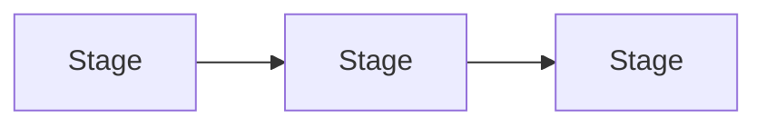

# 2. Framing the system

<!--
  This is the section that prevents the rest of the chapter from being a list of
  techniques. Establish the cost model, the invariant, or the taxonomy that every
  later section refers back to. If sections 03 to 06 do not point at something
  introduced here, this section is not doing its job.
-->

## What this actually is

Define the thing, and say what it is not. Compare it against the neighbouring idea
readers confuse it with, in a table.

| | This | The thing it gets confused with |
|---|---|---|
| Decides what at runtime | | |
| Fails how | | |
| Costs what | | |

## The cost model

The one piece of arithmetic the whole chapter derives from, with units and a worked
number, not just symbols.

$$
\text{total} = \text{term}_1 + \text{term}_2
$$

Worked once, with the numbers from section 1, so the reader sees the magnitude:

- term 1: ... = X
- term 2: ... = Y
- total: Z, which is the number every later section is trying to move.

## The shape of a design

Name the levers. Each of sections 03 to 06 takes one and goes deep on it.
