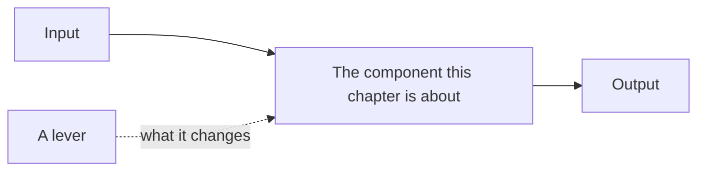

# Chapter Title

<!--
  Copy this folder to book/your-slug/ and delete every HTML comment.
  Then add the chapter to the table in book/README.md under one of its ### group
  headings: that table is what the site's sidebar is generated from, so a chapter
  missing from it is a chapter with no navigation.

  Files: 01, 02, then your own 03 to 06, then 07, 08, 09, 10 as named here. The
  fixed positions are the point. A reader who has finished one chapter knows where
  the production writeups and the interview questions are in every other one.
-->

> **Style note.** Keep or rewrite this note. It exists so a reader knows what kind
> of document they are in: teach-first, one idea per figure, an interviewer dialogue
> to open, and a cost model that the rest of the chapter derives from.

An interviewer rarely says "explain X." They say **"..."**, the symptom-first version
of the question. Open with that sentence, then name the one entry point that makes
the rest of the chapter follow: the quantity, the cost model, or the constraint every
later section refers back to.

## Sections

1. [Clarifying the requirements](01-clarifying-requirements.md) -- the dialogue that scopes the problem.
2. [Framing the system](02-frame-the-system.md) -- what this thing is, and the shape of a design.
3. [Your first deep dive](03-first-deep-dive.md) -- the mechanism the chapter is really about.
4. ... -- sections 04 to 06 are yours to name, same shape as 03.
5. ...
6. ...
7. [How teams do it in production](07-how-teams-do-it-in-production.md) -- named companies, divergence table, first-party links.
8. [Interview Q&A](08-interview-qa.md) -- commonly asked, tricky, and commonly answered wrong.
9. [Summary](09-summary.md) -- one-page recap, mermaid, test-yourself, further reading.
10. [Putting it together: the complete build](10-putting-it-together.md) -- the default stack, the scenario costed end to end, the same system under two other constraint sets, and a runnable reference.

## The whole system on one page

Read the sections in order the first time. They build on each other. Each opens with
the question an interviewer actually asks, then answers it.

<!--
  Figures go in this folder's assets/ and are referenced as assets/fig-name.png.
  Every image reference must resolve to a file that exists, and CI checks it.
-->
