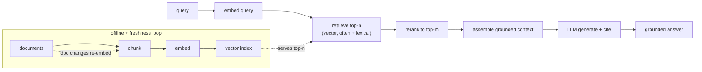
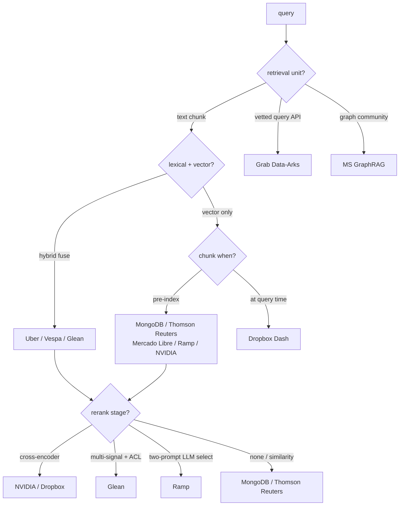
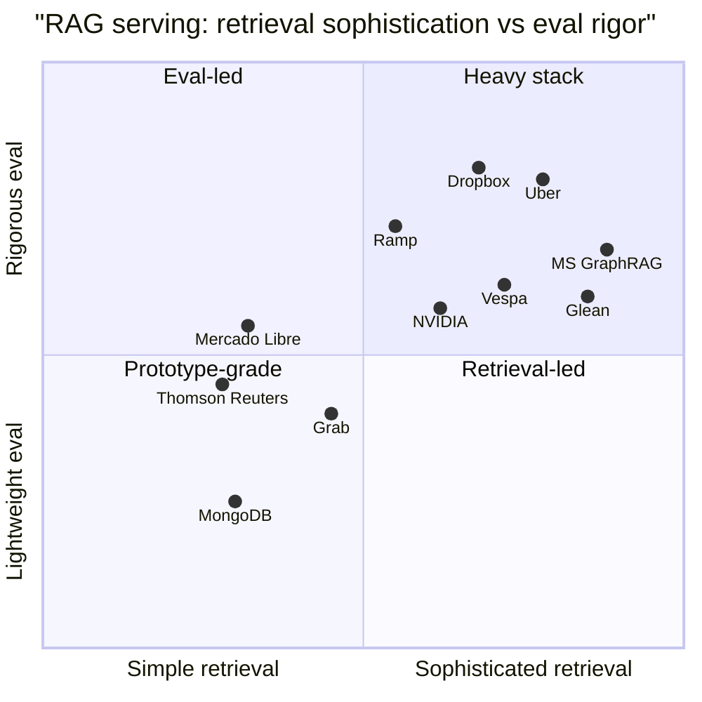

**What they share.** Every team embeds the query, retrieves candidate context from an index, assembles a tight grounded prompt, and lets the LLM answer so knowledge updates without retraining; they diverge on the retrieval unit (chunk, query API, graph community, table) and on how hard they push fusion, reranking, and eval.

**The reference pipeline.** Before the divergences, fix the skeleton every design starts from. Online, a query is embedded, matched against the index, reranked down to a short shortlist, packed into a grounded context, and generated with citations. Offline, the corpus is chunked, embedded, and indexed on a freshness loop that re-embeds only changed documents. Everything below is a variation on which stage gets the investment.

**The choices, side by side.**

| Decision | Options (who) | What decides it |
| --- | --- | --- |
| Retrieval strategy | vector-only (MongoDB, Thomson Reuters, Mercado Libre, Ramp, NVIDIA); hybrid vec+BM25 (Uber, Vespa, Glean, Dropbox); query-API RAG (Grab); knowledge graph (MS, Glean) | whether exact terms and jargon matter, and if the corpus is docs, queries, or entities |
| Chunking and freshness | pre-index chunks (MongoDB, Thomson Reuters, Mercado Libre, Ramp); query-time chunk (Dropbox); sync + webhooks (Dropbox); non-parametric store updated live (Thomson Reuters); LLM-enriched offline (Uber) | index churn vs query latency, and how fast source data changes |
| Reranking | none / similarity-only (MongoDB, Thomson Reuters); cross-encoder (NVIDIA, Dropbox); two-prompt LLM select (Ramp); multi-signal permission-aware (Glean); community summaries (MS) | cost budget per query and how noisy first-stage recall is |
| Grounding and eval | verify-before-use (MongoDB); provenance citations (Thomson Reuters, MS); LLM-as-judge (Uber, Dropbox); accuracy@k tuning (Ramp, Vespa); stakeholder approval (Mercado Libre); source P/R/F1 (Dropbox, Glean) | regulated domains need provenance; open-ended needs a judge; enumerable labels use accuracy@k |

**The math that separates them.**

$$\text{recall@}k = \frac{1}{|Q|}\sum_{q \in Q}\frac{|R_q^{k}\cap G_q|}{|G_q|}$$

$$\text{RRF}(d) = \sum_{r\in\lbrace \text{bm25}, \text{vec}\rbrace }\frac{1}{k_{\text{rrf}} + \text{rank}_r(d)}$$

$$F_1^{\text{source}} = \frac{2 P R}{P+R},\qquad P = \frac{\text{relevant retrieved}}{\text{retrieved}},\quad R = \frac{\text{relevant retrieved}}{\text{relevant}}$$

$$C_{\text{rerank}} \approx \frac{1}{75} C_{\text{gen}} \ \Rightarrow\ \text{keep top-}m \ll n \text{ candidates before generation}$$

$$\text{sim}(q, d) = \frac{\langle e_q, e_d \rangle}{\Vert e_q \Vert \ \Vert e_d \Vert}, \qquad R_q^{k} = \text{top-}k \ \text{by} \ \text{sim}(q, \cdot)$$

$$n_{\text{chunks}} = \left\lceil \frac{L}{s - o} \right\rceil, \qquad T_{\text{prompt}} \approx m \cdot s + T_{\text{query}}$$

$$Q_{\text{e2e}} \ \le \ \text{recall@}k \ \times \ Q_{\text{gen} \mid \text{retrieved}}$$

**Interview watch-outs.** The questions that recur across these systems, and the answer that separates a shallow pass from a real one.

- **Retrieval recall is the ceiling, not the generator.** Trap: "recall is low, so we need a stronger LLM." Wrong: swap the generator or turn up its context window and hope. Right: recall@k upper-bounds end-to-end quality ($Q_{\text{e2e}} \le \text{recall@}k \times Q_{\text{gen}}$), so if the right chunk was never retrieved, no generator recovers it. Look at chunking and the embedding model first, and measure retrieval recall separately from answer correctness (Dropbox source F1, NVIDIA two-stage).

- **Chunking is a design decision, not a default.** Trap: "fixed 512-token chunks" stated in one breath. Wrong: split mid-sentence or mid-table, destroying the embedding and the answer. Right: chunk on structure first (headings, paragraphs, code, tables), size-cap second, add overlap so boundary-spanning answers survive, and state the tradeoff: smaller chunks raise precision but need more of them, larger chunks dilute the vector and inflate prompt cost ($T_{\text{prompt}} \approx m \cdot s$). Uber tags table-bearing chunks so the splitter cannot cut a table mid-row.

- **Lost in the middle: more context is not more quality.** Trap: "just stuff the top 50 chunks in, the model will find it." Wrong: a long prompt buries the relevant passage, raises latency and cost, and can lower accuracy. Right: rerank hard and keep a tight top-m; a cross-encoder over the shortlist costs roughly one seventy-fifth of the generator per passage ($C_{\text{rerank}} \approx \tfrac{1}{75} C_{\text{gen}}$), so fewer, higher-precision chunks cut cost and dilution at once (NVIDIA, Dropbox).

- **Grounding and abstention beat confident wrong.** Trap: always answer. Wrong: return a fluent answer even when the top rerank score is weak, inviting hallucination. Right: abstain below a score threshold, instruct the model to cite chunk IDs, and verify each cited chunk actually appears in the assembled prompt before returning. Treat retrieved text as data, not instructions (prompt-injection from a wiki page is a real attack surface).

- **Eval is two evals, wired to a regression gate.** Trap: "we tried some queries and it looked good." Wrong: report one end-to-end accuracy number. Right: build a retrieval eval (recall@k against labeled query-doc pairs) and an answer eval (groundedness and correctness, LLM-as-judge plus a human sample), and gate any change to chunking, embedding, or prompt on both. Open-ended sensemaking needs multi-axis grading (MS GraphRAG: comprehensiveness, diversity, faithfulness), not a single scalar.

- **Access control constrains retrieval, so enforce it inside search.** Trap: filter permissions after retrieval. Wrong: post-filter the top-k, which both leaks and empties results when the visible set is small. Right: push per-user ACLs into the vector search so results come back pre-authorized (Glean permission-aware ranking); the scariest RAG bug is a correct, well-cited answer sourced from a document the asker should never see.
