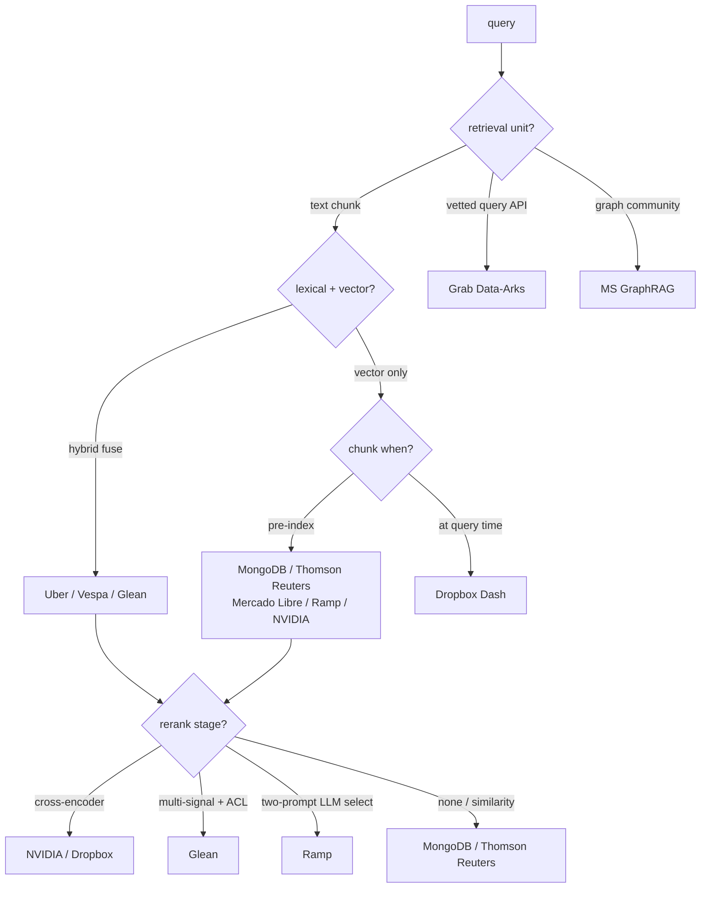
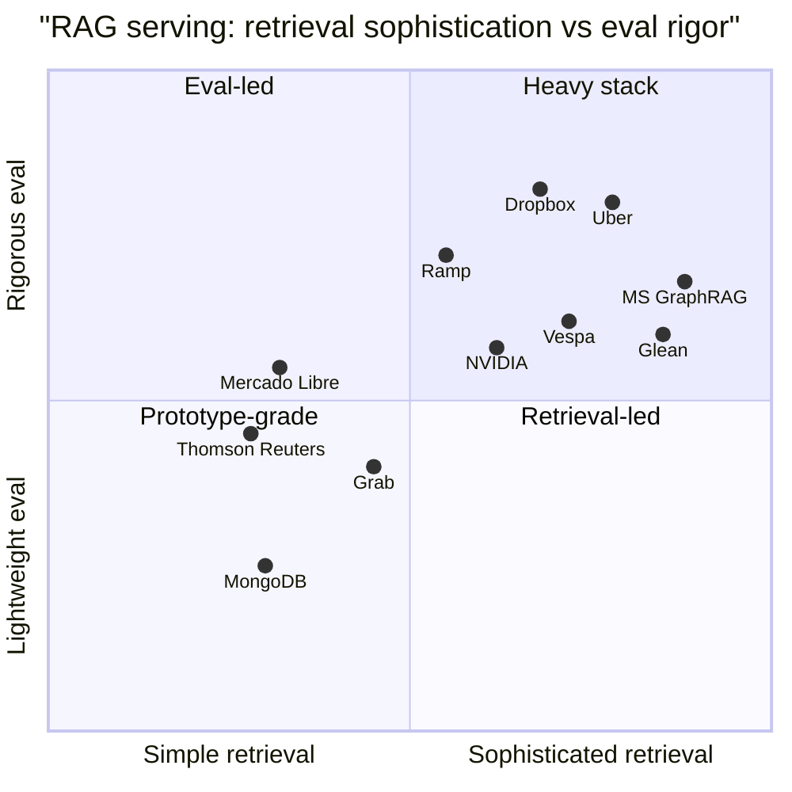

**What they share.** Every team embeds the query, retrieves candidate context from an index, assembles a tight grounded prompt, and lets the LLM answer so knowledge updates without retraining; they diverge on the retrieval unit (chunk, query API, graph community, table) and on how hard they push fusion, reranking, and eval.

**The choices, side by side.**

| Decision | Options (who) | What decides it |
| --- | --- | --- |
| Retrieval strategy | vector-only (MongoDB, Thomson Reuters, Mercado Libre, Ramp, NVIDIA); hybrid vec+BM25 (Uber, Vespa, Glean, Dropbox); query-API RAG (Grab); knowledge graph (MS, Glean) | whether exact terms and jargon matter, and if the corpus is docs, queries, or entities |
| Chunking and freshness | pre-index chunks (MongoDB, Thomson Reuters, Mercado Libre, Ramp); query-time chunk (Dropbox); sync + webhooks (Dropbox); non-parametric store updated live (Thomson Reuters); LLM-enriched offline (Uber) | index churn vs query latency, and how fast source data changes |
| Reranking | none / similarity-only (MongoDB, Thomson Reuters); cross-encoder (NVIDIA, Dropbox); two-prompt LLM select (Ramp); multi-signal permission-aware (Glean); community summaries (MS) | cost budget per query and how noisy first-stage recall is |
| Grounding and eval | verify-before-use (MongoDB); provenance citations (Thomson Reuters, MS); LLM-as-judge (Uber, Dropbox); accuracy@k tuning (Ramp, Vespa); stakeholder approval (Mercado Libre); source P/R/F1 (Dropbox, Glean) | regulated domains need provenance; open-ended needs a judge; enumerable labels use accuracy@k |

**The math that separates them.**

$$\text{recall@}k = \frac{1}{|Q|}\sum_{q \in Q}\frac{|R_q^{k}\cap G_q|}{|G_q|}$$

$$\text{RRF}(d) = \sum_{r\in\lbrace \text{bm25}, \text{vec}\rbrace }\frac{1}{k_{\text{rrf}} + \text{rank}_r(d)}$$

$$F_1^{\text{source}} = \frac{2 P R}{P+R},\qquad P = \frac{\text{relevant retrieved}}{\text{retrieved}},\quad R = \frac{\text{relevant retrieved}}{\text{relevant}}$$

$$C_{\text{rerank}} \approx \frac{1}{75} C_{\text{gen}} \ \Rightarrow\ \text{keep top-}m \ll n \text{ candidates before generation}$$

