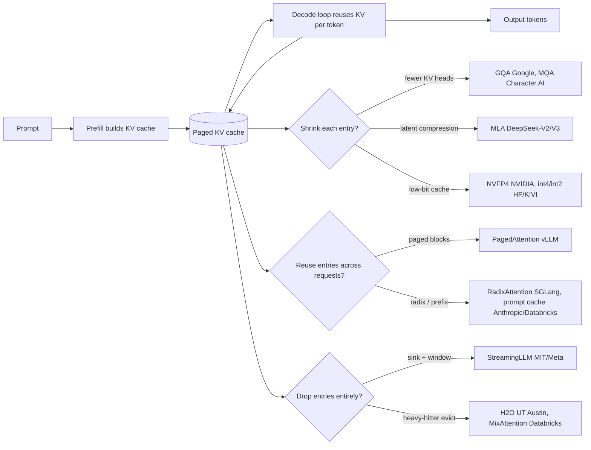
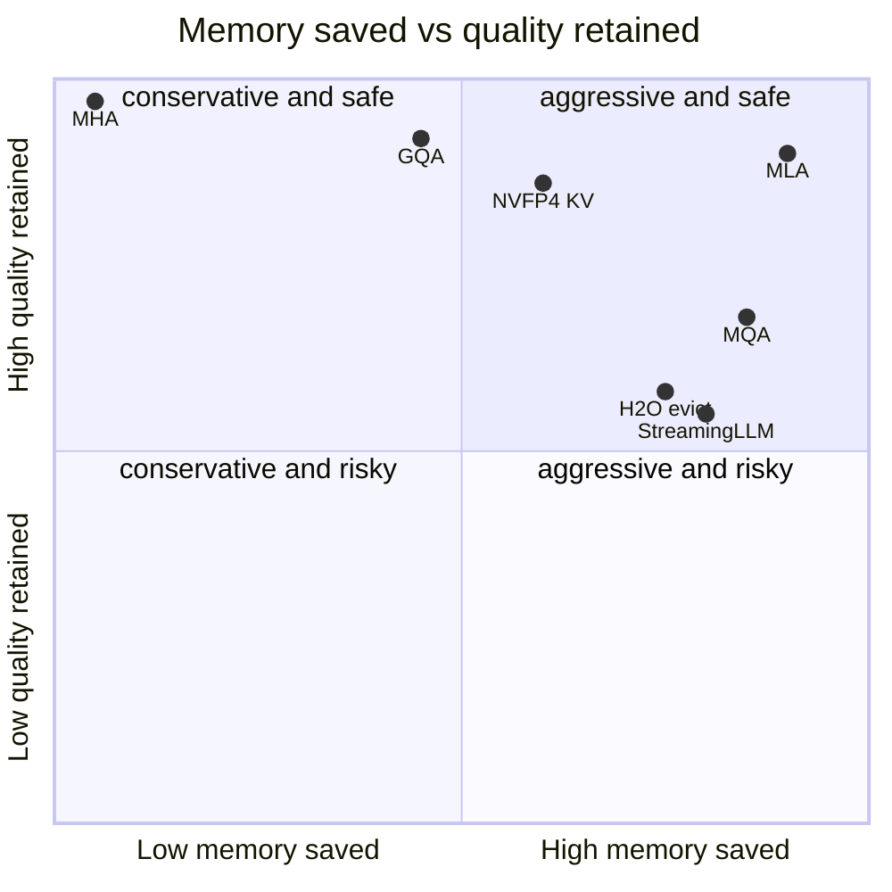

**What they share.** Every system runs one two-phase loop: prefill builds a KV cache once, then decode reuses that cache one token at a time, memory-bandwidth bound. All the divergence is in how each entry is shrunk, reused, or dropped against the same `kv_bytes` formula.

**The choices, side by side.**

| Decision | Options (who) | What decides it |
| --- | --- | --- |
| attention KV sharing | `MHA` (baseline) vs `GQA` (Google, Llama-3) vs `MLA` (DeepSeek) vs `MQA` (Character.AI) | how much of the `kv_heads` term you cut vs quality floor; MLA is train-time, GQA converts cheaply, MQA is most aggressive |
| memory management | `paged` (vLLM) vs `radix/prefix cache` (SGLang, Anthropic, Databricks) vs `eviction` (StreamingLLM, H2O) | reuse across requests when prefixes repeat; drop when the middle is expendable; page when fragmentation is the wall |
| quantization | `NVFP4 4-bit` (NVIDIA) vs `int8 native` (Character.AI) vs `int4/int2 per-token` (HF, KIVI) | memory headroom vs eval-gated quality; native-int8 needs custom kernels, PTQ needs per-channel scales |
| cross-layer / window sharing | `sliding window` (Databricks MixAttention, Character.AI 5-of-6) vs `cross-layer KV reuse` (Character.AI 2-3x, MA-Pairs) vs `full attention` (MHA) | long-range recall vs cache size; keep full-attention layers deep, cap sharing or reading-comprehension regresses |

**The math that separates them.**

**KV cache bytes (the term everyone attacks):**
$$ \mathrm{kv\_bytes} \approx 2 \cdot L \cdot S \cdot h_{kv} \cdot d_{head} \cdot b \cdot B $$

**GQA sharing ratio (32 query, 8 KV heads):**
$$ r_{GQA} = \frac{h_{kv}}{h_q} = \frac{8}{32} = \frac{1}{4} $$

**MLA latent compression (cache $d_c$, not K and V):**
$$ r_{MLA} = \frac{d_c}{2 \cdot h_{kv} \cdot d_{head}} \approx 0.07 \quad (\text{about } 93\% \text{ smaller}) $$

**Low-bit KV vs FP8 (NVFP4 halves memory):**
$$ r_{quant} = \frac{b_{lo}}{b_{hi}} = \frac{4}{8} = \frac{1}{2} \Rightarrow 2\times \text{ context, batch, concurrency} $$

