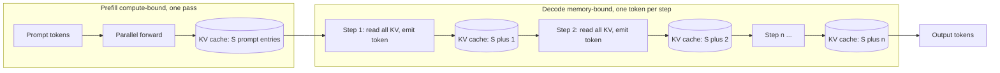
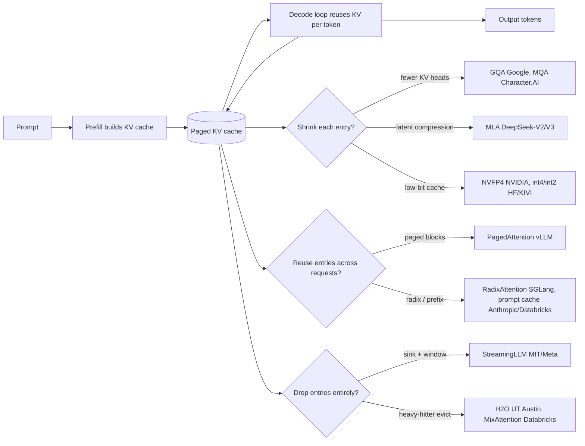
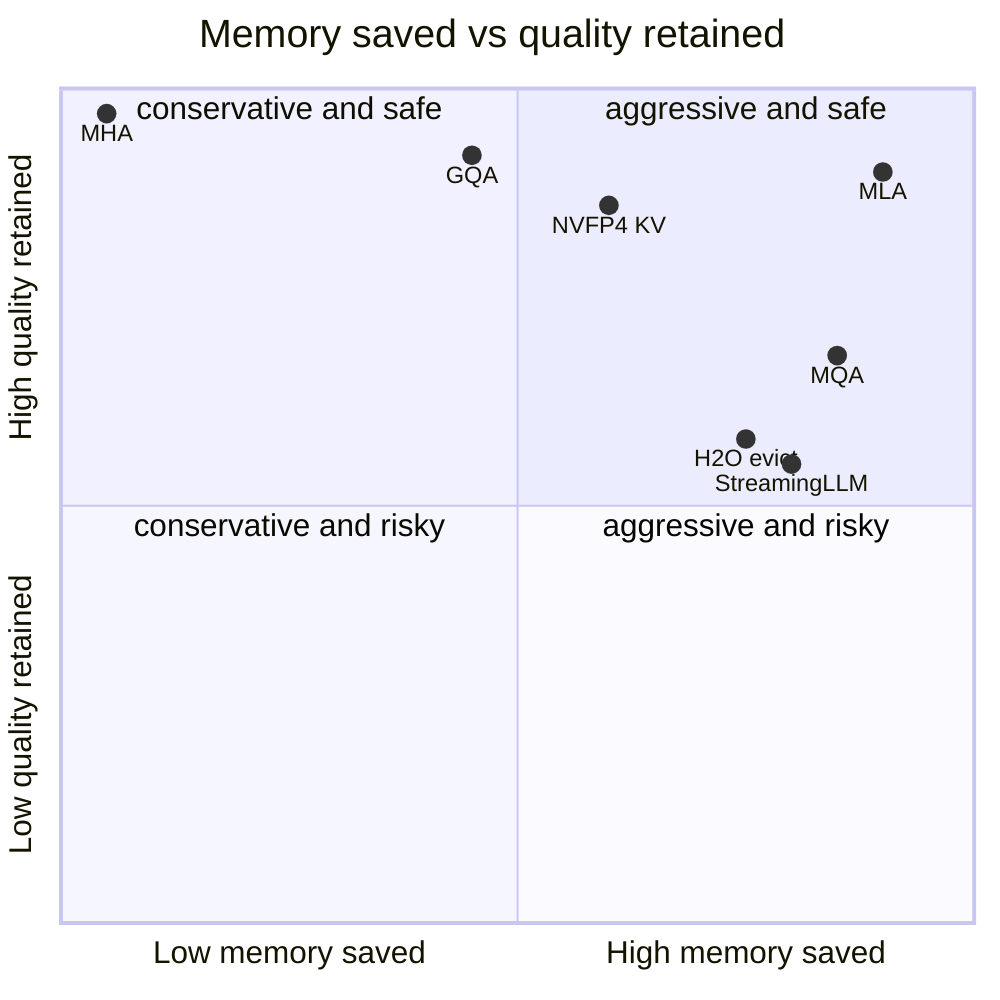

**What they share.** Every system runs one two-phase loop: prefill builds a KV cache once, then decode reuses that cache one token at a time, memory-bandwidth bound. All the divergence is in how each entry is shrunk, reused, or dropped against the same `kv_bytes` formula.

**The reference pipeline.** Prefill is compute-bound: it processes the whole prompt in parallel and fills the cache in one pass, setting first-token latency. Decode is memory-bandwidth-bound: each step reads the entire model plus the whole cache to emit one token, then appends one K and one V entry, so the cache grows by one slot per step and inter-token latency tracks cache size.

**Reading the diagram.** Follow it left to right as one request. In the prefill box the whole prompt enters at once, a single parallel forward pass runs, and the KV cache is filled with one entry per prompt token, which sets first-token latency and is compute-bound because the same weight read is amortized across the entire prompt. Cross into the decode box and the loop takes over: each step reads every model weight plus the entire cache to emit one token, then appends one key and one value, so the cache grows by one slot per step (prompt length, then prompt length plus one, plus two, and so on) and inter-token latency climbs with it. The key decision is diagnosing which phase is the wall, since decode is memory-bandwidth-bound at roughly two FLOPs per byte read while prefill is compute-bound, and the failure mode on long context is that the cache, not the weights, dominates GPU memory and eventually forces an out-of-memory under load. That growing cache is the design leverage: paging it into fixed blocks (vLLM PagedAttention) packs more concurrent sequences into HBM, shrinking each entry (GQA at Google, MLA at DeepSeek, low-bit KV at NVIDIA) cuts the per-slot cost, and reusing the prefill work across requests (prefix caching at Anthropic and Databricks, RadixAttention at SGLang) skips rebuilding the cache when a system prompt or document repeats. Every arrow after the cache node is one of these three moves bolted onto the same loop.

**How they diverge.**

**The choices, side by side.**

| Decision | Options (who) | What decides it |
| --- | --- | --- |
| attention KV sharing | `MHA` (baseline) vs `GQA` (Google, Llama-3) vs `MLA` (DeepSeek) vs `MQA` (Character.AI) | how much of the `kv_heads` term you cut vs quality floor; MLA is train-time, GQA converts cheaply, MQA is most aggressive |
| memory management | `paged` (vLLM) vs `radix/prefix cache` (SGLang, Anthropic, Databricks) vs `eviction` (StreamingLLM, H2O) | reuse across requests when prefixes repeat; drop when the middle is expendable; page when fragmentation is the wall |
| quantization | `NVFP4 4-bit` (NVIDIA) vs `int8 native` (Character.AI) vs `int4/int2 per-token` (HF, KIVI) | memory headroom vs eval-gated quality; native-int8 needs custom kernels, PTQ needs per-channel scales |
| cross-layer / window sharing | `sliding window` (Databricks MixAttention, Character.AI 5-of-6) vs `cross-layer KV reuse` (Character.AI 2-3x, MA-Pairs) vs `full attention` (MHA) | long-range recall vs cache size; keep full-attention layers deep, cap sharing or reading-comprehension regresses |

**The math that separates them.**

**KV cache bytes (the term everyone attacks):**
$$ \mathrm{kv\_bytes} \approx 2 \cdot L \cdot S \cdot h_{kv} \cdot d_{head} \cdot b \cdot B $$
where `L` is layers, `S` is sequence length, `h_kv` is KV heads, `d_head` is head dim, `b` is bytes per element, `B` is batch. Worked example: `L=32`, `S=100000`, `h_kv=8`, `d_head=128`, `b=2` (FP16), `B=1` gives about `2 x 32 x 100000 x 8 x 128 x 2 = 13.1` GB for a single 100k-token sequence, which is why long context, not weights, fills the GPU.

**GQA sharing ratio (32 query, 8 KV heads):**
$$ r_{GQA} = \frac{h_{kv}}{h_{q}} = \frac{8}{32} = \frac{1}{4} $$
so the cache drops to one quarter of MHA; the group size `h_q / h_kv = 4` is the direct quality-versus-memory dial.

**MLA latent compression (cache `d_c`, not K and V):**
$$ r_{MLA} = \frac{d_{c}}{2 \cdot h_{kv} \cdot d_{head}} \approx 0.07 \quad (\text{about } 93\% \text{ smaller}) $$

**Low-bit KV vs FP8 (NVFP4 halves memory):**
$$ r_{quant} = \frac{b_{lo}}{b_{hi}} = \frac{4}{8} = \frac{1}{2} \Rightarrow 2\times \text{ context, batch, concurrency} $$

**Decode arithmetic intensity (why decode is memory-bound):**
$$ I_{decode} = \frac{\mathrm{FLOPs}}{\mathrm{bytes\ read}} \approx \frac{2 \cdot N_{active}}{2 \cdot N_{active} + \mathrm{kv\_bytes}} \ll I_{roofline} $$
Per decode step you read every active weight (`N_active` params) and the whole KV cache but do only about `2` FLOPs per byte read, far below the hundreds of FLOPs per byte a modern GPU needs to be compute-bound. Prefill amortizes the same weight read across `S` tokens at once, so its intensity is roughly `S` times higher and it lands compute-bound. That gap is the entire reason KV-cache size, not raw compute, sets decode cost.

**Interview watch-outs.**

- **Decode is memory-bound, prefill is compute-bound.** Say this explicitly and back it with the arithmetic-intensity ratio above: decode reads the whole model plus cache to emit one token (about 2 FLOPs per byte), prefill amortizes that read across the whole prompt. The fix you pick depends on which phase is the wall, so profile prefill versus decode before optimizing.
- **KV cache, not weights, dominates long context.** Plug real numbers into `kv_bytes`; a single 100k-token sequence can cost more than 10 GB. Interviewers want to see you reach for `h_kv`, `d_head`, and `b` (GQA, MLA, quantization) rather than shrinking the model.
- **Paged attention raises concurrency, not single-request latency.** PagedAttention kills fragmentation so more sequences pack into HBM; it buys aggregate tokens per second, and the win only materializes when there are queued requests to fill the freed memory. Do not claim it speeds one request.
- **Quantization tradeoffs are eval-gated, and format and target matter.** NVFP4 halves memory versus FP8 and dequantizes to FP8 before the attention math to hold accuracy; low-bit formats differ (NVFP4 beats MXFP4 by finer block scaling), keys are often more sensitive than values, and low-bit schemes keep a full-precision recent window. Never ship 4-bit KV on vibes; gate on your own long-context eval.
- **Prefix and prompt caching skip prefill, so they help long-prompt short-output shapes.** Exact-prefix matching means one differing early token misses the whole cache, so put the stable system prompt and shared docs first; multi-tenant caches must be isolated and are volatile, so hit rate is workload-dependent (a 30% hit can still yield large throughput gains).
- **Eviction and windowing trade recall for a fixed budget.** StreamingLLM sinks plus a sliding window stream to millions of tokens but genuinely lose the middle; H2O keeps recent plus heavy-hitters; MixAttention needs full-attention layers placed deep. All of these can regress on reading comprehension and retrieval, so validate on those tasks, not just commonsense.
