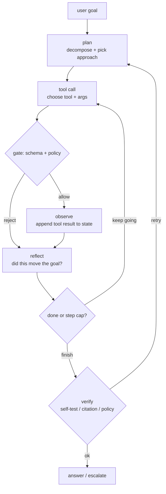
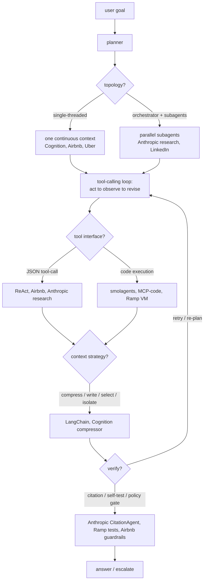
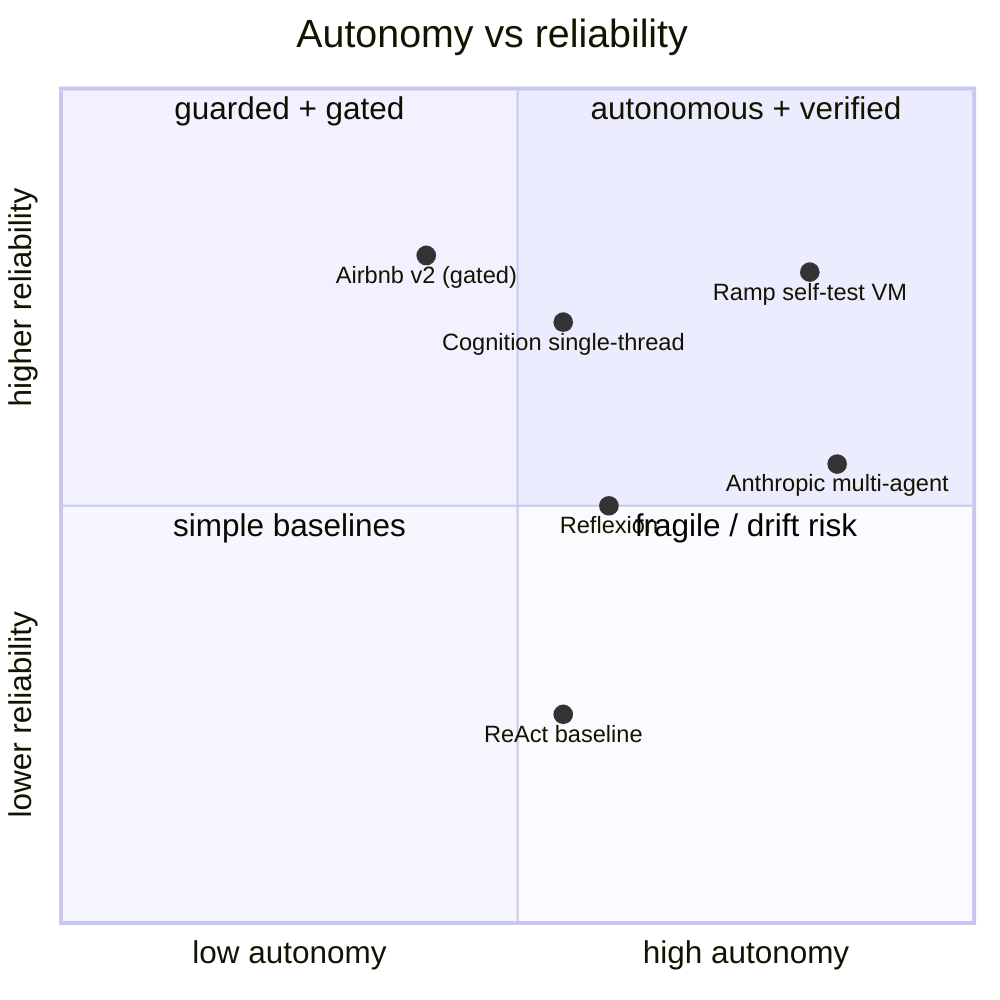

**What they share.** Every system turns a user goal into a plan, then runs a tool-calling loop that acts, observes, and revises with managed context, bolting on a verification pass before the answer ships. They split on whether one context holds the whole job or an orchestrator fans work to parallel subagents.

**The reference pipeline.** Strip away the vendor names and every design is the same four-beat loop: plan the approach, call a tool, observe the result, reflect on whether it moved the goal, then either loop again or answer. Verification wraps the exit, and a hard step cap wraps the whole thing so a wandering loop cannot run forever.

**The choices, side by side.** Where the reference loop stays fixed, the productionized systems diverge on topology, planning style, tool interface, and memory.

**The choices in a table.**

| Decision | Options (who) | What decides it |
| --- | --- | --- |
| topology | `single-agent loop` (Cognition, Airbnb, Uber) vs `orchestrator + parallel subagents` (Anthropic research, LinkedIn) vs `escalate-when-needed` (OpenAI guide) | Can one context hold the job? Separable subtasks needing isolated windows favor fan-out; coherent decision chains favor single-threaded. |
| planning | `ReAct` reactive next-step (Yao et al.) vs `Reflexion` self-critique retry (Shinn et al.) vs `plan-then-execute` (Anthropic lead agent, Airbnb CoT loop) | Known task shape and cost predictability favor plan-first; open-ended favors reactive; a clear success signal to learn from favors Reflexion. |
| tool / verification | `JSON tool-calls + gate` (Airbnb Tool Manager, ReAct) vs `code execution in sandbox` (smolagents E2B, Ramp Modal VM, Anthropic MCP-code) vs `citation pass` (Anthropic CitationAgent) | Many tools or large results waste tokens on JSON round-trips, so code wins; state-changing writes need a deterministic policy gate, not a prompt. |
| memory / context | `compress` (Cognition distiller, Claude Code auto-compact) vs `write + select` external memory (LangChain, Uber RAG) vs `isolate` separate windows (Anthropic subagents, LinkedIn siloed stores) | Transcript nearing the limit forces compression; recurring facts favor external write-then-retrieve; token-heavy blobs favor isolation. |

**The math that separates them.**

$$\textbf{context growth per turn:}\quad T_n = T_0 + \sum_{i=1}^{n}\bigl(a_i + o_i\bigr)$$

where $T_0$ is the system prompt plus goal, $a_i$ is the model's action tokens on step $i$, and $o_i$ is the observed tool-result tokens. The sum is why every step re-pays for the whole history at prefill.

$$\textbf{per-turn context cost:}\quad C_n = p\cdot T_{n-1} + p\cdot a_n^{in} + g\cdot a_n^{out}$$

with prefill price $p$ and generation price $g$: the $p\cdot T_{n-1}$ term grows linearly in $n$, so a long loop is dominated by re-reading its own transcript unless you compress or prefix-cache.

$$\textbf{per-task cost:}\quad C = \sum_{s=1}^{S}\Bigl(p\,(T_{s-1} + I_s) + g\,O_s\Bigr)$$

summed over $S$ loop steps, with $I_s$ input and $O_s$ output tokens for step $s$: this is the number an interviewer wants bounded by a step cap.

$$\textbf{multi-agent token multiple:}\quad \frac{C_{multi}}{C_{single}} \approx k \cdot \bar{r} \quad(\text{Anthropic: about } 15\times)$$

for $k$ subagents each doing $\bar{r}$ relative work: parallel fan-out buys wall-clock latency, not tokens.

$$\textbf{MoE active fraction:}\quad f_{active} = \frac{\text{top-}k}{E},\qquad C_{token} \propto f_{active}$$

a cheaper per-token reasoning step (top-$k$ of $E$ experts) compounds across every call in the loop.

$$\textbf{verified success:}\quad P_{ship} = P_{task}\cdot\bigl(1 - (1 - P_{catch})^{R}\bigr)$$

task success $P_{task}$ times the chance one of $R$ verification retries catches the error ($P_{catch}$ per pass): more retries raise ship quality but multiply cost by roughly $R$.

$$\textbf{error compounding:}\quad P_{ok}(n) = \prod_{i=1}^{n} q_i \le q^{\,n}$$

with per-step success $q_i$ (bounded above by the worst step $q$): an $n$-step loop at $q = 0.95$ per step lands near $0.95^{n}$, so a 10-step task is already below $0.60$ without gates that stop a bad step from propagating.

**Interview watch-outs.**
- **Single vs multi-agent is a judgment signal.** Default to one well-tooled agent and reach for an orchestrator only when subtasks are genuinely separable or need isolated context windows. Saying "multi-agent" reflexively reads as hype; naming the 15x token multiple and the hard-to-debug join step reads as experience.
- **Error compounding is the reason loops fail, not model quality.** Per-step success below 1 multiplies out ($q^{n}$), so a long horizon quietly rots. The fix is gates and checkpoints between steps so one bad step cannot propagate, plus a step cap as the runaway backstop.
- **Cost is steps times growing transcript, not a flat per-call price.** The prefill term $p\cdot T_{n-1}$ rises every turn. Control it with summarization / compression, prefix caching of the system prompt, and model tiering (cheap model for routing, expensive one only for the hard decision).
- **Latency and cost are different knobs.** Parallel tool calls and subagent fan-out cut wall-clock time but raise tokens; compression and tiering cut tokens. Do not conflate "faster" with "cheaper" in the same breath.
- **Verification must be code where money moves.** A policy gate in deterministic code (schema, limit, authorization) beats a prompt that says "only refund under $50", because tool results are untrusted and prompt injection rides in through them. Self-tests and citation passes cover correctness; the gate covers safety.
- **Bound everything and make it auditable.** A hard step cap and token budget per task are non-negotiable, and every step (reasoning, proposed call, gate decision, result) should be logged so the loop is debuggable and the eval can score end-to-end task success plus per-step tool choice.
