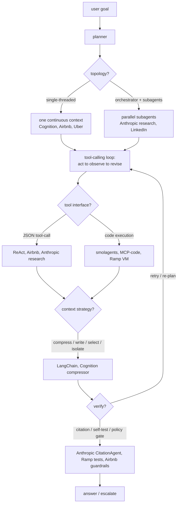
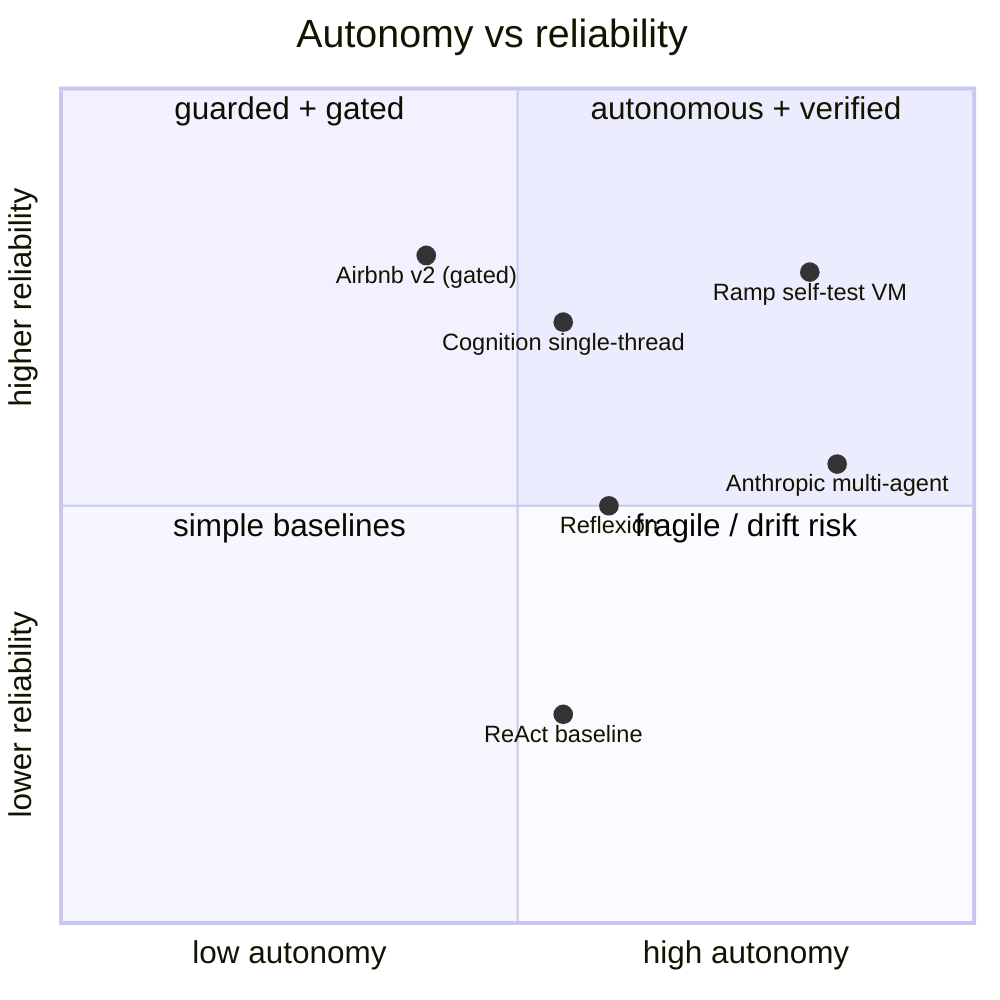

**What they share.** Every system turns a user goal into a plan, then runs a tool-calling loop that acts, observes, and revises with managed context, bolting on a verification pass before the answer ships. They split on whether one context holds the whole job or an orchestrator fans work to parallel subagents.

**The choices, side by side.**

| Decision | Options (who) | What decides it |
| --- | --- | --- |
| topology | `single-agent loop` (Cognition, Airbnb, Uber) vs `orchestrator + parallel subagents` (Anthropic research, LinkedIn) vs `escalate-when-needed` (OpenAI guide) | Can one context hold the job? Separable subtasks needing isolated windows favor fan-out; coherent decision chains favor single-threaded. |
| planning | `ReAct` reactive next-step (Yao et al.) vs `Reflexion` self-critique retry (Shinn et al.) vs `plan-then-execute` (Anthropic lead agent, Airbnb CoT loop) | Known task shape and cost predictability favor plan-first; open-ended favors reactive; a clear success signal to learn from favors Reflexion. |
| tool / verification | `JSON tool-calls + gate` (Airbnb Tool Manager, ReAct) vs `code execution in sandbox` (smolagents E2B, Ramp Modal VM, Anthropic MCP-code) vs `citation pass` (Anthropic CitationAgent) | Many tools or large results waste tokens on JSON round-trips, so code wins; state-changing writes need a deterministic policy gate, not a prompt. |
| memory / context | `compress` (Cognition distiller, Claude Code auto-compact) vs `write + select` external memory (LangChain, Uber RAG) vs `isolate` separate windows (Anthropic subagents, LinkedIn siloed stores) | Transcript nearing the limit forces compression; recurring facts favor external write-then-retrieve; token-heavy blobs favor isolation. |

**The math that separates them.**

$$\textbf{context growth per turn:}\quad T_n = T_0 + \sum_{i=1}^{n}\bigl(o_i + a_i\bigr)$$

$$\textbf{per-ticket cost:}\quad C = \sum_{s=1}^{S} p\,(T_{s-1} + I_s) + g\,O_s$$

$$\textbf{multi-agent token multiple:}\quad \frac{C_{multi}}{C_{single}} \approx k \cdot \bar{r} \;\;(\text{Anthropic: about }15\times)$$

$$\textbf{MoE active fraction:}\quad f_{active} = \frac{\text{top-}k}{E},\qquad C_{token} \propto f_{active}$$

$$\textbf{verified success:}\quad P_{ship} = P_{task}\cdot\bigl(1 - (1 - P_{catch})^{R}\bigr)$$

