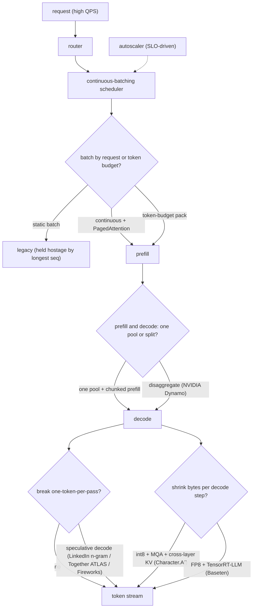
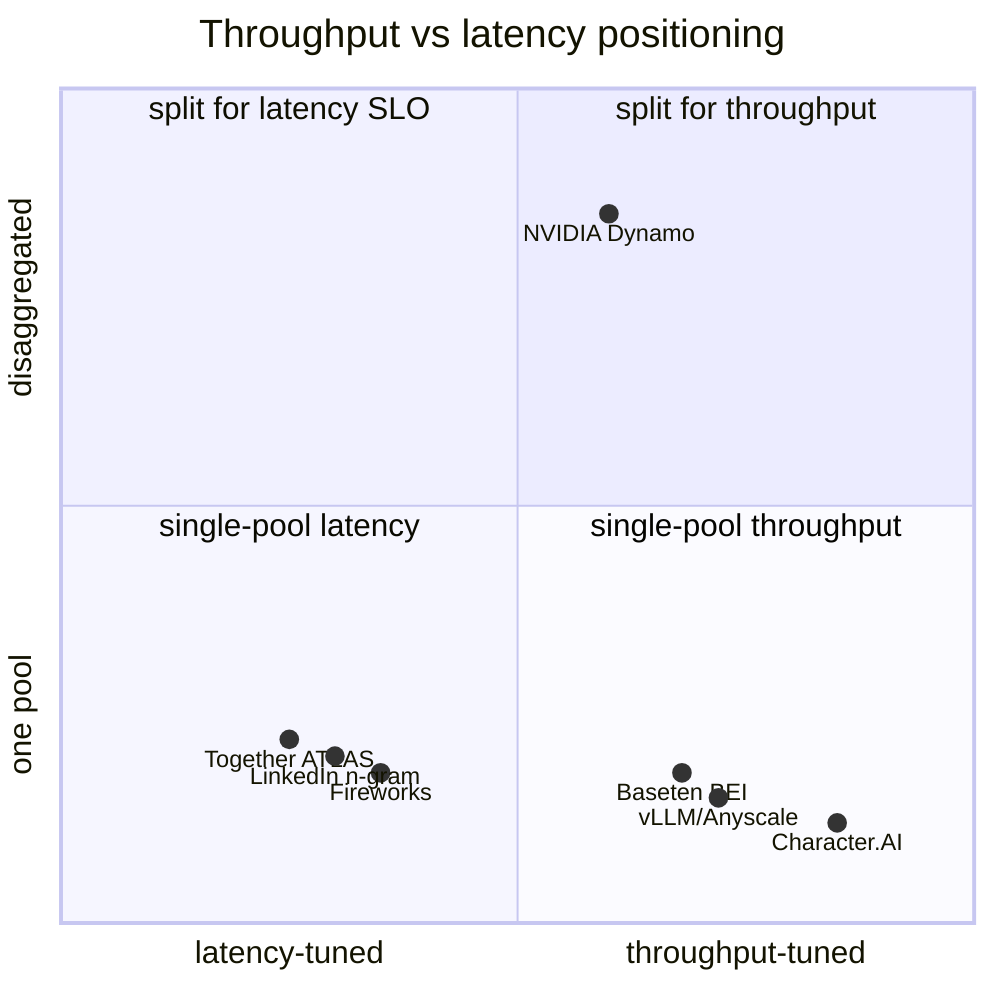

**What they share.** Every stack lands a request on a router, feeds a continuous (iteration-level) batching scheduler that reshapes the batch each token step, runs prefill then memory-bandwidth-bound decode, and streams tokens back while an SLO-driven autoscaler adds or drops replicas. What differs is only which stage each team pushed hardest.

**The choices, side by side.**

| Decision | Options (who) | What decides it |
| --- | --- | --- |
| batching | `continuous` + PagedAttention (vLLM/Anyscale) vs `static` vs `token-budget pack` (Baseten BEI) | Output-length variance: high variance rewards iteration-level scheduling; variable prompt length rewards packing to a token budget over a request count |
| latency lever | `speculative decoding` (LinkedIn n-gram, Together ATLAS, Fireworks) vs `disaggregated prefill/decode` (NVIDIA Dynamo) | Draft acceptance rate vs whether prefill and decode SLOs genuinely conflict; disaggregation needs fast interconnect for the KV handoff |
| parallelism | TP (in-node, per-layer all-reduce) vs PP (across nodes, stage boundaries) vs EP (MoE expert sharding) | TP for latency and to fit the model on fast links; PP to scale past a node; EP once experts outnumber a GPU |
| quantization | `int8` weight + KV (Character.AI) vs `FP8` on H100 (Baseten, Modal) vs `4-bit` for fit / cold-start | Decode is bandwidth-bound so fewer bytes read = more tokens/s; every precision drop passes a quality eval (Baseten holds cosine similarity > 99%) |

**The math that separates them.**

$$\textbf{decode step time} \approx \frac{P \cdot b_w + N \cdot \text{KV}_{\text{bytes}}}{\text{HBM bandwidth}}$$

$$\textbf{KV-cache bytes per token} = 2 \cdot L \cdot n_{kv} \cdot d_{head} \cdot b_{kv}$$

$$\textbf{speculative acceptance speedup} = \frac{1 - \alpha^{k+1}}{(1 - \alpha) (1 + c k)}$$

$$\textbf{arithmetic intensity vs roofline} \ \Rightarrow\ \text{tokens/s} = \min\left(\frac{\text{FLOPs}}{\text{op count}},\ \frac{\text{bandwidth}}{\text{bytes moved}}\right)$$

where $P$ = weight params, $b_w$ = weight bytes/param, $N$ = batched sequences, $L$ = layers, $n_{kv}$ = KV heads (MQA drives to 1), $b_{kv}$ = KV bytes/element, $\alpha$ = draft acceptance rate, $k$ = draft length, $c$ = per-token verify overhead.

