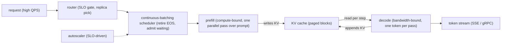
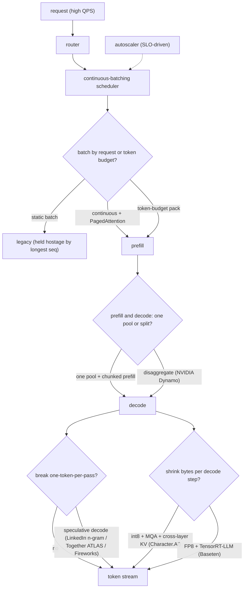
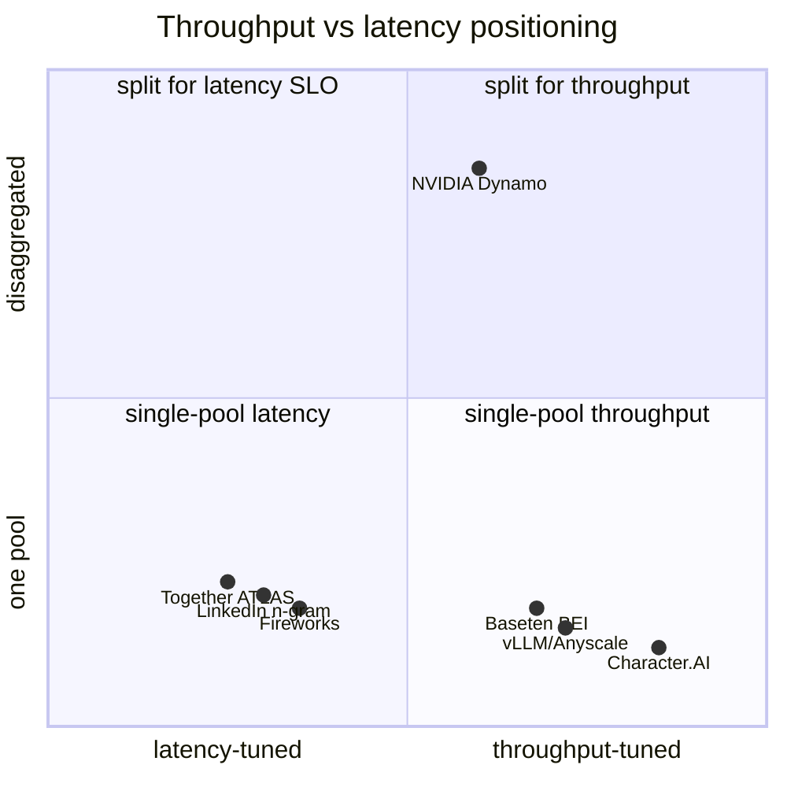

**What they share.** Every stack lands a request on a router, feeds a continuous (iteration-level) batching scheduler that reshapes the batch each token step, runs prefill then memory-bandwidth-bound decode, and streams tokens back while an SLO-driven autoscaler adds or drops replicas. What differs is only which stage each team pushed hardest.

**The reference pipeline.** Strip the branding and every system is the same skeleton: a request lands on a router, joins a continuous-batching scheduler that reshapes the batch every token step, runs a compute-bound prefill that fills the KV cache, then loops the bandwidth-bound decode that reads weights plus the growing KV cache once per token, and streams tokens out. The KV cache is the shared spine every optimization touches (paging, sharing, quantizing, offloading, or handing it off between disaggregated pools).

**Reading the diagram.** The router is the SLO gate: it picks a replica and, under overload, sheds load with a 429-style backpressure signal so the tail stays bounded rather than admitting work that makes every request miss its target. The continuous-batching scheduler is the throughput engine, reshaping the batch at each token step by retiring finished sequences and admitting waiting ones, which keeps the GPU saturated instead of held hostage by the longest member of a static batch (Anyscale's vLLM is the canonical example). Prefill is compute-bound and runs one parallel pass over the whole prompt, while decode is bandwidth-bound and emits one token per pass by reading the full weights plus KV cache, so the core tension is throughput versus latency: bigger batches win tokens per second but stretch p99 inter-token latency, and a long prefill sharing the pool spikes that latency unless it is chunked or the two phases are disaggregated onto separate pools (NVIDIA Dynamo, Microsoft Splitwise). The KV cache is the shared spine every lever touches, so paging, quantizing, sharing, and offloading it (Character.AI leans hardest here) is what sets how many concurrent sequences one GPU can hold. Speculative decoding is the main way to break the one-token-per-pass floor, drafting several tokens cheaply and verifying them in a single parallel pass without changing the output distribution (LinkedIn, Together, Fireworks), though it goes net-negative when acceptance is low or the batch already saturates the GPU. The token stream then flows back over SSE or gRPC while an SLO-driven autoscaler adds or drops replicas, so the design leverage is choosing which single stage to push hardest for a given workload rather than optimizing all of them at once.

**The divergence.** Same skeleton, but each team pushed one stage hardest. This is where the systems split.

**The choices, side by side.**

| Decision | Options (who) | What decides it |
| --- | --- | --- |
| batching | `continuous` + PagedAttention (vLLM/Anyscale) vs `static` vs `token-budget pack` (Baseten BEI) | Output-length variance: high variance rewards iteration-level scheduling; variable prompt length rewards packing to a token budget over a request count |
| latency lever | `speculative decoding` (LinkedIn n-gram, Together ATLAS, Fireworks) vs `disaggregated prefill/decode` (NVIDIA Dynamo) | Draft acceptance rate vs whether prefill and decode SLOs genuinely conflict; disaggregation needs fast interconnect for the KV handoff |
| parallelism | TP (in-node, per-layer all-reduce) vs PP (across nodes, stage boundaries) vs EP (MoE expert sharding) | TP for latency and to fit the model on fast links; PP to scale past a node; EP once experts outnumber a GPU |
| quantization | `int8` weight + KV (Character.AI) vs `FP8` on H100 (Baseten, Modal) vs `4-bit` for fit / cold-start | Decode is bandwidth-bound so fewer bytes read = more tokens/s; every precision drop passes a quality eval (Baseten holds cosine similarity over 99%) |

**The math that separates them.**

$$\textbf{arithmetic intensity} = \frac{\text{FLOPs performed}}{\text{bytes moved from HBM}}$$

$$\textbf{roofline tokens/s} = \min\!\left(\frac{\text{peak FLOPs}}{\text{FLOPs per token}},\ \frac{\text{HBM bandwidth}}{\text{bytes read per token}}\right)$$

Prefill has high arithmetic intensity (one parallel pass over many prompt tokens amortizes the weight read) so it sits on the compute side of the roofline. Decode has intensity near 1 (it reads the whole model to emit a single token) so it sits on the bandwidth side. That single fact drives every lever below.

$$\textbf{decode step time} \approx \frac{P \cdot b_w + N \cdot \text{KV}_{\text{bytes}}}{\text{HBM bandwidth}} \qquad \text{tokens/s} = \frac{1}{\text{decode step time}}$$

$$\textbf{weight-read floor} = \frac{P \cdot b_w}{\text{HBM bandwidth}} \quad \text{(per step, paid even at batch size 1)}$$

$$\textbf{KV-cache bytes per token} = 2 \cdot L \cdot n_{kv} \cdot d_{head} \cdot b_{kv}$$

$$\textbf{expected tokens per target pass} = \frac{1 - \alpha^{k+1}}{1 - \alpha}$$

$$\textbf{speculative speedup} = \frac{1 - \alpha^{k+1}}{(1 - \alpha)\,(1 + c\,k)}$$

where $P$ = weight params, $b_w$ = weight bytes/param, $N$ = batched sequences, $L$ = layers, $n_{kv}$ = KV heads (MQA drives to 1), $d_{head}$ = head dim, $b_{kv}$ = KV bytes/element, $\alpha$ = draft acceptance rate, $k$ = draft length, $c$ = per-token verify overhead as a fraction of a target step. The weight-read floor is why batching helps: it is amortized across all $N$ sequences in the batch, so throughput climbs with batch size until the KV term or compute catches up. Speculative speedup goes net-negative when $\alpha$ is low enough that $(1 + c\,k)$ outweighs the tokens gained (Fireworks measured a generic draft at $\alpha \approx 0.29$ slowing inference $1.5\times$).

**Interview watch-outs.**

- **Throughput and latency are one knob, not two.** Tokens/sec/GPU is the cost metric; p99 TTFT and p99 TPOT are the SLO metrics, and bigger batches trade the second for the first. Say which one the question optimizes before you reach for a lever, and quote goodput (requests that met SLO) rather than raw throughput when there is a latency ceiling.
- **Continuous batching is the scheduling win, PagedAttention is the memory win.** Do not fold them into one "23x" claim: iteration-level scheduling gets roughly 8x by retiring finished sequences and admitting waiting ones every token step; PagedAttention adds the non-contiguous KV blocks that cut memory waste below 4%. Against optimized static batching the honest number is closer to 5-6x.
- **Speculative decoding is a latency optimization, never a quality trade.** Correct rejection-sampling verification reproduces the target distribution exactly, so the win is entirely in the acceptance rate. It shines at low-to-moderate batch and can go net-negative at high batch (the GPU is already saturated, so verify overhead outweighs saved steps) or on novel text where drafts miss. Break-even is roughly where accepted tokens exceed $(1 + c\,k)$.
- **Disaggregate only when prefill and decode SLOs genuinely conflict.** Splitting the pools lets each phase pick its own parallelism (prefill low TP and compute-bound, decode high TP and bandwidth-bound) and stops prefill bursts from spiking TPOT, but it moves the KV cache between machines. Name the handoff cost: without NVLink or a fast fabric it becomes the new bottleneck. For one small model at moderate QPS, a single pool with chunked prefill is simpler and usually enough.
- **Quantization pays because decode is bandwidth-bound, not because it is "smaller."** Fewer weight bytes read per step is directly more tokens/s, and KV quantization additionally raises the batch size continuous batching can sustain. Every precision drop goes behind a quality eval before it ships (Baseten gates FP8 at cosine similarity over 99%), never on assumption.
- **Under overload, shed load rather than admit everything.** Reserve KV-cache budget per admitted sequence so a new admission cannot OOM the running ones, and return a 429-style signal with a retry hint so the tail stays bounded. Trying to serve every request is how p99 explodes for everyone; controlled rejection protects the ones already admitted.
