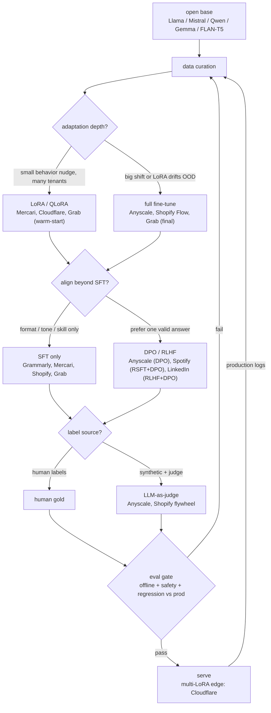
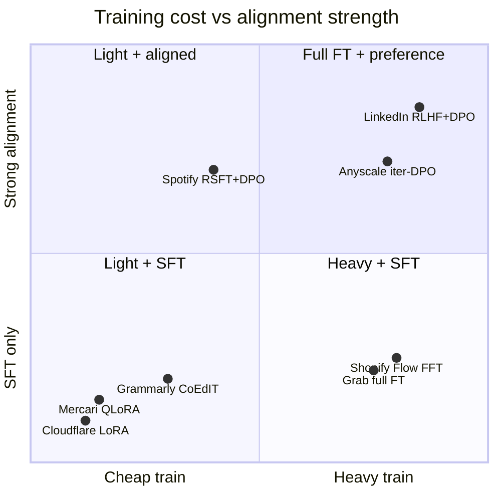

**What they share.** Every team rides one post-training spine (base to curated data to SFT to optional preference tuning to eval gate to serve) and differs only in which knobs the task forced them to turn. Most ship SFT alone; DPO/RLHF appears only where a quality axis SFT could not capture actually mattered.

**The choices, side by side.**

| Decision | Options (who) | What decides it |
| --- | --- | --- |
| adaptation | `full FT` (Anyscale, Shopify Flow) vs `LoRA` (Cloudflare, Grab warm-start) vs `QLoRA` (Mercari) | Behavior-shift size and serving economics: small nudge or many tenants goes LoRA/QLoRA; big shift or LoRA drifting OOD forces full FT. |
| alignment | `SFT only` (Grammarly, Mercari, Shopify, Grab) vs `DPO` (Anyscale, Spotify) vs `RLHF+DPO` (LinkedIn) | Is there a quality axis SFT cannot capture (prefer one valid answer, safety, tone)? If no, stop at SFT. |
| data curation | `dense human instruction set` (Grammarly) vs `templated pairs` (Mercari) vs `synthetic + LLM judge` (Anyscale, Shopify) vs `proprietary graph/domain` (LinkedIn, Grab) | Whether real production data exists yet, and whether the task axis can be scored automatically. |
| eval gate | `human pref vs generalist` (Grammarly) vs `BLEU vs API` (Mercari) vs `1% live activation rate` (Shopify) vs `Q&A accuracy + compression` (Anyscale) | Offline metrics overstate readiness; gate on the real product metric (live slice) before scaling traffic. |
| serving | `one tuned model` (Anyscale, Shopify) vs `4-bit PTQ small model` (Mercari) vs `multi-LoRA shared base` (Cloudflare) | Tenant count and cost target: many customers/domains push toward one warm base plus swappable adapters. |

**The math that separates them.**

**LoRA low-rank weight update:**

$$W = W_0 + \frac{\alpha}{r} B A, \quad B \in \mathbb{R}^{d \times r},\ A \in \mathbb{R}^{r \times k},\ r \ll \min(d,k)$$

**DPO preference loss (Anyscale, Spotify):**

$$\mathcal{L}_{DPO} = -\mathbb{E}_{(x,y_w,y_l)} \left[ \log \sigma \left( \beta \log \frac{\pi_\theta(y_w \mid x)}{\pi_{ref}(y_w \mid x)} - \beta \log \frac{\pi_\theta(y_l \mid x)}{\pi_{ref}(y_l \mid x)} \right) \right]$$

**RLHF KL-penalized objective (LinkedIn):**

$$\max_{\pi_\theta}\ \mathbb{E}_{x,\, y \sim \pi_\theta}\big[ r_\phi(x,y) \big] - \beta\, \mathrm{KL}\!\left[ \pi_\theta(y \mid x)\ \|\ \pi_{ref}(y \mid x) \right]$$

**QLoRA memory (Mercari, 4-bit frozen base):**

$$M \approx \underbrace{4\text{-bit} \cdot N_{base}}_{\text{frozen, }\sim 0.5\text{ byte/param}} + \underbrace{16\text{-bit} \cdot 2 r (d+k) L}_{\text{trainable adapter} \ll N_{base}}$$

