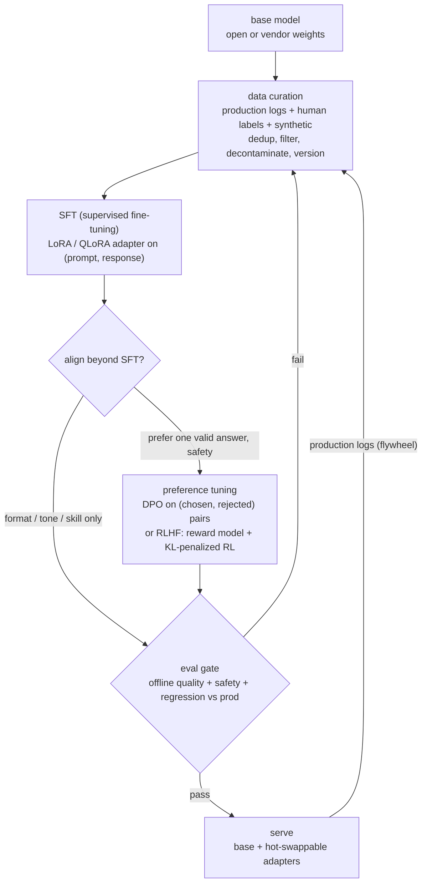
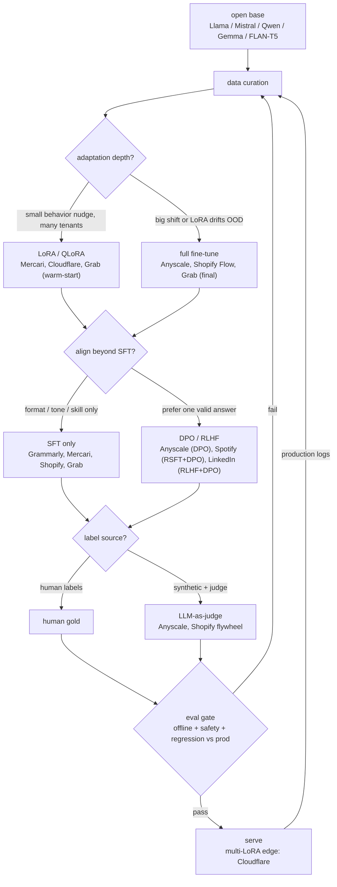
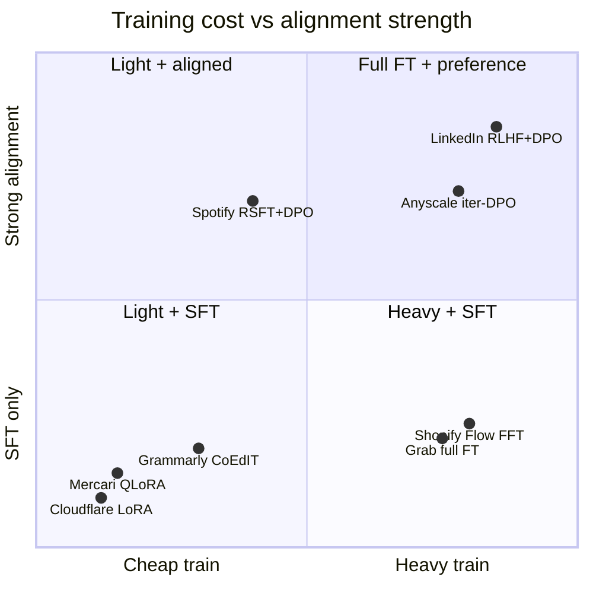

**What they share.** Every team rides one post-training spine (base to curated data to SFT to optional preference tuning to eval gate to serve) and differs only in which knobs the task forced them to turn. Most ship SFT alone; DPO/RLHF appears only where a quality axis SFT could not capture actually mattered.

**The reference pipeline.** The canonical shape is a loop, not a line: curate a small clean dataset, supervised fine-tune (usually a LoRA/QLoRA adapter), optionally align with DPO or RLHF, then gate every candidate on a held-out eval before it reaches a user. Production output feeds the next dataset version. Preference tuning is optional and comes after SFT, never instead of it.

**Reading the diagram.** Start at data curation: it blends production logs, human labels, and synthetic examples, then dedups, filters, decontaminates, and versions them, and this is the stage that decides everything downstream because the model imitates exactly what you show it, so a leaked eval set or a noisy few thousand pairs poisons every later step. SFT comes next as plain next-token training on (prompt, response) pairs, usually a LoRA or QLoRA adapter over a frozen base, and its failure mode is overfitting a narrow set into catastrophic forgetting, which you hold off with modest learning rates, one to three epochs, and a little general data mixed in. The align branch is a genuine decision, not a default: if you only need format, tone, or a missing skill you stop at SFT (Grammarly, Mercari, Shopify), and you reach for preference tuning only when a quality axis SFT cannot capture actually matters, DPO on (chosen, rejected) pairs (Anyscale, Spotify) or full RLHF with a reward model (LinkedIn), where the load-bearing knob is the KL or beta term that pins the policy near the reference so it cannot reward-hack into gibberish or sycophancy. The eval gate is the promotion authority: a candidate reaches users only if it clears offline quality, a safety and refusal pass rerun after any alignment step, and a regression check against current production, and a failure here routes straight back to curation rather than to a user. The design leverage is that the whole thing is a flywheel, with production logs feeding the next dataset version, so a mediocre first model plus a tight, well-gated loop beats a great first model with no feedback path.

**Where they diverge.** Given that spine, the real decisions are adaptation depth, whether to align past SFT, and the label source.

**The choices, side by side.**

| Decision | Options (who) | What decides it |
| --- | --- | --- |
| adaptation | `full FT` (Anyscale, Shopify Flow) vs `LoRA` (Cloudflare, Grab warm-start) vs `QLoRA` (Mercari) | Behavior-shift size and serving economics: small nudge or many tenants goes LoRA/QLoRA; big shift or LoRA drifting OOD forces full FT. |
| alignment | `SFT only` (Grammarly, Mercari, Shopify, Grab) vs `DPO` (Anyscale, Spotify) vs `RLHF+DPO` (LinkedIn) | Is there a quality axis SFT cannot capture (prefer one valid answer, safety, tone)? If no, stop at SFT. |
| data curation | `dense human instruction set` (Grammarly) vs `templated pairs` (Mercari) vs `synthetic + LLM judge` (Anyscale, Shopify) vs `proprietary graph/domain` (LinkedIn, Grab) | Whether real production data exists yet, and whether the task axis can be scored automatically. |
| eval gate | `human pref vs generalist` (Grammarly) vs `BLEU vs API` (Mercari) vs `1% live activation rate` (Shopify) vs `Q&A accuracy + compression` (Anyscale) | Offline metrics overstate readiness; gate on the real product metric (live slice) before scaling traffic. |
| serving | `one tuned model` (Anyscale, Shopify) vs `4-bit PTQ small model` (Mercari) vs `multi-LoRA shared base` (Cloudflare) | Tenant count and cost target: many customers/domains push toward one warm base plus swappable adapters. |

**The math that separates them.**

**LoRA low-rank weight update:**

$$W = W_0 + \frac{\alpha}{r} B A, \quad B \in \mathbb{R}^{d \times r},\ A \in \mathbb{R}^{r \times k},\ r \ll \min(d,k)$$

The base $W_0$ is frozen; only $B$ and $A$ train. Trainable parameters drop from $d k$ to $r(d+k)$, so at $r \ll \min(d,k)$ an adapter touches well under 1 percent of the matrix.

**DPO preference loss (Anyscale, Spotify):**

$$\mathcal{L}_{DPO} = -\mathbb{E}_{(x,y_w,y_l)} \left[ \log \sigma \left( \beta \log \frac{\pi_\theta(y_w \mid x)}{\pi_{ref}(y_w \mid x)} - \beta \log \frac{\pi_\theta(y_l \mid x)}{\pi_{ref}(y_l \mid x)} \right) \right]$$

A classification-style loss over (chosen $y_w$, rejected $y_l$) pairs, no separate reward model. The $\beta$ term controls how far the policy $\pi_\theta$ may move from the reference $\pi_{ref}$; small $\beta$ (Anyscale used 0.03) keeps it close and stable.

**RLHF KL-penalized objective (LinkedIn):**

$$\max_{\pi_\theta}\ \mathbb{E}_{x, y \sim \pi_\theta}\big[ r_\phi(x,y) \big] - \beta \, \mathrm{KL}\left[ \pi_\theta(y \mid x)\ \Vert \ \pi_{ref}(y \mid x) \right]$$

Maximize a learned reward $r_\phi$ while the KL penalty pins the policy near the SFT reference $\pi_{ref}$. Drop the KL term and the policy reward-hacks $r_\phi$ into degenerate text; this is the same $\pi_{ref}$-anchoring DPO folds into its loss in closed form.

**QLoRA memory (Mercari, 4-bit frozen base):**

$$M \approx \underbrace{4\text{-bit} \cdot N_{base}}_{\text{frozen, }\sim 0.5\text{ byte/param}} + \underbrace{16\text{-bit} \cdot 2 r (d+k) L}_{\text{trainable adapter} \ll N_{base}}$$

Quantizing the frozen base to roughly 0.5 byte per parameter is what fits a billions-parameter model plus its adapter on a single GPU.

**Interview watch-outs.**

- **Rank is not the knob you think.** LoRA rank $r$ bounds adapter capacity, but raising it rarely fixes a bad result; Anyscale's rank-64 LoRA lost to full fine-tune not for lack of rank but because the constrained subspace pushed token likelihoods out of distribution. Reach for full FT when the behavior shift is large, not for a bigger rank.
- **SFT overfits and forgets.** Over-training on a narrow set degrades general ability (catastrophic forgetting). Keep learning rates modest, epochs few (one to three), and mix in some general data; a small adapter perturbs the base less than a full re-train.
- **The KL / beta term is load-bearing.** In RLHF the KL penalty (and in DPO the $\beta$) is what stops the policy from drifting off the reference and reward-hacking into gibberish. Too small a $\beta$ over-steers into sycophancy or evasiveness; know that DPO's $\beta$ plays the same anchoring role as RLHF's explicit KL.
- **Data quality dominates volume.** A few thousand curated examples beat tens of thousands of scraped ones; the model imitates exactly what you show it, mistakes included. Dedup, balance, and decontaminate so the eval set never leaks into training, or the numbers are fiction.
- **Preference tuning can regress safety.** DPO/RLHF shifts what the model is willing to say, so re-run safety and refusal eval after alignment, not just task accuracy. Do not propose RLHF for a format-and-tone problem; that is over-engineering, and good SFT alone usually wins.
- **The flywheel can collapse.** Training on the model's own unfiltered output narrows diversity over time. Keep a human-labeled core, quarantine low-quality production logs through a calibrated judge, and gate every candidate on a held-out set before it ships.
