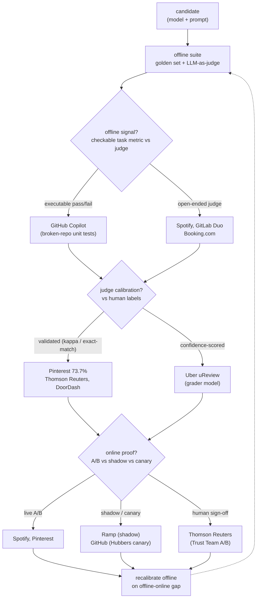
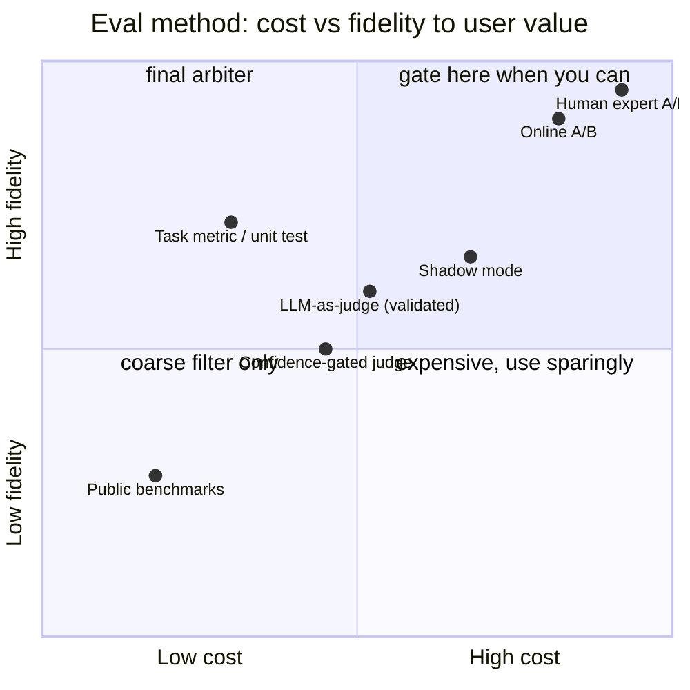

**What they share.** Every system runs the same two-loop skeleton: an offline suite (checkable task metrics plus an LLM-as-judge) gates the change, then an online loop checks the gate was honest and feeds back to recalibrate the judge. The judge is trusted only after it is validated against human labels.

**The choices, side by side.**

| Decision | Options (who) | What decides it |
| --- | --- | --- |
| offline signal | `golden set + task metric` (GitHub broken-repo pass/fail, GitLab Cosine/Cross similarity) vs `LLM-as-judge` (Spotify, Booking.com, Uber) | Is the answer checkable? Executable / labeled task uses a metric; open-ended (relevance, tone, faithfulness) needs a judge |
| judge calibration | `validated vs human` (Pinterest 73.7% exact-match, DoorDash, Thomson Reuters) vs `confidence-scored` (Uber uReview grader) vs `uncalibrated` (anti-pattern) | Failure cost and gate authority: high-stakes gating demands measured judge-human agreement before trust |
| online | `A/B` (Spotify, Pinterest) vs `shadow` (Ramp) vs `canary` (GitHub Hubbers) | Can the action run silently? Shadow needs mirrored traffic and yields no user signal; A/B needs throughput; canary needs a safe internal cohort |
| gating | `CI regression gate` (GitHub daily vs prod, GitLab daily CEF) vs `confidence threshold` (Uber, per assistant/lang/category) vs `human sign-off` (Thomson Reuters Trust Team) | Change cadence and blast radius: daily prompt edits need automated gates; irreversible legal output needs a human arbiter |

**The math that separates them.**

**Judge-human agreement (Cohen's kappa)**
$$\kappa = \frac{p_o - p_e}{1 - p_e}$$

**Retrieval / precision-recall (F1)**
$$F_1 = 2 \cdot \frac{\text{precision} \cdot \text{recall}}{\text{precision} + \text{recall}}$$

**Position-bias averaging (both orderings)**
$$s(A,B) = \tfrac{1}{2}\big[\, j(A \prec B) + \big(1 - j(B \prec A)\big) \,\big]$$

**Per-slice regression gate inequality**
$$\text{ship} \iff \min_{g \in \text{segments}} \big( s_g^{\text{cand}} - s_g^{\text{base}} \big) \ge -\,\epsilon, \quad \epsilon \sim \sigma_{\text{judge}}$$

