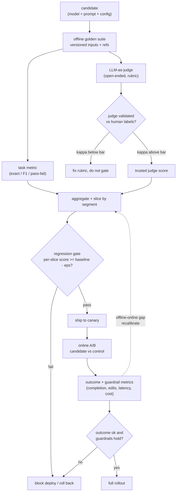
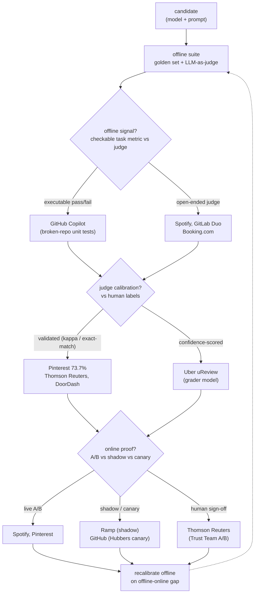
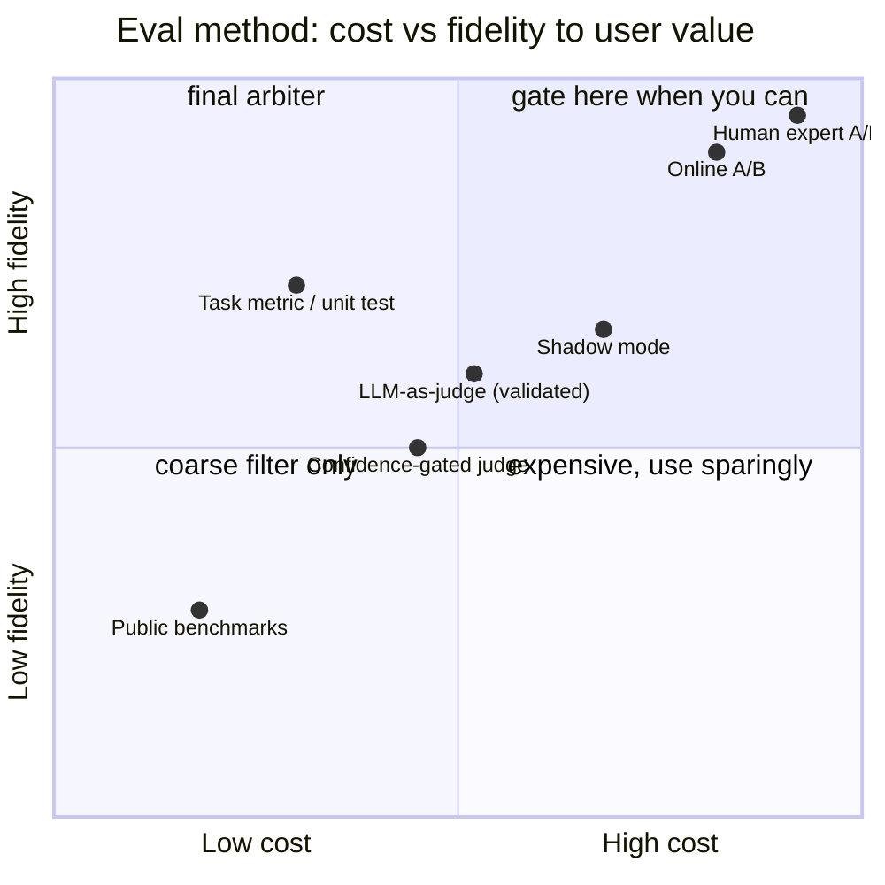

**What they share.** Every system runs the same two-loop skeleton: an offline suite (checkable task metrics plus an LLM-as-judge) gates the change, then an online loop checks the gate was honest and feeds back to recalibrate the judge. The judge is trusted only after it is validated against human labels.

**The reference pipeline.** Strip away the vendor names and one loop remains: a golden suite scores every candidate, a human-calibrated judge covers the open-ended cases, a regression gate blocks anything that drops below the baseline per slice, and only survivors reach an online A/B whose real outcome recalibrates the offline score.

**Reading the diagram.** Follow the arrows top to bottom as one candidate (model plus prompt plus config) earning the right to ship. The offline golden suite scores every candidate against versioned inputs, splitting into a deterministic task metric (exact match, F1, pass-fail) for checkable cases and an LLM-as-judge for the open-ended ones, and the judge branch is the first failure mode: it is only trusted after its agreement with human labels clears a bar, because an uncalibrated judge rewards longer, confident-sounding answers (verbosity bias) and lies about quality, so a low-agreement judge routes to fix-the-rubric rather than gating. The regression gate is the real decision point, comparing per-slice scores against baseline minus a tolerance so a change that lifts the average while tanking one segment (a language, a length bucket, a tier) still blocks, which is why GitHub daily-versus-prod and GitLab run it as CI, not a manual step. Survivors reach an online A/B where the candidate meets real traffic, because offline has no ground truth: the judge is structurally blind to task completion, user edits, session length, and cost, so Spotify and Pinterest treat the behavioral outcome plus guardrails as the tiebreaker and roll back on a miss. The dotted feedback edge is the leverage: a large offline-online gap recalibrates the suite rather than trusting the judge harder, which also defends against contamination, since a private, freshly-sampled golden set that keeps predicting the A/B result beats a famous public benchmark a model may have trained on. Design well here and most changes ship on the cheap offline gate alone, reserving the expensive A/B for the genuinely uncertain candidates.

**The choices, side by side.**

Below the shared skeleton, four decisions fork.

| Decision | Options (who) | What decides it |
| --- | --- | --- |
| offline signal | `golden set + task metric` (GitHub broken-repo pass/fail, GitLab Cosine/Cross similarity) vs `LLM-as-judge` (Spotify, Booking.com, Uber) | Is the answer checkable? Executable / labeled task uses a metric; open-ended (relevance, tone, faithfulness) needs a judge |
| judge calibration | `validated vs human` (Pinterest 73.7% exact-match, DoorDash, Thomson Reuters) vs `confidence-scored` (Uber uReview grader) vs `uncalibrated` (anti-pattern) | Failure cost and gate authority: high-stakes gating demands measured judge-human agreement before trust |
| online | `A/B` (Spotify, Pinterest) vs `shadow` (Ramp) vs `canary` (GitHub Hubbers) | Can the action run silently? Shadow needs mirrored traffic and yields no user signal; A/B needs throughput; canary needs a safe internal cohort |
| gating | `CI regression gate` (GitHub daily vs prod, GitLab daily CEF) vs `confidence threshold` (Uber, per assistant/lang/category) vs `human sign-off` (Thomson Reuters Trust Team) | Change cadence and blast radius: daily prompt edits need automated gates; irreversible legal output needs a human arbiter |

**The math that separates them.**

**Judge-human agreement (Cohen's kappa)**

Here `p_o` is the observed agreement rate between judge and human labels, and `p_e` is the agreement expected by chance from the label marginals. A judge is trusted for gating only once kappa clears a bar (Pinterest reports 73.7 percent exact match as its analog).

$$\kappa = \frac{p_o - p_e}{1 - p_e}$$

**Retrieval quality (precision, recall, F1)**

With `tp` true positives, `fp` false positives, `fn` false negatives at cutoff k, precision is the fraction of returned docs that are relevant and recall is the fraction of relevant docs returned. F1 is their harmonic mean, which stays low unless both are high.

$$\text{precision} = \frac{tp}{tp + fp}, \qquad \text{recall} = \frac{tp}{tp + fn}$$

$$F_1 = 2 \cdot \frac{\text{precision} \cdot \text{recall}}{\text{precision} + \text{recall}}$$

**Position-bias averaging (both orderings)**

Here `j(A before B)` is the judge probability that A wins when A is shown first. Averaging the score with the flipped ordering cancels the judge's fixed preference for whichever answer comes first.

$$s(A,B) = \tfrac{1}{2}\big[ j(A \prec B) + \big(1 - j(B \prec A)\big) \big]$$

**Per-slice regression gate inequality**

The candidate ships only if no segment `g` drops more than the tolerance `eps` below its baseline. Gating on the worst slice, not the average, is what stops a change that lifts the mean while tanking one segment. Set `eps` from the judge's measured variance `sigma`, never by guessing.

$$\text{ship} \iff \min_{g \in \text{segments}} \big( s_g^{\text{cand}} - s_g^{\text{base}} \big) \ge - \epsilon, \qquad \epsilon \sim \sigma_{\text{judge}}$$

**When to use which.**

Pick the offline signal, the calibration check, and the online proof by how checkable the task is and how much a bad ship costs.

| Reach for | When | Instead of |
|---|---|---|
| Task metric (exact match, F1, pass-fail) | The answer is checkable: executable tests or labeled outputs (GitHub broken-repo pass-fail) | An LLM-as-judge you would then have to calibrate |
| LLM-as-judge | Output is open-ended (relevance, tone, faithfulness) with no reference (Spotify, Booking.com) | A task metric that cannot score free text |
| Cohen's kappa gate | Before you let any judge block a deploy | Trusting an uncalibrated judge (Pinterest treats 73.7 percent exact match as the analog) |
| Precision, recall, F1 | Scoring retrieval or extraction where relevance is labeled | A judge on cases you can check deterministically |
| Position-bias averaging (both orderings) | A pairwise judge picks A vs B and order can leak | A single-ordering judge score that bakes in first-slot preference |
| Per-slice regression gate (worst segment) | Daily prompt edits where one segment can quietly fall off | Gating on the average, which hides a tanked language or tier |
| Online A/B | You have live throughput and can split traffic (Spotify, Pinterest) | Treating the offline score as proof of user value |
| Shadow mode | The action must run silently with no user-facing risk (Ramp) | A live A/B when you cannot expose the output yet |
| Canary or human sign-off | Blast radius is large or output is irreversible and regulated (GitHub Hubbers, Thomson Reuters) | An automated gate alone on high-stakes, non-reversible ships |

**Interview watch-outs.**

- **LLM-judge verbosity bias.** Judges reward longer, more confident-sounding answers even when they are not better. Optimizing hard against the judge (Goodhart) produces padded outputs the judge loves and users do not. Control for length in the rubric and keep the online edit/thumbs rate as the real tiebreaker.
- **No ground truth online.** Offline scores are a prediction, not proof. Name the online outcome metrics a judge is structurally blind to (task completion, user edits, session length, retention) and treat a large offline-online gap as the signal to recalibrate the suite, not to trust the judge harder.
- **Uncalibrated judge.** An LLM judge is a measurement instrument, and an uncalibrated instrument lies. Say you would collect a few hundred human labels and report judge-human agreement (Cohen's kappa) before gating anything, and fix the rubric first if it misses.
- **Contamination.** If eval cases or near-duplicates leaked into a model's training data, it looks great offline and fails in production. This is why a private, freshly-sampled golden set beats a famous public benchmark for gating your own feature, and why stage-one public benchmarks stay a coarse capability filter only.
- **Regression gates that only watch the average.** A single aggregate metric hides a segment that fell off a cliff. Gate per slice (language, length, tier, query type), keep a held-out set you never tune on, and set the tolerance from the judge's measured variance so noise does not flap the build.
- **Judge drift and position bias.** The judge is a hosted model that can change under you and favors whichever answer is shown first. Pin the judge model version, version the judge prompt, re-score a fixed calibration set to detect drift, and run both orderings averaged to cancel position bias.
