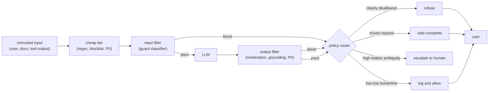
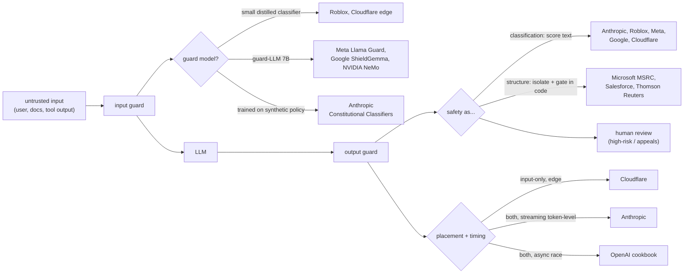
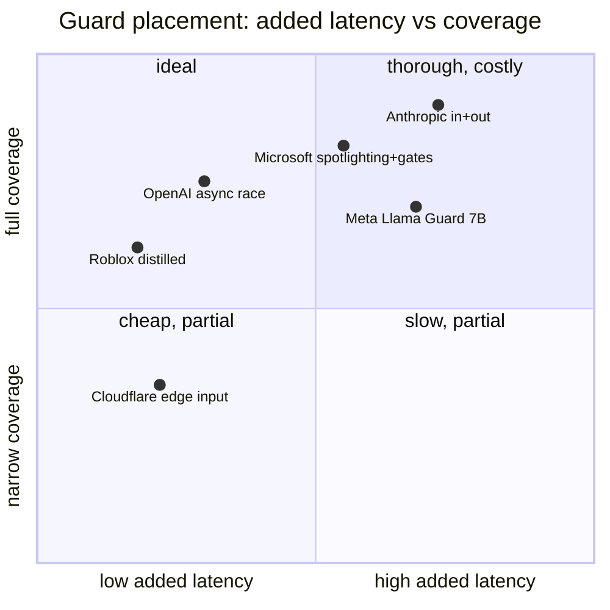

**What they share.** Every system wraps the model in a layered pipeline: untrusted input hits an input guard, the model runs, then output guards inspect the generation, with classifiers trained on the enforced policy and the highest-risk cases routed to humans. The differences are in where the effort concentrates, not in the skeleton.

**The reference pipeline.** Strip the branding and the same three-stage spine appears: an input filter scores the request, the model generates, an output filter scores the generation, and a policy router turns each verdict into refuse, safe-complete, escalate, or log. Deterministic checks run before the model-based ones so the expensive classifier only sees what survives the cheap tier.

**Reading the diagram.** Trace it left to right: untrusted input clears a cheap deterministic tier (regex, blocklist, PII patterns) so the expensive guard only sees survivors, then the input filter scores the request for policy and injection before the LLM ever runs, and after generation the output filter re-checks the completion for moderation, grounding, and leaked PII. The first design fork is the input filter itself: a small distilled classifier (Roblox at 750k RPS, Cloudflare at the edge) buys throughput, while a guard-LLM like Meta Llama Guard or Google ShieldGemma buys taxonomy flexibility, and a trained classifier stays a separate decision that a jailbroken base model cannot argue out of, whereas an LLM-judge inherits the same persuadability. The two guards defend different threats: the input side is where you catch a jailbreak or an indirect prompt injection riding in a retrieved document, and because you can never fully block injection the real leverage is structural isolation plus code-side action gates that shrink the blast radius (Microsoft spotlighting, Salesforce PII masking). Every box on this path is latency on the critical budget, so the cascade shape matters: cheap-to-expensive keeps most traffic off the guard-LLM, and an async race (OpenAI cookbook) hides the guard behind generation but only when generation has no side effects, since parallelism can leak an unsafe token or action before the verdict lands. Finally the policy router turns each verdict into refuse, safe-complete, escalate, or log rather than a blunt block, which is the lever that trades over-refusal against catch rate: aggressive thresholds route legitimate users around the product, so the honest metric is the benign refusal delta (Anthropic held it near 0.38 percent) alongside the adversarial catch number, and every decision fails closed and gets logged for tuning and audit.

**Where the systems diverge.**

**The choices, side by side.**

| Decision | Options (who) | What decides it |
| --- | --- | --- |
| guard model | `small distilled classifier` (Roblox 750k RPS, Cloudflare) vs `guard-LLM 7B` (Meta Llama Guard, Google ShieldGemma, NVIDIA NeMo) vs `synthetic-policy classifier` (Anthropic) | request volume and latency budget: billions/day forces distilled; taxonomy flexibility favors instruction-tuned 7B |
| placement | `input filter` (Cloudflare edge) vs `output filter` (Thomson Reuters grounding) vs `both` (Anthropic, Meta, Microsoft, Salesforce, NeMo) | trust boundary: input-only misses unsafe generations; RAG/agents need output grounding too |
| jailbreak / injection defense | `trained classifier` (Anthropic 86% to 4.4%) vs `spotlighting + code gates` (Microsoft) vs `PII masking + prompt defense` (Salesforce) vs `input blocklist-free zero-shot` (Cloudflare) | direct jailbreak yields to output classifiers; indirect injection needs structural isolation and least-privilege action gates |
| policy routing | `hard block` vs `safe-complete` vs `graded score` (OpenAI G-Eval 1-5, Grab likelihood tier) vs `escalate to human` (Roblox, Thomson Reuters) | stakes and false-positive cost: graded scores enable rewrite; regulated domains escalate ambiguity |
| latency hiding | `cascade cheap-to-expensive` (Grab, Meta) vs `async race vs generation` (OpenAI) vs `separate batched vLLM tier` (NeMo, Cloudflare 2s timeout) | critical-path budget; async leaks tokens before block fires, so it needs side-effect-free generation |

**The math that separates them.**

$$\textbf{Cascade expected cost: } \ \mathbb{E}[C] = c_{\text{cheap}} + p_{\text{escalate}} \cdot c_{\text{guardLLM}}$$

Most traffic clears on the cheap tier, so the expensive guard-LLM cost is paid only on the small escalated fraction. Roblox flags roughly 0.01 percent of messages, which is why a distilled front tier dominates the economics.

$$\textbf{Recall at fixed FPR operating point: } \ \text{Recall}@\text{FPR}=0.01 = \frac{TP}{TP+FN} \ \ \text{s.t.} \ \ \frac{FP}{FP+TN}=0.01$$

$$\textbf{Precision at a recall floor: } \ \text{Precision}@\text{Recall}=r_0 = \frac{TP}{TP+FP} \ \ \text{s.t.} \ \ \frac{TP}{TP+FN} \ge r_0$$

Fixing a recall floor (catch at least a fraction r0 of violations) and reading off precision tells you the over-block cost of that safety guarantee: low precision at the floor means most blocks are false alarms.

$$\textbf{Attack success under layered defense: } \ \text{ASR} = \prod_{i=1}^{L}\bigl(1 - r_i\bigr) \ \ \Rightarrow\ \ 0.86 \to 0.044$$

$$\textbf{KL-anchored refusal objective: } \ \max_{\pi} \ \mathbb{E}_{x \sim D}\bigl[R_{\text{safe}}(x, \pi)\bigr] - \beta \cdot \text{KL}\bigl(\pi \ \| \ \pi_{\text{ref}}\bigr)$$

The refusal reward pushes the policy to decline unsafe prompts, while the KL term to the reference model penalizes drift; a large beta keeps benign behavior intact, which is how Anthropic held the production refusal delta near 0.38 percent while cutting jailbreaks.

$$\textbf{Async race adds no wall clock: } \ T_{\text{total}} = \max\bigl(T_{\text{guard}}, T_{\text{gen}}\bigr) \ \ \text{vs series } \ T_{\text{guard}} + T_{\text{gen}}$$

**When to use which.**

Pick the guard model, the defense, and the timing by request volume, threat type, and how much latency the critical path can spare.

| Reach for | When | Instead of |
|---|---|---|
| Small distilled classifier | Billions of requests a day on a tight latency budget (Roblox 750k RPS, Cloudflare edge) | A 7B guard-LLM sitting on the hot path |
| Guard-LLM 7B | Taxonomy churns and volume is moderate (Meta Llama Guard, Google ShieldGemma, NVIDIA NeMo) | A distilled classifier that needs retraining per policy edit |
| Spotlighting plus code-side action gates | The threat is indirect prompt injection riding in retrieved content (Microsoft) | A text classifier, which a jailbroken model can argue past |
| Cascade expected cost E[C] | Most traffic is benign and the guard-LLM is expensive (Roblox flags 0.01 percent) | Running the guard-LLM on every request |
| Recall at fixed FPR, precision at a recall floor | Choosing a threshold and pricing the over-block cost of a safety guarantee | Quoting bare accuracy with no operating point |
| ASR product across layers | Reporting layered-defense strength (0.86 down to 0.044) | Claiming a single guard is sufficient |
| KL-anchored refusal objective | Training refusal without wrecking benign behavior (Anthropic held the delta near 0.38 percent) | Hard refusal tuning that spikes over-refusal |
| Async race (max, not sum) | Generation has no side effects and you want to hide guard latency (OpenAI cookbook) | Series checks that add wall clock, or async when mid-stream actions can leak |
| Escalate to human | High-stakes ambiguity or regulated output and appeals (Thomson Reuters, Roblox) | An automated hard block or safe-complete on irreversible decisions |

**Interview watch-outs.**

- **Classifier vs guard-LLM independence.** A trained classifier is a separate decision, so talking the base model out of its rules does not move the verdict. An LLM-judge guardrail (OpenAI cookbook, Meta Llama Guard) inherits the base model's persuadability, so do not claim independence for a guard that shares the same failure modes.
- **Jailbreak vs injection are different threats.** A jailbreak talks the model out of its safety behavior and yields to output classifiers plus refusal training. Indirect prompt injection rides in untrusted content and needs structural isolation plus code-side action gates. Saying "no prompt fully prevents injection, so I shrink the blast radius" is the signal.
- **Latency budget shapes the whole design.** Every guard is time on the critical path. Reach for a cascade (cheap tier first, guard-LLM only on ambiguous inputs), an async race, or a separate batched vLLM tier. State a budget (for example under 100ms p50 for the fast checks) rather than stacking model calls in series.
- **Async can leak side effects.** Racing the guard against generation only hides latency when generation has no side effects before the block fires. If the model can act mid-stream, parallelism can leak an unsafe action or surface unsafe tokens before the verdict lands.
- **Over-refusal is a real failure.** Report the benign refusal-rate delta, not just the adversarial catch rate; the 86 percent to 4.4 percent headline is on an adversarial set, and the 0.38 percent production refusal change is what proves low over-blocking. Aggressive thresholds route legitimate users around the product.
- **Fail closed, and log.** A guard that errors and silently allows the request is worse than no guard; default risky paths to caution on error. A 2s edge timeout returning partial results is a deliberate fail-open choice that must be intentional, and every block decision needs an audit trail to tune thresholds and defend the system.
