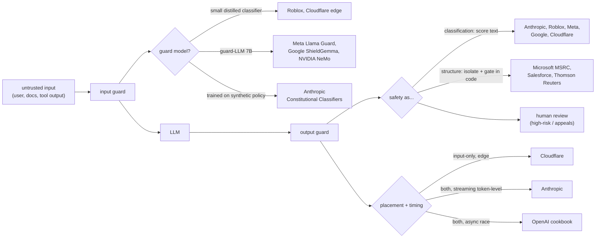
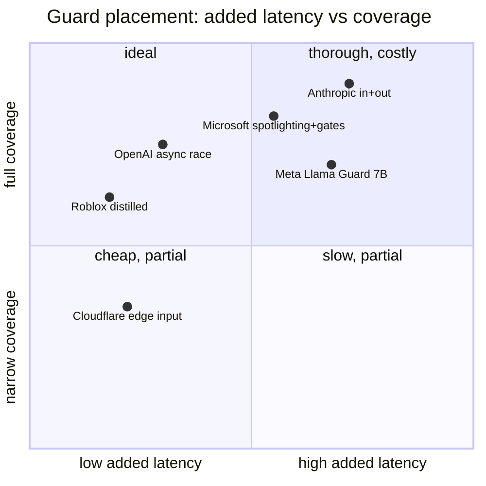

**What they share.** Every system wraps the model in a layered pipeline: untrusted input hits an input guard, the model runs, then output guards inspect the generation, with classifiers trained on the enforced policy and the highest-risk cases routed to humans.

**The choices, side by side.**

| Decision | Options (who) | What decides it |
| --- | --- | --- |
| guard model | `small distilled classifier` (Roblox 750k RPS, Cloudflare) vs `guard-LLM 7B` (Meta Llama Guard, Google ShieldGemma, NVIDIA NeMo) vs `synthetic-policy classifier` (Anthropic) | request volume and latency budget: billions/day forces distilled; taxonomy flexibility favors instruction-tuned 7B |
| placement | `input filter` (Cloudflare edge) vs `output filter` (Thomson Reuters grounding) vs `both` (Anthropic, Meta, Microsoft, Salesforce, NeMo) | trust boundary: input-only misses unsafe generations; RAG/agents need output grounding too |
| jailbreak / injection defense | `trained classifier` (Anthropic 86%→4.4%) vs `spotlighting + code gates` (Microsoft) vs `PII masking + prompt defense` (Salesforce) vs `input blocklist-free zero-shot` (Cloudflare) | direct jailbreak yields to output classifiers; indirect injection needs structural isolation and least-privilege action gates |
| policy routing | `hard block` vs `safe-complete` vs `graded score` (OpenAI G-Eval 1-5, Grab likelihood tier) vs `escalate to human` (Roblox, Thomson Reuters) | stakes and false-positive cost: graded scores enable rewrite; regulated domains escalate ambiguity |
| latency hiding | `cascade cheap-to-expensive` (Grab, Meta) vs `async race vs generation` (OpenAI) vs `separate batched vLLM tier` (NeMo, Cloudflare 2s timeout) | critical-path budget; async leaks tokens before block fires, so it needs side-effect-free generation |

**The math that separates them.**

$$\textbf{Cascade expected cost: } \ \mathbb{E}[C] = c_{\text{cheap}} + p_{\text{escalate}} \cdot c_{\text{guardLLM}}$$

$$\textbf{Recall at fixed FPR operating point: } \ \text{Recall}@\text{FPR}=0.01 = \frac{TP}{TP+FN} \ \ \text{s.t.} \ \ \frac{FP}{FP+TN}=0.01$$

$$\textbf{Attack success under layered defense: } \ \text{ASR} = \prod_{i=1}^{L}\bigl(1 - r_i\bigr) \ \ \Rightarrow\ \ 0.86 \to 0.044$$

$$\textbf{Async race adds no wall clock: } \ T_{\text{total}} = \max\bigl(T_{\text{guard}}, T_{\text{gen}}\bigr) \ \ \text{vs series } \ T_{\text{guard}} + T_{\text{gen}}$$

