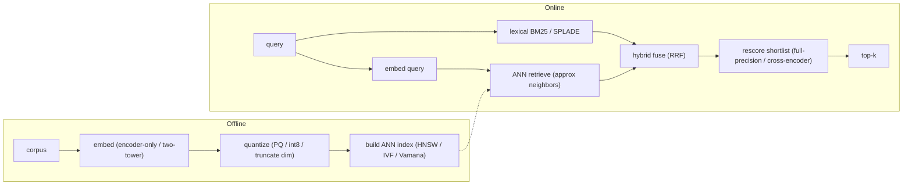
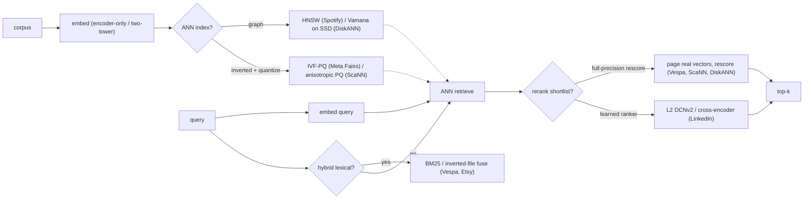
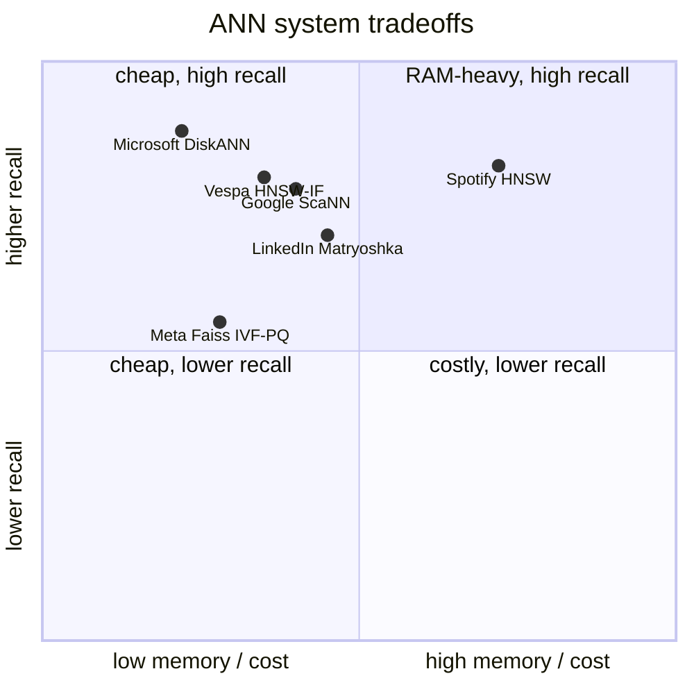

**What they share.** Every system runs the same skeleton: offline, embed the corpus and build an ANN index; online, embed the query, retrieve approximate neighbors, and rescore a shortlist at higher precision. The divergence is not the spine but four knobs: which ANN structure, how hard vectors are compressed, whether a lexical channel runs alongside, and how heavy the final rerank is.

**The reference pipeline.** The spine every writeup here instantiates: encode once offline into an index, then at query time embed, retrieve approximate neighbors, optionally fuse a lexical channel, and rescore the shortlist at full precision. Compression lives at the index build; the rescore exists precisely because compressed first-phase scores are approximate.

**Reading the diagram.** Follow the two lanes: offline, an encoder-only or two-tower model turns each document into a vector, which is quantized and packed into an ANN index; online, the same encoder embeds the query, the index returns approximate neighbors, an optional lexical channel runs in parallel, the two are fused, and a shortlist is rescored at full precision. The embed stage fixes the dimension, and dimension sets index RAM and search time about linearly, so LinkedIn uses Matryoshka nested vectors to serve a short prefix to retrieval and the full vector to ranking from one training run. The ANN index is the load-bearing choice: HNSW (Spotify) gives the best recall at latency but holds the graph plus full vectors in RAM, IVF-PQ (Meta Faiss) clusters then compresses to cut RAM at billion scale, ScaNN (Google) tunes quantization to the inner-product ranking goal, and DiskANN (Microsoft) keeps a billion vectors on SSD with only compressed codes in DRAM. Quantization is never free: PQ, int8, and 4-bit codes make first-phase scores approximate, which is exactly why the rescore exists, so pairing any compression claim with a full-precision or cross-encoder rescore is the senior tell. The hybrid fuse (reciprocal rank fusion of BM25 or SPLADE with the dense channel, as at Vespa, Etsy, and Walmart) is the expected unprompted answer, since pure dense misses SKUs, error codes, and rare tokens. The design leverage is that each stage is an independent recall-versus-cost knob (index type, code size, hybrid on or off, rerank depth), so you tune the one that matches your memory regime and query mix rather than reaching for a bigger model.

**The choices, side by side.**

**The choices, in a table.**

| Decision | Options (who) | What decides it |
| --- | --- | --- |
| ANN index | `HNSW` (Spotify) vs `IVF-PQ` (Meta) vs `ScaNN` anisotropic (Google) vs `Vamana`/`DiskANN` (Microsoft) vs `HNSW-IF` (Vespa) | Does the corpus fit in RAM? Graph if yes; inverted-file plus SSD if billion-scale on a budget |
| quantization | `E4M3 8-bit float` (Spotify) vs `int8` (Vespa) vs `PQ 20-byte codes` (Meta) vs `anisotropic learned PQ` (Google) vs `4-bit PQ` (Etsy) vs `8-bit custom scaling` (Dropbox) | RAM budget per vector; MIPS ranking wants parallel-error penalty, not uniform reconstruction |
| hybrid/rerank | dense-only (Spotify) vs `HNSW + BM25/inverted-file` (Vespa, Etsy, Walmart) vs `SPLADE` sparse-neural (Faire); rescore: full-precision (Vespa depth 4000, ScaNN, DiskANN) vs learned `DCNv2` (LinkedIn) | Do exact-term / rare-token queries matter? Compressed first-phase scores are approximate, so rescore recovers precision |
| dimensionality | `fixed full dim` (Dropbox, to bound cosine error) vs `Matryoshka` nested (LinkedIn: 2048 retrieve, 4096 rank) vs multi-embedding fan-out (Pinterest, Instacart) | Dim sets index RAM and search time linearly; Matryoshka serves both stages from one training run |

**The math that separates them.**

$$\textbf{index memory (uncompressed)} = n_{vectors} \times dim \times bytes_{per\ elem}$$

$$\textbf{PQ code size (bytes/vector)} = m \times \lceil b/8 \rceil, \quad m\ \text{subspaces},\ b\ \text{bits/code}$$

$$\textbf{PQ compression ratio} = \frac{dim \times 4}{m \times \lceil b/8 \rceil}, \quad \text{vs float32 baseline}$$

$$\textbf{ScaNN anisotropic loss} = \eta \lVert r_{\parallel} \rVert^{2} + \lVert r_{\perp} \rVert^{2}, \quad r = x - \tilde{x},\ \eta > 1$$

$$\textbf{recall vs latency (graph)} = f(ef,\ M) \uparrow \ \Rightarrow\ recall \uparrow,\ latency \uparrow$$

$$\textbf{IVF probe cost} \approx nprobe \times \frac{n_{vectors}}{n_{lists}} \times cost_{per\ code}, \quad nprobe \uparrow \Rightarrow recall \uparrow,\ latency \uparrow$$

**When to use which.**

Pick the index and the compression for your memory regime, then match the quantization loss and rerank to the ranking objective.

| Reach for | When | Instead of |
|---|---|---|
| HNSW graph | The corpus fits in RAM and you want best recall at latency (Spotify) | IVF-PQ or DiskANN when memory is the binding constraint |
| IVF-PQ | Billion-scale corpus on a RAM budget (Meta Faiss) | HNSW, which holds the graph plus full vectors in RAM |
| DiskANN (Vamana on SSD) | A billion vectors must fit on one box (Microsoft) | Keeping full-precision vectors resident in DRAM |
| ScaNN anisotropic loss | Two-tower inner-product / MIPS ranking (Google) | A Euclidean-tuned PQ that quietly loses MIPS recall |
| PQ code-size and compression-ratio formulas | Sizing RAM per vector before choosing codes | Assuming compression is free |
| Full-precision or cross-encoder rescore | After any quantization, since first-phase scores are approximate (Vespa depth 4000, ScaNN, DiskANN) | Trusting compressed first-phase scores as final |
| Hybrid BM25 or SPLADE fuse (RRF) | Exact-term and rare-token queries matter (Vespa, Etsy, Walmart) | Pure dense, which misses SKUs and error codes |
| Matryoshka nested dimensions | You want retrieval and ranking served from one model (LinkedIn: 2048 retrieve, 4096 rank) | Training and aligning separate models per stage |
| IVF probe cost (tune nprobe) | Trading recall against latency on an inverted-file index | Reaching for a bigger encoder when the knob is nprobe |

**Interview watch-outs.**

- **Pick the index for the memory regime, not by reputation.** `HNSW` is best recall-at-latency but stores the graph plus full vectors in RAM, so it fits when the corpus fits. `IVF-PQ` clusters then compresses, trading recall for a large RAM cut at billion scale. `ScaNN` wins CPU-bound recall-vs-QPS by tuning quantization to the inner-product ranking goal. `DiskANN` (Vamana on SSD) holds a billion vectors on one box by routing with DRAM-resident codes and hitting SSD only for final candidates. Naming the four and their regimes is the senior signal.
- **Quantization costs recall, so always name the rescore.** PQ, int8, and 4-bit codes make first-phase scores approximate; the fix is a full-precision (or cross-encoder) rescore over the top few hundred. Claiming compression is free is the classic miss.
- **Hybrid is the expected unprompted answer.** Pure dense misses exact matches (SKUs, error codes, rare tokens); fuse a lexical channel (BM25 or SPLADE) with reciprocal rank fusion. Hybrid reliably beats either alone.
- **MIPS is not Euclidean nearest neighbor.** For two-tower inner-product search, minimizing average reconstruction error is the wrong objective; ScaNN penalizes error parallel to the vector to preserve the high inner products that decide ranking. Reusing a Euclidean-tuned quantizer for MIPS quietly loses recall.
- **Matryoshka serves two stages from one model.** Nested embeddings let a 2048-dim prefix drive cheap ANN retrieval and the full 4096-dim vector feed the ranker, no separate models to train or keep aligned. Truncating dimension is a recall-vs-cost knob without re-embedding.
- **Model upgrades are a full re-index, not a mix.** Change the embedding model and every vector must be re-embedded; old and new vectors cannot share one space. Multi-version embedders multiply storage linearly, so a swap is a storage-and-cost event. Build the new index alongside, dual-read, then cut over.
