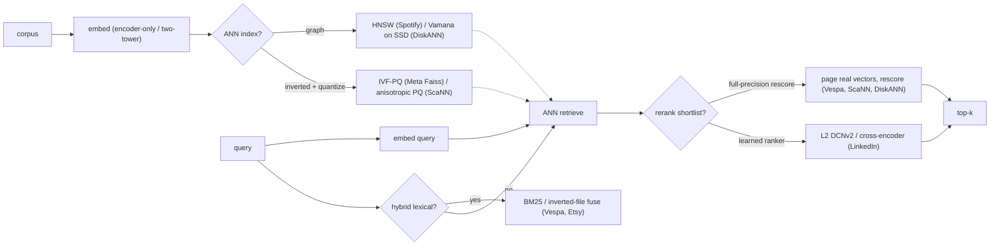
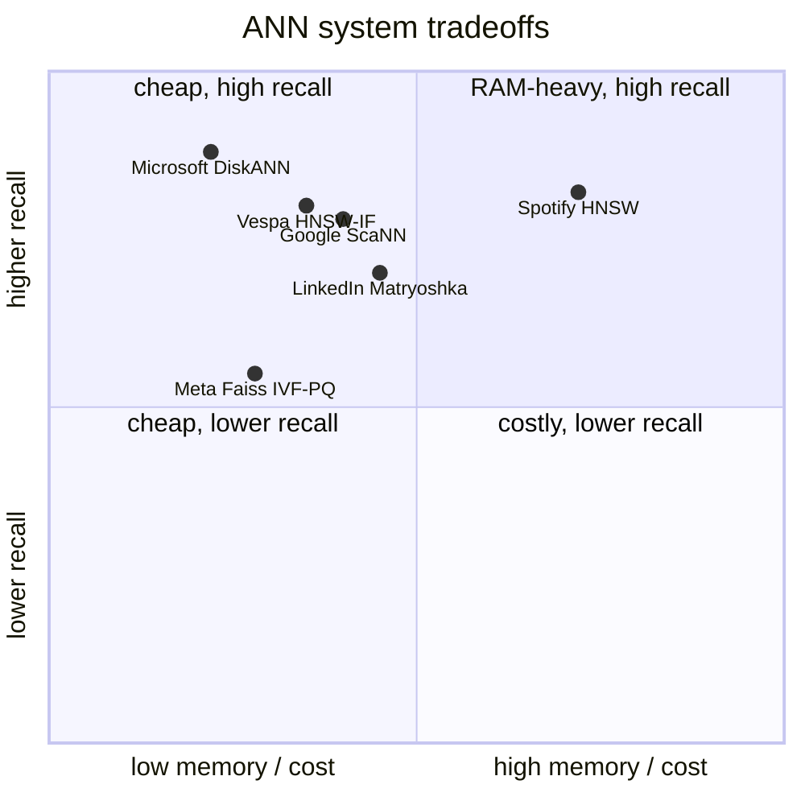

**What they share.** Every system runs the same skeleton: offline, embed the corpus and build an ANN index; online, embed the query, retrieve approximate neighbors, and rescore a shortlist at higher precision. The divergence is not the spine but four knobs: which ANN structure, how hard vectors are compressed, whether a lexical channel runs alongside, and how heavy the final rerank is.

**The choices, side by side.**

| Decision | Options (who) | What decides it |
| --- | --- | --- |
| ANN index | `HNSW` (Spotify) vs `IVF-PQ` (Meta) vs `ScaNN` anisotropic (Google) vs `Vamana`/`DiskANN` (Microsoft) vs `HNSW-IF` (Vespa) | Does the corpus fit in RAM? Graph if yes; inverted-file plus SSD if billion-scale on a budget |
| quantization | `E4M3 8-bit float` (Spotify) vs `int8` (Vespa) vs `PQ 20-byte codes` (Meta) vs `anisotropic learned PQ` (Google) vs `4-bit PQ` (Etsy) vs `8-bit custom scaling` (Dropbox) | RAM budget per vector; MIPS ranking wants parallel-error penalty, not uniform reconstruction |
| hybrid/rerank | dense-only (Spotify) vs `HNSW + BM25/inverted-file` (Vespa, Etsy, Walmart) vs `SPLADE` sparse-neural (Faire); rescore: full-precision (Vespa depth 4000, ScaNN, DiskANN) vs learned `DCNv2` (LinkedIn) | Do exact-term / rare-token queries matter? Compressed first-phase scores are approximate, so rescore recovers precision |
| dimensionality | `fixed full dim` (Dropbox, to bound cosine error) vs `Matryoshka` nested (LinkedIn: 2048 retrieve, 4096 rank) vs multi-embedding fan-out (Pinterest, Instacart) | Dim sets index RAM and search time linearly; Matryoshka serves both stages from one training run |

**The math that separates them.**

$$\textbf{index memory (uncompressed)} = n_{vectors} \times dim \times bytes_{per\ elem}$$

$$\textbf{PQ compression ratio} = \frac{dim \times 4}{m \times \lceil b/8 \rceil}, \quad m\ \text{subspaces},\ b\ \text{bits/code}$$

$$\textbf{ScaNN anisotropic loss} = \eta \lVert r_{\parallel} \rVert^{2} + \lVert r_{\perp} \rVert^{2}, \quad r = x - \tilde{x},\ \eta > 1$$

$$\textbf{recall vs latency (graph)} = f(ef,\ M) \uparrow \ \Rightarrow\ recall \uparrow,\ latency \uparrow$$

